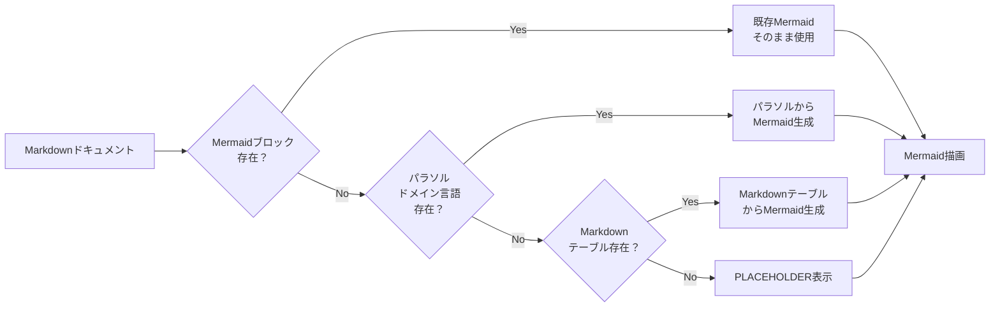
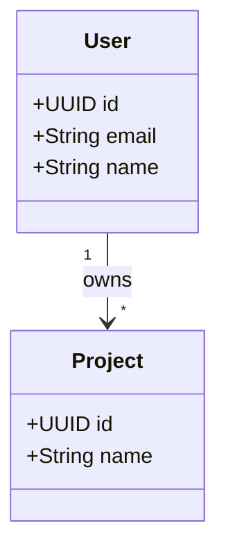
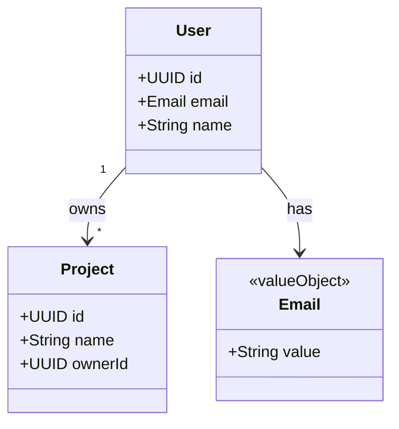
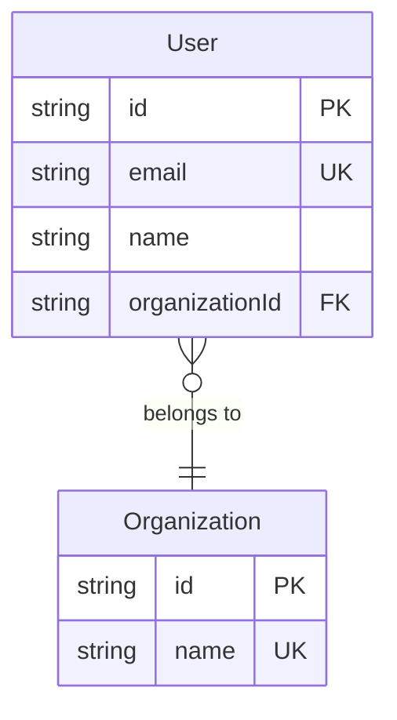
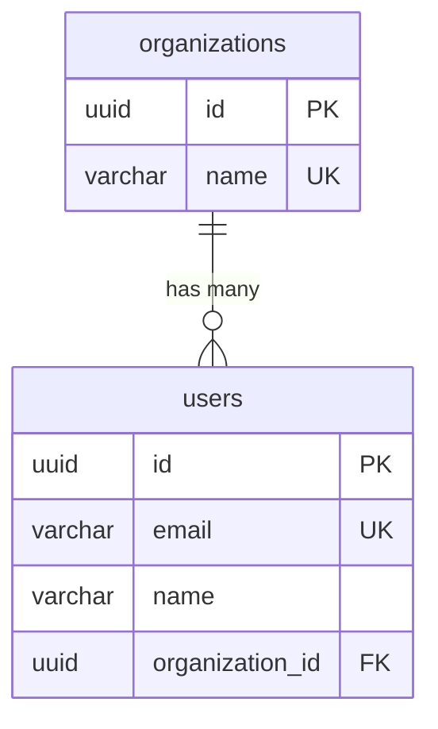
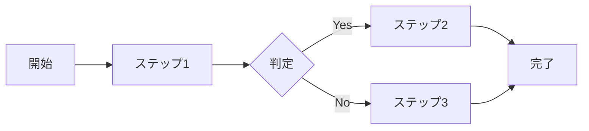
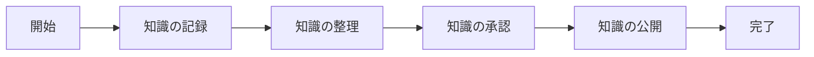
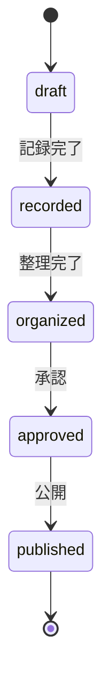
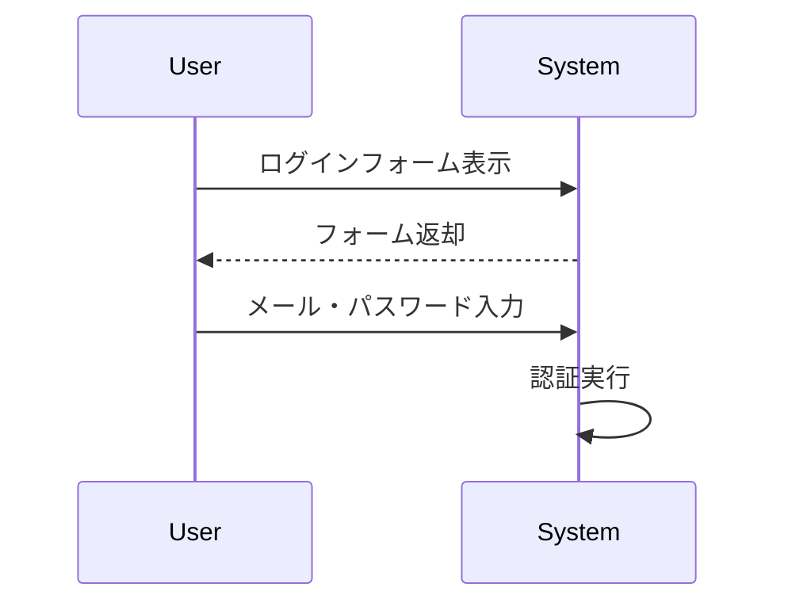

# パラソル設計ドキュメント Mermaid変換仕様

**バージョン**: 1.0.0
**最終更新日**: 2025-10-01

---

## 1. 概要

パラソル設計ドキュメントには、以下の種類のMermaid図が含まれます。この仕様書では、各図形式の入力フォーマットと、Mermaid形式への変換ルールを定義します。

### 対応する図の種類

1. **ドメインモデル図** (Class Diagram)
2. **DB設計図** (ER Diagram)
3. **ビジネスオペレーションフロー図** (Flowchart)
4. **状態遷移図** (State Diagram)

---

## 2. 変換方針

### 2.1 基本方針

- **既存Mermaid優先**: Markdownに既にMermaid形式の図が存在する場合は、そのまま使用
- **自動生成**: Mermaid図が存在しない場合、パラソルドメイン言語やMarkdownテーブルから自動生成
- **エラー時のフォールバック**: 変換に失敗した場合は、PLACEHOLDERを表示

### 2.2 変換フロー



---

## 3. ドメインモデル図 (Class Diagram)

### 3.1 入力形式

#### 3.1.1 既存Mermaid形式

```markdown
## ドメインモデル


```

**変換処理**: そのまま抽出して使用

#### 3.1.2 パラソルドメイン言語形式

```markdown
## 2. エンティティ定義

### User（ユーザー）

| 属性名 | 型 | 必須 | 説明 |
|--------|----|----|------|
| id | UUID | ○ | 一意識別子 |
| email | EMAIL | ○ | メールアドレス |
| name | STRING_100 | ○ | 名前 |

### Project（プロジェクト）

| 属性名 | 型 | 必須 | 説明 |
|--------|----|----|------|
| id | UUID | ○ | 一意識別子 |
| name | STRING_100 | ○ | プロジェクト名 |
| ownerId | UUID | ○ | オーナーID |

## 3. 値オブジェクト定義

### Email（メールアドレス）
...

## 4. 集約定義

### UserAggregate
**集約ルート**: User
**包含エンティティ**: Profile, Settings
```

**変換処理**:
1. エンティティセクション（`## 2. エンティティ定義`）を検出
2. 各エンティティのテーブルからクラス定義を生成
3. 値オブジェクトは別クラスとして生成
4. 集約は包含関係（composition）として表現

### 3.2 出力形式



### 3.3 型変換マッピング

| パラソル型 | Mermaid型 | 備考 |
|-----------|----------|------|
| UUID | UUID | そのまま |
| STRING_N | String | 長さ情報は省略 |
| TEXT | String | |
| EMAIL | Email | 値オブジェクトとして表現 |
| DATE | Date | |
| TIMESTAMP | DateTime | |
| INTEGER | Integer | |
| DECIMAL | Decimal | |
| BOOLEAN | Boolean | |
| ENUM | String | 列挙値は省略 |

### 3.4 関連の推測ルール

1. **FK参照**: `ownerId`のような命名から関連を推測
   - パターン: `{エンティティ名}Id` → `{エンティティ名}`への参照
   - カーディナリティ: デフォルトは `"*" --> "1"`

2. **集約包含**: 集約定義から composition を生成
   - 集約ルート `*--` 包含エンティティ

---

## 4. DB設計図 (ER Diagram)

### 4.1 入力形式

#### 4.1.1 既存Mermaid ER図形式

```markdown
## 2. ER図


```

**変換処理**: そのまま抽出して使用（**重要**: 再変換しない）

#### 4.1.2 Markdownテーブル形式

```markdown
## 3. 物理設計

### 1. users テーブル

| カラム名 | データ型 | NULL | 制約 | 説明 |
|---------|---------|------|------|------|
| id | UUID | NOT NULL | PK | ユーザーID |
| email | VARCHAR(255) | NOT NULL | UNIQUE | メールアドレス |
| name | VARCHAR(100) | NOT NULL | - | 名前 |
| organization_id | UUID | NOT NULL | FK(organizations.id) | 所属組織ID |

### 2. organizations テーブル

| カラム名 | データ型 | NULL | 制約 | 説明 |
|---------|---------|------|------|------|
| id | UUID | NOT NULL | PK | 組織ID |
| name | VARCHAR(100) | NOT NULL | UNIQUE | 組織名 |
```

**変換処理**:
1. 物理設計セクション（`## 3. 物理設計` または `## Physical Design`）を検出
2. テーブル見出し（`### N. {table_name} テーブル`）を検出
3. 各テーブルのMarkdownテーブルからカラム情報を抽出
4. FK制約（`FK(table.column)`）からリレーションシップを生成

### 4.2 出力形式



### 4.3 制約の表現

| 制約種別 | 表記 | Mermaid表現 |
|---------|------|------------|
| Primary Key | PK | `PK` |
| Unique | UNIQUE | `UK` |
| Foreign Key | FK(table.column) | `FK` + リレーション |
| Not Null | NOT NULL | 省略（デフォルト） |

### 4.4 リレーションシップのカーディナリティ推測

| FK側の制約 | カーディナリティ | 理由 |
|-----------|----------------|------|
| FK + UNIQUE | `||--\|\|` | 1対1 |
| FK（通常） | `\|\|--o{` | 1対多 |
| 中間テーブル | `}o--o{` | 多対多 |

### 4.5 重要な注意事項

**既存Mermaid ER図の扱い**:
- Markdownに既にMermaid ER図が存在する場合は、**絶対に再変換しない**
- 理由: 再変換すると以下の問題が発生
  1. リレーションシップラベルが失われる
  2. カーディナリティが不正確になる
  3. 手動で調整した内容が消失する

**検出ロジック**:
```typescript
// パーサーで Mermaid ER図の存在を検出
if (hasMermaidERDiagram && mermaidContent) {
  return mermaidContent; // そのまま返す
}

// Mermaid ER図がない場合のみ、Markdownテーブルから生成
return generateERDiagramFromMarkdownTables();
```

---

## 5. ビジネスオペレーションフロー図 (Flowchart)

### 5.1 入力形式

#### 5.1.1 既存Mermaid Flowchart形式

```markdown
## プロセスフロー


```

**変換処理**: そのまま抽出して使用

#### 5.1.2 Markdown箇条書き形式

```markdown
## ビジネスプロセス

### ステップ詳細
1. **知識の記録**: コンサルタントがプロジェクト知識を記録
2. **知識の整理**: PMがカテゴリとタグを付与
3. **知識の承認**: ナレッジマネージャーが品質を確認
4. **知識の公開**: 組織全体で共有可能に
```

**変換処理**:
1. `## ビジネスプロセス`または`### ステップ詳細`セクションを検出
2. 番号付きリスト（`1. **名前**: 説明`）を検出
3. フローチャート形式に変換

### 5.2 出力形式



---

## 6. 状態遷移図 (State Diagram)

### 6.1 入力形式

#### 6.1.1 既存Mermaid State Diagram形式

```markdown
## ビジネス状態


```

**変換処理**: そのまま抽出して使用

#### 6.1.2 テキスト記述形式

```markdown
## 状態遷移

知識記事は以下の状態を遷移します：

- **draft**: 下書き（初期状態）
- **recorded**: 記録済み
- **organized**: 整理済み
- **approved**: 承認済み
- **published**: 公開済み（最終状態）

遷移：
- draft → recorded: 記録完了
- recorded → organized: 整理完了
- organized → approved: 承認
- approved → published: 公開
```

**変換処理**:
1. 状態リストから状態を抽出
2. 遷移リストから遷移を抽出
3. State Diagram形式に変換

### 6.2 出力形式


---

## 7. 実装ガイドライン

### 7.1 変換メソッドの責務分離

```typescript
class DiagramConverter {
  // ドメインモデル図
  static domainToClassDiagram(markdown: string): string {
    // 既存Mermaid検出 → そのまま返す
    // パラソルドメイン言語検出 → Class Diagram生成
    // なし → PLACEHOLDER
  }

  // DB設計図
  static dbToERDiagram(markdown: string): string {
    // 既存Mermaid ER図検出 → そのまま返す（重要！）
    // Markdownテーブル検出 → ER Diagram生成
    // なし → PLACEHOLDER
  }

  // ビジネスオペレーションフロー図
  static operationToFlowDiagram(markdown: string): string {
    // 既存Mermaid Flowchart検出 → そのまま返す
    // Markdown箇条書き検出 → Flowchart生成
    // なし → PLACEHOLDER
  }

  // 状態遷移図
  static stateTransitionDiagram(markdown: string): string {
    // 既存Mermaid State Diagram検出 → そのまま返す
    // テキスト記述検出 → State Diagram生成
    // なし → PLACEHOLDER
  }
}
```

### 7.2 共通パーサーロジック

```typescript
private static extractExistingMermaid(
  markdown: string,
  diagramType: 'classDiagram' | 'erDiagram' | 'flowchart' | 'stateDiagram'
): string | null {
  const lines = markdown.split('\n');
  let inCodeBlock = false;
  let inTargetDiagram = false;
  let mermaidLines: string[] = [];

  lines.forEach(line => {
    const trimmed = line.trim();

    if (trimmed.startsWith('```')) {
      if (!inCodeBlock && trimmed.includes('mermaid')) {
        inCodeBlock = true;
        return;
      } else if (inCodeBlock) {
        inCodeBlock = false;
        inTargetDiagram = false;
        return;
      }
    }

    if (inCodeBlock && !inTargetDiagram && trimmed.startsWith(diagramType)) {
      inTargetDiagram = true;
    }

    if (inTargetDiagram) {
      mermaidLines.push(trimmed);
    }
  });

  return mermaidLines.length > 0 ? mermaidLines.join('\n') : null;
}
```

### 7.3 エラーハンドリング

```typescript
static safeConvert(
  markdown: string,
  converter: (md: string) => string
): string {
  try {
    const result = converter(markdown);
    if (!result || result.trim().length === 0) {
      return 'erDiagram\n  PLACEHOLDER {\n    string info\n  }';
    }
    return result;
  } catch (error) {
    console.error('Mermaid conversion error:', error);
    return 'erDiagram\n  ERROR {\n    string message\n  }';
  }
}
```

---

## 8. テストケース

### 8.1 ドメインモデル図

#### テストケース1: 既存Mermaid
- **入力**: Mermaid classDiagramブロック
- **期待**: そのまま返却

#### テストケース2: パラソルドメイン言語
- **入力**: エンティティ定義テーブル
- **期待**: classDiagram生成

### 8.2 DB設計図

#### テストケース1: 既存Mermaid ER図
- **入力**: Mermaid erDiagramブロック（リレーション含む）
- **期待**: **そのまま返却**（リレーションラベル保持）

#### テストケース2: Markdownテーブル
- **入力**: 物理設計セクションのテーブル定義
- **期待**: erDiagram生成（リレーション推測）

### 8.3 ビジネスオペレーションフロー図

#### テストケース1: 既存Mermaid Flowchart
- **入力**: Mermaid flowchartブロック
- **期待**: そのまま返却

#### テストケース2: Markdown箇条書き
- **入力**: ステップ詳細の番号付きリスト
- **期待**: flowchart生成

### 8.4 状態遷移図

#### テストケース1: 既存Mermaid State Diagram
- **入力**: Mermaid stateDiagram-v2ブロック
- **期待**: そのまま返却

#### テストケース2: テキスト記述
- **入力**: 状態リストと遷移リスト
- **期待**: stateDiagram生成

---

## 9. 今後の拡張

### 9.1 シーケンス図サポート

ユースケースフローからシーケンス図を生成

```markdown
## 基本フロー
1. ユーザーがログインフォームを表示
2. システムがフォームを返却
3. ユーザーがメールとパスワードを入力
4. システムが認証を実行
```

↓



### 9.2 ロバストネス図サポート

Boundary/Control/Entityの3要素から図を生成

---

**ドキュメント履歴**:
- 2025-10-01: 初版作成
- 作成者: Claude
- レビュー状態: Draft
