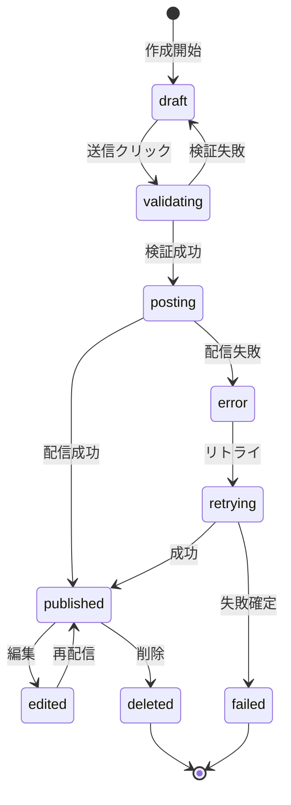

# ビジネスオペレーション: コミュニケーションを促進する

**バージョン**: 1.0.0
**更新日**: 2025-10-01

## 概要
**目的**: チームメンバー間の円滑なコミュニケーションを実現し、情報共有とコラボレーションを促進する
**パターン**: Communication
**ゴール**: リアルタイムメッセージング、スレッド会話、ファイル共有を通じて、チームの生産性と創造性を最大化する

## 関係者とロール
- **メッセージ送信者**: チャネルやダイレクトメッセージでメッセージを投稿するユーザー
- **メッセージ受信者**: チャネルメンバーとしてメッセージを受け取り、反応やリプライを行うユーザー
- **チャネル管理者**: チャネルの作成、メンバー管理、設定変更を担当
- **ワークスペース管理者**: ワークスペース全体のチャネル管理、ポリシー設定を担当
- **システム**: メッセージ配信、検索インデックス更新、通知生成を実行

## プロセスフロー

> **重要**: プロセスフローは必ず番号付きリスト形式で記述してください。
> Mermaid形式は使用せず、テキスト形式で記述することで、代替フローと例外フローが視覚的に分離されたフローチャートが自動生成されます。

1. システムがメッセージ作成を行う
2. システムが内容検証を実行する
3. システムがメッセージ保存を処理する
4. システムがエラー表示を処理する
5. システムがチャネル配信を処理する
6. システムが検索インデックス更新を処理する
7. システムがメンション処理を実行する
8. システムが通知生成を行う
9. システムが完了を処理する

## 代替フロー

### 代替フロー1: 情報不備
- 2-1. システムが情報の不備を検知する
- 2-2. システムが修正要求を送信する
- 2-3. ユーザーが情報を修正し再実行する
- 2-4. 基本フロー2に戻る

## 例外処理

### 例外1: システムエラー
- システムエラーが発生した場合
- エラーメッセージを表示する
- 管理者に通知し、ログに記録する

### 例外2: 承認却下
- 承認が却下された場合
- 却下理由をユーザーに通知する
- 修正後の再実行を促す

## ビジネス状態

## KPI
- **メッセージ投稿成功率**: 99.9%以上 - 投稿試行に対する成功率
- **配信遅延**: 100ms以内 - メッセージ送信から受信者への配信完了までの時間
- **アクティブユーザー率**: 70%以上 - 週次でメッセージを投稿または閲覧したユーザーの割合
- **平均応答時間**: 30分以内 - メッセージ投稿から最初の返信までの平均時間
- **スレッド利用率**: 50%以上 - 返信にスレッド機能を使用した割合
- **検索成功率**: 85%以上 - 検索クエリに対して有用な結果が見つかった割合

## ビジネスルール
- **メッセージ文字数制限**: 1メッセージ最大10,000文字
- **添付ファイル制限**: 1メッセージあたり最大10ファイル、合計100MB
- **編集可能期間**: 投稿後24時間以内のみ編集可能（システム設定で変更可）
- **削除ポリシー**: 論理削除のみ（データベースから物理削除しない）、削除後も検索対象外
- **スレッド深度制限**: スレッドのネストは1階層のみ（スレッドへのリプライはスレッド内で平坦化）
- **リアクション制限**: 1メッセージあたり最大50種類のリアクション、各ユーザーは同じリアクションを1回のみ
- **メンション制限**: 1メッセージで最大20名までメンション可能
- **アーカイブチャネル制限**: アーカイブされたチャネルは読み取り専用、新規投稿不可
- **プライベートチャネル**: 招待されたメンバーのみ閲覧・投稿可能

## 入出力仕様

### 入力
- **メッセージ本文**: テキストコンテンツ（最大10,000文字）
- **送信者情報**: ユーザーID、表示名、プロフィール画像URL
- **チャネル情報**: チャネルID、チャネルタイプ（public/private/direct）
- **添付ファイル**: ファイル名、MIMEタイプ、ファイルサイズ、アップロードURL
- **メンション**: メンション対象ユーザーIDリスト
- **スレッド情報**: 親メッセージID（スレッド返信の場合）
- **メッセージタイプ**: text（通常）、file（ファイル添付）、system（システムメッセージ）

### 出力
- **メッセージレコード**: メッセージID、投稿日時、編集日時、削除フラグ
- **配信確認**: 配信成功通知、タイムスタンプ
- **検索インデックス**: 更新されたインデックスバージョン
- **通知イベント**: メンション通知、チャネル更新通知
- **メトリクス**: 投稿数、閲覧数、リアクション数

## 例外処理
- **ネットワークエラー**: 送信失敗時は自動的に3回までリトライ（指数バックオフ）、失敗したメッセージは下書きとして保存
- **権限エラー**: 投稿権限がない場合、エラーメッセージを表示し投稿をブロック
- **チャネル削除エラー**: 投稿中にチャネルが削除された場合、投稿を中断しエラーを通知
- **ファイルアップロードエラー**: アップロード失敗時はメッセージのみ投稿、ファイルは再アップロード可能
- **禁止ワード検出**: 組織ポリシーで禁止された単語が含まれる場合、投稿をブロックし編集を促す
- **スパム検出**: 短時間に大量投稿を検知した場合、一時的に投稿を制限（1分間に10メッセージ）
- **同時編集競合**: 複数ユーザーが同時にメッセージを編集した場合、最終更新者の内容を採用し、競合を通知

## 派生ユースケース
このビジネスオペレーションから以下のユースケースが派生します：

1. **チャネルにメッセージを投稿する**
   - アクター: チャネルメンバー
   - 概要: テキスト、ファイル、メンションを含むメッセージをチャネルに投稿する

2. **スレッドで返信する**
   - アクター: チャネルメンバー
   - 概要: 特定のメッセージに対してスレッド形式で返信し、話題を整理する

3. **メッセージにリアクションする**
   - アクター: チャネルメンバー
   - 概要: 絵文字リアクションでメッセージに簡易的な反応を示す

4. **メッセージを検索する**
   - アクター: ワークスペースメンバー
   - 概要: キーワード、日付、チャネル、送信者でメッセージを検索する

5. **チャネルを作成する**
   - アクター: ワークスペースメンバー
   - 概要: 新しいパブリックまたはプライベートチャネルを作成し、メンバーを招待する

6. **ダイレクトメッセージを送信する**
   - アクター: ワークスペースメンバー
   - 概要: 特定のユーザーと1対1またはグループでプライベートメッセージを交換する

7. **メッセージを編集・削除する**
   - アクター: メッセージ投稿者
   - 概要: 自分が投稿したメッセージの内容を修正または削除する
