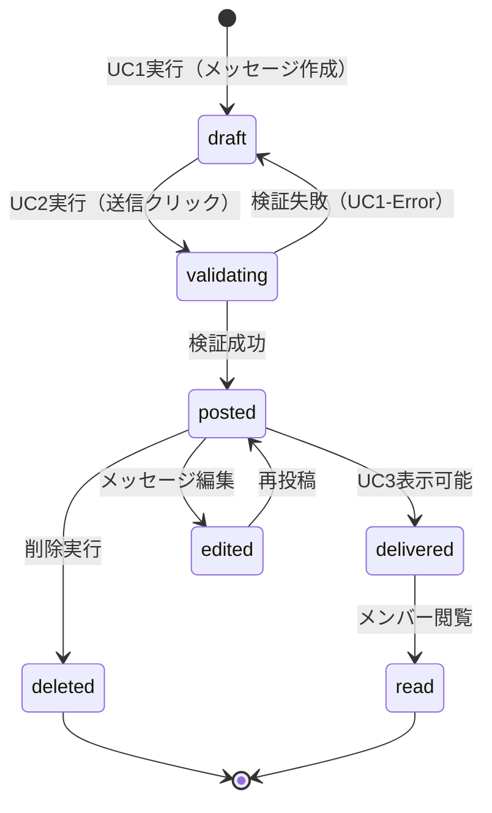

# ビジネスオペレーション: コミュニケーションを促進する

**バージョン**: 2.0.0
**更新日**: 2025-10-08
**設計方針**: ユースケース・ページ分解指向 + パラソルドメイン言語連携

## 📋 概要
**目的**: チームメンバー間の円滑なコミュニケーションを実現し、リアルタイムメッセージング、スレッド会話、ファイル共有を通じてチームの生産性と創造性を最大化する
**パターン**: Communication
**ゴール**: メッセージ投稿成功率99.9%以上、配信遅延100ms以内、アクティブユーザー率70%以上を達成

## 🎭 関係者とロール
- **チャネルメンバー**: メッセージの投稿・閲覧・リアクションを行うユーザー
- **チャネル管理者**: チャネル設定の変更・メンバー管理を担当
- **ワークスペース管理者**: ワークスペース全体のポリシー設定を担当
- **システム**: メッセージ配信・検索インデックス更新・通知生成を自動実行

## 🏗️ パラソルドメイン連携

### サービス境界とユースケース連携

> **⚡ マイクロサービス設計の基本原則（ユースケース利用型）**
> - **自サービス管理**: 自エンティティの全CRUD + 自ユースケースの実装
> - **他サービス連携**: **他サービスの公開ユースケースを利用**（エンティティは意識しない）

#### 📦 自サービス管理（collaboration-facilitation-service）
**責務**: ✅ エンティティ管理 ✅ ユースケース実装 ✅ ビジネスロジック
```
Entity: Channel (チャネル) - Aggregate Root
├── id: UUID - チャネル識別子
├── name: STRING_100 - チャネル名
├── type: ENUM - チャネルタイプ(public/private/direct)
├── workspaceId: UUID - 所属ワークスペース
└── 状態: active → archived（不可逆）

Entity: Message (メッセージ)
├── id: UUID - メッセージ識別子
├── channelId: UUID - 所属チャネル
├── authorId: UUID - 送信者（→ secure-access-service/User参照）
├── content: TEXT - メッセージ内容
├── type: ENUM - メッセージタイプ(text/file/system)
└── 状態: draft → posted → edited → deleted

Entity: ChannelMember (チャネルメンバー)
├── channelId: UUID - チャネル識別子
├── userId: UUID - ユーザー識別子（→ secure-access-service/User参照）
├── role: ENUM - ロール(owner/admin/member)
└── notificationEnabled: BOOLEAN - 通知設定

ValueObject: MentionContext (メンション文脈)
├── userId: UUID - メンション対象（→ secure-access-service/User参照）
├── position: INTEGER - テキスト内の位置
└── type: ENUM - メンションタイプ(user/team/channel)

Aggregate: ChannelAggregate (チャネル集約)
├── ルート: Channel
├── 包含: Message[], ChannelMember[], Thread[]
└── 不変条件: プライベートチャネルは招待制、アーカイブ後は投稿不可
```

#### 🔗 他サービスユースケース利用（ユースケース呼び出し型）
**責務**: ❌ エンティティ知識不要 ✅ ユースケース利用のみ

```
[secure-access-service] ユースケース利用:
├── UC-AUTH-01: ユーザー認証を実行する → POST /api/auth/authenticate
├── UC-AUTH-02: 権限を検証する → POST /api/auth/validate-permission
├── UC-AUTH-03: アクセスログを記録する → POST /api/auth/log-access
└── UC-AUTH-04: 組織階層を確認する → GET /api/auth/organization-hierarchy

[notification-service] ユースケース利用:
├── UC-NOTIFY-01: 通知を配信する → POST /api/notifications/send
├── UC-NOTIFY-02: 通知設定を取得する → GET /api/notifications/settings
├── UC-NOTIFY-03: 配信状況を確認する → GET /api/notifications/status
└── UC-NOTIFY-04: メンション通知を送信する → POST /api/notifications/send-mention

[knowledge-service] ユースケース利用:
├── UC-KNOWLEDGE-01: 知識を記事化する → POST /api/knowledge/articles/create
├── UC-KNOWLEDGE-02: 検索インデックスを更新する → PUT /api/knowledge/search/index
├── UC-KNOWLEDGE-03: 関連知識を発見する → GET /api/knowledge/discover
└── UC-KNOWLEDGE-04: 会話から洞察を抽出する → POST /api/knowledge/extract-insights
```

**ユースケース連携パターン**:
- **機能利用**: `POST /api/{service}/usecases/{usecase-id}` - 他サービス機能実行
- **状況照会**: `GET /api/{service}/usecases/{usecase-id}/status` - 実行状況確認
- **結果取得**: `GET /api/{service}/usecases/{usecase-id}/result` - 処理結果取得

### マイクロサービス連携型ドメインサービス

#### 🎯 ビジネス価値重視のドメインサービス
```
DomainService: CollaborationActivator（コラボレーション活性化）
├── enhanceTeamCommunication() - チーム連携を強化する
├── facilitateKnowledgeSharing() - 知識共有を促進する
├── amplifyEngagement() - エンゲージメントを向上させる
└── strengthenTeamBonds() - チーム結束を強化する

DomainService: CommunicationOrchestrator（コミュニケーション統制）
├── coordinateMessageFlow() - メッセージ流れを最適化する
├── optimizeNotificationDelivery() - 通知配信を最適化する（→ notification-service連携）
├── maintainCommunicationQuality() - コミュニケーション品質を維持する
└── preventInformationOverload() - 情報過多を防止する

DomainService: KnowledgeCapture（知識獲得）
├── extractInsightsFromConversations() - 会話から洞察を抽出する（→ knowledge-service連携）
├── identifyExpertiseNetworks() - 専門知識ネットワークを特定する
├── buildInstitutionalMemory() - 組織記憶を構築する
└── enableKnowledgeDiscovery() - 知識発見を可能にする

DomainService: SecurityEnforcer（セキュリティ強化）
├── validateCommunicationPermissions() - コミュニケーション権限を検証する（→ secure-access-service連携）
├── enforceDataProtection() - データ保護を強制する
├── auditCommunicationActivities() - コミュニケーション活動を監査する
└── preventUnauthorizedAccess() - 不正アクセスを防止する
```

## 🔄 プロセスフロー（ユースケース分解指向）

> **重要**: 各ステップは「誰が何をするか」を明記し、ユースケース分解の根拠とする

### 価値創造型基本フロー（マイクロサービス連携）

1. **チャネルメンバーがアイデア・知見共有を開始** → **UC1: チーム連携を活性化する**
   - **自サービス操作**: Message（draft状態）、ChannelAggregate
   - **他サービスユースケース利用**: → UC-AUTH-02: 権限を検証する
   - **必要ページ**: チーム連携活性化ページ - 知見入力・専門知識共有・メンション機能
   - **ビジネス価値**: チームメンバー間の知識流通促進

2. **システムがコミュニケーション品質を維持** → **内部処理（ページなし）**
   - **ドメインサービス**: CommunicationOrchestrator.maintainCommunicationQuality()
   - **他サービスユースケース利用**: → UC-KNOWLEDGE-04: 会話から洞察を抽出する

3. **チャネルメンバーが知識共有を実行** → **UC2: 知識共有を促進する**
   - **自サービス操作**: Message（posted状態）、ChannelAggregate
   - **他サービスユースケース利用**: → UC-NOTIFY-01: 通知を配信する、→ UC-KNOWLEDGE-01: 知識を記事化する
   - **必要ページ**: 知識共有促進ページ - 共有確認・影響範囲表示・配信最適化
   - **ビジネス価値**: 組織知識の蓄積と活用促進

4. **システムが組織記憶を構築し知識発見を可能化** → **内部処理（ページなし）**
   - **ドメインサービス**: KnowledgeCapture.buildInstitutionalMemory()
   - **他サービスユースケース利用**: → UC-KNOWLEDGE-02: 検索インデックスを更新する

5. **チャネルメンバーが継続的エンゲージメントを実現** → **UC3: エンゲージメントを向上させる**
   - **自サービス操作**: Message（閲覧・リアクション）、Thread、Reaction
   - **他サービスユースケース利用**: → UC-AUTH-03: アクセスログを記録する
   - **必要ページ**: エンゲージメント向上ページ - 対話促進・知識発見・チーム結束強化
   - **ビジネス価値**: 持続的なチーム協働と創造性向上

### ユースケース分解原則（価値創造指向）
- **価値創造ステップ** → ユースケース + ページ（ビジネス成果重視）
- **システム価値強化** → ドメインサービス（マイクロサービス連携）
- **1ユースケース = 1つの明確なビジネス価値 = 1つの価値創造ページ**

## 📄 ユースケース・ページ設計マトリックス（価値創造型）

| UC# | ユースケース名（価値創造） | 対応ページ | 自サービスエンティティ | 他サービス連携 | アクター | 設計方針 |
|-----|-------------------------|-----------|---------------------|-------------|----------|----------|
| UC1 | チーム連携を活性化する | チーム連携活性化ページ | Message, ChannelAggregate | secure-access-service | チャネルメンバー | 価値重視 - 知見共有・専門知識流通・チーム結束 |
| UC2 | 知識共有を促進する | 知識共有促進ページ | Message, ChannelAggregate | notification-service, knowledge-service | チャネルメンバー | 影響重視 - 組織知識蓄積・配信最適化・記憶構築 |
| UC3 | エンゲージメントを向上させる | エンゲージメント向上ページ | Message, Thread, Reaction | secure-access-service | チャネルメンバー | 継続重視 - 対話促進・創造性向上・持続的協働 |

## 🔀 代替フロー（ユースケース分岐指向）

### 代替フロー1: メンション付きメッセージ
- **分岐元**: 基本フロー ステップ1
- **条件**: メッセージに@マークでのメンションが含まれる
- **代替ユースケース**: UC1-Alt: メンションを含むメッセージを作成する
  - **必要ページ**: メンション付きメッセージ作成ページ - メンション候補表示・自動補完
  - **操作エンティティ**: Message, MentionContext

### 代替フロー2: ファイル添付メッセージ
- **分岐元**: 基本フロー ステップ1
- **条件**: ファイルが添付される
- **代替ユースケース**: UC1-Alt2: ファイル付きメッセージを作成する
  - **必要ページ**: ファイル添付メッセージ作成ページ - ファイルアップロード・プレビュー表示
  - **操作エンティティ**: Message, FileAttachment

### 代替フロー3: スレッド返信
- **分岐元**: 基本フロー ステップ3
- **条件**: 既存メッセージへの返信として投稿
- **代替ユースケース**: UC2-Alt: スレッドでメッセージを送信する
  - **必要ページ**: スレッド返信送信ページ - 親メッセージ表示・スレッド文脈表示
  - **操作エンティティ**: Message, Thread

## ⚠️ 例外フロー（エラーページ設計指向）

### 例外1: メッセージ内容検証エラー
- **発生ステップ**: ステップ2
- **エラーユースケース**: UC1-Error: メッセージ作成エラーを処理する
  - **必要ページ**: メッセージ作成エラーページ - エラー内容表示・修正方法提示・再入力フォーム
  - **表示情報**: 文字数制限超過、禁止ワード検出、ファイルサイズ超過

### 例外2: 送信権限エラー
- **発生ステップ**: ステップ4
- **エラーユースケース**: UC2-Error: メッセージ送信エラーを処理する
  - **必要ページ**: 送信権限エラーページ - 権限不足の説明・管理者連絡方法・代替チャネル提案
  - **表示情報**: 権限レベル、必要権限、回復手順

### 例外3: ネットワーク接続エラー
- **発生ステップ**: ステップ4
- **エラーユースケース**: UC2-Error2: ネットワークエラーを処理する
  - **必要ページ**: 接続エラーページ - 自動再試行・手動再送・下書き保存
  - **表示情報**: 接続状態、再試行回数、下書き保存状況

## 📊 ビジネス状態（エンティティライフサイクル）



**状態とエンティティの対応**:
- **draft**: Message.type = 'draft', Message.content = 入力中テキスト
- **posted**: Message.type = 'text', Message.createdAt = 投稿時刻
- **delivered**: Channel.lastActivityAt = 最新メッセージ時刻

## 📏 KPI（ユースケース別成功指標）

| ユースケース | KPI | 目標値 | 測定方法 |
|-------------|-----|--------|----------|
| UC1 | メッセージ作成完了率 | 95%以上 | 作成開始/作成完了の比率 |
| UC2 | メッセージ送信成功率 | 99.9%以上 | 送信試行/送信成功の比率 |
| UC3 | メッセージ表示応答時間 | 100ms以内 | API応答時間の95パーセンタイル |

## 📜 ビジネスルール（ドメイン制約）

### エンティティ制約
- **Message**: content長は10,000文字以内 → CollaborationCoordinator.validateMessageContent()で実装
- **Channel**: アーカイブ後は新規投稿不可 → ChannelAggregate不変条件で実装
- **MentionContext**: 1メッセージ最大20メンション → ドメインサービスで実装

### ユースケース制約
- **UC1**: 下書き保存は24時間 → メッセージ作成ページバリデーションで実装
- **UC2**: 連続投稿は1分間10件まで → メッセージ送信ページで制限実装
- **UC3**: 既読状態は自動更新 → メッセージ表示ページで自動処理

## 🔗 入出力仕様（API・ページ連携）

### ユースケース別入出力

#### UC1: メッセージを作成する
**入力（ページ → API）**:
```json
{
  "messageData": {
    "content": "string - メッセージ本文",
    "channelId": "UUID - 投稿先チャネル",
    "mentions": ["UUID[] - メンション対象ユーザー"],
    "attachments": ["FileAttachment[] - 添付ファイル"]
  }
}
```

**出力（API → ページ）**:
```json
{
  "result": "success/error",
  "message": {
    "id": "UUID",
    "content": "string",
    "status": "draft"
  },
  "nextAction": "UC2実行可能 | エラー修正要求"
}
```

#### UC2: メッセージを送信する
**入力（ページ → API）**:
```json
{
  "sendData": {
    "messageId": "UUID - 送信対象メッセージ",
    "confirmSend": "boolean - 送信確認"
  }
}
```

**出力（API → ページ）**:
```json
{
  "result": "success/error",
  "message": {
    "id": "UUID",
    "status": "posted",
    "timestamp": "ISO8601"
  },
  "nextAction": "UC3表示可能"
}
```

#### UC3: メッセージを表示する
**入力（ページ → API）**:
```json
{
  "displayParams": {
    "channelId": "UUID - 表示対象チャネル",
    "limit": "number - 表示件数",
    "before": "ISO8601 - 取得基準時刻"
  }
}
```

**出力（API → ページ）**:
```json
{
  "result": "success/error",
  "messages": [
    {
      "id": "UUID",
      "content": "string",
      "author": {"id": "UUID", "name": "string"},
      "timestamp": "ISO8601",
      "readBy": ["UUID[]"],
      "reactions": [{"emoji": "string", "count": "number"}]
    }
  ],
  "hasMore": "boolean"
}
```

## 🚀 実装指針

### 推奨実装順序
1. **パラソルドメイン言語実装** - Message, Channel, ChannelMemberエンティティ
2. **ドメインサービス実装** - CollaborationCoordinator中核ロジック
3. **UC1実装** - メッセージ作成ページ + API
4. **UC2実装** - メッセージ送信ページ + API
5. **UC3実装** - メッセージ表示ページ + API
6. **代替・例外フロー実装** - メンション、ファイル添付、エラー処理
7. **統合テスト** - プロセスフロー全体の検証

### 品質チェックポイント
- [ ] 各ユースケースに対応するページが1対1で存在する
- [ ] Message, Channel エンティティが正しく操作される
- [ ] ビジネス状態遷移がエンティティ状態と一致する
- [ ] 代替・例外フローにも適切なページが用意される
- [ ] KPI目標値が実装で達成可能である

---
*このビジネスオペレーション設計は、ユースケース・ページ分解とパラソルドメイン言語連携を強化した設計指針v2.0に基づいています*