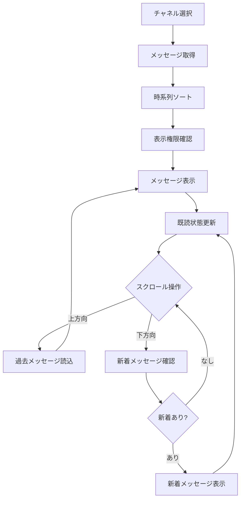
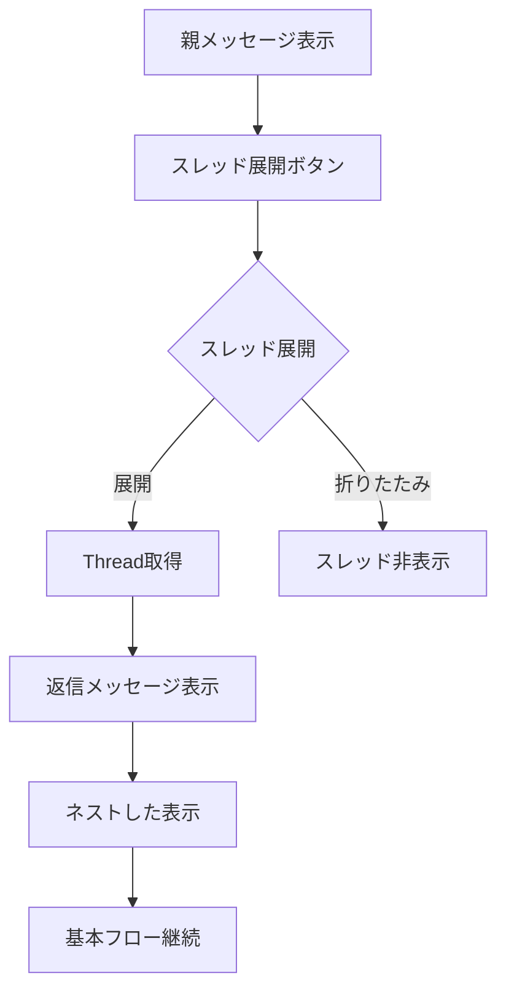
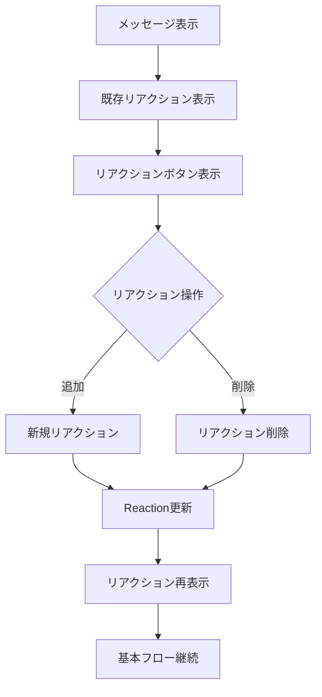
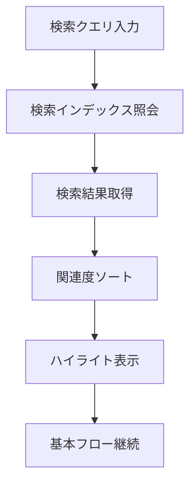

# ユースケース: メッセージを表示する

## 基本情報
- **ユースケースID**: UC3
- **アクター**: チャネルメンバー
- **概要**: チャネル内の投稿済みメッセージを時系列で表示し、既読管理、スレッド会話、リアクション機能を提供する

## パラソルドメイン連携
- **操作エンティティ**: Message, Channel
- **関連エンティティ**: ChannelMember, Thread, Reaction, ReadStatus
- **ドメインサービス**: CollaborationCoordinator.updateSearchIndex()

## 事前条件
- ユーザーがチャネルメンバーとして認証済み
- 対象チャネルが存在し、アクセス権限を持つ
- 表示対象のメッセージが投稿済み状態（posted）である

## 事後条件
### 成功時
- メッセージが時系列順で表示されている
- 表示したメッセージが既読状態に更新されている
- スレッド・リアクション機能が利用可能状態
- メッセージへの返信・リアクションが実行可能状態

### 失敗時
- エラーメッセージが表示されている
- アクセス可能な範囲のメッセージのみ表示
- 権限不足の場合、制限内容の説明表示

## 基本フロー

1. チャネルメンバーがチャネルを選択する
2. システムがMessageエンティティからメッセージ一覧を取得する
3. システムがメッセージを時系列順にソートする
4. システムがChannelMemberの権限に基づき表示権限を確認する
5. システムが最新メッセージから順番に表示する
6. システムがReadStatusエンティティを更新し既読状態を記録する
7. チャネルメンバーが画面をスクロールして過去・新着メッセージを閲覧する
8. システムがリアルタイムで新着メッセージを表示に反映する

## 代替フロー

### 代替フロー1: スレッド会話表示
**分岐点**: ステップ5
**条件**: メッセージにスレッド返信が存在する

1. システムが親メッセージにスレッド返信が存在することを確認する
2. システムがスレッド展開ボタンを表示する
3. チャネルメンバーがスレッド展開ボタンをクリックする
4. システムがThreadエンティティから返信メッセージを取得する
5. システムが返信メッセージをネスト表示する
6. 基本フローのステップ6に戻る

### 代替フロー2: リアクション表示・操作
**分岐点**: ステップ5
**条件**: メッセージにリアクションが付与されている、または新規リアクションを追加

1. システムがメッセージに付与された既存リアクションを表示する
2. システムがリアクション追加ボタンを表示する
3. チャネルメンバーがリアクション操作を実行する
4. システムがReactionエンティティを更新する
5. システムがリアクション状況を再表示する
6. 基本フローのステップ6に戻る

### 代替フロー3: 検索結果表示
**分岐点**: ステップ2
**条件**: 検索クエリが指定されている

1. チャネルメンバーが検索クエリを入力する
2. システムがCollaborationCoordinator.updateSearchIndex()を使用して検索を実行する
3. システムが検索結果を関連度順にソートする
4. システムが検索キーワードをハイライト表示する
5. 基本フローのステップ4に戻る

## 例外フロー

### 例外1: メッセージ読み込みエラー
**発生点**: ステップ2
**条件**: ネットワーク障害またはサーバーエラー

1. システムがメッセージ取得処理でエラーを検出
2. キャッシュされたメッセージがある場合は表示
3. 「オフラインモード」表示と再接続ボタン提供
4. 接続復旧時の自動再読み込み機能

### 例外2: 権限不足エラー
**発生点**: ステップ4
**条件**: チャネルアクセス権限が削除・変更されている

1. システムがChannelMemberの権限変更を検出
2. アクセス可能な範囲のメッセージのみ表示
3. 権限不足の理由と対処方法を説明
4. チャネル管理者への権限回復依頼機能提供

### 例外3: メッセージ削除・編集競合
**発生点**: ステップ5
**条件**: 表示中にメッセージが削除・編集される

1. システムがメッセージ状態変更を検出
2. 削除メッセージの場合「削除されたメッセージ」と表示
3. 編集メッセージの場合、最新内容に自動更新
4. 変更履歴の表示オプション提供

## 特別要件
- **性能**: 初期表示100ms以内、スクロール時の追加読み込み50ms以内
- **可用性**: オフライン表示機能（キャッシュ利用）
- **セキュリティ**: メッセージ閲覧ログの監査記録
- **ユーザビリティ**: 既読・未読の視覚的区別、リアルタイム更新

## ビジネスルール
- 既読状態は自動更新（画面表示から2秒後）
- プライベートチャネルのメッセージは外部共有禁止
- システムメッセージは特別表示（アイコン・色分け）
- 削除されたメッセージは「削除されました」と表示（完全削除はしない）
- リアクションは1ユーザーあたり1種類まで（変更は可能）

## 表示仕様

### メッセージ表示項目
- **送信者情報**: アバター、名前、オンライン状態
- **メッセージ内容**: テキスト、ファイル添付、メンション
- **タイムスタンプ**: 送信時刻、編集時刻（編集済みの場合）
- **既読状況**: 既読者数、未読マーク
- **リアクション**: 絵文字とリアクション者数
- **スレッド**: 返信数、最新返信者

### 表示順序とグループ化
- **時系列順**: 最新メッセージが下部
- **日付グループ**: 日付区切りでグループ表示
- **送信者グループ**: 連続投稿時のグループ表示
- **システムメッセージ**: 特別表示エリア

## 成功指標
- **表示応答時間**: 100ms以内（95パーセンタイル）
- **既読率**: 90%以上（アクティブユーザー）
- **スレッド利用率**: 25%以上（返信機能の活用）
- **リアクション使用率**: 60%以上（コミュニケーション活性化）

---
*このユースケースは新仕様v2.0のユースケース・ページ分解指向設計に基づいています*