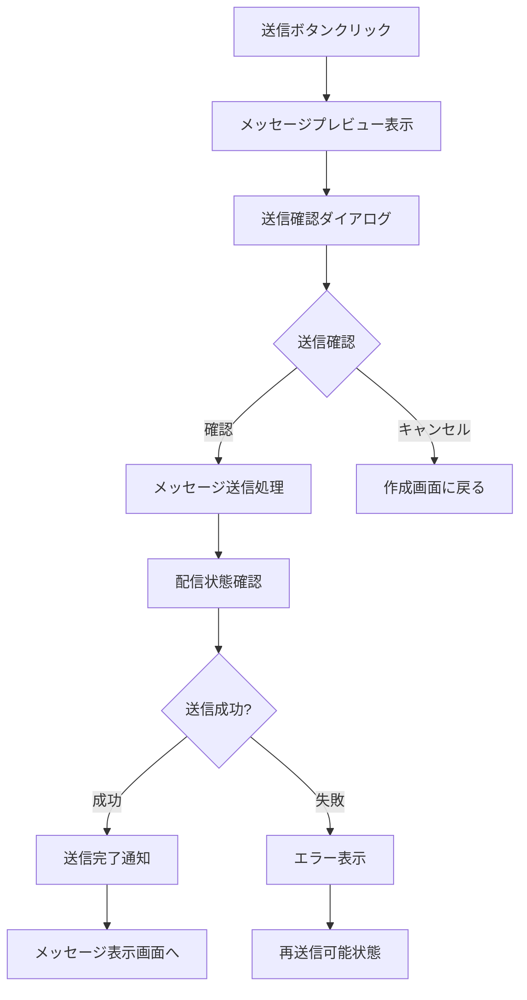
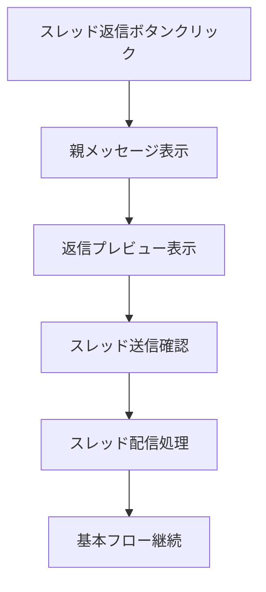
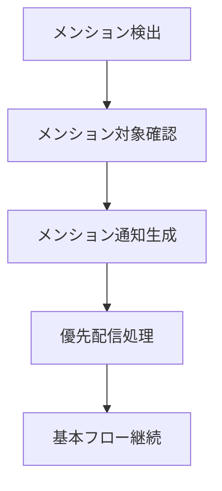

# ユースケース: メッセージを送信する

## 基本情報
- **ユースケースID**: UC2
- **アクター**: チャネルメンバー
- **概要**: 作成済みのメッセージを最終確認し、チャネルに送信して他のメンバーに配信する

## パラソルドメイン連携
- **操作エンティティ**: Message, ChannelAggregate
- **関連エンティティ**: Channel, ChannelMember, MentionContext, Thread
- **ドメインサービス**: CollaborationCoordinator.processMessage()

## 事前条件
- ユーザーがチャネルメンバーとして認証済み
- 下書き状態のメッセージが存在する
- ユーザーがチャネルへの投稿権限を持つ
- チャネルがアクティブ状態である

## 事後条件
### 成功時
- メッセージがposted状態に更新されている
- チャネルの全メンバーにメッセージが配信されている
- メンション対象者に通知が送信されている
- メッセージ表示（UC3）が実行可能状態

### 失敗時
- メッセージがdraft状態で保持されている
- エラー内容が表示されている
- 再送信が実行可能状態

## 基本フロー

1. チャネルメンバーが送信ボタンをクリックする
2. システムがメッセージのプレビューを表示する
3. システムが送信確認ダイアログを表示する
4. チャネルメンバーが送信を確認する
5. システムがメッセージをposted状態に更新する
6. システムがチャネル内の全メンバーにメッセージを配信する
7. システムがメンション対象者に通知を送信する
8. システムが送信完了を通知する

## 代替フロー

### 代替フロー1: スレッド返信送信
**分岐点**: ステップ1
**条件**: 既存メッセージへの返信として送信

1. チャネルメンバーがスレッド返信ボタンをクリックする
2. システムが親メッセージを表示する
3. システムが返信メッセージのプレビューを表示する
4. システムがスレッド送信確認ダイアログを表示する
5. システムがThreadエンティティを更新する
6. 基本フローのステップ5に戻る

### 代替フロー2: メンション付きメッセージ送信
**分岐点**: ステップ6
**条件**: メッセージにメンションが含まれる

1. システムがメッセージ内のメンションを検出する
2. システムがメンション対象ユーザーのアクティブ状態を確認する
3. システムがMentionContextを基に通知を生成する
4. システムがメンション対象者に優先配信を実行する
5. 基本フローのステップ7に戻る

## 例外フロー

### 例外1: 送信権限エラー
**発生点**: ステップ5
**条件**: チャネルへの投稿権限が削除されている

1. システムがCollaborationCoordinator.processMessage()で権限エラー検出
2. 送信権限エラーメッセージを表示
3. チャネル管理者への連絡方法を提示
4. 代替チャネルでの投稿を提案

### 例外2: ネットワーク接続エラー
**発生点**: ステップ6
**条件**: ネットワーク接続が不安定または切断

1. システムが配信処理でネットワークエラーを検出
2. 自動再試行（最大3回）を実行
3. 再試行失敗時、オフライン送信モードに切り替え
4. 接続復旧時の自動再送機能を提供

### 例外3: チャネルアーカイブエラー
**発生点**: ステップ5
**条件**: 送信処理中にチャネルがアーカイブされる

1. システムがChannelAggregateの状態変更を検出
2. チャネルアーカイブエラーメッセージを表示
3. メッセージを下書き状態で保持
4. アクティブなチャネルへの移動を提案

## 特別要件
- **性能**: 送信処理は2秒以内の完了
- **可用性**: 配信失敗時の自動再試行機能
- **セキュリティ**: 送信ログの監査記録
- **ユーザビリティ**: 送信状況のリアルタイム表示

## ビジネスルール
- メッセージ送信後の編集は24時間以内に限定
- システムメッセージは自動送信（承認不要）
- プライベートチャネルは招待制メンバーのみ送信可能
- ファイル添付は送信時にウイルススキャン実行
- 連続送信制限: 1分間に10メッセージまで

## 成功指標
- **送信成功率**: 99.9%以上（ネットワークエラー除く）
- **配信遅延**: 100ms以内（95パーセンタイル）
- **メンション通知配信率**: 100%（アクティブユーザー）

---
*このユースケースは新仕様v2.0のユースケース・ページ分解指向設計に基づいています*