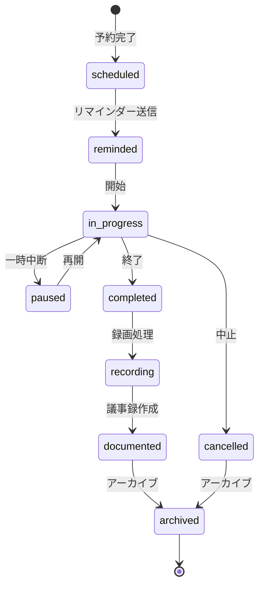

# ビジネスオペレーション: 会議効率を最大化し生産性を向上させる

**バージョン**: 2.0.0
**更新日**: 2025-10-09
**設計方針**: ユースケース・ページ分解指向 + パラソルドメイン言語連携

## 📋 概要
**目的**: 会議のスケジューリングから実施、フォローアップまでを一貫して管理し、会議の生産性を最大化する
**パターン**: Workflow
**ゴール**: 会議準備の効率化、アジェンダ遵守による時間厳守、議事録の自動生成により、会議コストを30%削減し組織全体のコミュニケーション効率を向上させる

## 🎭 関係者とロール
- **会議ホスト**: 会議を主催し、アジェンダ設定、参加者招待、会議進行を担当
- **会議参加者**: 会議に参加し、議論に貢献し、アクションアイテムを実行
- **会議オーガナイザー**: 複数会議の調整、会議室予約、リソース管理を担当
- **議事録作成者**: 会議中の議論を記録し、決定事項とアクションアイテムを整理
- **システム**: 会議スケジューリング、リマインダー送信、録画管理、議事録自動生成を実行

## 🏗️ パラソルドメイン連携

### サービス境界とユースケース連携

> **⚡ マイクロサービス設計の基本原則（ユースケース利用型）**
> - **自サービス管理**: 自エンティティの全CRUD + 自ユースケースの実装
> - **他サービス連携**: **他サービスの公開ユースケースを利用**（エンティティは意識しない）

#### 📦 自サービス管理（collaboration-facilitation-service）
**責務**: ✅ エンティティ管理 ✅ ユースケース実装 ✅ ビジネスロジック

```
Entity: Meeting - Aggregate Root
├── id: UUID - 一意識別子
├── hostId: UUID - 主催者ID参照
├── title: STRING_200 - 会議タイトル
├── description: TEXT - 会議説明
├── startTime: TIMESTAMP - 開始日時
├── endTime: TIMESTAMP - 終了日時
├── status: ENUM - 状態（scheduled/in_progress/completed/cancelled）
├── roomId: UUID - 会議室ID（オプション）
├── meetingUrl: STRING_500 - オンライン会議URL（オプション）
└── recordingUrl: STRING_500 - 録画URL（オプション）

ValueObject: MeetingAgenda
├── items: JSON - 議題リスト
├── timeAllocation: JSON - 時間配分
└── preparationMaterials: JSON - 事前資料

ValueObject: MeetingSettings
├── recordingEnabled: BOOLEAN - 録画有効フラグ
├── waitingRoomEnabled: BOOLEAN - 待機室有効フラグ
├── screenSharingEnabled: BOOLEAN - 画面共有有効フラグ
└── chatEnabled: BOOLEAN - チャット有効フラグ

Aggregate: MeetingAggregate
├── ルート: Meeting
├── 包含: MeetingAgenda, MeetingSettings, MeetingParticipant
└── 不変条件: 開始時刻 < 終了時刻、参加者最小1名、主催者必須
```

#### 🔗 他サービスユースケース利用（ユースケース呼び出し型）
**責務**: ❌ エンティティ知識不要 ✅ ユースケース利用のみ

```
[secure-access-service] ユースケース利用:
├── UC-AUTH-01: ユーザー認証を実行する → POST /api/auth/authenticate
├── UC-AUTH-02: 権限を検証する → POST /api/auth/validate-permission
└── UC-AUTH-03: アクセスログを記録する → POST /api/auth/log-access

[notification-service] ユースケース利用:
├── UC-NOTIFY-01: 会議リマインダーを配信する → POST /api/notifications/send-reminder
├── UC-NOTIFY-02: 会議招待を送信する → POST /api/notifications/send-invitation
└── UC-NOTIFY-03: 会議フォローアップを配信する → POST /api/notifications/send-followup

[knowledge-co-creation-service] ユースケース利用:
├── UC-KNOWLEDGE-01: 議事録を知識として記録する → POST /api/knowledge/articles/create
└── UC-KNOWLEDGE-02: 関連ナレッジを検索する → GET /api/knowledge/search
```

### マイクロサービス連携型ドメインサービス

#### 🎯 ビジネス価値重視のドメインサービス
```
DomainService: MeetingEfficiencyService（会議効率化サービス）
├── enhanceMeetingProductivity() - 会議生産性向上
├── optimizeMeetingScheduling() - スケジューリング最適化（→ user-preference分析）
├── strengthenMeetingEngagement() - 参加者エンゲージメント強化
└── amplifyActionItemCompletion() - アクション完了率向上

DomainService: CrossServiceMeetingCoordinator（サービス間会議調整サービス）
├── coordinateResourceAllocation() - リソース配分調整（→ resource-optimization連携）
├── maintainMeetingQuality() - 会議品質維持
├── preventMeetingOverload() - 会議過多防止
└── ensureComplianceRequirements() - コンプライアンス遵守（→ secure-access連携）
```

## プロセスフロー

> **重要**: プロセスフローは必ず番号付きリスト形式で記述してください。
> Mermaid形式は使用せず、テキスト形式で記述することで、代替フローと例外フローが視覚的に分離されたフローチャートが自動生成されます。

1. システムが会議予約を処理する
2. システムが参加者調整を処理する
3. システムがアジェンダ作成を行う
4. システムがリマインダー送信を処理する
5. システムが会議開始を処理する
6. システムが議論・記録を処理する
7. システムが会議終了を処理する
8. システムが録画保存を処理する
9. システムが議事録作成を行う
10. システムがアクション配信を処理する
11. システムが完了を処理する

## 代替フロー

### 代替フロー1: 情報不備
- 2-1. システムが情報の不備を検知する
- 2-2. システムが修正要求を送信する
- 2-3. ユーザーが情報を修正し再実行する
- 2-4. 基本フロー2に戻る

## 例外処理

### 例外1: システムエラー
- システムエラーが発生した場合
- エラーメッセージを表示する
- 管理者に通知し、ログに記録する

### 例外2: 承認却下
- 承認が却下された場合
- 却下理由をユーザーに通知する
- 修正後の再実行を促す

## ビジネス状態



## KPI
- **会議出席率**: 90%以上 - 予定参加者のうち実際に参加した割合
- **時間厳守率**: 85%以上 - 予定時間内に終了した会議の割合
- **議事録作成率**: 95%以上 - 会議後24時間以内に議事録が作成された割合
- **アクション完了率**: 80%以上 - 会議で決定されたアクションアイテムの期限内完了率
- **平均会議時間**: 45分以内 - 1会議あたりの平均所要時間
- **会議満足度**: 4.0以上（5段階評価） - 参加者による会議効率性の評価

## ビジネスルール
- **最短予約時間**: 会議は最低15分単位で予約可能
- **最長会議時間**: 1会議の最大時間は8時間
- **参加者上限**: 1会議の最大参加者数は100名（ビデオ会議の場合）
- **キャンセル期限**: 会議開始24時間前までキャンセル可能、以降はホストのみ中止可能
- **リマインダー必須**: 会議開始30分前と5分前の2回のリマインダー送信は必須
- **録画同意**: 録画を行う場合は参加者全員の同意が必要（会議開始時に確認）
- **録画保存期間**: 録画データは会議終了後90日間保存、その後自動削除
- **議事録公開範囲**: デフォルトで参加者のみ閲覧可能、ホストが公開範囲を拡大可能
- **アジェンダ必須**: 1時間以上の会議にはアジェンダ設定が必須
- **アクションアイテム追跡**: 議事録から抽出されたアクションアイテムは自動的にタスク化

## 入出力仕様

### 入力
- **会議基本情報**: タイトル、説明、目的、会議タイプ（video/audio/chat）
- **スケジュール情報**: 開始日時、終了日時、タイムゾーン、繰り返し設定
- **参加者リスト**: ユーザーID配列、必須/任意の区分、外部ゲストメールアドレス
- **アジェンダ**: 議題リスト、各議題の所要時間、担当者、事前資料URL
- **会議設定**: 録画有無、待機室有効化、画面共有権限、チャット有効化
- **会議室予約**: 物理会議室ID（オンサイト会議の場合）

### 出力
- **会議レコード**: 会議ID、会議URL、作成日時、ステータス
- **カレンダーイベント**: iCalendar形式のイベントファイル（外部カレンダー連携用）
- **リマインダー通知**: 参加者への通知メッセージ、通知日時
- **会議録画**: 録画ファイルURL、サムネイル画像、再生時間
- **議事録**: Markdown形式の議事録、決定事項リスト、アクションアイテムリスト
- **出席記録**: 参加者ごとの参加時刻、退出時刻、出席時間
- **会議メトリクス**: 予定時間、実際の時間、参加率、満足度スコア

## 例外処理
- **参加者予定競合**: スケジュール競合がある参加者には警告表示、任意参加への変更を提案
- **会議室ダブルブッキング**: 会議室予約が競合した場合、代替会議室を提案または自動予約
- **ビデオ会議接続エラー**: 接続失敗時は自動リトライ（3回）、失敗した場合は音声会議へフォールバック
- **録画失敗**: 録画開始失敗時は参加者に通知し、手動録画を促す
- **議事録作成遅延**: 自動生成失敗時は手動作成を促す通知を送信
- **リマインダー送信失敗**: メール送信失敗時はアプリ内通知でリトライ
- **会議時間超過**: 予定終了時刻を過ぎた場合、ホストに延長確認の通知を送信
- **無応答参加者**: 会議開始後10分経過しても参加がない必須参加者には再度通知

## 派生ユースケース
このビジネスオペレーションから以下のユースケースが派生します：

1. **会議をスケジュールする**
   - アクター: 会議ホスト
   - 概要: 会議の日時、参加者、アジェンダを設定し、会議を予約する

2. **会議に参加する**
   - アクター: 会議参加者
   - 概要: 会議URLからビデオ会議に参加し、議論に貢献する

3. **議事録を作成する**
   - アクター: 議事録作成者、システム（自動生成）
   - 概要: 会議中の議論を記録し、決定事項とアクションアイテムを整理する

4. **会議をキャンセル・再スケジュールする**
   - アクター: 会議ホスト
   - 概要: 予約済みの会議をキャンセルまたは別の日時に変更する

5. **会議録画を視聴する**
   - アクター: 会議参加者、承認された関係者
   - 概要: 録画された会議を視聴し、見逃した議論を確認する

6. **アクションアイテムを追跡する**
   - アクター: 会議ホスト、アクション担当者
   - 概要: 会議で決定されたアクションアイテムの進捗を確認し、完了を管理する

7. **繰り返し会議を設定する**
   - アクター: 会議ホスト
   - 概要: 定例会議として毎週・毎月自動的に会議を予約する
