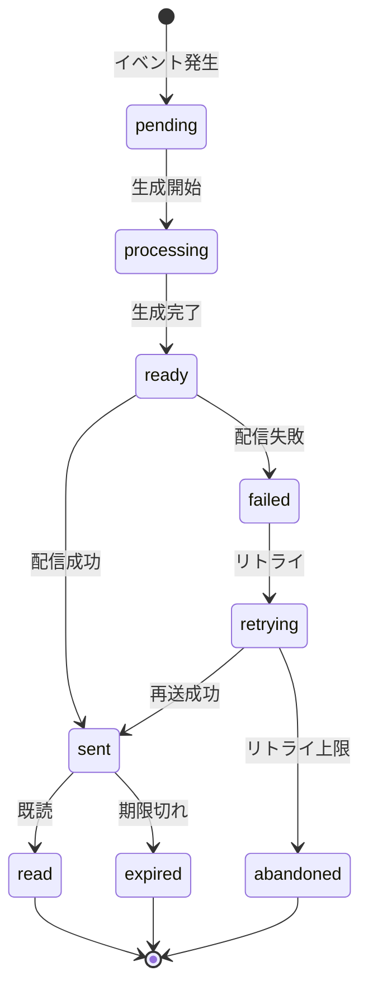

# ビジネスオペレーション: 重要情報をタイムリーに届け行動を促進する

**バージョン**: 2.0.0
**更新日**: 2025-10-09
**設計方針**: ユースケース・ページ分解指向 + パラソルドメイン言語連携

## 📋 概要
**目的**: 重要な情報をタイムリーに関係者へ届け、適切な行動を促進する
**パターン**: Communication
**ゴール**: 通知の確実な配信と高い既読率の達成により、組織のコミュニケーション効率を最大化する

## 🎭 関係者とロール
- **システム**: 通知イベントを検知し、通知を生成・配信する
- **通知送信者**: 通知の起点となるアクション（メンション、承認依頼等）を実行するユーザー
- **通知受信者**: 通知を受け取り、内容を確認し、必要に応じてアクションを実行するユーザー
- **通知管理者**: 通知設定の管理、通知テンプレートの作成、配信ルールの最適化を担当

## 🏗️ パラソルドメイン連携

### サービス境界とユースケース連携

> **⚡ マイクロサービス設計の基本原則（ユースケース利用型）**
> - **自サービス管理**: 自エンティティの全CRUD + 自ユースケースの実装
> - **他サービス連携**: **他サービスの公開ユースケースを利用**（エンティティは意識しない）

#### 📦 自サービス管理（collaboration-facilitation-service）
**責務**: ✅ エンティティ管理 ✅ ユースケース実装 ✅ ビジネスロジック

```
Entity: Notification - Aggregate Root
├── id: UUID - 一意識別子
├── senderId: UUID - 送信者ID参照
├── recipientId: UUID - 受信者ID参照
├── title: STRING_200 - 通知タイトル
├── content: TEXT - 通知内容
├── priority: ENUM - 優先度（high/medium/low）
├── category: ENUM - カテゴリ（mention/approval/reminder/alert）
├── status: ENUM - 状態（pending/sent/read/expired）
├── sentAt: TIMESTAMP - 送信日時
├── readAt: TIMESTAMP - 既読日時
└── expiresAt: TIMESTAMP - 有効期限

ValueObject: NotificationContent
├── title: STRING_200 - タイトル（必須、1文字以上）
├── message: TEXT - メッセージ本文
├── actionUrl: STRING_500 - アクションURL（オプション）
└── attachments: JSON - 添付情報（オプション）

ValueObject: DeliverySettings
├── channels: ENUM[] - 配信チャネル（app/email/push）
├── immediateDelivery: BOOLEAN - 即時配信フラグ
├── scheduleTime: TIMESTAMP - 配信予約時間（オプション）
└── retryConfig: JSON - リトライ設定

Aggregate: NotificationAggregate
├── ルート: Notification
├── 包含: NotificationContent, DeliverySettings
└── 不変条件: 送信者・受信者必須、有効期限 > 送信日時、カテゴリ別優先度制約
```

#### 🔗 他サービスユースケース利用（ユースケース呼び出し型）
**責務**: ❌ エンティティ知識不要 ✅ ユースケース利用のみ

```
[secure-access-service] ユースケース利用:
├── UC-AUTH-01: ユーザー認証を実行する → POST /api/auth/authenticate
├── UC-AUTH-02: 権限を検証する → POST /api/auth/validate-permission
└── UC-AUTH-03: アクセスログを記録する → POST /api/auth/log-access

[project-success-service] ユースケース利用:
├── UC-PROJECT-01: プロジェクト情報を取得する → GET /api/projects/details
├── UC-PROJECT-02: チームメンバー情報を取得する → GET /api/projects/members
└── UC-PROJECT-03: プロジェクト活動を記録する → POST /api/projects/activities

[knowledge-co-creation-service] ユースケース利用:
├── UC-KNOWLEDGE-01: 通知内容を知識として記録する → POST /api/knowledge/articles/create
└── UC-KNOWLEDGE-02: 関連知識を検索する → GET /api/knowledge/search
```

**ユースケース連携パターン**:
- **機能利用**: `POST /api/{service}/usecases/{usecase-id}` - 他サービス機能実行
- **状況照会**: `GET /api/{service}/usecases/{usecase-id}/status` - 実行状況確認
- **結果取得**: `GET /api/{service}/usecases/{usecase-id}/result` - 処理結果取得

### マイクロサービス連携型ドメインサービス

#### 🎯 ビジネス価値重視のドメインサービス
```
DomainService: NotificationDeliveryCoordinator（通知配信調整サービス）
├── enhanceNotificationRelevance() - 通知の関連性向上
├── optimizeDeliveryTiming() - 配信タイミング最適化（→ user-preference分析）
├── strengthenEngagement() - エンゲージメント強化
└── amplifyActionRate() - アクション実行率向上

DomainService: CrossServiceNotificationCoordinator（サービス間通知調整サービス）
├── coordinateProjectNotifications() - プロジェクト関連通知調整（→ project-success連携）
├── maintainNotificationQuality() - 通知品質維持
├── preventNotificationSpam() - 通知スパム防止
└── ensurePrivacyCompliance() - プライバシー遵守（→ secure-access連携）
```

## 🔄 プロセスフロー（ユースケース分解指向）

> **重要**: 各ステップは「誰が何をするか」を明記し、ユースケース分解の根拠とする

### 基本フロー
1. **システムが通知イベントを検知** → **内部処理（ページなし）**
   - **ドメインサービス**: NotificationDeliveryCoordinator.detectNotificationEvent()

2. **システムが通知コンテンツを生成** → **UC1: 通知コンテンツを作成する**
   - **操作エンティティ**: Notification（新規作成）、NotificationContent
   - **必要ページ**: 通知作成確認ページ - 生成内容の確認と調整

3. **システムが受信者設定を確認** → **内部処理（ページなし）**
   - **ドメインサービス**: CrossServiceNotificationCoordinator.validateRecipientSettings()
   - **他サービス連携**: → UC-AUTH-02: 権限を検証する

4. **受信者が通知を受信** → **UC2: 通知を受信し確認する**
   - **操作エンティティ**: Notification（状態更新: pending → sent）
   - **必要ページ**: 通知一覧ページ - 未読通知の表示と管理

5. **受信者が通知内容を確認** → **UC3: 通知詳細を表示し行動する**
   - **操作エンティティ**: Notification（状態更新: sent → read）
   - **必要ページ**: 通知詳細ページ - 詳細内容と関連アクション

6. **システムが配信結果を記録** → **内部処理（ページなし）**
   - **ドメインサービス**: NotificationDeliveryCoordinator.recordDeliveryMetrics()
   - **他サービス連携**: → UC-KNOWLEDGE-01: 通知内容を知識として記録

### ユースケース分解原則
- **ユーザー操作ステップ** → ユースケース + ページ
- **システム内部処理** → ドメインサービス（ページなし）
- **1ユースケース = 1つの明確な目的 = 1つのページ**

## 📄 ユースケース・ページ設計マトリックス

| UC# | ユースケース名 | 対応ページ | エンティティ | アクター | 設計方針 |
|-----|---------------|-----------|-------------|----------|----------|
| UC1 | 通知コンテンツを作成する | 通知作成確認ページ | Notification, NotificationContent | システム/通知管理者 | 操作重視・自動生成確認 |
| UC2 | 通知を受信し確認する | 通知一覧ページ | Notification | 通知受信者 | 表示重視・効率的スキャン |
| UC3 | 通知詳細を表示し行動する | 通知詳細ページ | Notification | 通知受信者 | 操作重視・アクション促進 |

## 🔀 代替フロー（ユースケース分岐指向）

### 代替フロー1: 通知設定によるスキップ
- **分岐元**: 基本フロー ステップ4
- **条件**: 受信者が該当カテゴリの通知を無効に設定
- **代替ユースケース**: UC2-Alt: 通知設定を確認し配信調整する
  - **必要ページ**: 通知設定確認ページ - 設定内容と変更オプション
  - **操作エンティティ**: Notification（status更新: pending → skipped）

### 代替フロー2: 配信チャネル障害
- **分岐元**: 基本フロー ステップ4
- **条件**: メールサーバー障害等で配信チャネルが利用不可
- **代替ユースケース**: UC2-Alt: 代替チャネルで通知を配信する
  - **必要ページ**: 配信状況ページ - 障害状況と代替手段表示
  - **操作エンティティ**: Notification（配信設定変更）

## ⚠️ 例外フロー（エラーページ設計指向）

### 例外1: 受信者権限不足
- **発生ステップ**: ステップ3（受信者設定確認）
- **エラーユースケース**: UC2-Error: 権限エラーを処理し管理者に通知する
  - **必要ページ**: 権限エラーページ - エラー詳細・管理者連絡・代替手段
  - **表示情報**: エラーメッセージ、管理者連絡先、権限申請手順

### 例外2: 通知頻度制限超過
- **発生ステップ**: ステップ2（通知生成）
- **エラーユースケース**: UC1-Error: 頻度制限エラーを処理し遅延配信する
  - **必要ページ**: 配信遅延通知ページ - 遅延理由・配信予定時刻・緊急時連絡方法
  - **表示情報**: 制限理由、次回配信時刻、緊急時のエスカレーション手順

## ビジネス状態



## 📏 KPI（ユースケース別成功指標）

| ユースケース | KPI | 目標値 | 測定方法 |
|-------------|-----|--------|----------|
| UC1: 通知コンテンツを作成する | 通知生成成功率 | 99.8% | 生成試行回数に対する成功率 |
| UC1: 通知コンテンツを作成する | 平均生成時間 | 1秒以内 | イベント検知から生成完了まで |
| UC2: 通知を受信し確認する | 配信成功率 | 99.5% | 生成通知の配信成功率 |
| UC2: 通知を受信し確認する | 平均配信時間 | 3秒以内 | 生成から受信者到達まで |
| UC3: 通知詳細を表示し行動する | 24時間以内既読率 | 85% | 配信後24時間以内の既読率 |
| UC3: 通知詳細を表示し行動する | アクション実行率 | 60% | 通知から関連アクションへの遷移率 |

## ビジネスルール
- **即時配信原則**: 高優先度通知（緊急アラート、承認依頼）は5秒以内に配信
- **バッチ配信制限**: 低優先度通知は1時間ごとにまとめて配信可能（受信者設定に依存）
- **通知頻度制限**: 同一受信者への通知は10分間に最大3件まで（スパム防止）
- **深夜配信制限**: 通常通知は22:00-08:00の配信を制限（緊急通知は除外）
- **既読自動期限**: 未読通知は30日後に自動的に期限切れステータスに移行
- **重複排除**: 同一イベントから生成される同一内容の通知は1件のみ配信
- **配信チャネル優先順位**: アプリ内通知（必須） → メール通知（設定に応じて） → プッシュ通知（設定に応じて）

## 入出力仕様

### 入力
- **イベント情報**: イベント種別、発生日時、発生元エンティティ（メッセージ、会議、承認依頼等）
- **送信者情報**: ユーザーID、表示名、ロール
- **通知内容**: タイトル、メッセージ本文、アクションURL、優先度
- **受信者リスト**: 通知対象ユーザーIDの配列
- **通知オプション**: 配信チャネル指定、期限日時、カテゴリ

### 出力
- **通知レコード**: 生成された通知の詳細情報（通知ID、配信ステータス、配信日時）
- **配信結果**: 配信成功/失敗の詳細、エラー情報（失敗時）
- **配信ログ**: 配信履歴、既読日時、クリック日時
- **メトリクス**: 配信統計情報（配信数、既読数、クリック数）

## 例外処理
- **受信者不明エラー**: 指定されたユーザーIDが存在しない場合、エラーログを記録しスキップ
- **通知設定未登録**: 受信者の通知設定が未登録の場合、デフォルト設定（アプリ内通知のみ）を適用
- **配信チャネルエラー**: メール送信失敗時は3回までリトライ（指数バックオフ）、最終的にアプリ内通知のみに切り替え
- **通知頻度超過**: 頻度制限超過時は低優先度通知をキューに保留し、次の配信タイミングで送信
- **システム過負荷**: 通知配信キューが閾値を超えた場合、低優先度通知の配信を一時停止

## 🚀 実装指針

### 推奨実装順序
1. **パラソルドメイン言語定義** - Notification、NotificationContent、DeliverySettings集約
2. **ドメインサービス実装** - NotificationDeliveryCoordinator、CrossServiceNotificationCoordinator
3. **ユースケース・ページのペア実装** - UC1→UC2→UC3の順序で段階的に
4. **統合テスト** - 他サービス連携を含む通知配信フロー全体の検証

### 品質チェックポイント
- [ ] 各ユースケースに対応するページが1対1で存在する
- [ ] パラソルドメイン言語エンティティ（Notification）が正しく操作される
- [ ] ビジネス状態遷移がエンティティ状態と一致する
- [ ] 代替・例外フローにも適切なページが用意される
- [ ] 他サービスユースケース利用が正しく実装される（secure-access、project-success、knowledge連携）

---
*このオペレーション定義は、ユースケース・ページ分解とパラソルドメイン言語連携を強化したビジネスオペレーション設計指針v2.0に基づいています*
