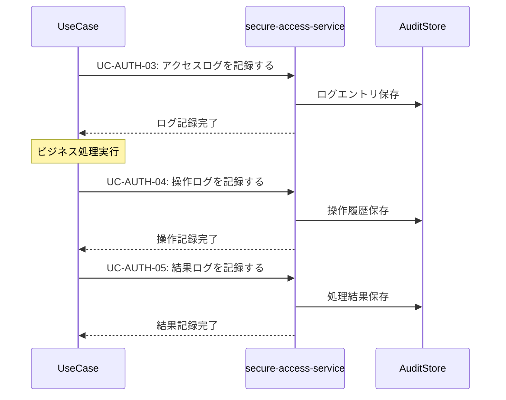

# 監査ログ共通パターン (Audit Logging Pattern)

**バージョン**: v1.0.0
**更新日**: 2025-10-13
**適用範囲**: 監査ログが必要な全ユースケース

## 📋 パターン概要

このパターンは、secure-access-serviceを利用した標準的な監査ログ記録・分析フローを定義します。コンプライアンス要件や運用監視のための包括的なログ管理を提供します。

## 🎯 適用ユースケース

- ✅ **必須適用**: セキュリティセンシティブな操作を含むユースケース
- ✅ **必須適用**: データ変更・削除を伴うユースケース
- ✅ **推奨適用**: ビジネスクリティカルな処理を行うユースケース
- ❌ **適用外**: 読み取り専用で機密性の低いユースケース

## 🔄 標準監査ログフロー

### 基本シーケンス


### API呼び出し詳細

#### 1. アクセスログ記録
```http
POST /api/auth/usecases/log-access
```

**リクエスト**:
```json
{
  "logContext": {
    "serviceId": "knowledge-co-creation-service",
    "operationId": "capture-knowledge",
    "usecaseId": "validate-knowledge-quality",
    "sessionId": "{session_id}",
    "requestId": "{request_id}"
  },
  "accessInfo": {
    "userId": "{user_id}",
    "userRole": "consultant",
    "ipAddress": "192.168.1.100",
    "userAgent": "Mozilla/5.0 (compatible)",
    "accessTime": "2025-10-13T10:30:00Z",
    "accessMethod": "web_browser"
  },
  "resourceInfo": {
    "resourceType": "knowledge",
    "resourceId": "{knowledge_id}",
    "resourceOwner": "{owner_user_id}",
    "sensitivityLevel": "internal"
  }
}
```

**レスポンス**:
```json
{
  "success": true,
  "data": {
    "logId": "log_uuid",
    "recordedAt": "2025-10-13T10:30:01Z",
    "sequenceNumber": 12345,
    "retentionUntil": "2025-10-13T10:30:01Z"
  }
}
```

#### 2. 操作ログ記録
```http
POST /api/auth/usecases/log-operation
```

**リクエスト**:
```json
{
  "logContext": {
    "parentLogId": "{access_log_id}",
    "operationType": "create|read|update|delete|execute",
    "operationName": "validate_knowledge_quality"
  },
  "operationDetails": {
    "targetEntities": [
      {
        "entityType": "knowledge",
        "entityId": "{knowledge_id}",
        "beforeState": {"status": "draft", "quality_score": null},
        "afterState": {"status": "validated", "quality_score": 85}
      }
    ],
    "parameters": {
      "validation_criteria": ["accuracy", "completeness", "relevance"],
      "validation_method": "ai_assisted"
    },
    "executionTime": "2025-10-13T10:30:02Z",
    "duration": 1500
  },
  "businessContext": {
    "businessProcess": "knowledge_validation",
    "businessValue": "quality_assurance",
    "impactScope": "single_knowledge_item"
  }
}
```

#### 3. 結果ログ記録
```http
POST /api/auth/usecases/log-result
```

**リクエスト**:
```json
{
  "logContext": {
    "parentLogId": "{operation_log_id}",
    "resultType": "success|failure|partial_success"
  },
  "resultDetails": {
    "outcome": "success",
    "resultData": {
      "quality_score": 85,
      "validation_feedback": "高品質な知識として認定",
      "improvement_suggestions": ["図表の追加推奨", "参考文献の充実"]
    },
    "metrics": {
      "processing_time": 1500,
      "resources_consumed": {"cpu_seconds": 12, "memory_mb": 256},
      "quality_indicators": {"accuracy": 0.9, "completeness": 0.8}
    }
  },
  "compliance": {
    "dataRetention": "7_years",
    "privacyLevel": "business_confidential",
    "regulatoryRequirements": ["ISO27001", "GDPR"]
  }
}
```

## 📊 ログレベル定義

### アクセスレベル
```json
{
  "logLevels": {
    "TRACE": {
      "description": "全アクセス詳細記録",
      "retention": "30_days",
      "usage": "デバッグ・トラブルシューティング"
    },
    "INFO": {
      "description": "通常業務操作記録",
      "retention": "1_year",
      "usage": "運用監視・業務分析"
    },
    "WARN": {
      "description": "注意を要する操作記録",
      "retention": "3_years",
      "usage": "セキュリティ監視"
    },
    "ERROR": {
      "description": "エラー・異常操作記録",
      "retention": "7_years",
      "usage": "インシデント対応"
    },
    "AUDIT": {
      "description": "監査要求操作記録",
      "retention": "7_years",
      "usage": "法的要件・コンプライアンス"
    }
  }
}
```

### 機密度分類
```json
{
  "sensitivityLevels": {
    "public": {
      "description": "公開情報",
      "logDetail": "basic",
      "retention": "1_year"
    },
    "internal": {
      "description": "社内情報",
      "logDetail": "standard",
      "retention": "3_years"
    },
    "confidential": {
      "description": "機密情報",
      "logDetail": "detailed",
      "retention": "7_years"
    },
    "restricted": {
      "description": "極秘情報",
      "logDetail": "full_audit_trail",
      "retention": "permanent"
    }
  }
}
```

## ⚠️ エラーハンドリング

### ログ記録失敗
```json
{
  "error": "AUDIT_LOG_FAILED",
  "message": "監査ログの記録に失敗しました",
  "code": 500,
  "recovery": {
    "action": "retry_with_backup",
    "backupLocation": "local_buffer",
    "maxRetries": 3,
    "escalation": "security_team_notification"
  }
}
```

**対応策**:
1. ローカルバッファへの一時保存
2. バックアップログサーバーへの送信
3. セキュリティチームへの即座通知

### ストレージ容量不足
```json
{
  "error": "AUDIT_STORAGE_FULL",
  "message": "監査ログストレージの容量が不足しています",
  "code": 507,
  "recovery": {
    "action": "archive_old_logs",
    "archiveThreshold": "90_days",
    "compressionRatio": "60_percent"
  }
}
```

### データ整合性エラー
```json
{
  "error": "AUDIT_DATA_CORRUPTION",
  "message": "監査ログデータの整合性エラーが検出されました",
  "code": 422,
  "recovery": {
    "action": "validate_and_repair",
    "integrityCheck": "checksum_verification",
    "repairMethod": "redundancy_restoration"
  }
}
```

## 🔧 カスタマイズオプション

### ログ詳細度設定
```json
{
  "detailLevels": {
    "minimal": {
      "fields": ["timestamp", "userId", "operation", "result"],
      "performance": "high",
      "storage": "low"
    },
    "standard": {
      "fields": ["timestamp", "userId", "operation", "parameters", "result", "duration"],
      "performance": "medium",
      "storage": "medium"
    },
    "comprehensive": {
      "fields": ["all_available_fields"],
      "performance": "low",
      "storage": "high"
    }
  }
}
```

### リアルタイム監視設定
```json
{
  "monitoring": {
    "realtime_alerts": {
      "suspicious_access": {
        "triggers": ["multiple_failed_attempts", "unusual_time_access", "privilege_escalation"],
        "thresholds": {"max_failures": 5, "time_window": "5_minutes"},
        "notification": "immediate"
      },
      "high_volume_operations": {
        "triggers": ["bulk_data_access", "mass_deletion", "concurrent_modifications"],
        "thresholds": {"operations_per_minute": 100},
        "notification": "batched"
      }
    }
  }
}
```

## 📈 分析・レポート

### 監査レポート生成
```http
POST /api/auth/usecases/generate-audit-report
```

**リクエスト**:
```json
{
  "reportScope": {
    "timeRange": {
      "startDate": "2025-10-01T00:00:00Z",
      "endDate": "2025-10-13T23:59:59Z"
    },
    "filters": {
      "services": ["knowledge-co-creation-service"],
      "operations": ["capture-knowledge", "validate-quality"],
      "users": ["consultant@example.com"],
      "logLevels": ["INFO", "WARN", "ERROR", "AUDIT"]
    }
  },
  "reportFormat": {
    "type": "comprehensive",
    "sections": ["summary", "timeline", "anomalies", "compliance"],
    "exportFormat": "pdf"
  }
}
```

### 異常検知分析
```json
{
  "anomalyDetection": {
    "patterns": [
      {
        "type": "time_based_anomaly",
        "description": "通常時間外アクセスの検出",
        "threshold": "業務時間外の90%以上がアノマリー"
      },
      {
        "type": "volume_anomaly",
        "description": "異常な操作量の検出",
        "threshold": "平均の200%以上の操作量"
      },
      {
        "type": "access_pattern_anomaly",
        "description": "不審なアクセスパターンの検出",
        "threshold": "通常パターンからの逸脱度80%以上"
      }
    ]
  }
}
```

## 🔒 プライバシー・コンプライアンス

### 個人情報保護
```json
{
  "privacyProtection": {
    "dataMinimization": {
      "principle": "必要最小限のデータのみ記録",
      "implementation": "フィールドレベルでの記録制御"
    },
    "pseudonymization": {
      "userIds": "ハッシュ化済みIDでの記録",
      "ipAddresses": "末尾オクテットの匿名化"
    },
    "dataRetention": {
      "automatic_deletion": "保存期間満了時の自動削除",
      "manual_purge": "データ主体からの削除要求対応"
    }
  }
}
```

### 規制要件対応
```json
{
  "complianceFrameworks": {
    "GDPR": {
      "rightToAccess": "個人データアクセス権",
      "rightToErasure": "忘れられる権利",
      "dataPortability": "データポータビリティ"
    },
    "ISO27001": {
      "accessControl": "A.9 アクセス制御",
      "logging": "A.12.4 ログ取得及び監視",
      "incidentManagement": "A.16 情報セキュリティインシデント管理"
    }
  }
}
```

## 🚀 パフォーマンス最適化

### ログ書き込み最適化
- **非同期書き込み**: メイン処理をブロックしない非同期ログ記録
- **バッチ処理**: 複数ログエントリの効率的なバッチ書き込み
- **圧縮**: 長期保存ログの自動圧縮
- **インデックス**: 検索性能向上のための適切なインデックス設計

### 目標レスポンス時間
- **ログ記録開始**: 95%ile < 50ms、99%ile < 100ms
- **監査レポート生成**: 95%ile < 5s、99%ile < 15s
- **異常検知**: 95%ile < 1s、99%ile < 3s

## 📝 使用例テンプレート

### 基本的な監査ログ
```markdown
## 監査ログ記録
{{INCLUDE: audit-logging-pattern#standard-logging}}

### ログ設定
- レベル: INFO
- 保存期間: 3年
- 詳細度: 標準
```

### 高セキュリティ要求時
```markdown
## 包括的監査ログ
{{INCLUDE: audit-logging-pattern#comprehensive-logging}}

### セキュリティ強化設定
- レベル: AUDIT
- 保存期間: 永続
- 詳細度: 包括的
- リアルタイム監視: 有効
```

## 🔄 バージョン履歴

- **v1.0.0** (2025-10-13): 初版作成
  - 基本監査ログフロー定義
  - プライバシー保護機能実装
  - パフォーマンス最適化設計

## 🔗 関連パターン

- **authentication-pattern.md**: 認証処理との連携
- **notification-pattern.md**: 異常検知時の通知
- **error-handling-pattern.md**: エラー時の特別ログ記録