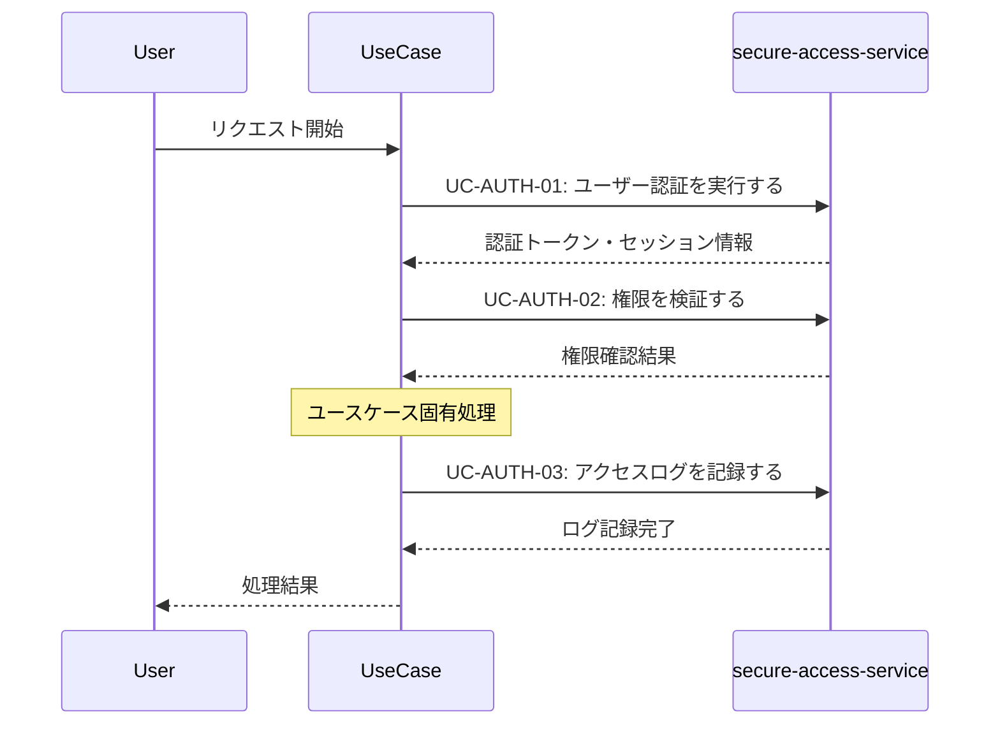

# 認証共通パターン (Authentication Pattern)

**バージョン**: v1.0.0
**更新日**: 2025-10-13
**適用範囲**: 認証が必要な全ユースケース

## 📋 パターン概要

このパターンは、secure-access-serviceを利用した標準的な認証・権限確認フローを定義します。すべてのパラソル設計ユースケースで共通利用されます。

## 🎯 適用ユースケース

- ✅ **必須適用**: 認証が必要な全ユースケース
- ✅ **推奨適用**: 機密性のある操作を含むユースケース
- ❌ **適用外**: 公開読み取り専用操作

## 🔄 標準認証フロー

### 基本シーケンス


### API呼び出し詳細

#### 1. ユーザー認証実行
```http
POST /api/auth/usecases/authenticate
```

**リクエスト**:
```json
{
  "userId": "{current_user_id}",
  "authMethod": "session|token|certificate",
  "context": {
    "serviceId": "knowledge-co-creation-service",
    "operationId": "{operation_name}",
    "usecaseId": "{usecase_name}"
  }
}
```

**レスポンス**:
```json
{
  "success": true,
  "data": {
    "authToken": "jwt_token_string",
    "sessionId": "session_uuid",
    "expiresAt": "2025-10-13T10:30:00Z",
    "userRoles": ["consultant", "knowledge_editor"],
    "permissions": ["read", "write", "share"]
  }
}
```

#### 2. 権限検証
```http
POST /api/auth/usecases/validate-permission
```

**リクエスト**:
```json
{
  "authToken": "{auth_token}",
  "requestedPermission": "{permission_name}",
  "resourceContext": {
    "resourceType": "knowledge",
    "resourceId": "{knowledge_id}",
    "operation": "validate_quality|publish|share"
  }
}
```

**レスポンス**:
```json
{
  "success": true,
  "data": {
    "authorized": true,
    "grantedPermissions": ["read", "write", "validate"],
    "restrictions": {
      "timeLimit": "2025-10-13T18:00:00Z",
      "scopeLimit": ["department_only"]
    }
  }
}
```

#### 3. アクセスログ記録
```http
POST /api/auth/usecases/log-access
```

**リクエスト**:
```json
{
  "authToken": "{auth_token}",
  "logEntry": {
    "operation": "{operation_name}",
    "usecase": "{usecase_name}",
    "action": "start|complete|error",
    "resources": ["{resource_id}"],
    "outcome": "success|failure|partial",
    "details": "{additional_details}"
  }
}
```

## ⚠️ エラーハンドリング

### 認証エラー
```json
{
  "error": "AUTHENTICATION_FAILED",
  "message": "ユーザー認証に失敗しました",
  "code": 401,
  "recovery": {
    "action": "redirect_to_login",
    "url": "/auth/login",
    "retryable": true
  }
}
```

**対応策**:
1. ユーザーをログイン画面にリダイレクト
2. 元のリクエストをセッション保存
3. 認証完了後の処理継続

### 権限不足エラー
```json
{
  "error": "PERMISSION_DENIED",
  "message": "要求された操作の権限がありません",
  "code": 403,
  "recovery": {
    "action": "request_permission",
    "requiredPermission": "knowledge_validate",
    "approver": "department_manager"
  }
}
```

**対応策**:
1. 必要権限の申請フォーム表示
2. 代替操作の提案
3. 読み取り専用モードでの継続

### セッション期限切れ
```json
{
  "error": "SESSION_EXPIRED",
  "message": "セッションの有効期限が切れています",
  "code": 401,
  "recovery": {
    "action": "refresh_session",
    "refreshToken": "{refresh_token}",
    "autoRefresh": true
  }
}
```

**対応策**:
1. 自動セッション更新
2. 失敗時は再認証
3. 処理状態の保持・復元

## 🔧 カスタマイズオプション

### 認証強度レベル
```json
{
  "authStrength": {
    "level": "basic|standard|high|critical",
    "requirements": {
      "basic": ["password"],
      "standard": ["password", "mfa"],
      "high": ["password", "mfa", "device_verification"],
      "critical": ["password", "mfa", "device_verification", "admin_approval"]
    }
  }
}
```

### コンテキスト固有権限
```json
{
  "contextPermissions": {
    "knowledge_validation": {
      "self_authored": ["read", "write", "validate"],
      "department_shared": ["read", "comment"],
      "organization_public": ["read"]
    }
  }
}
```

## 📊 監査・コンプライアンス

### 必須ログ項目
- **認証ログ**: ユーザー・時刻・認証方法・結果
- **権限確認ログ**: 要求権限・許可/拒否・理由
- **アクセスログ**: 操作内容・対象リソース・結果

### プライバシー保護
- **個人情報**: ハッシュ化・仮名化での記録
- **機密操作**: 操作内容の抽象化記録
- **保存期間**: 法的要求に応じた適切な保存期間

## 🚀 パフォーマンス最適化

### 認証キャッシュ
- **トークンキャッシュ**: 有効期間中のトークン再利用
- **権限キャッシュ**: 短期間の権限確認結果キャッシュ
- **セッション管理**: 効率的なセッション状態管理

### 目標レスポンス時間
- **認証処理**: 95%ile < 500ms、99%ile < 1s
- **権限確認**: 95%ile < 200ms、99%ile < 500ms
- **ログ記録**: 95%ile < 100ms、99%ile < 300ms

## 📝 使用例テンプレート

### 標準的な利用
```markdown
## 共通パターン利用
{{INCLUDE: authentication-pattern}}

## ユースケース固有処理
1. **認証・権限確認完了後**:
   - [ユースケース固有のAPI呼び出し]
   - [ビジネスロジック実行]
   - [結果処理]
```

### 高セキュリティ要求時
```markdown
## 共通パターン利用（高セキュリティ）
{{INCLUDE: authentication-pattern?authStrength=high}}

## 追加セキュリティ要件
- デバイス検証: 必須
- 管理者承認: 必要
- 操作記録: 詳細レベル
```

## 🔄 バージョン履歴

- **v1.0.0** (2025-10-13): 初版作成
  - 基本認証フロー定義
  - エラーハンドリング標準化
  - パフォーマンス目標設定

## 🔗 関連パターン

- **notification-pattern.md**: 認証完了後の通知処理
- **audit-logging-pattern.md**: 詳細な監査ログ記録
- **error-handling-pattern.md**: 共通エラー処理戦略