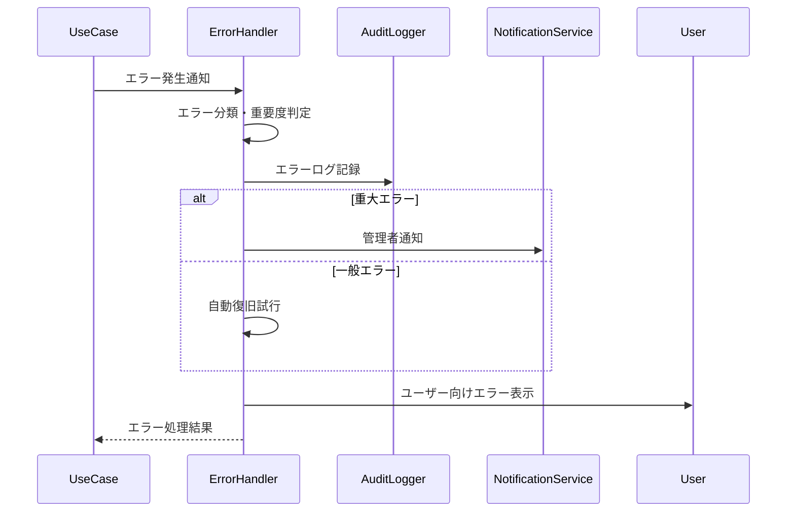

# エラー処理共通パターン (Error Handling Pattern)

**バージョン**: v1.0.0
**更新日**: 2025-10-13
**適用範囲**: エラー処理が必要な全ユースケース

## 📋 パターン概要

このパターンは、統一的なエラー処理とリカバリ戦略を定義します。ユーザー体験の向上、システムの可用性確保、適切なエラー追跡を実現します。

## 🎯 適用ユースケース

- ✅ **必須適用**: 外部API連携を含むユースケース
- ✅ **必須適用**: 複雑なビジネス処理を行うユースケース
- ✅ **推奨適用**: ユーザー入力を処理するユースケース
- ❌ **適用外**: 読み取り専用の単純な表示処理

## 🔄 標準エラー処理フロー

### 基本シーケンス


## 🏷️ エラー分類システム

### エラー重要度レベル
```json
{
  "severityLevels": {
    "CRITICAL": {
      "description": "システム全体に影響する致命的エラー",
      "examples": ["データベース接続失敗", "セキュリティ侵害検知"],
      "response": "即座対応",
      "notification": "管理者即座通知",
      "recovery": "手動復旧"
    },
    "HIGH": {
      "description": "サービス機能に重大な影響",
      "examples": ["決済処理失敗", "重要データ破損"],
      "response": "1時間以内",
      "notification": "管理者通知",
      "recovery": "自動復旧試行後、手動介入"
    },
    "MEDIUM": {
      "description": "一部機能への影響",
      "examples": ["外部API応答遅延", "バリデーションエラー"],
      "response": "4時間以内",
      "notification": "チーム通知",
      "recovery": "自動復旧"
    },
    "LOW": {
      "description": "軽微な問題、処理継続可能",
      "examples": ["推奨設定違反", "パフォーマンス警告"],
      "response": "24時間以内",
      "notification": "ログのみ",
      "recovery": "自動対応"
    }
  }
}
```

### エラー分類
```json
{
  "errorCategories": {
    "VALIDATION_ERROR": {
      "description": "入力データ検証エラー",
      "httpStatus": 422,
      "userMessage": "入力内容に不備があります",
      "recovery": "user_correction"
    },
    "AUTHENTICATION_ERROR": {
      "description": "認証・権限エラー",
      "httpStatus": 401,
      "userMessage": "認証が必要です",
      "recovery": "redirect_to_login"
    },
    "AUTHORIZATION_ERROR": {
      "description": "認可エラー",
      "httpStatus": 403,
      "userMessage": "この操作を実行する権限がありません",
      "recovery": "request_permission"
    },
    "RESOURCE_NOT_FOUND": {
      "description": "リソース未発見",
      "httpStatus": 404,
      "userMessage": "要求されたデータが見つかりません",
      "recovery": "alternative_suggestion"
    },
    "BUSINESS_LOGIC_ERROR": {
      "description": "ビジネスルール違反",
      "httpStatus": 422,
      "userMessage": "業務ルールに反する操作です",
      "recovery": "business_guidance"
    },
    "EXTERNAL_SERVICE_ERROR": {
      "description": "外部サービス連携エラー",
      "httpStatus": 502,
      "userMessage": "外部システムとの連携で問題が発生しました",
      "recovery": "retry_with_fallback"
    },
    "SYSTEM_ERROR": {
      "description": "システム内部エラー",
      "httpStatus": 500,
      "userMessage": "システムエラーが発生しました",
      "recovery": "automatic_retry"
    },
    "PERFORMANCE_ERROR": {
      "description": "性能・タイムアウトエラー",
      "httpStatus": 504,
      "userMessage": "処理に時間がかかっています",
      "recovery": "retry_later"
    }
  }
}
```

## 🔧 標準エラーレスポンス

### 基本エラーレスポンス構造
```json
{
  "success": false,
  "error": {
    "code": "ERROR_CODE",
    "category": "VALIDATION_ERROR",
    "severity": "MEDIUM",
    "message": "ユーザー向けメッセージ",
    "details": "詳細な技術情報（開発時のみ）",
    "timestamp": "2025-10-13T10:30:00Z",
    "requestId": "req_uuid",
    "context": {
      "service": "knowledge-co-creation-service",
      "operation": "validate-knowledge-quality",
      "usecase": "validate-knowledge-quality"
    }
  },
  "recovery": {
    "action": "user_correction",
    "suggestions": [
      "必須フィールドを入力してください",
      "形式が正しいか確認してください"
    ],
    "retryable": true,
    "retryAfter": 30
  },
  "support": {
    "contactInfo": "support@example.com",
    "documentationUrl": "https://docs.example.com/errors/VALIDATION_ERROR",
    "troubleshootingSteps": [
      "入力データの確認",
      "ブラウザの更新",
      "サポートへの連絡"
    ]
  }
}
```

### バリデーションエラー詳細
```json
{
  "success": false,
  "error": {
    "code": "VALIDATION_FAILED",
    "category": "VALIDATION_ERROR",
    "message": "入力データにエラーがあります",
    "validationErrors": [
      {
        "field": "title",
        "code": "REQUIRED",
        "message": "タイトルは必須です"
      },
      {
        "field": "email",
        "code": "INVALID_FORMAT",
        "message": "正しいメールアドレス形式で入力してください"
      },
      {
        "field": "content",
        "code": "LENGTH_EXCEEDED",
        "message": "内容は1000文字以内で入力してください",
        "currentLength": 1500,
        "maxLength": 1000
      }
    ]
  }
}
```

## 🛠️ 復旧戦略

### 自動復旧パターン

#### 1. リトライ戦略
```json
{
  "retryStrategy": {
    "exponentialBackoff": {
      "initialDelay": 1000,
      "maxDelay": 30000,
      "multiplier": 2.0,
      "maxAttempts": 5
    },
    "circuitBreaker": {
      "failureThreshold": 5,
      "resetTimeout": 60000,
      "halfOpenMaxCalls": 3
    }
  }
}
```

#### 2. フォールバック戦略
```json
{
  "fallbackStrategies": {
    "external_service_failure": {
      "primary": "external_api_call",
      "fallback": "cached_response",
      "ultimate_fallback": "default_response"
    },
    "database_failure": {
      "primary": "primary_db",
      "fallback": "readonly_replica",
      "ultimate_fallback": "cached_data"
    },
    "processing_failure": {
      "primary": "ai_processing",
      "fallback": "rule_based_processing",
      "ultimate_fallback": "manual_queue"
    }
  }
}
```

### 手動復旧サポート

#### トラブルシューティングガイド
```json
{
  "troubleshootingGuides": {
    "AUTHENTICATION_ERROR": {
      "steps": [
        "ログイン状態を確認してください",
        "ブラウザを更新してください",
        "パスワードをリセットしてください",
        "管理者にお問い合わせください"
      ],
      "expectedTime": "5分以内"
    },
    "EXTERNAL_SERVICE_ERROR": {
      "steps": [
        "しばらく待ってから再試行してください",
        "ネットワーク接続を確認してください",
        "システム状況ページを確認してください",
        "サポートにお問い合わせください"
      ],
      "expectedTime": "15分以内"
    }
  }
}
```

## 📊 エラー監視・分析

### メトリクス収集
```json
{
  "errorMetrics": {
    "errorRate": {
      "description": "エラー発生率",
      "calculation": "errors / total_requests",
      "threshold": "<1%"
    },
    "errorDistribution": {
      "description": "エラー種別分布",
      "dimensions": ["category", "severity", "service"],
      "visualization": "pie_chart"
    },
    "recoveryRate": {
      "description": "自動復旧成功率",
      "calculation": "successful_recoveries / total_errors",
      "threshold": ">90%"
    },
    "meanTimeToRecover": {
      "description": "平均復旧時間",
      "measurement": "seconds",
      "target": "<30s"
    }
  }
}
```

### アラート設定
```json
{
  "alertRules": {
    "highErrorRate": {
      "condition": "errorRate > 5% for 5 minutes",
      "severity": "HIGH",
      "notification": ["team-lead", "sre-team"]
    },
    "criticalError": {
      "condition": "severity == CRITICAL",
      "severity": "CRITICAL",
      "notification": ["on-call-engineer", "management"],
      "immediateResponse": true
    },
    "recoveryFailure": {
      "condition": "recoveryRate < 50% for 10 minutes",
      "severity": "MEDIUM",
      "notification": ["development-team"]
    }
  }
}
```

## 🎨 ユーザー体験向上

### エラー表示の最適化
```json
{
  "userExperienceOptimization": {
    "progressiveDisclosure": {
      "level1": "簡潔なエラーメッセージ",
      "level2": "詳細説明（展開可能）",
      "level3": "技術詳細（開発者向け）"
    },
    "contextualHelp": {
      "inlineHelp": "エラーメッセージ直下にヘルプ表示",
      "tooltips": "用語説明やヒント",
      "links": "関連ドキュメントへのリンク"
    },
    "accessibility": {
      "screenReader": "スクリーンリーダー対応",
      "highContrast": "高コントラスト表示",
      "keyboardNavigation": "キーボード操作対応"
    }
  }
}
```

### エラー防止支援
```json
{
  "preventiveSupport": {
    "inputValidation": {
      "realtime": "リアルタイム入力チェック",
      "suggestions": "入力支援・補完",
      "formatting": "自動フォーマット"
    },
    "warningSystem": {
      "beforeSubmit": "送信前警告",
      "riskAssessment": "操作リスク評価",
      "confirmationDialogs": "重要操作の確認"
    }
  }
}
```

## 🔒 セキュリティ考慮事項

### 情報漏洩防止
```json
{
  "securityMeasures": {
    "errorMessageSanitization": {
      "production": "機密情報の除去",
      "development": "詳細情報の表示",
      "logging": "完全な技術情報の記録"
    },
    "stackTraceHandling": {
      "userVisible": "スタックトレース非表示",
      "logging": "完全なスタックトレース記録",
      "monitoring": "エラー発生箇所の追跡"
    }
  }
}
```

### 攻撃検知・防御
```json
{
  "securityDefense": {
    "anomalousErrorPatterns": {
      "detection": "異常なエラーパターンの検知",
      "response": "自動ブロック・管理者通知"
    },
    "rateLimiting": {
      "errorThreshold": "短時間での大量エラー検知",
      "protection": "レート制限・一時ブロック"
    }
  }
}
```

## ⚡ パフォーマンス最適化

### エラー処理の効率化
- **非同期エラー処理**: メイン処理への影響最小化
- **エラーログの最適化**: 構造化ログによる高速検索
- **キャッシュ活用**: よくあるエラーパターンのキャッシュ化
- **バッチ処理**: 大量エラーの効率的な処理

### 目標レスポンス時間
- **エラー検知**: 95%ile < 10ms、99%ile < 50ms
- **エラー処理**: 95%ile < 100ms、99%ile < 300ms
- **復旧処理**: 95%ile < 1s、99%ile < 5s

## 📝 使用例テンプレート

### 標準的なエラー処理
```markdown
## エラーハンドリング
{{INCLUDE: error-handling-pattern#standard-error-handling}}

### エラー設定
- 重要度: MEDIUM
- 復旧戦略: 自動リトライ
- ユーザー通知: インライン表示
```

### 重要処理でのエラー処理
```markdown
## 包括的エラーハンドリング
{{INCLUDE: error-handling-pattern#comprehensive-error-handling}}

### 高可用性設定
- 重要度: HIGH
- 復旧戦略: フォールバック + 手動介入
- 監視: リアルタイムアラート
```

## 🔄 バージョン履歴

- **v1.0.0** (2025-10-13): 初版作成
  - 統一エラー分類システム確立
  - 自動復旧戦略の実装
  - ユーザー体験最適化

## 🔗 関連パターン

- **authentication-pattern.md**: 認証エラーの特別処理
- **notification-pattern.md**: エラー発生時の通知
- **audit-logging-pattern.md**: エラーログの監査記録