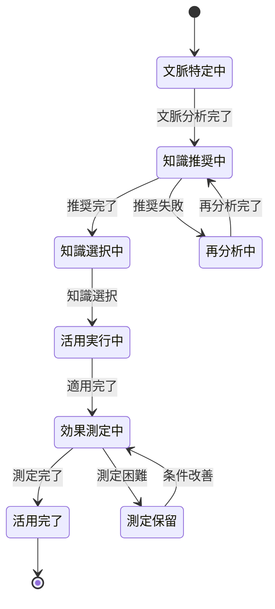

# ビジネスオペレーション: 知識を実践的に活用する

**バージョン**: 2.0.0
**更新日**: 2025-10-21
**設計方針**: 組織学習・価値創造・実践支援

## 概要
**目的**: 蓄積された知識を実際の業務・プロジェクトで活用し、組織の学習効率と成果品質を向上させる
**パターン**: Analytics + Workflow
**ゴール**: 適切な知識の迅速な発見・適用により、業務効率50%向上と品質不具合30%削減を実現する

## 🏗️ パラソルドメイン連携

### 📊 操作エンティティ
- **KnowledgeApplicationEntity**（自サービス管理・状態更新: draft → applied → evaluated）: 知識活用記録の管理
- **ApplicationContextEntity**（自サービス管理・CRUD）: 活用文脈（プロジェクト、タスク、課題）の管理
- **KnowledgeUsageMetricsEntity**（自サービス管理・CRUD）: 活用効果測定データの管理
- **KnowledgeEntity**（参照のみ）: 活用対象知識の参照
- **UserEntity**（参照のみ）: 知識活用者情報の参照

### 🏢 パラソル集約
- **KnowledgeApplicationAggregate** - 知識活用プロセス統合管理
  - 集約ルート: KnowledgeApplication
  - 包含エンティティ: ApplicationContext, UsageMetrics, RecommendationHistory
  - 不変条件: 活用開始後は文脈情報の変更禁止、効果測定結果の改ざん防止

### ⚙️ ドメインサービス
- **KnowledgeRecommendationService**: enhance[DecisionMaking]() - 文脈に応じた最適知識の推奨
- **ContextAnalysisService**: strengthen[ProblemSolving]() - 課題・状況分析による知識マッチング
- **ValueCreationService**: amplify[LearningImpact]() - 知識活用による価値創造の最大化

### 🔗 他サービスユースケース利用（ユースケース利用型）
**責務**: ❌ エンティティ知識不要 ✅ ユースケース利用のみ

[secure-access-service] ユースケース利用:
├── UC-AUTH-01: ユーザー認証を実行する → POST /api/auth/authenticate
├── UC-AUTH-02: 権限を検証する → POST /api/auth/validate-permission
└── UC-AUTH-03: アクセスログを記録する → POST /api/auth/log-access

[collaboration-facilitation-service] ユースケース利用:
├── UC-COMM-01: 活用結果を共有する → POST /api/communications/share-knowledge-application
└── UC-NOTIFY-01: 効果測定完了を通知する → POST /api/notifications/send-metrics-update

[project-success-service] ユースケース利用:
├── UC-PROJECT-05: プロジェクト学習記録を追加する → POST /api/projects/add-learning-record
└── UC-DELIVERABLE-02: 成果物品質向上記録を作成する → POST /api/deliverables/record-quality-improvement

## 関係者とロール
- **コンサルタント**: 知識を実際の業務・プロジェクトで活用する（主アクター）
- **プロジェクトマネージャー**: チームの知識活用状況を管理・指導する
- **ナレッジマネージャー**: 知識活用効果を分析し、知識ベースを改善する
- **クライアント**: 知識活用による成果向上を享受する

## プロセスフロー

> **パラソル設計v2.0**: 知識活用による組織学習サイクルの実現

1. **コンサルタント**が業務課題・プロジェクト状況を入力する → **UC-APPLY-01: 活用文脈を特定する**
2. **システム**が文脈分析とマッチング処理を実行する → **UC-APPLY-02: 適切な知識を推奨する**
3. **コンサルタント**が推奨知識を評価・選択する → **UC-APPLY-03: 知識を実際に適用する**
4. **システム**が適用プロセスと結果を記録する → **UC-APPLY-04: 活用効果を測定・評価する**
5. **システム**が活用結果をチーム・組織に共有する（他サービス連携）
6. **ナレッジマネージャー**が活用効果分析とフィードバックを実行する

## 代替フロー

### 代替フロー1: 推奨知識不適合
- **分岐点**: ステップ3（知識評価・選択）
- **条件**: 推奨された知識が文脈に適合しない場合
- **処理**:
  - 3a1. コンサルタントが「不適合」をフィードバック
  - 3a2. システムが文脈情報を再分析
  - 3a3. システムが代替知識を推奨
  - 3a4. 基本フロー3に戻る

### 代替フロー2: 複数知識の組み合わせ活用
- **分岐点**: ステップ3（知識適用）
- **条件**: 複数の知識を組み合わせて活用する場合
- **処理**:
  - 3b1. コンサルタントが複数知識を選択
  - 3b2. システムが知識間の関連性を分析
  - 3b3. システムが組み合わせ活用プランを提案
  - 3b4. コンサルタントがプランを承認後、基本フロー4に進む

### 代替フロー3: リアルタイム知識更新
- **分岐点**: ステップ4（効果測定）
- **条件**: 活用中に知識ベースが更新された場合
- **処理**:
  - 4a1. システムが更新通知を送信
  - 4a2. コンサルタントが更新内容を確認
  - 4a3. 必要に応じて活用方法を調整
  - 4a4. 調整内容を記録し、基本フロー6に進む

## 例外処理

### 例外1: 文脈分析失敗
- **発生点**: ステップ2（文脈分析）
- **処理**:
  - システムが「文脈情報不足」エラーを表示
  - 必要な追加情報の入力を促す
  - ナレッジマネージャーに分析支援を要請
  - 手動での知識推奨フローに切り替え

### 例外2: 活用効果測定不可
- **発生点**: ステップ4（効果測定）
- **処理**:
  - システムが測定方法の見直しを提案
  - 定性的評価フォームを表示
  - 効果測定は「保留」状態で記録
  - 後日の再測定スケジュールを設定

### 例外3: 知識活用権限不足
- **発生点**: ステップ3（知識適用）
- **処理**:
  - システムが権限不足を検知
  - ナレッジマネージャーに承認依頼を送信
  - 一時的な制限付きアクセスを許可
  - 承認完了後、フル活用権限を付与

## ビジネス状態

## KPI
- **知識発見時間**: 平均5分以内（従来比80%短縮）
- **活用成功率**: 85%以上（推奨知識の実際活用率）
- **効果実現率**: 70%以上（期待効果の実現率）
- **組織学習速度**: 月間新規活用事例20件以上
- **知識再利用率**: 60%以上（同一知識の複数文脈活用）

## ビジネスルール
- **活用権限**: 機密レベルに応じた知識アクセス制御
- **効果測定**: 活用から30日以内の効果測定義務
- **フィードバック**: 活用結果の知識ベースへの還元必須
- **品質保証**: 不適切な活用事例の即座報告義務
- **学習記録**: 個人・チーム・組織レベルの学習履歴管理

## 入出力仕様

### 入力
- **業務文脈情報**: プロジェクト、タスク、課題、目標、制約条件
- **活用者プロファイル**: スキルレベル、経験分野、所属チーム
- **希望する知識タイプ**: 手順、テンプレート、事例、原則、ツール
- **活用期限**: 知識適用の実行期限
- **成功指標**: 活用による期待効果の定量・定性指標

### 出力
- **推奨知識リスト**: 文脈適合度、信頼性、実用性スコア付き
- **活用プラン**: 具体的な適用手順とタイムライン
- **効果予測**: 期待される改善効果とリスク
- **活用レポート**: 実行内容、課題、成果、学習内容
- **組織学習インサイト**: 他メンバーへの共有価値のある知見

## 品質保証要件
- **推奨精度**: 文脈適合度80%以上の知識推奨
- **応答性能**: 文脈分析5秒以内、推奨表示3秒以内
- **可用性**: 営業時間中99.5%以上のシステム稼働
- **セキュリティ**: 機密知識の適切なアクセス制御
- **監査性**: 全活用プロセスの詳細ログ記録

## 関連ユースケース
- **UC-APPLY-01**: 活用文脈を特定する - 業務状況の分析と知識需要の明確化
- **UC-APPLY-02**: 適切な知識を推奨する - 文脈マッチングによる最適知識の発見
- **UC-APPLY-03**: 知識を実際に適用する - 推奨知識の実業務での実装
- **UC-APPLY-04**: 活用効果を測定・評価する - 知識活用による価値創造の定量化
