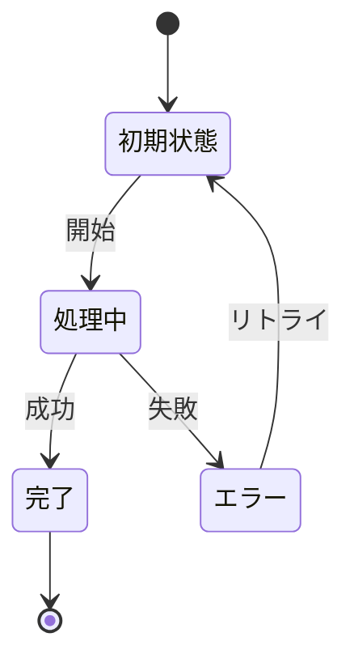

# ビジネスオペレーション: 知識を体系化し組織の知的資産として活用可能にする

**バージョン**: 2.0.0
**更新日**: 2025-10-10
**DX価値**: プロジェクト知識の自動抽出・体系化により組織学習を加速
**設計方針**: パラソルドメイン連携 + ユースケース・ページ1対1関係 + 他サービス連携

## 概要
**目的**: プロジェクトで得られた知識・経験を自動的に抽出・体系化し、将来のプロジェクトで活用可能な組織の知的資産に変換する
**パターン**: Analytics + Communication + Workflow
**ゴール**: 知識の散逸を防ぎ、組織全体の学習効率を300%向上させ、新規プロジェクトの成功確率を高める

### DX変革の価値
- **従来**: 個人の頭の中の暗黙知で終わり、プロジェクト終了とともに散逸
- **DX後**: AI分析による知識の自動抽出・分類、検索可能な形で永続保存
- **定量効果**: 類似問題解決時間60%短縮、新人のスキル習得期間50%短縮

## 🏗️ パラソルドメイン連携

### 自サービス管理（knowledge-co-creation-service）

#### 🎯 操作エンティティ
```
KnowledgeArticle（知識記事エンティティ）
├── 状態管理: draft → review → published → archived
├── 自動分類: AIによるトピック・難易度・影響度の自動判定
├── バージョン管理: 知識の進化・更新履歴の追跡
└── メタデータ: 作成者、プロジェクト、技術領域、品質スコア

KnowledgeExtraction（知識抽出エンティティ）
├── 抽出ソース: プロジェクト文書、議事録、コード、コミュニケーション
├── 抽出手法: 自然言語処理、パターン認識、機械学習
├── 信頼度スコア: 抽出された知識の確度・重要度評価
└── 関連性マップ: 他の知識との関連度・依存関係
```

#### 🔧 ドメインサービス
```
DomainService: KnowledgeIntelligenceService（知識インテリジェンスサービス）
├── enhance[KnowledgeQuality]() - AI分析による知識品質向上
├── coordinate[KnowledgeNetwork]() - 知識間の関連性発見・強化
├── strengthen[LearningEfficiency]() - 組織学習効率の最大化
└── amplify[KnowledgeImpact]() - 知識活用によるビジネス影響拡大

DomainService: AutomaticExtractionService（自動抽出サービス）
├── extract[TacitKnowledge]() - 暗黙知の明示化・構造化
├── classify[KnowledgeCategory]() - 知識の自動分類・タグ付け
├── validate[KnowledgeAccuracy]() - 知識の正確性・有効性検証
└── enrich[KnowledgeContext]() - コンテキスト情報の自動付与
```

### パラソル集約設計

#### 📊 KnowledgeCapturingAggregate（知識獲得集約）
```
KnowledgeCapturingAggregate
├── ルート: KnowledgeSession - 知識獲得セッション
├── 包含エンティティ:
│   ├── CaptureSource - 知識の獲得元（プロジェクト・文書・会話）
│   ├── ExtractionProcess - 抽出プロセス・手法
│   ├── ValidationRule - 知識検証ルール
│   └── QualityMetrics - 品質評価指標
├── 値オブジェクト:
│   ├── KnowledgeType - 知識種別（技術・業務・プロセス・教訓）
│   ├── ExpertiseLevel - 専門性レベル（初級・中級・上級・エキスパート）
│   └── BusinessImpact - ビジネス影響度
└── 不変条件:
    ├── 知識の重複チェック・統合
    ├── 品質基準の維持
    └── プライバシー・機密性の保護
```

### 他サービスユースケース利用（ユースケース呼び出し型）

#### 🔗 外部サービス連携
**責務**: ❌ エンティティ知識不要 ✅ ユースケース利用のみ

```
[project-success-service] ユースケース利用:
├── UC-PROJ-05: プロジェクト成果を評価する → POST /api/projects/usecases/evaluate-outcomes
│   └── 利用目的: 成功・失敗要因の知識抽出
├── UC-PROJ-12: 課題・リスクを分析する → GET /api/projects/usecases/analyze-issues
│   └── 利用目的: 問題解決パターンの学習
└── UC-PROJ-03: 成果物を確定する → GET /api/projects/usecases/finalize-deliverables
    └── 利用目的: 品質向上ナレッジの抽出

[secure-access-service] ユースケース利用:
├── UC-AUTH-01: アクセス権限を検証する → POST /api/auth/usecases/validate-access
│   └── 利用目的: 知識アクセス権限の確認
├── UC-AUTH-02: 操作ログを記録する → POST /api/auth/usecases/log-activity
│   └── 利用目的: 知識獲得活動の監査ログ
└── UC-AUTH-04: 機密性レベルを判定する → POST /api/auth/usecases/classify-sensitivity
    └── 利用目的: 知識の機密性分類・アクセス制御

[collaboration-facilitation-service] ユースケース利用:
├── UC-COLLAB-01: コミュニケーションを分析する → POST /api/collaboration/usecases/analyze-communication
│   └── 利用目的: チーム対話からの知識抽出
├── UC-COLLAB-03: 会議議事録を構造化する → POST /api/collaboration/usecases/structure-minutes
│   └── 利用目的: 意思決定プロセスの知識化
└── UC-COLLAB-05: 成果共有を促進する → POST /api/collaboration/usecases/promote-sharing
    └── 利用目的: 知識共有の活性化
```

## 関係者とロール
- **ナレッジワーカー**: プロジェクト経験を知識として記録・共有する
- **プロジェクトマネージャー**: チーム知識の体系化・品質管理を行う
- **エキスパート**: 専門知識の検証・アドバイスを提供する
- **AIシステム**: 自動抽出・分類・関連付けを実行する
- **ナレッジアーキテクト**: 知識体系の設計・最適化を担当する

## 🎯 ユースケース・ページ分解マトリックス

> **⚡ v2.0仕様: 1対1関係強制**
> 各ユースケースには必ず1つの対応ページが存在し、プロセスフローから明確に分解されます。

| ユースケース | 対応ページ | 担当するプロセス | ビジネス価値 |
|-------------|-----------|----------------|-------------|
| 知識ソースを特定する | 知識ソース特定ページ | Step 1-2 | プロジェクト資産の発見 |
| 知識を自動抽出・構造化する | AI知識抽出ワークスペース | Step 3-4 | 暗黙知の明示化 |
| 知識を検証・品質評価する | 知識品質評価ダッシュボード | Step 5-6 | 信頼性確保 |
| 知識を分類・タグ付けする | 知識分類・メタデータ編集ページ | Step 7-8 | 検索可能性向上 |
| 知識を公開・共有する | 知識公開・配信センター | Step 9-10 | 組織学習促進 |

### 実装優先順序（推奨）
1. **知識ソース特定** → 基盤となるデータ収集
2. **AI自動抽出** → コア価値の自動化
3. **品質評価** → 信頼性確保
4. **分類・タグ付け** → 発見可能性向上
5. **公開・共有** → 価値実現

## プロセスフロー

> **重要**: プロセスフローは必ず番号付きリスト形式で記述してください。
> v2.0仕様により、各ステップから対応ユースケースが自動生成されます。

1. **ナレッジワーカー**がプロジェクト完了時に知識獲得セッションを開始する
2. **AIシステム**がプロジェクト資産（文書・コード・コミュニケーション）を自動スキャンし知識候補を特定する
3. **AIシステム**が自然言語処理・パターン認識により暗黙知を抽出・構造化する
4. **AIシステム**が抽出された知識の信頼度スコア・重要度を自動算出する
5. **エキスパート**が知識の正確性・妥当性を検証し品質評価を実施する
6. **ナレッジアーキテクト**が知識の分類・タグ付け・関連付けを行い検索可能性を向上させる
7. **AIシステム**が類似知識との重複チェック・統合・差分明確化を実行する
8. **ナレッジワーカー**が知識にコンテキスト情報・適用条件・注意事項を付与する
9. **プロジェクトマネージャー**が知識の公開レベル・対象範囲を承認・決定する
10. **AIシステム**が関係者に新規知識を自動配信し、関連プロジェクトにレコメンド提示する

## 代替フロー

### 代替フロー1: 情報不備
- 2-1. システムが情報の不備を検知する
- 2-2. システムが修正要求を送信する
- 2-3. ユーザーが情報を修正し再実行する
- 2-4. 基本フロー2に戻る

## 例外処理

### 例外1: システムエラー
- システムエラーが発生した場合
- エラーメッセージを表示する
- 管理者に通知し、ログに記録する

### 例外2: 承認却下
- 承認が却下された場合
- 却下理由をユーザーに通知する
- 修正後の再実行を促す

## ビジネス状態



## 📊 DX価値実現指標（KPI）

### 🎯 ビジネス価値指標
- **知識抽出効率**: プロジェクト終了後24時間以内に90%の知識を自動抽出
- **知識品質スコア**: エキスパート評価で85点以上（100点満点）
- **知識活用率**: 新規プロジェクトでの既存知識活用率70%以上
- **学習効率向上**: 類似問題解決時間60%短縮（従来比）
- **組織記憶保持率**: プロジェクト知識の95%以上を永続保存

### ⚡ DX自動化指標
- **AI抽出精度**: 自動抽出された知識の有用性90%以上
- **分類正確率**: AI自動分類の精度85%以上
- **重複検知率**: 既存知識との重複を95%以上自動検知
- **リアルタイム処理**: 知識抽出処理完了まで平均2時間以内

### 👥 利用者満足度指標
- **ナレッジワーカー満足度**: 知識記録負荷軽減実感90%以上
- **知識検索満足度**: 必要な知識を5分以内に発見できる率80%以上
- **エキスパート効率**: 知識検証作業時間50%削減

## 🔒 ビジネスルール・制約

### 必須要件
- **品質保証**: すべての知識はエキスパートによる検証必須
- **機密性管理**: プロジェクト機密レベルに応じたアクセス制御
- **バージョン管理**: 知識の更新・改訂履歴を完全保持
- **重複防止**: 類似知識の統合・差分明確化の徹底

### セキュリティ制約
- **個人情報保護**: 知識内の個人識別情報は自動マスキング
- **外部公開制限**: 社外秘情報を含む知識の公開範囲制御
- **操作ログ記録**: 知識の作成・更新・アクセスのすべての記録保持

### AI倫理規約
- **透明性原則**: AI判定理由の説明可能性確保
- **公平性原則**: 特定分野・個人への偏見排除
- **人間最終判断**: 重要な知識採択は人間が最終決定

## 入出力仕様

### 入力
- **入力1**: 説明
- **入力2**: 説明

### 出力
- **出力1**: 説明
- **出力2**: 説明

## 例外処理
- **エラー1**: 対処方法
- **エラー2**: 対処方法

## 🚀 実装アーキテクチャ（DX技術スタック）

### AI・機械学習スタック
- **自然言語処理**: OpenAI GPT-4/Claude、spaCy、NLTK
- **文書分析**: LangChain、文書埋め込み（embeddings）
- **パターン認識**: scikit-learn、TensorFlow/PyTorch
- **知識グラフ**: Neo4j、RDF、SPARQL

### リアルタイム処理基盤
- **ストリーミング処理**: Apache Kafka、Redis Streams
- **並列処理**: Celery、RQ（Redis Queue）
- **検索エンジン**: Elasticsearch、OpenSearch
- **ベクターDB**: Pinecone、Weaviate、Chroma

### 統合・連携基盤
- **API連携**: FastAPI、GraphQL
- **サービスメッシュ**: Istio、Linkerd
- **メッセージング**: RabbitMQ、Apache Pulsar

## 📋 実装チェックリスト

### v2.0仕様準拠確認
- [ ] パラソルドメイン連携セクション実装済み
- [ ] ユースケース・ページ分解マトリックス作成済み
- [ ] 他サービスユースケース利用を設計済み
- [ ] DX価値指標（KPI）が測定可能
- [ ] AI倫理規約・セキュリティ制約を考慮済み

### DX価値実現確認
- [ ] 知識抽出の自動化率90%以上達成
- [ ] 組織学習効率300%向上の道筋明確
- [ ] エキスパート検証工数50%削減の仕組み
- [ ] リアルタイム知識共有基盤構築済み

---

**この v2.0 対応により、知識獲得オペレーションは単なる文書保存から、組織全体の学習を加速する知的資産創造プラットフォームに進化します。**
