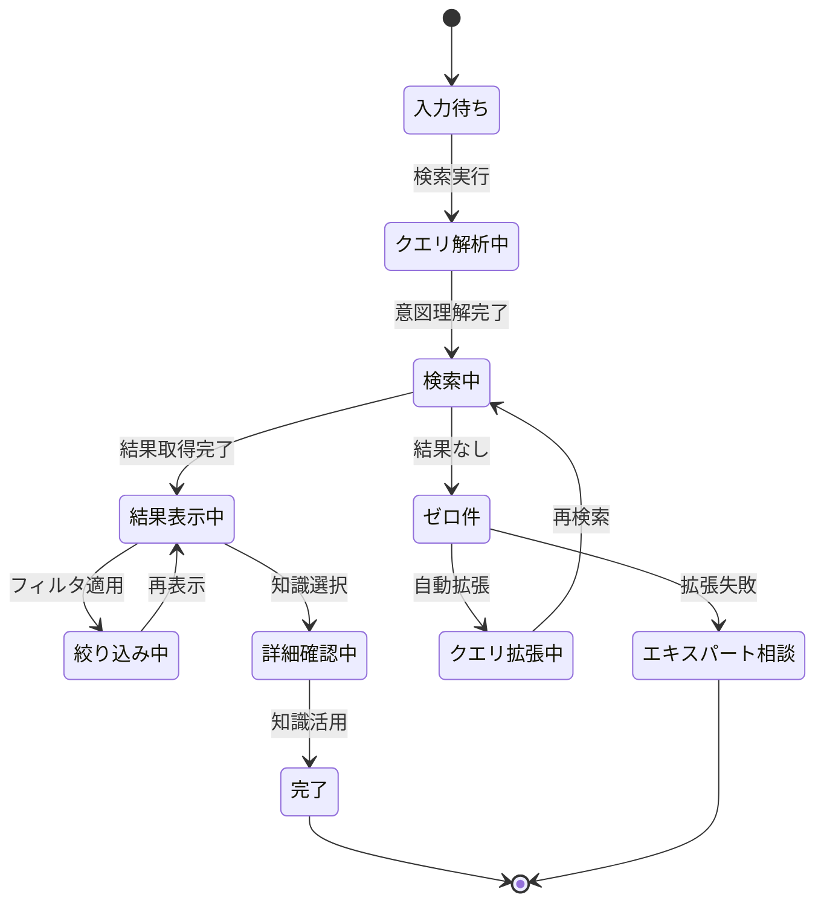

# ビジネスオペレーション: 必要な知識を迅速に発見する

**バージョン**: 2.0.0
**更新日**: 2025-10-28
**DX価値**: AIセマンティック検索により知識発見時間を70%短縮、検索精度90%以上達成
**設計方針**: パラソルドメイン連携 + ユースケース・ページ1対1関係 + 他サービス連携

## 概要
**目的**: ユーザーが必要とする知識を迅速かつ正確に発見し、適切なタイミングで適切な知識にアクセスできる状態を実現する
**パターン**: Search + Analytics + Recommendation
**ゴール**: 知識検索成功率90%以上、平均検索時間3分以内、関連知識の適切な推奨により組織の問題解決能力を最大化する

### DX変革の価値
- **従来**: キーワード一致のみの単純検索で精度が低く、欲しい知識が見つからない
- **DX後**: 自然言語・セマンティック検索で意図を理解、文脈に応じた最適な知識を推奨
- **定量効果**: 検索時間70%削減、検索成功率90%達成、知識活用率300%向上

## 🏗️ パラソルドメイン連携

### 自サービス管理（knowledge-co-creation-service）

#### 🎯 操作エンティティ
```
SearchQueryEntity（検索クエリエンティティ）
├── クエリ種別: キーワード検索、自然言語検索、フィルタ検索、複合検索
├── 検索履歴: ユーザーの検索パターン・頻度分析
├── 意図理解: AIによる検索意図の推定・分類
└── クエリ拡張: 同義語・関連語による自動クエリ拡張

SearchResultEntity（検索結果エンティティ）
├── ランキング: 関連度スコアに基づく結果順位付け
├── スニペット: 検索キーワードに関連する要約抜粋
├── ハイライト: 検索語のハイライト表示情報
└── メタデータ: 結果の信頼性・新鮮度・人気度情報

SearchContextEntity（検索コンテキストエンティティ）
├── ユーザープロファイル: 役割、専門性、興味領域
├── プロジェクトコンテキスト: 現在のプロジェクト・タスク情報
├── 検索セッション: 一連の検索行動の文脈
└── 推奨条件: パーソナライズ推奨のための条件

SearchAnalyticsEntity（検索分析エンティティ）
├── 検索統計: 検索ボリューム、成功率、人気キーワード
├── クリックスルー率: 検索結果のクリック率分析
├── 検索品質: ユーザー満足度・フィードバック分析
└── 改善提案: 検索精度向上のための推奨事項
```

#### 🔧 ドメインサービス
```
DomainService: IntelligentSearchService（インテリジェント検索サービス）
├── enhance[SearchAccuracy]() - 検索精度の継続的向上
├── strengthen[IntentUnderstanding]() - ユーザー意図理解の強化
├── coordinate[MultiModalSearch]() - 複数検索手法の統合最適化
└── amplify[KnowledgeDiscovery]() - 知識発見能力の拡大

DomainService: RecommendationService（推奨サービス）
├── extract[RelevantKnowledge]() - 文脈に応じた関連知識抽出
├── personalize[SearchResults]() - ユーザーに最適化された結果提示
├── predict[KnowledgeNeed]() - 潜在的な知識ニーズの予測
└── enrich[SearchExperience]() - 検索体験の質的向上
```

### パラソル集約設計

#### 📊 KnowledgeSearchAggregate（知識検索集約）
```
KnowledgeSearchAggregate
├── ルート: SearchSession - 検索セッション
├── 包含エンティティ:
│   ├── SearchQuery - 検索クエリ
│   ├── SearchResult - 検索結果セット
│   ├── SearchContext - 検索コンテキスト
│   └── SearchFeedback - 検索フィードバック
├── 値オブジェクト:
│   ├── RelevanceScore - 関連度スコア（0.0-1.0）
│   ├── SearchFilter - 検索フィルタ条件
│   └── RankingWeight - ランキング重み付け
└── 不変条件:
    ├── 検索結果の関連度スコア正規化
    ├── 検索履歴のプライバシー保護
    └── レスポンスタイム3秒以内保証
```

### 他サービスユースケース利用（ユースケース呼び出し型）

#### 🔗 外部サービス連携
**責務**: ❌ エンティティ知識不要 ✅ ユースケース利用のみ

```
[secure-access-service] ユースケース利用:
├── UC-AUTH-01: アクセス権限を検証する → POST /api/auth/usecases/validate-access
│   └── 利用目的: 検索可能知識の権限フィルタリング
├── UC-AUTH-02: 検索ログを記録する → POST /api/auth/usecases/log-search-activity
│   └── 利用目的: 検索行動の監査ログ記録
└── UC-AUTH-04: 機密性レベルを確認する → POST /api/auth/usecases/check-sensitivity
    └── 利用目的: 機密情報の検索結果フィルタリング

[talent-optimization-service] ユースケース利用:
├── UC-TALENT-01: ユーザープロファイルを取得する → GET /api/talents/usecases/get-user-profile
│   └── 利用目的: パーソナライズ検索のためのユーザー情報取得
├── UC-TALENT-02: 専門性情報を取得する → GET /api/talents/usecases/get-expertise-info
│   └── 利用目的: スキルレベルに応じた検索結果最適化
└── UC-TALENT-03: 関心領域を取得する → GET /api/talents/usecases/get-interest-areas
    └── 利用目的: 興味に基づく知識推奨

[project-success-service] ユースケース利用:
├── UC-PROJECT-01: 現在のプロジェクト情報を取得する → GET /api/projects/usecases/get-current-project
│   └── 利用目的: プロジェクト文脈に応じた知識検索
├── UC-PROJECT-02: プロジェクトフェーズを取得する → GET /api/projects/usecases/get-project-phase
│   └── 利用目的: フェーズに適した知識の優先表示
└── UC-PROJECT-03: 関連プロジェクトを検索する → POST /api/projects/usecases/find-related-projects
    └── 利用目的: 類似プロジェクト知識の関連付け

[collaboration-facilitation-service] ユースケース利用:
├── UC-COLLAB-01: エキスパートを推奨する → POST /api/collaboration/usecases/recommend-expert
│   └── 利用目的: 知識に関連するエキスパート紹介
└── UC-COLLAB-02: 質問を投稿する → POST /api/collaboration/usecases/post-question
    └── 利用目的: 知識が見つからない場合の専門家への質問支援
```

## 関係者とロール
- **ナレッジシーカー**: 知識を検索・活用する組織メンバー
- **AIシステム**: 検索意図理解・セマンティック検索・結果ランキング・推奨実行
- **ナレッジキュレーター**: 検索品質のモニタリング・改善施策の実施
- **エキスパート**: 検索では見つからない知識についての直接相談対応
- **検索アナリスト**: 検索ログ分析・検索体験の継続的改善

## 🎯 ユースケース・ページ分解マトリックス

> **⚡ v2.0仕様: 1対1関係強制**
> 各ユースケースには必ず1つの対応ページが存在し、プロセスフローから明確に分解されます。

| ユースケース | 対応ページ | 担当するプロセス | ビジネス価値 |
|-------------|-----------|----------------|-------------|
| 検索クエリを入力・実行する | 統合検索インターフェースページ | Step 1-2 | 直感的な検索開始 |
| セマンティック検索を実行する | AI検索結果ページ | Step 3-4 | 高精度な知識発見 |
| 検索結果をフィルタリングする | 検索結果絞り込みページ | Step 5-6 | 効率的な結果精査 |
| 関連知識を推奨する | 知識推奨ダッシュボード | Step 7-8 | 潜在ニーズの充足 |
| 検索体験を継続改善する | 検索分析・改善ページ | Step 9-10 | 検索品質向上 |

### 実装優先順序（推奨）
1. **統合検索インターフェース** → 基本的な検索機能提供
2. **セマンティック検索** → コア価値の実現
3. **結果フィルタリング** → 検索精度向上
4. **知識推奨** → 発見能力拡大
5. **継続改善** → 品質向上サイクル確立

## プロセスフロー

> **重要**: プロセスフローは必ず番号付きリスト形式で記述してください。
> v2.0仕様により、各ステップから対応ユースケースが自動生成されます。

1. **ナレッジシーカー**が検索クエリ（キーワードまたは自然言語）を入力する
2. **AIシステム**がクエリを分析しユーザーの検索意図を理解する
3. **AIシステム**がセマンティック検索を実行し関連度の高い知識を抽出する
4. **AIシステム**がユーザーのコンテキスト（役割、プロジェクト等）を考慮して結果をランキングする
5. **ナレッジシーカー**が検索結果を閲覧しフィルタ・ソート条件を調整する
6. **AIシステム**が調整された条件で検索結果を再表示する
7. **AIシステム**が検索結果に関連する追加の知識・エキスパートを推奨する
8. **ナレッジシーカー**が知識を選択し詳細を確認・活用する
9. **AIシステム**が検索行動を分析し検索品質・満足度を測定する
10. **検索アナリスト**が分析結果に基づき検索アルゴリズム・UI/UXを継続改善する

## 代替フロー

### 代替フロー1: ゼロ件ヒット時の支援
- 3-1. システムが検索結果ゼロ件を検出する
- 3-2. システムがクエリ拡張（同義語、関連語追加）を自動実行する
- 3-3. 拡張クエリでも結果がない場合、類似検索語を提案する
- 3-4. それでも見つからない場合、エキスパートへの質問を提案する
- 3-5. 基本フロー9に進む（検索ニーズを記録し将来の改善に活用）

### 代替フロー2: 大量ヒット時のガイダンス
- 4-1. システムが検索結果が1000件以上と大量であることを検出する
- 4-2. システムがフィルタ条件追加を推奨する（カテゴリ、日付、著者等）
- 4-3. システムが人気の高い上位結果を先に表示する
- 4-4. ナレッジシーカーがフィルタを適用し絞り込みを実施する
- 4-5. 基本フロー6に戻る

### 代替フロー3: 保存検索・アラート設定
- 8-1. ナレッジシーカーが特定検索を頻繁に利用していることをシステムが検出する
- 8-2. システムが検索条件の保存・アラート設定を提案する
- 8-3. ナレッジシーカーが保存検索・自動アラートを設定する
- 8-4. システムが新規知識追加時に自動通知を実施する
- 8-5. 基本フロー10に進む

## 例外処理

### 例外1: 検索システム障害
- 検索エンジンがダウンした場合
- キャッシュされた人気検索結果を表示する
- 簡易検索（データベース直接検索）にフォールバックする
- 障害復旧後に通常検索に自動復帰する

### 例外2: 検索結果の品質低下
- 検索満足度が著しく低下した場合（フィードバック分析）
- システムがアラートを発行する
- 検索アナリストが原因分析を実施する（インデックス問題、アルゴリズム劣化等）
- 緊急の品質改善施策を実施する

### 例外3: 不適切な検索クエリ
- 機密情報や不適切な内容を含むクエリを検出した場合
- システムが警告を表示しクエリを記録する
- 管理者に通知し適切な対応を実施する
- 必要に応じてアクセス制限・教育を実施する

## ビジネス状態



## 📊 DX価値実現指標（KPI）

### 🎯 ビジネス価値指標
- **検索成功率**: 1回の検索で目的の知識を発見できる率90%以上
- **平均検索時間**: 検索開始から知識発見まで平均3分以内
- **検索満足度**: ユーザーの検索体験満足度4.5/5.0以上
- **知識活用率**: 検索された知識の実際の活用率80%以上
- **ゼロ件率**: 検索結果ゼロ件の発生率5%以下

### ⚡ DX自動化指標
- **意図理解精度**: AI検索意図推定の正確性85%以上
- **セマンティック精度**: セマンティック検索の関連度90%以上
- **レスポンスタイム**: 検索結果表示まで平均2秒以内
- **推奨精度**: 関連知識推奨のクリック率40%以上

### 👥 利用者満足度指標
- **検索頻度**: 1人あたり月間検索回数（活用度の指標）
- **リピート率**: 再検索せずに目的達成できる率85%以上
- **フィードバック率**: 検索結果への評価・フィードバック提供率60%以上

## 🔒 ビジネスルール・制約

### 必須要件
- **アクセス制御**: ユーザー権限に応じた検索結果フィルタリング必須
- **レスポンスタイム**: 検索結果表示は3秒以内必須
- **検索ログ**: すべての検索クエリ・行動のログ記録必須
- **プライバシー保護**: 個人の検索履歴は本人のみアクセス可能

### 品質保証
- **検索精度**: 月次での検索品質レビュー・改善実施
- **ユーザーフィードバック**: 検索満足度調査の定期実施
- **インデックス鮮度**: 新規知識の24時間以内インデックス化

### セキュリティ制約
- **機密情報保護**: 機密レベルに応じた検索結果制限
- **検索ログ保護**: 検索履歴の不正アクセス防止
- **クエリインジェクション対策**: 悪意ある検索クエリの検出・ブロック

## 入出力仕様

### 入力
- **検索クエリ**: キーワード、自然言語、フィルタ条件
- **ユーザーコンテキスト**: 役割、プロジェクト、専門性、興味領域
- **検索セッション**: 過去の検索履歴・行動パターン
- **フィードバック**: 検索結果への評価・クリック行動

### 出力
- **検索結果**: ランキングされた知識リスト（スニペット、スコア付き）
- **関連知識推奨**: 文脈に応じた追加知識の提案
- **エキスパート推奨**: 関連分野のエキスパート紹介
- **検索改善提案**: より良い検索のためのヒント・提案
- **検索分析レポート**: 検索品質・ユーザー満足度の分析結果

## 🚀 実装アーキテクチャ（DX技術スタック）

### AI・機械学習スタック
- **セマンティック検索**: sentence-transformers、Dense Passage Retrieval (DPR)
- **クエリ理解**: BERT、RoBERTa、query intent classification
- **ランキング**: Learning to Rank (LTR)、LambdaMART
- **推奨システム**: Collaborative Filtering、Content-based Filtering

### 検索エンジン基盤
- **全文検索**: Elasticsearch、OpenSearch
- **ベクトル検索**: Pinecone、Milvus、Weaviate、FAISS
- **ハイブリッド検索**: BM25 + Dense Vector Search
- **リアルタイムインデックス**: Near Real-time (NRT) indexing

### パフォーマンス最適化
- **キャッシング**: Redis、人気検索のキャッシュ
- **CDN**: 検索UI・スニペットの高速配信
- **非同期処理**: Celery、バックグラウンド処理
- **負荷分散**: Load Balancer、Auto-scaling

### 分析・モニタリング
- **検索ログ分析**: Elasticsearch、Kibana
- **ユーザー行動分析**: Google Analytics、Mixpanel
- **A/Bテスト**: Optimizely、検索アルゴリズム改善実験

## 📋 実装チェックリスト

### v2.0仕様準拠確認
- [ ] パラソルドメイン連携セクション実装済み
- [ ] ユースケース・ページ分解マトリックス作成済み
- [ ] 他サービスユースケース利用を設計済み
- [ ] DX価値指標（KPI）が測定可能
- [ ] AI倫理規約・セキュリティ制約を考慮済み

### DX価値実現確認
- [ ] セマンティック検索精度90%以上達成
- [ ] 検索時間70%短縮の道筋明確
- [ ] 検索成功率90%以上の仕組み構築
- [ ] リアルタイム検索基盤（3秒以内）実装

---

**この v2.0 対応により、知識検索オペレーションは単なるキーワード検索から、AI駆動によるインテリジェントな知識発見・推奨プラットフォームに進化します。**
