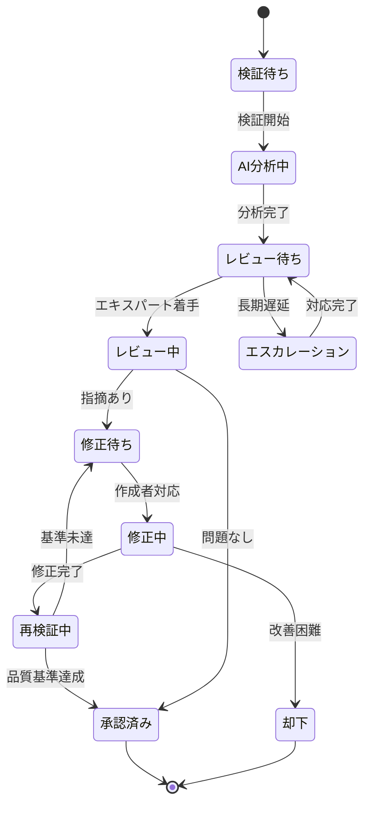

# ビジネスオペレーション: 知識の品質と信頼性を保証する

**バージョン**: 2.0.0
**更新日**: 2025-10-28
**DX価値**: AI品質分析により知識検証時間を60%短縮、品質スコア85点以上を保証
**設計方針**: パラソルドメイン連携 + ユースケース・ページ1対1関係 + 他サービス連携

## 概要
**目的**: 組織知識の正確性・妥当性・鮮度を継続的に検証し、高品質で信頼できる知識ベースを維持する
**パターン**: Validation + Quality Assurance + Workflow
**ゴール**: すべての公開知識が品質基準（85点以上/100点満点）を満たし、組織が安心して活用できる状態を実現する

### DX変革の価値
- **従来**: 手作業レビューで時間がかかり、検証基準がバラバラで品質が不安定
- **DX後**: AI自動品質分析とエキスパートレビューの組み合わせで高品質を効率的に保証
- **定量効果**: 検証時間60%短縮、品質スコア85点以上達成率95%、知識信頼性向上による活用率150%増

## 🏗️ パラソルドメイン連携

### 自サービス管理（knowledge-co-creation-service）

#### 🎯 操作エンティティ
```
KnowledgeValidationEntity（知識検証エンティティ）
├── 状態管理: draft → reviewing → approved → rejected → needs_revision
├── 検証種別: 正確性検証、鮮度検証、完全性検証、一貫性検証
├── 検証スコア: AI分析スコア + エキスパート評価スコア（0-100点）
└── 検証履歴: 検証日時、検証者、検証結果、指摘事項

ValidationCriteriaEntity（検証基準エンティティ）
├── 品質基準: 正確性、完全性、明確性、実用性、鮮度の基準定義
├── 分野別基準: 技術、業務、プロセス等の分野別の検証基準
├── 重み付け: 各基準の重要度（critical, high, medium, low）
└── 閾値設定: 合格基準スコア、警告レベル

ValidationFeedbackEntity（検証フィードバックエンティティ）
├── 指摘種別: 誤り、不明確、情報不足、更新必要、その他
├── 重要度: critical（致命的）、major（重要）、minor（軽微）
├── 改善提案: 具体的な修正案・改善方法
└── 対応状況: open → in_progress → resolved → verified

QualityMetricsEntity（品質指標エンティティ）
├── 総合品質スコア: 各検証項目の加重平均（0-100点）
├── 信頼度レベル: A（90点以上）、B（80-89点）、C（70-79点）、D（70点未満）
├── 品質推移: 時系列での品質変化トレンド
└── ベンチマーク: 同カテゴリ平均との比較
```

#### 🔧 ドメインサービス
```
DomainService: KnowledgeQualityService（知識品質サービス）
├── enhance[QualityStandard]() - 品質基準の継続的向上
├── strengthen[ValidationAccuracy]() - 検証精度の強化
├── coordinate[ExpertReview]() - エキスパートレビューの最適化
└── amplify[TrustworthyKnowledge]() - 信頼できる知識の拡大

DomainService: AutoValidationService（自動検証サービス）
├── extract[QualityIssue]() - AIによる品質問題の自動検出
├── classify[ValidationPriority]() - 検証優先度の自動分類
├── validate[ContentAccuracy]() - コンテンツ正確性の自動検証
└── enrich[ValidationInsight]() - 検証洞察の深化・補完
```

### パラソル集約設計

#### 📊 KnowledgeValidationAggregate（知識検証集約）
```
KnowledgeValidationAggregate
├── ルート: ValidationSession - 知識検証セッション
├── 包含エンティティ:
│   ├── ValidationCriteria - 検証基準
│   ├── ValidationResult - 検証結果
│   ├── ValidationFeedback - 検証フィードバック
│   └── QualityMetrics - 品質指標
├── 値オブジェクト:
│   ├── QualityScore - 品質スコア（0-100点）
│   ├── TrustLevel - 信頼度レベル（A-D）
│   └── ValidationStatus - 検証ステータス
└── 不変条件:
    ├── 公開知識は必ず検証済み（approved）状態
    ├── 品質スコア85点未満は公開不可
    └── 検証履歴の完全保持（監査証跡）
```

### 他サービスユースケース利用（ユースケース呼び出し型）

#### 🔗 外部サービス連携
**責務**: ❌ エンティティ知識不要 ✅ ユースケース利用のみ

```
[secure-access-service] ユースケース利用:
├── UC-AUTH-01: アクセス権限を検証する → POST /api/auth/usecases/validate-access
│   └── 利用目的: 検証作業権限の確認
├── UC-AUTH-02: 操作ログを記録する → POST /api/auth/usecases/log-activity
│   └── 利用目的: 検証活動の監査ログ記録
└── UC-AUTH-03: エキスパート認証を実行する → POST /api/auth/usecases/authenticate-expert
    └── 利用目的: エキスパートレビュー権限の確認

[talent-optimization-service] ユースケース利用:
├── UC-TALENT-01: エキスパートを検索する → POST /api/talents/usecases/find-expert
│   └── 利用目的: 分野別エキスパートの特定・アサイン
├── UC-TALENT-02: 専門性レベルを取得する → GET /api/talents/usecases/get-expertise-level
│   └── 利用目的: レビュアーの適格性確認
└── UC-TALENT-03: レビュー実績を記録する → POST /api/talents/usecases/record-review-activity
    └── 利用目的: エキスパートの貢献度記録

[collaboration-facilitation-service] ユースケース利用:
├── UC-COLLAB-01: レビュー依頼を送信する → POST /api/collaboration/usecases/send-review-request
│   └── 利用目的: エキスパートへのレビュー依頼通知
├── UC-COLLAB-02: レビュー完了を通知する → POST /api/collaboration/usecases/notify-review-completion
│   └── 利用目的: 検証完了の通知配信
└── UC-COLLAB-03: フィードバックを収集する → POST /api/collaboration/usecases/collect-validation-feedback
    └── 利用目的: 検証プロセスの改善フィードバック収集

[project-success-service] ユースケース利用:
├── UC-PROJECT-01: プロジェクト成果物を検証する → POST /api/projects/usecases/validate-deliverable
│   └── 利用目的: プロジェクト知識の品質検証連携
└── UC-PROJECT-02: 品質基準を取得する → GET /api/projects/usecases/get-quality-standards
    └── 利用目的: プロジェクト固有の品質基準適用
```

## 関係者とロール
- **ナレッジキュレーター**: 検証プロセス全体の管理・調整
- **エキスパート**: 専門知識に基づく内容の正確性・妥当性検証
- **品質マネージャー**: 品質基準の策定・品質保証プロセスの監督
- **AIシステム**: 自動品質分析・問題検出・検証支援
- **知識作成者**: 指摘事項への対応・知識の修正・改善

## 🎯 ユースケース・ページ分解マトリックス

> **⚡ v2.0仕様: 1対1関係強制**
> 各ユースケースには必ず1つの対応ページが存在し、プロセスフローから明確に分解されます。

| ユースケース | 対応ページ | 担当するプロセス | ビジネス価値 |
|-------------|-----------|----------------|-------------|
| 検証基準を定義・管理する | 検証基準管理ページ | Step 1-2 | 一貫した品質保証 |
| AI自動品質分析を実行する | AI品質分析ダッシュボード | Step 3-4 | 効率的な品質チェック |
| エキスパートレビューを実施する | エキスパートレビューページ | Step 5-6 | 専門的品質保証 |
| 指摘事項を管理・追跡する | フィードバック管理ページ | Step 7-8 | 品質改善サイクル |
| 品質を継続監視・改善する | 品質モニタリングダッシュボード | Step 9-10 | 長期的品質維持 |

### 実装優先順序（推奨）
1. **検証基準定義** → 品質保証の基盤構築
2. **AI自動分析** → 効率的な初期検証
3. **エキスパートレビュー** → 専門的品質保証
4. **フィードバック管理** → 改善サイクル確立
5. **継続監視** → 長期品質維持

## プロセスフロー

> **重要**: プロセスフローは必ず番号付きリスト形式で記述してください。
> v2.0仕様により、各ステップから対応ユースケースが自動生成されます。

1. **品質マネージャー**が知識分野別の検証基準・品質基準を定義する
2. **AIシステム**が検証基準をもとに自動品質分析アルゴリズムを最適化する
3. **AIシステム**が新規・更新知識を自動的に品質分析し問題を検出する
4. **AIシステム**が検出された問題を重要度別に分類し優先順位を付ける
5. **ナレッジキュレーター**が適切なエキスパートを選定しレビューを依頼する
6. **エキスパート**が専門知識に基づき内容の正確性・妥当性を詳細検証する
7. **エキスパート**が指摘事項をフィードバックし改善提案を提供する
8. **知識作成者**が指摘事項に対応し知識を修正・改善する
9. **AIシステム**が修正内容を検証し品質スコアを再計算する
10. **ナレッジキュレーター**が最終承認し知識を公開、または再検証を指示する

## 代替フロー

### 代替フロー1: 緊急知識の迅速検証
- 1-1. 緊急度の高い知識（重大インシデント対応等）の検証要求を受ける
- 1-2. システムが迅速検証プロセスを起動する（簡略化された基準適用）
- 1-3. オンラインのエキスパートに即座レビュー依頼を送信する
- 1-4. 1時間以内での最低限の品質確認を実施する
- 1-5. 暫定公開し、後日詳細検証を実施する
- 1-6. 基本フロー10に戻る

### 代替フロー2: 複数エキスパートの合議レビュー
- 5-1. 複雑・高度な知識で単独レビューが困難と判断される
- 5-2. システムが複数分野のエキスパートを選定する
- 5-3. 各エキスパートが個別に検証・評価を実施する
- 5-4. システムが各評価を集約し合議結果をまとめる
- 5-5. 意見の相違がある場合は協議・調整を実施する
- 5-6. 基本フロー7に戻る

### 代替フロー3: 定期的な既存知識の再検証
- 3-1. システムが公開済み知識の鮮度をモニタリングする
- 3-2. 6ヶ月以上更新のない知識を再検証候補として抽出する
- 3-3. 関連分野の最新情報と照合し陳腐化をチェックする
- 3-4. 更新が必要な知識をリスト化しキュレーターに通知する
- 3-5. 基本フロー5に進み再検証プロセスを実施する

## 例外処理

### 例外1: エキスパート不在・レビュー遅延
- レビュー可能なエキスパートが不在・多忙で遅延が発生した場合
- システムが代替エキスパートを自動検索・提案する
- 社外専門家への依頼オプションを提示する
- 遅延が長期化する場合は一時的に「検証中」ステータスで公開する
- レビュー完了後に即座更新・通知する

### 例外2: 品質基準未達で改善困難
- 複数回の修正でも品質基準に達しない場合
- ナレッジキュレーターがエスカレーションを実施する
- エキスパートと知識作成者の直接協議を設定する
- 必要に応じて知識の全面的な書き直しを決定する
- 改善不可と判断された場合は知識を非公開・アーカイブする

### 例外3: 検証後の重大な誤り発見
- 公開後にユーザーから重大な誤りの報告があった場合
- システムが即座にアラートを発行し該当知識を一時非公開にする
- 緊急検証プロセスを起動し誤りの確認・修正を実施する
- 修正完了後に再検証・再公開し、影響範囲を調査する
- すべての利用者に訂正通知を送信する

## ビジネス状態



## 📊 DX価値実現指標（KPI）

### 🎯 ビジネス価値指標
- **品質スコア達成率**: 85点以上の知識が全体の95%以上
- **検証効率**: 従来の手作業検証と比較して時間60%削減
- **知識信頼性**: ユーザーの知識信頼度評価4.5/5.0以上
- **誤り検出率**: 公開後の誤り報告を月間5件以下に抑制
- **知識活用率**: 高品質知識の活用率が通常知識の150%

### ⚡ DX自動化指標
- **AI検出精度**: 自動品質分析の問題検出精度80%以上
- **検証スピード**: AI分析完了まで平均30分以内
- **レビュー効率**: エキスパートレビュー時間50%削減（AI支援により）
- **リアルタイムモニタリング**: 品質問題の24時間以内検出

### 👥 利用者満足度指標
- **エキスパート満足度**: レビュー作業負荷の適切さ4.0/5.0以上
- **作成者満足度**: フィードバックの有用性4.5/5.0以上
- **ユーザー信頼度**: 組織知識への信頼度90%以上

## 🔒 ビジネスルール・制約

### 必須要件
- **検証必須**: すべての公開知識は検証済みステータス必須
- **品質基準**: 総合スコア85点以上でなければ公開不可
- **検証履歴**: すべての検証活動の完全記録保持（監査証跡）
- **エキスパート資格**: 専門性レベルが一定以上のみレビュー可能

### 品質保証
- **定期再検証**: 公開知識の6ヶ月ごとの鮮度チェック必須
- **サンプリング検査**: AI検証結果の10%を人間が抜き取り検査
- **品質トレンド分析**: 月次での品質推移分析・改善実施

### セキュリティ制約
- **機密情報保護**: 検証プロセスでの機密情報取り扱い規則遵守
- **操作ログ記録**: 検証・承認・却下のすべての記録保持
- **アクセス制御**: 検証ステータスに応じた閲覧制限

## 入出力仕様

### 入力
- **検証対象知識**: 新規作成または更新された知識コンテンツ
- **検証基準**: 分野別・種別別の品質基準定義
- **エキスパートプール**: レビュー可能なエキスパートリスト
- **ユーザーフィードバック**: 公開知識への評価・誤り報告

### 出力
- **検証結果**: 品質スコア、合否判定、指摘事項詳細
- **品質レポート**: 総合品質評価、改善推奨事項
- **承認済み知識**: 品質保証された公開可能な知識
- **品質ダッシュボード**: 組織全体の知識品質状況可視化
- **検証履歴**: 完全な監査証跡

## 🚀 実装アーキテクチャ（DX技術スタック）

### AI・機械学習スタック
- **品質分析**: GPT-4、Claude（コンテンツ品質評価）
- **誤り検出**: Grammarly API、LanguageTool（文法・表現チェック）
- **類似度検証**: Sentence Transformers（重複・矛盾検出）
- **鮮度判定**: 時系列分析、ドメイン知識ベース照合

### ワークフロー管理
- **レビュープロセス**: Camunda、Temporal（ワークフローエンジン）
- **タスク管理**: Asana API、Jira API（レビュータスク管理）
- **通知システム**: SendGrid、Slack API（レビュー依頼・完了通知）

### 品質管理基盤
- **品質ダッシュボード**: Tableau、Grafana（品質可視化）
- **統計分析**: Pandas、NumPy（品質トレンド分析）
- **レポート生成**: ReportLab、WeasyPrint（品質レポート自動生成）

## 📋 実装チェックリスト

### v2.0仕様準拠確認
- [ ] パラソルドメイン連携セクション実装済み
- [ ] ユースケース・ページ分解マトリックス作成済み
- [ ] 他サービスユースケース利用を設計済み
- [ ] DX価値指標（KPI）が測定可能
- [ ] AI倫理規約・セキュリティ制約を考慮済み

### DX価値実現確認
- [ ] AI品質分析精度80%以上達成
- [ ] 検証時間60%短縮の道筋明確
- [ ] 品質スコア85点以上達成率95%の仕組み
- [ ] リアルタイム品質監視基盤構築済み

---

**この v2.0 対応により、知識検証オペレーションは単なるレビュー作業から、AI駆動による高度な品質保証・信頼性確保プラットフォームに進化します。**
