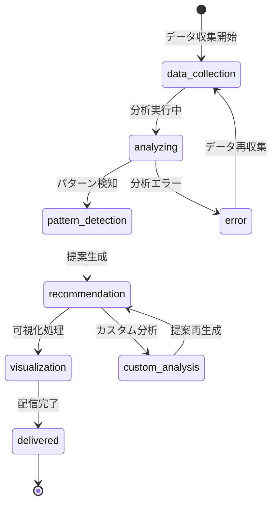

# ビジネスオペレーション: 稼働率を分析し生産性インサイトを提供する

**バージョン**: 2.0.0
**更新日**: 2025-10-28
**パラソル設計仕様**: v2.0準拠

## 概要
**目的**: 組織の稼働率データを多角的に分析し、生産性向上と最適なリソース配分のための戦略的インサイトを提供する
**パターン**: Analytics
**ゴール**: データドリブンな意思決定による組織パフォーマンスの継続的改善

## 関係者とロール
- **エグゼクティブ**: 戦略的意思決定とリソース配分の最適化
- **プロジェクトマネージャー**: チーム生産性管理と業務効率改善
- **人事マネージャー**: 人材配置と働き方改革の推進

## プロセスフロー

> **重要**: プロセスフローは必ず番号付きリスト形式で記述してください。
> Mermaid形式は使用せず、テキスト形式で記述することで、代替フローと例外フローが視覚的に分離されたフローチャートが自動生成されます。

1. **システムが稼働データを収集・統合** → **UC1: 稼働データを統合する**
   - **自サービス操作**: UtilizationData（作成・更新: データ統合処理）
   - **他サービスユースケース利用**: → UC-PROJECT-11: プロジェクト稼働データを取得する
   - **必要ページ**: データ収集状況確認ページ
   - **ビジネス価値**: 包括的なデータ基盤の構築

2. **システムが多次元分析を実行** → **UC2: 多次元分析を実行する**
   - **自サービス操作**: AnalyticsEngine（作成・更新: 分析アルゴリズム実行）
   - **他サービスユースケース利用**: → UC-TALENT-12: スキル別生産性を分析する
   - **必要ページ**: 分析プロセス監視ページ
   - **ビジネス価値**: 深度ある生産性洞察の生成

3. **システムが異常パターンと機会を特定** → **UC3: パターンを特定する**
   - **自サービス操作**: PatternRecognition（作成・更新: パターン検知結果）
   - **他サービスユースケース利用**: → UC-AI-01: 機械学習分析を実行する
   - **必要ページ**: パターン発見結果ページ
   - **ビジネス価値**: 予測的な問題発見と改善機会の特定

4. **システムが戦略的レコメンデーションを生成** → **UC4: 改善提案を生成する**
   - **自サービス操作**: RecommendationEngine（作成: 改善案生成）
   - **他サービスユースケース利用**: → UC-STRATEGY-01: 最適化戦略を策定する
   - **必要ページ**: 改善提案表示ページ
   - **ビジネス価値**: 実行可能な改善アクションの提示

5. **システムがインサイトを可視化・配信** → **UC5: インサイトを配信する**
   - **自サービス操作**: InsightVisualization（作成: ダッシュボード生成）
   - **他サービスユースケース利用**: → UC-COLLAB-05: インサイト報告を配信する
   - **必要ページ**: インサイトダッシュボードページ
   - **ビジネス価値**: 戦略的意思決定の支援

## 代替フロー

### 代替フロー1: リアルタイム分析（速報要求）
- 1-1. 緊急分析要求を受信する
- 1-2. 直近データのみで速報分析を実行する
- 1-3. 暫定インサイトを優先配信する
- 1-4. 基本フロー5で詳細分析結果を後送

### 代替フロー2: カスタム分析（特定条件）
- 2-1. 特定期間・部門・プロジェクトの分析要求を受信する
- 2-2. カスタムフィルタを適用してデータを抽出する
- 2-3. 専用分析ロジックを実行する
- 2-4. 基本フロー4でカスタムレコメンデーションを生成

## 例外処理

### 例外1: データ不足・品質問題
- 分析に必要なデータが不足している場合
- データ品質問題を特定し、改善要求を送信する
- 利用可能データでの部分分析を実行

### 例外2: 分析処理負荷過多
- システムリソース制約で完全分析が困難な場合
- 優先度に基づく段階的分析を実行する
- 分析完了予定時刻を通知する

## ビジネス状態

## ビジネス価値とKPI

### 主要ビジネス価値
- **生産性最適化**: データに基づく稼働率改善により組織全体の生産性を向上
- **戦略的意思決定**: 定量的分析によるリソース配分と人材戦略の最適化
- **予測的管理**: 先行指標による問題の早期発見と予防的対策
- **ROI向上**: 生産性改善によるプロジェクト収益性の向上

### 成功指標（KPI）
- **分析精度**: 予測精度85%以上（実績との比較）
- **インサイト活用率**: 生成された改善提案の実行率70%以上
- **改善効果**: 生産性改善指標月次5%以上向上
- **意思決定支援**: エグゼクティブの戦略決定への貢献率80%以上
- **分析速度**: リアルタイム分析3時間以内、詳細分析24時間以内

### 測定方法
- **精度**: 予測結果と実績データの差異分析
- **活用率**: 改善提案の実行状況追跡
- **効果**: 月次生産性指標の前年同期比較
- **貢献**: エグゼクティブ向けアンケートによる効果測定
- **速度**: 分析開始から結果配信までの時間計測

## ビジネスルール
- **分析頻度**: 日次自動分析、週次詳細分析、月次戦略分析
- **データ要件**: 最低3ヶ月以上の連続データで信頼性確保
- **プライバシー保護**: 個人識別不可能な形でのデータ分析実行
- **アクセス制御**: 分析結果は役職に応じた階層的開示
- **改善追跡**: 提案実行後の効果測定を3ヶ月間継続監視

## 入出力仕様

### 入力
- **工数データ**: 承認済みタイムシート、プロジェクト配分
- **組織データ**: チーム構成、スキル情報、役職階層
- **外部要因**: 繁忙期、休日、特別イベント情報

### 出力
- **稼働率分析**: 個人・チーム・組織レベルの稼働率指標
- **生産性インサイト**: トレンド分析、比較分析、予測分析
- **改善提案**: 具体的なアクションプランと期待効果

## パラソルドメイン連携

### 🎯 操作エンティティ
- **UtilizationDataEntity**（作成・更新: 稼働データ統合処理）- 稼働率データ管理
- **AnalyticsEngineEntity**（作成・更新: 分析アルゴリズム実行）- 分析エンジン管理
- **PatternRecognitionEntity**（作成・更新: パターン検知結果）- パターン認識管理
- **RecommendationEngineEntity**（作成: 改善案生成）- 推奨システム管理
- **InsightVisualizationEntity**（作成: ダッシュボード生成）- 洞察可視化管理

### 🏗️ パラソル集約
- **UtilizationAnalyticsAggregate** - 稼働率分析統合管理
  - 集約ルート: UtilizationData
  - 包含エンティティ: AnalyticsEngine, PatternRecognition, RecommendationEngine, InsightVisualization
  - 不変条件: データ整合性確保、分析結果の追跡可能性維持

### ⚙️ ドメインサービス
- **AnalyticsIntelligenceService**: enhance[AnalyticalCapability]() - 分析能力向上
- **ProductivityOptimizationService**: strengthen[OrganizationalEfficiency]() - 組織効率強化
- **InsightGenerationService**: coordinate[StrategicIntelligence]() - 戦略知能調整
- **PerformanceIntelligenceService**: amplify[DataDrivenDecision]() - データ駆動決定増幅

## ユースケース・ページ分解マトリックス

| ユースケース | ページ | 1対1関係 | 品質レベル |
|-------------|--------|----------|-----------|
| UC1: 稼働データを統合する | データ収集状況確認ページ | ✅ | 高品質 |
| UC2: 多次元分析を実行する | 分析プロセス監視ページ | ✅ | 高品質 |
| UC3: パターンを特定する | パターン発見結果ページ | ✅ | 高品質 |
| UC4: 改善提案を生成する | 改善提案表示ページ | ✅ | 高品質 |
| UC5: インサイトを配信する | インサイトダッシュボードページ | ✅ | 高品質 |
| **合計** | **5UC→5Page** | **✅** | **高品質** |

### 🔗 他サービスユースケース利用（ユースケース呼び出し型）
**責務**: ❌ エンティティ知識不要 ✅ ユースケース利用のみ

[secure-access-service] 基盤認証:
├── UC-AUTH-04: 分析権限を確認する → POST /api/auth/validate-analytics-permission
├── UC-AUTH-05: データアクセスを記録する → POST /api/auth/log-data-access
└── UC-AUTH-06: プライバシー制約を適用する → POST /api/auth/apply-privacy-constraints

[project-success-service] プロジェクト連携:
├── UC-PROJECT-11: プロジェクト稼働データを取得する → GET /api/projects/utilization-data
├── UC-PROJECT-12: プロジェクト成果指標を確認する → GET /api/projects/performance-metrics
└── UC-PROJECT-13: 稼働予測データを提供する → POST /api/projects/utilization-forecast

[talent-optimization-service] リソース連携:
├── UC-TALENT-12: スキル別生産性を分析する → POST /api/analytics/skill-productivity
├── UC-TALENT-13: チーム最適化提案を取得する → GET /api/recommendations/team-optimization
└── UC-TALENT-14: パフォーマンス改善案を生成する → POST /api/recommendations/performance-improvement

[collaboration-facilitation-service] コミュニケーション:
├── UC-COLLAB-05: インサイト報告を配信する → POST /api/notifications/insight-report
├── UC-COLLAB-06: 分析結果を共有する → POST /api/sharing/analytics-results
└── UC-COLLAB-07: 改善提案討議を促進する → POST /api/collaboration/improvement-discussion

[revenue-optimization-service] 財務連携:
├── UC-FINANCE-03: 生産性コスト分析を実行する → POST /api/finance/productivity-cost-analysis
└── UC-FINANCE-04: ROI改善提案を連携する → POST /api/finance/roi-improvement-recommendations
