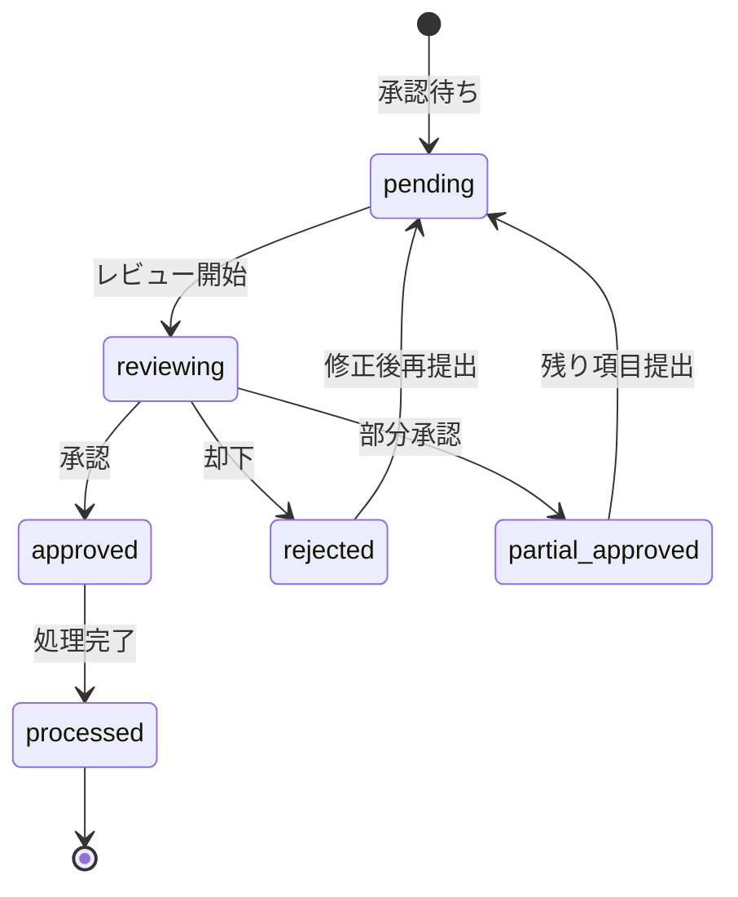

# ビジネスオペレーション: タイムシートを迅速に承認し品質を保証する

**バージョン**: 2.0.0
**更新日**: 2025-10-28
**パラソル設計仕様**: v2.0準拠

## 概要
**目的**: 提出されたタイムシートを効率的に審査・承認し、正確な工数データによる組織の生産性向上を実現する
**パターン**: Workflow
**ゴール**: 承認プロセスの迅速化と工数データ品質の確保

## 関係者とロール
- **プロジェクトマネージャー**: タイムシート審査と承認決定
- **メンバー（コンサルタント）**: 工数修正対応と再提出
- **エグゼクティブ**: 承認済み工数データによる意思決定

## プロセスフロー

> **重要**: プロセスフローは必ず番号付きリスト形式で記述してください。
> Mermaid形式は使用せず、テキスト形式で記述することで、代替フローと例外フローが視覚的に分離されたフローチャートが自動生成されます。

1. **システムが承認待ちタイムシートを検出** → **UC1: 承認対象を特定する**
   - **自サービス操作**: TimesheetApproval（状態: pending）
   - **他サービスユースケース利用**: → UC-AUTH-01: 承認者権限を確認する
   - **必要ページ**: 承認待ちリスト表示ページ
   - **ビジネス価値**: 効率的な承認業務の開始

2. **PMがタイムシート内容を詳細レビュー** → **UC2: 工数詳細を審査する**
   - **自サービス操作**: TimesheetReview（作成・更新）
   - **他サービスユースケース利用**: → UC-PROJECT-08: プロジェクト予算を確認する
   - **必要ページ**: タイムシート詳細審査ページ
   - **ビジネス価値**: 工数データの正確性確保

3. **システムが異常パターンを自動検知** → **UC3: 異常を自動検出する**
   - **自サービス操作**: AnomalyDetection（作成・更新）
   - **他サービスユースケース利用**: → UC-INTEL-01: パターン分析を実行する
   - **必要ページ**: 異常検知結果表示ページ
   - **ビジネス価値**: 自動品質チェックによる効率化

4. **PMが承認・却下判定を実行** → **UC4: 承認判定を下す**
   - **自サービス操作**: TimesheetApproval（状態: pending → approved/rejected）
   - **他サービスユースケース利用**: → UC-COLLAB-02: 判定結果を通知する
   - **必要ページ**: 承認判定実行ページ
   - **ビジネス価値**: 迅速な意思決定と透明性確保

5. **システムが承認結果を統合処理** → **UC5: 承認結果を統合する**
   - **自サービス操作**: ApprovedTimesheet（作成）
   - **他サービスユースケース利用**: → UC-FINANCE-01: 原価データを更新する
   - **必要ページ**: 承認完了確認ページ
   - **ビジネス価値**: 正確な原価データによる収益性向上

## 代替フロー

### 代替フロー1: 部分承認（一部修正要求）
- 3-1. システムが特定項目の異常を検知する
- 3-2. PMが該当項目のみ修正要求を出す
- 3-3. 承認可能な項目は先行承認する
- 3-4. 修正完了後に残り項目を基本フロー4で処理

### 代替フロー2: 一括承認（定型パターン）
- 2-1. システムが承認パターンを学習済みと判定する
- 2-2. PMに一括承認オプションを提示する
- 2-3. PMが一括承認を選択する
- 2-4. 基本フロー5に直接進む

## 例外処理

### 例外1: 承認権限不足
- PMの承認権限が不足している場合
- 上位承認者への自動エスカレーション
- 権限不足の理由と必要手続きを表示

### 例外2: 予算超過検知
- プロジェクト予算を超過する工数の場合
- エグゼクティブへの即時アラート配信
- 特別承認フローへの自動移行

## ビジネス状態

## ビジネス価値とKPI

### 主要ビジネス価値
- **承認効率化**: 承認プロセスの自動化による管理工数削減
- **品質保証**: 異常検知による工数データの信頼性向上
- **透明性確保**: 承認プロセスの可視化による公平性実現
- **意思決定支援**: リアルタイム承認により迅速な原価管理実現

### 成功指標（KPI）
- **承認スピード**: 平均24時間以内（提出から承認まで）
- **承認精度**: 承認後修正率2%以下（承認判定の正確性）
- **自動検知率**: 異常パターン95%以上（手動チェック削減）
- **管理工数削減**: 従来比60%削減（承認業務効率化）
- **PMの満足度**: 4.5/5.0以上（承認業務の使いやすさ）

### 測定方法
- **スピード**: 提出タイムスタンプから承認完了までの時間
- **精度**: 承認後の修正・取り消し件数の追跡
- **検知率**: 自動検知した異常の手動確認結果との比較
- **工数削減**: 承認業務時間の月次比較分析
- **満足度**: PM向け四半期アンケート調査

## ビジネスルール
- **承認期限**: 提出から48時間以内の承認義務（休日除く）
- **承認権限**: PM以上の役職、またはプロジェクト予算権限者
- **却下理由**: 必須記入（メンバーのフィードバック向上）
- **証跡保持**: 承認プロセス全体の監査ログ記録
- **異常閾値**: 1日12時間超、週60時間超の工数は要特別承認

## 入出力仕様

### 入力
- **提出済みタイムシート**: メンバーID、期間、工数詳細
- **承認者情報**: PM権限、プロジェクト配属、予算権限
- **プロジェクト制約**: 予算上限、承認ルール、特別要件

### 出力
- **承認済みタイムシート**: 承認者、承認日時、コメント
- **承認統計**: 承認率、平均処理時間、異常検知数
- **通知データ**: メンバーへの結果通知、エスカレーション

## パラソルドメイン連携

### 🎯 操作エンティティ
- **TimesheetApprovalEntity**（状態更新: pending → approved/rejected）- タイムシート承認管理
- **TimesheetReviewEntity**（作成・更新: 審査記録・コメント）- 審査プロセス管理
- **AnomalyDetectionEntity**（作成・更新: 異常パターン検知）- 品質管理
- **ApprovedTimesheetEntity**（作成: 承認完了データ）- 承認済みデータ管理

### 🏗️ パラソル集約
- **ApprovalWorkflowAggregate** - タイムシート承認統合管理
  - 集約ルート: TimesheetApproval
  - 包含エンティティ: TimesheetReview, AnomalyDetection, ApprovedTimesheet
  - 不変条件: 承認者権限の確認必須、審査記録の保持義務

### ⚙️ ドメインサービス
- **ApprovalEfficiencyService**: enhance[ApprovalSpeed]() - 承認速度向上
- **QualityAssuranceService**: strengthen[DataQuality]() - データ品質強化
- **AnomalyIntelligenceService**: coordinate[AutomatedDetection]() - 自動検知調整
- **WorkflowOptimizationService**: amplify[ProcessEfficiency]() - プロセス効率増幅

## ユースケース・ページ分解マトリックス

| ユースケース | ページ | 1対1関係 | 品質レベル |
|-------------|--------|----------|-----------|
| UC1: 承認対象を特定する | 承認待ちリスト表示ページ | ✅ | 高品質 |
| UC2: 工数詳細を審査する | タイムシート詳細審査ページ | ✅ | 高品質 |
| UC3: 異常を自動検出する | 異常検知結果表示ページ | ✅ | 高品質 |
| UC4: 承認判定を下す | 承認判定実行ページ | ✅ | 高品質 |
| UC5: 承認結果を統合する | 承認完了確認ページ | ✅ | 高品質 |
| **合計** | **5UC→5Page** | **✅** | **高品質** |

### 🔗 他サービスユースケース利用（ユースケース呼び出し型）
**責務**: ❌ エンティティ知識不要 ✅ ユースケース利用のみ

[secure-access-service] 基盤認証:
├── UC-AUTH-01: 承認者権限を確認する → POST /api/auth/validate-permission
├── UC-AUTH-02: 承認プロセスを記録する → POST /api/auth/log-access
└── UC-AUTH-03: 異常アクセスを検知する → POST /api/auth/detect-anomaly

[project-success-service] プロジェクト連携:
├── UC-PROJECT-08: プロジェクト予算を確認する → GET /api/projects/budget/{id}
├── UC-PROJECT-09: 工数制約を取得する → GET /api/projects/constraints/{id}
└── UC-PROJECT-10: 予算状況を更新する → PUT /api/projects/budget-usage

[collaboration-facilitation-service] コミュニケーション:
├── UC-COLLAB-02: 判定結果を通知する → POST /api/notifications/approval-result
├── UC-COLLAB-03: エスカレーション通知を送信する → POST /api/notifications/escalation
└── UC-COLLAB-04: 承認完了報告を配信する → POST /api/notifications/completion

[talent-optimization-service] リソース連携:
├── UC-TALENT-10: 承認者リストを取得する → GET /api/members/approvers
└── UC-TALENT-11: 工数パフォーマンスを分析する → POST /api/analytics/timesheet-performance

[revenue-optimization-service] 財務連携:
├── UC-FINANCE-01: 原価データを更新する → PUT /api/finance/cost-data
└── UC-FINANCE-02: 収益性分析を実行する → POST /api/finance/profitability-analysis
