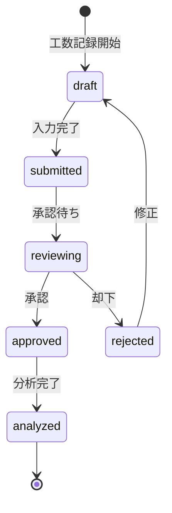

# ビジネスオペレーション: 工数を正確に記録し生産性を可視化する

**バージョン**: 2.0.0
**更新日**: 2025-10-28
**パラソル設計仕様**: v2.0準拠

## 概要
**目的**: プロジェクト工数を正確に記録し、生産性分析と改善のための基盤データを確立する
**パターン**: Workflow
**ゴール**: 工数記録の精度向上と生産性最適化への貢献

## 関係者とロール
- **メンバー（コンサルタント）**: 日々の工数入力と時間管理
- **プロジェクトマネージャー**: 工数レビューと承認
- **エグゼクティブ**: 生産性指標の確認と意思決定

## プロセスフロー

> **重要**: プロセスフローは必ず番号付きリスト形式で記述してください。
> Mermaid形式は使用せず、テキスト形式で記述することで、代替フローと例外フローが視覚的に分離されたフローチャートが自動生成されます。

1. **メンバーが工数記録を開始** → **UC1: 工数エントリを作成する**
   - **自サービス操作**: TimesheetEntry（状態: draft）
   - **他サービスユースケース利用**: → UC-AUTH-01: ユーザー認証を確認する
   - **必要ページ**: 工数記録入力ページ
   - **ビジネス価値**: 正確な時間追跡の開始

2. **システムがプロジェクト・タスク情報を取得** → **UC2: 関連情報を確認する**
   - **自サービス操作**: WorklogContext（作成・更新）
   - **他サービスユースケース利用**: → UC-PROJECT-05: プロジェクト情報を取得する
   - **必要ページ**: プロジェクト選択ページ
   - **ビジネス価値**: 正確な工数分類

3. **メンバーが詳細工数情報を入力** → **UC3: 工数詳細を記録する**
   - **自サービス操作**: TimesheetEntry（状態: draft → submitted）
   - **他サービスユースケース利用**: → UC-AUTH-02: 入力権限を検証する
   - **必要ページ**: 工数詳細入力ページ
   - **ビジネス価値**: 詳細な生産性データ収集

4. **システムが工数を集計・分析** → **UC4: 工数データを分析する**
   - **自サービス操作**: ProductivityMetrics（作成・更新）
   - **他サービスユースケース利用**: → UC-VISUAL-01: 分析結果を可視化する
   - **必要ページ**: 工数分析ダッシュボード
   - **ビジネス価値**: 即座の生産性インサイト

5. **システムが承認フローを開始** → **UC5: 承認プロセスを実行する**
   - **自サービス操作**: ApprovalWorkflow（作成）
   - **他サービスユースケース利用**: → UC-COLLAB-01: 承認通知を配信する
   - **必要ページ**: 承認状況確認ページ
   - **ビジネス価値**: 品質保証された工数データ

## 代替フロー

### 代替フロー1: 工数修正要求
- 3-1. システムが工数データの異常を検知する
- 3-2. PMに修正依頼通知を送信する
- 3-3. メンバーが工数を修正・再入力する
- 3-4. 基本フロー4に戻る

### 代替フロー2: 自動工数推定
- 1-1. システムが過去データから工数を推定する
- 1-2. 推定値をメンバーに提示する
- 1-3. メンバーが推定値を確認・調整する
- 1-4. 基本フロー3に進む

## 例外処理

### 例外1: プロジェクト情報取得失敗
- プロジェクトサービス連携エラーの場合
- キャッシュされたプロジェクト情報を使用する
- エラーログを記録し、後で同期を実行する

### 例外2: 工数入力制限超過
- 1日の工数上限（12時間）を超えた場合
- 警告メッセージを表示し、確認を求める
- 管理者への異常通知を実行する

## ビジネス状態

## ビジネス価値とKPI

### 主要ビジネス価値
- **生産性透明性**: 工数の正確な把握による生産性の可視化
- **プロジェクト収益性**: 正確な原価計算による収益最適化
- **リソース最適化**: 工数分析に基づく人員配置の改善
- **品質向上**: 工数と品質の相関分析による改善施策

### 成功指標（KPI）
- **工数記録率**: 95%以上（全稼働時間に対する記録率）
- **記録精度**: 誤差±10%以内（実績との比較）
- **入力時間**: 平均5分以内（1日分の工数記録）
- **承認サイクル**: 2営業日以内（記録から承認まで）
- **利用者満足度**: 4.0/5.0以上（使いやすさ評価）

### 測定方法
- **記録率**: (記録済み工数時間 / 全稼働時間) × 100
- **精度**: プロジェクト完了時の実績との差異分析
- **効率性**: ユーザー操作ログによる入力時間計測
- **満足度**: 月次ユーザーアンケート調査

## ビジネスルール
- **記録必須**: 全メンバーは稼働時間の記録が必須
- **日次入力**: 工数は作業当日または翌営業日までに入力
- **承認フロー**: 記録された工数は48時間以内にPMが承認
- **修正制限**: 承認後の工数修正は管理者権限が必要
- **精度要件**: 15分単位での記録（最小単位）

## 入出力仕様

### 入力
- **プロジェクト情報**: プロジェクトID、タスクID
- **工数詳細**: 作業時間、作業内容、成果物
- **メンバー情報**: ユーザーID、ロール、権限レベル

### 出力
- **工数レコード**: 承認済み工数データ
- **生産性指標**: 個人・プロジェクト別分析結果
- **承認状況**: 工数承認プロセスの進捗

## パラソルドメイン連携

### 🎯 操作エンティティ
- **TimesheetEntryEntity**（状態更新: draft → submitted → approved）- 工数記録エントリ管理
- **WorklogContextEntity**（作成・更新: プロジェクト関連情報）- 作業コンテキスト管理
- **ProductivityMetricsEntity**（作成・更新: 分析指標算出）- 生産性指標管理
- **ApprovalWorkflowEntity**（作成・更新: 承認フロー制御）- 承認プロセス管理

### 🏗️ パラソル集約
- **TimesheetAggregate** - 工数記録統合管理
  - 集約ルート: TimesheetEntry
  - 包含エンティティ: WorklogContext, ProductivityMetrics, ApprovalWorkflow
  - 不変条件: 承認済み工数は編集不可、合計時間整合性確保

### ⚙️ ドメインサービス
- **ProductivityAnalysisService**: enhance[ProductivityInsights]() - 生産性洞察向上
- **TimesheetValidationService**: strengthen[DataQuality]() - データ品質強化
- **WorkflowOptimizationService**: coordinate[ApprovalEfficiency]() - 承認効率調整
- **PerformanceIntelligenceService**: amplify[OrganizationalIntelligence]() - 組織知能増幅

## ユースケース・ページ分解マトリックス

| ユースケース | ページ | 1対1関係 | 品質レベル |
|-------------|--------|----------|-----------|
| UC1: 工数エントリを作成する | 工数記録入力ページ | ✅ | 高品質 |
| UC2: 関連情報を確認する | プロジェクト選択ページ | ✅ | 高品質 |
| UC3: 工数詳細を記録する | 工数詳細入力ページ | ✅ | 高品質 |
| UC4: 工数データを分析する | 工数分析ダッシュボード | ✅ | 高品質 |
| UC5: 承認プロセスを実行する | 承認状況確認ページ | ✅ | 高品質 |
| **合計** | **5UC→5Page** | **✅** | **高品質** |

### 🔗 他サービスユースケース利用（ユースケース呼び出し型）
**責務**: ❌ エンティティ知識不要 ✅ ユースケース利用のみ

[secure-access-service] 基盤認証:
├── UC-AUTH-01: ユーザー認証を確認する → POST /api/auth/authenticate
├── UC-AUTH-02: 入力権限を検証する → POST /api/auth/validate-permission
└── UC-AUTH-03: アクセスログを記録する → POST /api/auth/log-access

[project-success-service] プロジェクト連携:
├── UC-PROJECT-05: プロジェクト情報を取得する → GET /api/projects/info/{id}
├── UC-PROJECT-06: タスク詳細を確認する → GET /api/tasks/details/{id}
└── UC-PROJECT-07: 工数を登録する → POST /api/projects/worklog

[collaboration-facilitation-service] コミュニケーション:
├── UC-COLLAB-01: 承認通知を配信する → POST /api/notifications/approval
├── UC-COLLAB-02: 異常アラートを送信する → POST /api/notifications/alert
└── UC-COLLAB-03: 進捗報告を共有する → POST /api/notifications/progress

[talent-optimization-service] リソース連携:
├── UC-TALENT-08: メンバー稼働状況を更新する → PUT /api/members/workload
└── UC-TALENT-09: スキル実績を記録する → POST /api/skills/track-usage
