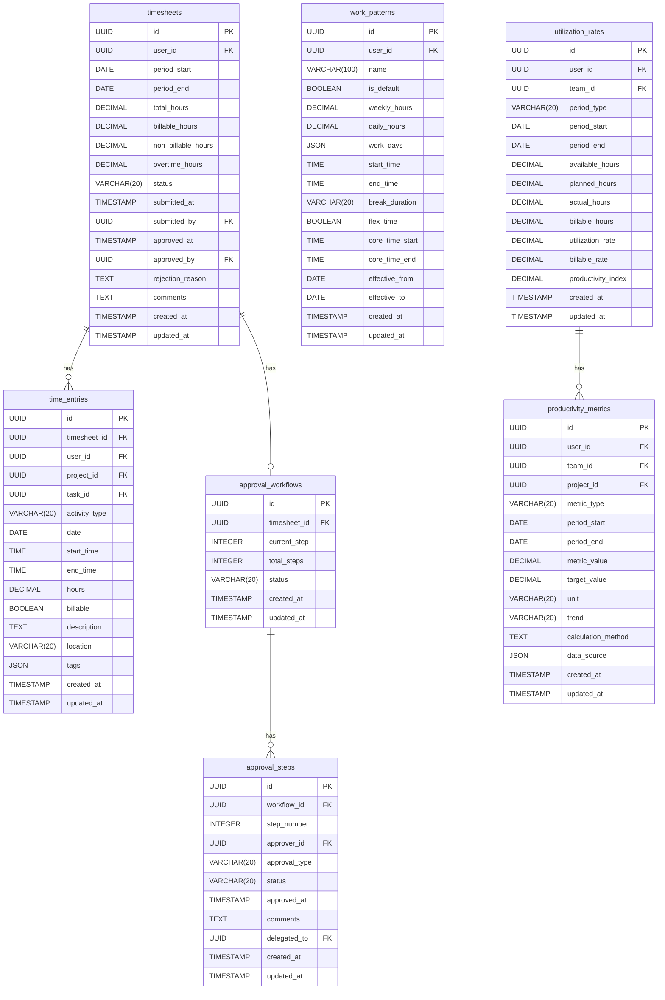

# データベース設計: 生産性可視化サービス

## 設計概要
**データベース**: SQLite (開発環境) / PostgreSQL (本番環境想定)
**文字エンコーディング**: UTF-8
**タイムゾーン**: UTC

## 論理設計

### ER図



## 物理設計

### テーブル作成SQL

#### timesheetsテーブル
```sql
CREATE TABLE timesheets (
    id UUID PRIMARY KEY DEFAULT gen_random_uuid(),
    user_id UUID NOT NULL,
    period_start DATE NOT NULL,
    period_end DATE NOT NULL,
    total_hours DECIMAL(10, 2) NOT NULL DEFAULT 0,
    billable_hours DECIMAL(10, 2) NOT NULL DEFAULT 0,
    non_billable_hours DECIMAL(10, 2) NOT NULL DEFAULT 0,
    overtime_hours DECIMAL(10, 2) NOT NULL DEFAULT 0,
    status VARCHAR(20) NOT NULL CHECK (status IN ('Draft', 'Submitted', 'Approved', 'Rejected', 'Revised')),
    submitted_at TIMESTAMP,
    submitted_by UUID,
    approved_at TIMESTAMP,
    approved_by UUID,
    rejection_reason TEXT,
    comments TEXT,
    created_at TIMESTAMP NOT NULL DEFAULT NOW(),
    updated_at TIMESTAMP NOT NULL DEFAULT NOW(),
    CONSTRAINT check_timesheet_period CHECK (period_start <= period_end),
    CONSTRAINT check_timesheet_hours CHECK (
        total_hours >= 0 AND
        billable_hours >= 0 AND
        non_billable_hours >= 0 AND
        overtime_hours >= 0 AND
        total_hours = billable_hours + non_billable_hours
    ),
    CONSTRAINT check_timesheet_submission CHECK (
        (status = 'Submitted' AND submitted_at IS NOT NULL AND submitted_by IS NOT NULL) OR
        (status != 'Submitted')
    ),
    CONSTRAINT check_timesheet_approval CHECK (
        (status = 'Approved' AND approved_at IS NOT NULL AND approved_by IS NOT NULL) OR
        (status != 'Approved')
    ),
    CONSTRAINT unique_timesheet_period UNIQUE (user_id, period_start, period_end)
);

CREATE INDEX idx_timesheets_user_id ON timesheets(user_id);
CREATE INDEX idx_timesheets_period_start ON timesheets(period_start);
CREATE INDEX idx_timesheets_status ON timesheets(status);
CREATE INDEX idx_timesheets_submitted_at ON timesheets(submitted_at);
CREATE INDEX idx_timesheets_approved_by ON timesheets(approved_by);
```

#### time_entriesテーブル
```sql
CREATE TABLE time_entries (
    id UUID PRIMARY KEY DEFAULT gen_random_uuid(),
    timesheet_id UUID NOT NULL REFERENCES timesheets(id) ON DELETE CASCADE,
    user_id UUID NOT NULL,
    project_id UUID NOT NULL,
    task_id UUID,
    activity_type VARCHAR(20) NOT NULL CHECK (activity_type IN ('Development', 'Meeting', 'Review', 'Documentation', 'Support', 'Other')),
    date DATE NOT NULL,
    start_time TIME,
    end_time TIME,
    hours DECIMAL(5, 2) NOT NULL,
    billable BOOLEAN NOT NULL DEFAULT true,
    description TEXT NOT NULL,
    location VARCHAR(20) CHECK (location IN ('Office', 'Remote', 'Client', 'Other')),
    tags JSON,
    created_at TIMESTAMP NOT NULL DEFAULT NOW(),
    updated_at TIMESTAMP NOT NULL DEFAULT NOW(),
    CONSTRAINT check_entry_hours CHECK (hours >= 0.25 AND hours <= 24),
    CONSTRAINT check_entry_time_range CHECK (
        (start_time IS NULL AND end_time IS NULL) OR
        (start_time IS NOT NULL AND end_time IS NOT NULL AND start_time < end_time)
    )
);

CREATE INDEX idx_time_entries_timesheet_id ON time_entries(timesheet_id);
CREATE INDEX idx_time_entries_user_id ON time_entries(user_id);
CREATE INDEX idx_time_entries_project_id ON time_entries(project_id);
CREATE INDEX idx_time_entries_task_id ON time_entries(task_id);
CREATE INDEX idx_time_entries_date ON time_entries(date);
CREATE INDEX idx_time_entries_billable ON time_entries(billable);
CREATE INDEX idx_time_entries_tags ON time_entries USING GIN (tags);
```

#### work_patternsテーブル
```sql
CREATE TABLE work_patterns (
    id UUID PRIMARY KEY DEFAULT gen_random_uuid(),
    user_id UUID NOT NULL,
    name VARCHAR(100) NOT NULL,
    is_default BOOLEAN NOT NULL DEFAULT false,
    weekly_hours DECIMAL(5, 2) NOT NULL,
    daily_hours DECIMAL(5, 2) NOT NULL,
    work_days JSON NOT NULL,
    start_time TIME NOT NULL,
    end_time TIME NOT NULL,
    break_duration VARCHAR(20) NOT NULL,
    flex_time BOOLEAN NOT NULL DEFAULT false,
    core_time_start TIME,
    core_time_end TIME,
    effective_from DATE NOT NULL,
    effective_to DATE,
    created_at TIMESTAMP NOT NULL DEFAULT NOW(),
    updated_at TIMESTAMP NOT NULL DEFAULT NOW(),
    CONSTRAINT check_wp_hours CHECK (
        weekly_hours > 0 AND weekly_hours <= 60 AND
        daily_hours > 0 AND daily_hours <= 12
    ),
    CONSTRAINT check_wp_time_range CHECK (start_time < end_time),
    CONSTRAINT check_wp_core_time CHECK (
        (flex_time = false) OR
        (flex_time = true AND core_time_start IS NOT NULL AND core_time_end IS NOT NULL AND
         core_time_start >= start_time AND core_time_end <= end_time AND core_time_start < core_time_end)
    ),
    CONSTRAINT check_wp_effective_period CHECK (
        effective_to IS NULL OR effective_from <= effective_to
    )
);

CREATE INDEX idx_work_patterns_user_id ON work_patterns(user_id);
CREATE INDEX idx_work_patterns_is_default ON work_patterns(is_default);
CREATE INDEX idx_work_patterns_effective_from ON work_patterns(effective_from);
CREATE INDEX idx_work_patterns_effective_to ON work_patterns(effective_to);
CREATE UNIQUE INDEX idx_work_patterns_default ON work_patterns(user_id) WHERE is_default = true;
```

#### utilization_ratesテーブル
```sql
CREATE TABLE utilization_rates (
    id UUID PRIMARY KEY DEFAULT gen_random_uuid(),
    user_id UUID,
    team_id UUID,
    period_type VARCHAR(20) NOT NULL CHECK (period_type IN ('Daily', 'Weekly', 'Monthly', 'Quarterly')),
    period_start DATE NOT NULL,
    period_end DATE NOT NULL,
    available_hours DECIMAL(10, 2) NOT NULL,
    planned_hours DECIMAL(10, 2) NOT NULL,
    actual_hours DECIMAL(10, 2) NOT NULL,
    billable_hours DECIMAL(10, 2) NOT NULL,
    utilization_rate DECIMAL(5, 2) NOT NULL,
    billable_rate DECIMAL(5, 2) NOT NULL,
    productivity_index DECIMAL(5, 2),
    created_at TIMESTAMP NOT NULL DEFAULT NOW(),
    updated_at TIMESTAMP NOT NULL DEFAULT NOW(),
    CONSTRAINT check_ur_scope CHECK (
        (user_id IS NOT NULL AND team_id IS NULL) OR
        (user_id IS NULL AND team_id IS NOT NULL)
    ),
    CONSTRAINT check_ur_period CHECK (period_start <= period_end),
    CONSTRAINT check_ur_hours CHECK (
        available_hours > 0 AND
        planned_hours >= 0 AND
        actual_hours >= 0 AND
        billable_hours >= 0 AND
        billable_hours <= actual_hours
    ),
    CONSTRAINT check_ur_rates CHECK (
        utilization_rate >= 0 AND utilization_rate <= 100 AND
        billable_rate >= 0 AND billable_rate <= 100
    ),
    CONSTRAINT unique_utilization_period UNIQUE (user_id, team_id, period_type, period_start, period_end)
);

CREATE INDEX idx_utilization_rates_user_id ON utilization_rates(user_id);
CREATE INDEX idx_utilization_rates_team_id ON utilization_rates(team_id);
CREATE INDEX idx_utilization_rates_period_type ON utilization_rates(period_type);
CREATE INDEX idx_utilization_rates_period_start ON utilization_rates(period_start);
CREATE INDEX idx_utilization_rates_utilization_rate ON utilization_rates(utilization_rate);
```

#### productivity_metricsテーブル
```sql
CREATE TABLE productivity_metrics (
    id UUID PRIMARY KEY DEFAULT gen_random_uuid(),
    user_id UUID,
    team_id UUID,
    project_id UUID,
    metric_type VARCHAR(20) NOT NULL CHECK (metric_type IN ('Velocity', 'Efficiency', 'Quality', 'Output')),
    period_start DATE NOT NULL,
    period_end DATE NOT NULL,
    metric_value DECIMAL(10, 2) NOT NULL,
    target_value DECIMAL(10, 2),
    unit VARCHAR(20) NOT NULL,
    trend VARCHAR(20) CHECK (trend IN ('Improving', 'Stable', 'Declining')),
    calculation_method TEXT,
    data_source JSON,
    created_at TIMESTAMP NOT NULL DEFAULT NOW(),
    updated_at TIMESTAMP NOT NULL DEFAULT NOW(),
    CONSTRAINT check_pm_period CHECK (period_start <= period_end),
    CONSTRAINT check_pm_value CHECK (metric_value >= 0)
);

CREATE INDEX idx_productivity_metrics_user_id ON productivity_metrics(user_id);
CREATE INDEX idx_productivity_metrics_team_id ON productivity_metrics(team_id);
CREATE INDEX idx_productivity_metrics_project_id ON productivity_metrics(project_id);
CREATE INDEX idx_productivity_metrics_metric_type ON productivity_metrics(metric_type);
CREATE INDEX idx_productivity_metrics_period_start ON productivity_metrics(period_start);
CREATE INDEX idx_productivity_metrics_trend ON productivity_metrics(trend);
```

#### approval_workflowsテーブル
```sql
CREATE TABLE approval_workflows (
    id UUID PRIMARY KEY DEFAULT gen_random_uuid(),
    timesheet_id UUID NOT NULL REFERENCES timesheets(id) ON DELETE CASCADE,
    current_step INTEGER NOT NULL DEFAULT 1,
    total_steps INTEGER NOT NULL,
    status VARCHAR(20) NOT NULL CHECK (status IN ('Pending', 'InProgress', 'Completed', 'Cancelled')),
    created_at TIMESTAMP NOT NULL DEFAULT NOW(),
    updated_at TIMESTAMP NOT NULL DEFAULT NOW(),
    CONSTRAINT check_workflow_steps CHECK (
        current_step >= 1 AND
        current_step <= total_steps AND
        total_steps >= 1
    )
);

CREATE INDEX idx_approval_workflows_timesheet_id ON approval_workflows(timesheet_id);
CREATE INDEX idx_approval_workflows_status ON approval_workflows(status);
CREATE UNIQUE INDEX idx_approval_workflows_unique ON approval_workflows(timesheet_id);
```

#### approval_stepsテーブル
```sql
CREATE TABLE approval_steps (
    id UUID PRIMARY KEY DEFAULT gen_random_uuid(),
    workflow_id UUID NOT NULL REFERENCES approval_workflows(id) ON DELETE CASCADE,
    step_number INTEGER NOT NULL,
    approver_id UUID NOT NULL,
    approval_type VARCHAR(20) NOT NULL CHECK (approval_type IN ('Sequential', 'Parallel')),
    status VARCHAR(20) NOT NULL CHECK (status IN ('Pending', 'Approved', 'Rejected', 'Skipped')),
    approved_at TIMESTAMP,
    comments TEXT,
    delegated_to UUID,
    created_at TIMESTAMP NOT NULL DEFAULT NOW(),
    updated_at TIMESTAMP NOT NULL DEFAULT NOW(),
    CONSTRAINT check_step_number CHECK (step_number >= 1),
    CONSTRAINT check_step_approval CHECK (
        (status = 'Approved' AND approved_at IS NOT NULL) OR
        (status != 'Approved')
    ),
    CONSTRAINT unique_workflow_step UNIQUE (workflow_id, step_number)
);

CREATE INDEX idx_approval_steps_workflow_id ON approval_steps(workflow_id);
CREATE INDEX idx_approval_steps_approver_id ON approval_steps(approver_id);
CREATE INDEX idx_approval_steps_status ON approval_steps(status);
CREATE INDEX idx_approval_steps_delegated_to ON approval_steps(delegated_to);
```

## パフォーマンス設計

### インデックス戦略
- **タイムシート検索**: user_id, period_start, statusによる検索
- **工数記録検索**: timesheet_id, project_id, dateによる検索
- **稼働率検索**: user_id, team_id, period_type, period_startによる検索
- **生産性指標検索**: metric_type, trendによる検索

### 複合インデックス
```sql
-- タイムシート期間検索の最適化
CREATE INDEX idx_timesheets_user_period ON timesheets(user_id, period_start, period_end);

-- 工数記録のプロジェクト・日付検索の最適化
CREATE INDEX idx_time_entries_project_date ON time_entries(project_id, date);

-- 承認待ちタイムシートの検索最適化
CREATE INDEX idx_timesheets_status_submitted ON timesheets(status, submitted_at DESC) WHERE status = 'Submitted';

-- 稼働率の期間検索最適化
CREATE INDEX idx_utilization_rates_period ON utilization_rates(period_type, period_start, period_end);
```

### パーティション設計（本番環境）
```sql
-- 月次パーティション（time_entries）
CREATE TABLE time_entries (
    id UUID,
    timesheet_id UUID,
    date DATE NOT NULL,
    -- 他のカラム
) PARTITION BY RANGE (date);

CREATE TABLE time_entries_2024_01 PARTITION OF time_entries
FOR VALUES FROM ('2024-01-01') TO ('2024-02-01');

CREATE TABLE time_entries_2024_02 PARTITION OF time_entries
FOR VALUES FROM ('2024-02-01') TO ('2024-03-01');
```

## セキュリティ設計

### アクセス制御
```sql
CREATE ROLE productivity_reader;
CREATE ROLE productivity_writer;
CREATE ROLE productivity_admin;

GRANT SELECT ON ALL TABLES IN SCHEMA public TO productivity_reader;
GRANT SELECT, INSERT, UPDATE ON timesheets, time_entries, work_patterns TO productivity_writer;
GRANT ALL PRIVILEGES ON ALL TABLES IN SCHEMA public TO productivity_admin;
```

### 行レベルセキュリティ
```sql
-- ユーザーは自分のタイムシートのみ閲覧可能
CREATE POLICY timesheet_user_policy ON timesheets
    FOR SELECT
    USING (
        user_id = current_user_id() OR
        approved_by = current_user_id() OR
        is_manager(current_user_id())
    );

-- ユーザーは自分の工数記録のみ編集可能
CREATE POLICY time_entry_edit_policy ON time_entries
    FOR UPDATE
    USING (
        user_id = current_user_id() AND
        date >= CURRENT_DATE - INTERVAL '14 days'
    );
```

## 運用設計

### バックアップ戦略
- **フルバックアップ**: 日次
- **差分バックアップ**: 6時間毎
- **保管期間**: 90日（法的要件により工数データは長期保管）
- **リストアテスト**: 週次

### 監視項目
- テーブルサイズ: timesheets(10万件), time_entries(100万件)
- クエリレスポンス時間: タイムシート検索50ms以下
- 同時承認処理数: 100件/秒
- デッドロック発生率: 0.1%以下

### データアーカイブ
```sql
-- 2年以上前の承認済みタイムシートをアーカイブ
INSERT INTO timesheets_archive
SELECT * FROM timesheets
WHERE status = 'Approved' AND approved_at < NOW() - INTERVAL '2 years';

-- アーカイブ後のデータ削除
DELETE FROM timesheets
WHERE status = 'Approved' AND approved_at < NOW() - INTERVAL '2 years';
```

### 定期メンテナンス
```sql
-- 週次バキューム
VACUUM ANALYZE timesheets;
VACUUM ANALYZE time_entries;

-- 月次インデックス再構築
REINDEX TABLE timesheets;
REINDEX TABLE time_entries;

-- 統計情報更新
ANALYZE timesheets;
ANALYZE time_entries;
```

## データ整合性保証

### トリガー定義
```sql
-- タイムシート合計工数の自動計算
CREATE OR REPLACE FUNCTION update_timesheet_totals()
RETURNS TRIGGER AS $$
BEGIN
    UPDATE timesheets
    SET
        total_hours = (
            SELECT COALESCE(SUM(hours), 0)
            FROM time_entries
            WHERE timesheet_id = NEW.timesheet_id
        ),
        billable_hours = (
            SELECT COALESCE(SUM(hours), 0)
            FROM time_entries
            WHERE timesheet_id = NEW.timesheet_id AND billable = true
        ),
        non_billable_hours = (
            SELECT COALESCE(SUM(hours), 0)
            FROM time_entries
            WHERE timesheet_id = NEW.timesheet_id AND billable = false
        ),
        updated_at = NOW()
    WHERE id = NEW.timesheet_id;
    RETURN NEW;
END;
$$ LANGUAGE plpgsql;

CREATE TRIGGER trg_update_timesheet_totals
AFTER INSERT OR UPDATE OR DELETE ON time_entries
FOR EACH ROW
EXECUTE FUNCTION update_timesheet_totals();

-- 1日の工数上限チェック
CREATE OR REPLACE FUNCTION check_daily_hours_limit()
RETURNS TRIGGER AS $$
DECLARE
    daily_total DECIMAL;
BEGIN
    SELECT COALESCE(SUM(hours), 0) INTO daily_total
    FROM time_entries
    WHERE user_id = NEW.user_id
      AND date = NEW.date
      AND id != COALESCE(NEW.id, '00000000-0000-0000-0000-000000000000');

    IF (daily_total + NEW.hours) > 24 THEN
        RAISE EXCEPTION '1日の工数が24時間を超えています';
    END IF;

    RETURN NEW;
END;
$$ LANGUAGE plpgsql;

CREATE TRIGGER trg_check_daily_hours
BEFORE INSERT OR UPDATE ON time_entries
FOR EACH ROW
EXECUTE FUNCTION check_daily_hours_limit();
```
