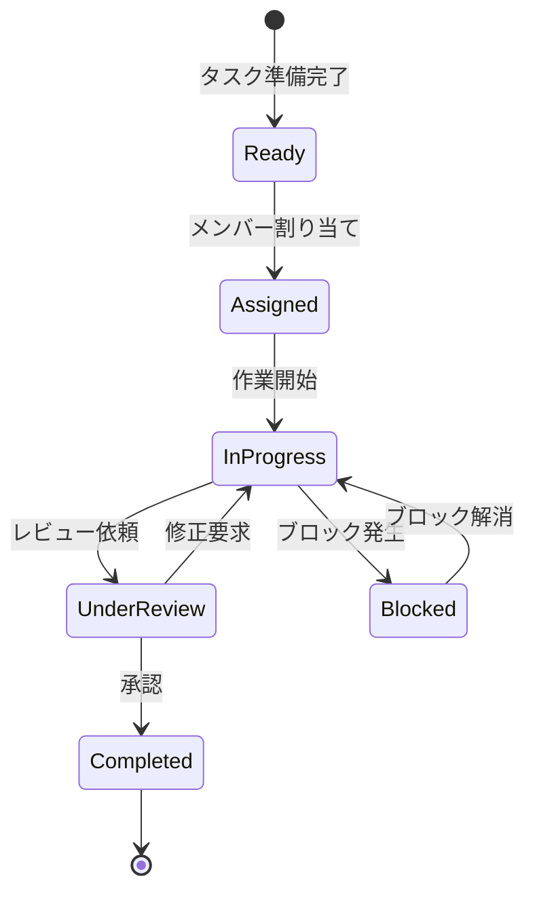

# ビジネスオペレーション: タスクを割り当て実行する

**バージョン**: 1.0.0
**更新日**: 2024-12-30

## 概要

**目的**: タスクを適切なメンバーに割り当て、効率的に実行する

**パターン**: Workflow

**ゴール**: 各メンバーのスキルと稼働状況に応じた最適な割り当てが行われ、タスクが期限内に完了する

## 関係者とロール

- **PM**: タスク割り当て、リソース調整、ボトルネック解消
- **コンサルタント**: タスク実行、進捗報告、成果物作成
- **リソースマネージャー**: リソース可用性の管理

## プロセスフロー

> **重要**: プロセスフローは必ず番号付きリスト形式で記述してください。
> Mermaid形式は使用せず、テキスト形式で記述することで、代替フローと例外フローが視覚的に分離されたフローチャートが自動生成されます。

1. システムがタスク優先順位付けを処理する
2. システムがリソース確認を実行する
3. システムがメンバー割り当てを処理する
4. システムがタスク実行を実行する
5. システムが進捗報告を処理する
6. システムが成果物確認を実行する
7. システムがタスククローズを処理する

## 代替フロー

### 代替フロー1: 情報不備
- 2-1. システムが情報の不備を検知する
- 2-2. システムが修正要求を送信する
- 2-3. ユーザーが情報を修正し再実行する
- 2-4. 基本フロー2に戻る

## 例外処理

### 例外1: システムエラー
- システムエラーが発生した場合
- エラーメッセージを表示する
- 管理者に通知し、ログに記録する

### 例外2: 承認却下
- 承認が却下された場合
- 却下理由をユーザーに通知する
- 修正後の再実行を促す

## ビジネス状態

## KPI

- **稼働率**: メンバー平均80-90%（過負荷でも過少でもない）
- **タスク完了率**: 計画通り90%以上のタスクが期限内完了
- **品質合格率**: 1回目レビューで80%以上が合格
- **割り当て時間**: タスク準備完了から割り当てまで平均1日以内
- **ブロック解消時間**: ブロック発生から解消まで平均2日以内

## ビジネスルール

- 1人のメンバーに同時に割り当てられるタスクは最大3つまで
- 稼働率が90%を超えるメンバーには新規タスクを割り当てない
- クリティカルパスのタスクは経験豊富なメンバーに優先割り当て
- 新人育成タスクは全体の20%を目安とする
- タスク割り当ては本人の了承を得ること（強制割り当て禁止）
- 進捗報告は最低週1回実施すること

## 入出力仕様

### 入力

- **タスク一覧**: WBSで定義された実行待ちタスク
- **リソース稼働状況**: メンバーの現在の稼働率と空き状況
- **スキルマトリクス**: 各メンバーのスキルレベル
- **タスク優先順位**: クリティカルパス、重要度情報

### 出力

- **割り当て計画**: タスクとメンバーのマッピング
- **稼働率予測**: 今後の稼働率推移
- **進捗報告**: タスクごとの進捗状況（完了率、残作業）
- **成果物**: タスクの成果物（ドキュメント、設定ファイル等）
- **ブロッカー報告**: 実行を妨げる障害の報告

## 例外処理

- **リソース不足**: 外部リソースの調達、タスクの後倒し、スコープ削減検討
- **スキルミスマッチ**: トレーニング実施、ペアワーク、タスク再割り当て
- **ブロッカー発生**: 原因の特定と除去、代替手段の検討
- **品質不合格**: レビュー指摘の修正、必要に応じて再作業
- **遅延発生**: 追加リソース投入、並行作業化、作業時間延長

## 派生ユースケース

このビジネスオペレーションから以下のユースケースが派生します：

1. タスクをメンバーに割り当てる
2. タスクを開始する
3. タスクを完了する
4. 成果物を提出する