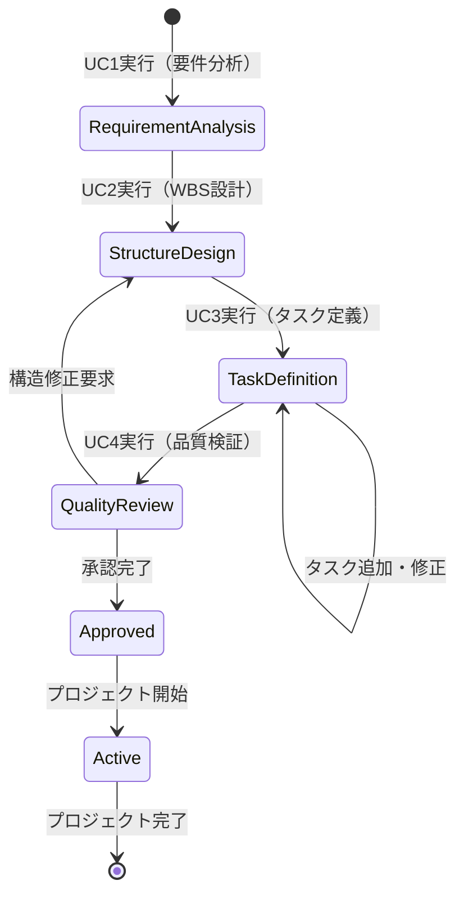

# ビジネスオペレーション: プロジェクト成果物を実現可能なタスクに分解し成功を確実にする

**バージョン**: 2.0.0
**更新日**: 2025-10-10
**設計方針**: ユースケース・ページ分解指向 + パラソルドメイン言語連携

## 📋 概要
**目的**: プロジェクト成果物を実現可能なタスクに体系的に分解し、成功確率を最大化する
**パターン**: Workflow + Analytics
**ゴール**: 漏れのないタスク分解とリスク最小化により、プロジェクト成功率90%以上を実現

## 🎭 関係者とロール
- **プロジェクトマネージャー**: WBS設計・タスク統合管理・品質保証
- **コンサルタント**: 専門領域タスク定義・工数見積・技術実現性評価
- **クライアント**: 要求仕様確認・成果物定義承認・依存関係調整
- **システム**: タスク分解支援・工数予測・依存関係検証

## 🏗️ パラソルドメイン連携

### サービス境界とユースケース連携

> **⚡ マイクロサービス設計の基本原則（ユースケース利用型）**
> - **自サービス管理**: 自エンティティの全CRUD + 自ユースケースの実装
> - **他サービス連携**: **他サービスの公開ユースケースを利用**（エンティティは意識しない）

#### 📦 自サービス管理（project-success-service）
**責務**: ✅ エンティティ管理 ✅ ユースケース実装 ✅ ビジネスロジック

```
Entity: Task - Aggregate Root
├── id: UUID - 一意識別子
├── projectId: UUID - プロジェクトID参照
├── parentTaskId: UUID - 親タスクID（WBS階層用）
├── name: STRING_200 - タスク名
├── description: TEXT - タスク説明
├── estimatedHours: DECIMAL - 見積工数
├── status: ENUM - 状態（draft/approved/ready/in_progress/completed）
├── priority: ENUM - 優先度（high/medium/low）
├── assignedSkills: JSON - 必要スキル配列
└── dependencies: JSON - 依存関係配列

Entity: WorkBreakdownStructure - Aggregate Root
├── id: UUID - WBS一意識別子
├── projectId: UUID - プロジェクトID参照
├── version: STRING_20 - WBSバージョン
├── status: ENUM - 状態（draft/approved/active）
├── totalEstimatedHours: DECIMAL - 総見積工数
└── criticalPath: JSON - クリティカルパス情報

ValueObject: TaskDependency
├── predecessorTaskId: UUID - 前提タスクID
├── successorTaskId: UUID - 後続タスクID
├── dependencyType: ENUM - 依存タイプ（FS/SS/FF/SF）
└── lag: INTEGER - 遅延日数

Aggregate: TaskAggregate
├── ルート: Task
├── 包含: TaskDependency（多対多）
└── 不変条件: 工数 > 0、循環依存禁止、スキル必須
```

#### 🔗 他サービスユースケース利用（ユースケース呼び出し型）
**責務**: ❌ エンティティ知識不要 ✅ ユースケース利用のみ

```
[talent-optimization-service] ユースケース利用:
├── UC-SKILL-01: スキル要件を分析する → POST /api/skills/analyze-requirements
├── UC-SKILL-02: 利用可能スキルを確認する → GET /api/skills/availability
└── UC-SKILL-03: スキルギャップを評価する → POST /api/skills/gap-analysis

[secure-access-service] ユースケース利用:
├── UC-AUTH-01: プロジェクト権限を確認する → POST /api/auth/validate-project-access
└── UC-AUTH-02: アクセスログを記録する → POST /api/auth/log-access

[knowledge-co-creation-service] ユースケース利用:
├── UC-KNOWLEDGE-01: 過去WBSを検索する → GET /api/knowledge/wbs-templates
└── UC-KNOWLEDGE-02: タスク分解知識を記録する → POST /api/knowledge/task-patterns
```

**ユースケース連携パターン**:
- **機能利用**: `POST /api/{service}/usecases/{usecase-id}` - 他サービス機能実行
- **状況照会**: `GET /api/{service}/usecases/{usecase-id}/status` - 実行状況確認
- **結果取得**: `GET /api/{service}/usecases/{usecase-id}/result` - 処理結果取得

### マイクロサービス連携型ドメインサービス

#### 🎯 ビジネス価値重視のドメインサービス
```
DomainService: TaskDecompositionCoordinator（タスク分解調整サービス）
├── optimizeTaskGranularity() - タスク粒度最適化
├── validateTaskCompleteness() - 分解完全性検証（→ 知識サービス連携）
├── strengthenSuccessProbability() - 成功確率向上
└── minimizeProjectRisk() - プロジェクトリスク最小化

DomainService: WorkflowOptimizationCoordinator（ワークフロー最適化サービス）
├── eliminateTaskDependencyConflicts() - 依存関係競合解消
├── optimizeCriticalPath() - クリティカルパス最適化（→ スキルサービス連携）
├── balanceWorkload() - 作業負荷分散
└── ensureDeliverableQuality() - 成果物品質保証（→ 監査サービス連携）
```

## 🔄 プロセスフロー（ユースケース分解指向）

> **重要**: 各ステップは「誰が何をするか」を明記し、ユースケース分解の根拠とする

### 基本フロー
1. **PMがプロジェクト成果物を確認** → **UC1: プロジェクト成果物要件を分析する**
   - **操作エンティティ**: WorkBreakdownStructure（新規作成）
   - **必要ページ**: 成果物分析ページ - 要件確認と分解戦略決定

2. **システムが分解戦略を最適化** → **内部処理（ページなし）**
   - **ドメインサービス**: TaskDecompositionCoordinator.optimizeDecompositionStrategy()

3. **PMがWBS構造を設計** → **UC2: 作業分解構造を設計する**
   - **操作エンティティ**: WorkBreakdownStructure（構造更新）
   - **必要ページ**: WBS設計ページ - 階層構造と分解ルール定義

4. **コンサルタントがタスク詳細を定義** → **UC3: 個別タスクを詳細定義する**
   - **操作エンティティ**: Task（新規作成・詳細設定）
   - **必要ページ**: タスク定義ページ - 詳細仕様と工数見積

5. **システムが依存関係を検証** → **内部処理（ページなし）**
   - **ドメインサービス**: WorkflowOptimizationCoordinator.validateDependencies()

6. **PMが統合レビューを実行** → **UC4: タスク分解品質を検証し承認する**
   - **操作エンティティ**: WorkBreakdownStructure（承認状態更新）
   - **必要ページ**: 統合レビューページ - 品質検証と承認決定

7. **システムがプロジェクト準備を完了** → **内部処理（ページなし）**
   - **ドメインサービス**: TaskDecompositionCoordinator.finalizeProjectPreparation()

### ユースケース分解原則
- **ユーザー操作ステップ** → ユースケース + ページ
- **システム内部処理** → ドメインサービス（ページなし）
- **1ユースケース = 1つの明確な目的 = 1つのページ**

## 📄 ユースケース・ページ設計マトリックス

| UC# | ユースケース名 | 対応ページ | エンティティ | アクター | 設計方針 |
|-----|---------------|-----------|-------------|----------|----------|
| UC1 | プロジェクト成果物要件を分析する | 成果物分析ページ | WorkBreakdownStructure（新規） | PM | 分析重視・戦略決定支援 |
| UC2 | 作業分解構造を設計する | WBS設計ページ | WorkBreakdownStructure（構造） | PM | 構造重視・階層設計 |
| UC3 | 個別タスクを詳細定義する | タスク定義ページ | Task（新規・詳細） | コンサルタント | 入力重視・詳細仕様管理 |
| UC4 | タスク分解品質を検証し承認する | 統合レビューページ | WorkBreakdownStructure（承認） | PM | 操作重視・品質保証 |

## 🔀 代替フロー（ユースケース分岐指向）

### 代替フロー1: 成果物要件変更
- **分岐元**: 基本フロー ステップ3
- **条件**: クライアントから成果物要件の変更要求
- **代替ユースケース**: UC1-Alt: 変更された要件を再分析し影響評価する
  - **必要ページ**: 要件変更影響分析ページ - 変更内容確認と影響範囲評価
  - **操作エンティティ**: WorkBreakdownStructure（要件更新）

### 代替フロー2: 技術的制約発見
- **分岐元**: 基本フロー ステップ4
- **条件**: タスク定義中に技術的制約や実現困難性を発見
- **代替ユースケース**: UC3-Alt: 技術的制約を考慮しタスクを再設計する
  - **必要ページ**: 技術制約対応ページ - 制約詳細と代替手段検討
  - **操作エンティティ**: Task（制約対応更新）

## ⚠️ 例外フロー（エラーページ設計指向）

### 例外1: 工数見積困難
- **発生ステップ**: ステップ4（タスク詳細定義）
- **エラーユースケース**: UC3-Error: 見積困難タスクを処理し調査計画する
  - **必要ページ**: 見積困難対応ページ - 不確実性分析・調査タスク計画
  - **表示情報**: 困難要因、調査方法、PoC計画、段階的見積手順

### 例外2: 依存関係循環
- **発生ステップ**: ステップ5（依存関係検証）
- **エラーユースケース**: UC2-Error: 循環依存を検出し構造再設計する
  - **必要ページ**: 循環依存解決ページ - 依存関係可視化・解決手順
  - **表示情報**: 循環パス詳細、影響範囲、解決オプション、推奨対応

## 📊 ビジネス状態（エンティティライフサイクル）



**状態とエンティティの対応**:
- **RequirementAnalysis**: WBS.status = "draft", WBS.version = "0.1"
- **StructureDesign**: WBS.status = "structure_design", Task作成開始
- **TaskDefinition**: Task.status = "draft", 依存関係定義
- **QualityReview**: WBS.status = "under_review", 統合検証
- **Approved**: WBS.status = "approved", Task.status = "ready"

## 📏 KPI（ユースケース別成功指標）

| ユースケース | KPI | 目標値 | 測定方法 |
|-------------|-----|--------|----------|
| UC1 | 要件分析完全性 | 95% | 後工程での要件変更率5%以下 |
| UC2 | WBS構造品質 | 90% | 階層適切性・重複なし評価 |
| UC3 | タスク見積精度 | 80% | 実績との差異±20%以内 |
| UC4 | 承認後変更率 | 10%以下 | 承認後のタスク変更頻度 |

## 📜 ビジネスルール（ドメイン制約）

### エンティティ制約
- **Task**: 工数範囲0.5日〜5日、スキル要件必須 → TaskDecompositionCoordinator.validateTaskConstraints()
- **WorkBreakdownStructure**: 階層深度最大5レベル → WorkflowOptimizationCoordinator.validateHierarchy()

### ユースケース制約
- **UC3**: 依存関係循環禁止 → ページバリデーションで実装
- **UC4**: 承認前の完全性チェック必須 → ページバリデーションで実装

## 🔗 入出力仕様（API・ページ連携）

### ユースケース別入出力

#### UC1: プロジェクト成果物要件を分析する
**入力（ページ → API）**:
```json
{
  "projectScope": {
    "deliverables": "Array<string> - 成果物一覧",
    "objectives": "Array<string> - プロジェクト目標",
    "constraints": "Object - 制約条件",
    "stakeholders": "Array<Object> - ステークホルダー情報"
  }
}
```

**出力（API → ページ）**:
```json
{
  "analysisResult": {
    "decompositionStrategy": "string - 分解戦略",
    "estimatedComplexity": "string - 複雑度評価",
    "riskFactors": "Array<string> - リスク要因",
    "nextAction": "UC2実行可能（WBS設計）"
  }
}
```

#### UC3: 個別タスクを詳細定義する
**入力（ページ → API）**:
```json
{
  "taskDefinition": {
    "name": "string - タスク名",
    "description": "string - 詳細説明",
    "estimatedHours": "number - 見積工数",
    "requiredSkills": "Array<string> - 必要スキル",
    "dependencies": "Array<UUID> - 依存タスクID",
    "deliverables": "Array<string> - 成果物"
  }
}
```

**出力（API → ページ）**:
```json
{
  "result": "success/validation_error",
  "taskId": "UUID - 作成されたタスクID",
  "warnings": "Array<string> - 警告事項",
  "nextAction": "次タスク定義 | UC4実行可能（品質検証）"
}
```

## 🚀 実装指針

### 推奨実装順序
1. **パラソルドメイン言語定義** - Task、WorkBreakdownStructure、TaskDependency集約
2. **ドメインサービス実装** - TaskDecompositionCoordinator、WorkflowOptimizationCoordinator
3. **ユースケース・ページのペア実装** - UC1→UC2→UC3→UC4の順序で段階的に
4. **統合テスト** - 他サービス連携を含むタスク分解フロー全体の検証

### 品質チェックポイント
- [ ] 各ユースケースに対応するページが1対1で存在する
- [ ] パラソルドメイン言語エンティティ（Task、WBS）が正しく操作される
- [ ] ビジネス状態遷移がエンティティ状態と一致する
- [ ] 代替・例外フローにも適切なページが用意される
- [ ] 他サービスユースケース利用が正しく実装される（talent、secure-access、knowledge連携）

---
*このオペレーション定義は、ユースケース・ページ分解とパラソルドメイン言語連携を強化したビジネスオペレーション設計指針v2.0に基づいています*