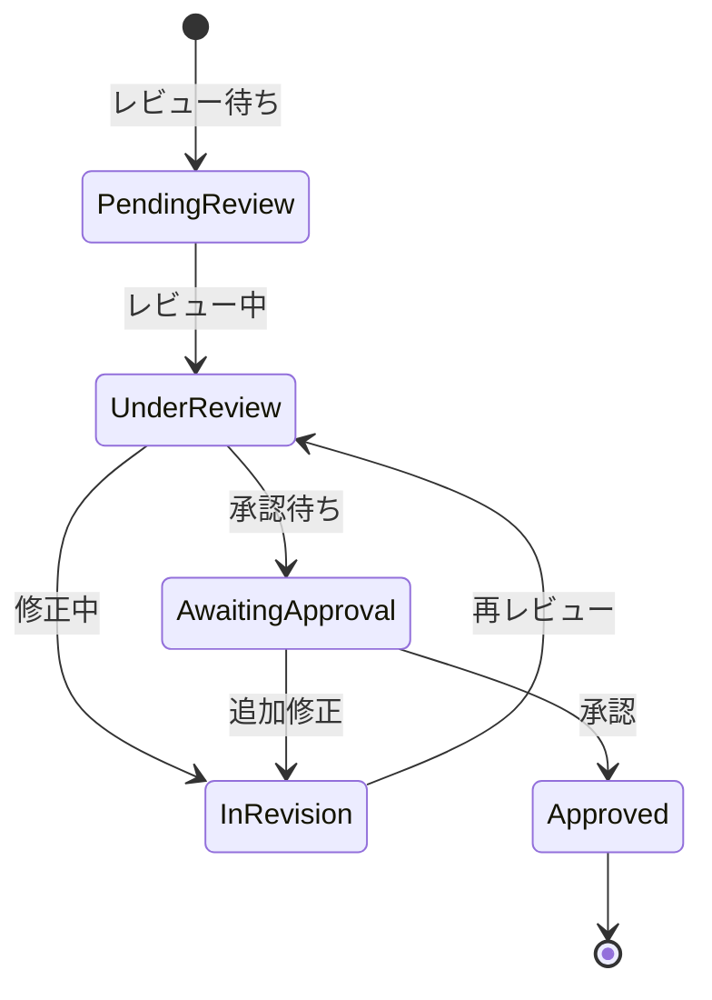

# ビジネスオペレーション: 成果物をレビューし承認する

**バージョン**: 1.0.0
**更新日**: 2024-12-30

## 概要

**目的**: 成果物の品質を複数の視点でレビューし、基準を満たすことを確認する

**パターン**: Workflow

**ゴール**: 高品質な成果物のみが承認され、次工程に進む

## 関係者とロール

- **作成者**: 指摘事項への対応、修正実施
- **レビュアー**: 品質チェック、改善指摘、推奨事項の提示
- **承認者**: 最終承認判断、リリース可否の決定
- **クライアント**: 外部レビュー、受入確認

## プロセスフロー

> **重要**: プロセスフローは必ず番号付きリスト形式で記述してください。
> Mermaid形式は使用せず、テキスト形式で記述することで、代替フローと例外フローが視覚的に分離されたフローチャートが自動生成されます。

1. システムがレビュー依頼を処理する
2. システムがレビュー実施を処理する
3. システムが指摘事項修正を処理する
4. システムが承認を行う
5. システムが成果物確定を処理する

## 代替フロー

### 代替フロー1: 情報不備
- 2-1. システムが情報の不備を検知する
- 2-2. システムが修正要求を送信する
- 2-3. ユーザーが情報を修正し再実行する
- 2-4. 基本フロー2に戻る

## 例外処理

### 例外1: システムエラー
- システムエラーが発生した場合
- エラーメッセージを表示する
- 管理者に通知し、ログに記録する

### 例外2: 承認却下
- 承認が却下された場合
- 却下理由をユーザーに通知する
- 修正後の再実行を促す

## ビジネス状態

## KPI

- **レビュー完了時間**: 依頼から3営業日以内にレビュー完了
- **指摘事項対応率**: 100%の指摘事項が対応される
- **再レビュー率**: 20%以下（1回のレビューで80%以上が合格）
- **承認率**: レビュー合格後の承認率95%以上
- **レビュアー参加率**: 予定レビュアーの90%以上が実際にレビュー

## ビジネスルール

- レビューは必ず作成者以外が実施すること
- 重要な成果物は最低2名のレビュアーが確認すること
- レビューは品質チェックリストに基づいて実施
- 指摘事項は重要度（Critical, Major, Minor）で分類
- Critical指摘は必ず修正、Major指摘は原則修正、Minor指摘は推奨
- レビュー依頼から3営業日以内にレビューを完了すること
- 承認は最終的に承認権限を持つ者（PM、クライアント等）が実施

## 入出力仕様

### 入力

- **成果物**: レビュー対象のドキュメント、コード、設計書等
- **品質チェックリスト**: 確認すべき品質項目のリスト
- **品質基準**: 合格基準、DoD（Definition of Done）
- **レビュー依頼書**: レビューの目的、期限、レビュアー

### 出力

- **レビューコメント**: 指摘事項、推奨事項、質問
- **レビュー結果**: 合格/不合格の判定、指摘事項サマリー
- **修正指示**: 具体的な修正内容と優先度
- **承認記録**: 承認者、承認日時、承認コメント
- **確定版成果物**: 承認された最終版

## 例外処理

- **レビュアー不在**: 代理レビュアーの指名、レビュー延期
- **大量の指摘事項**: 品質レベルの再確認、再作成の検討
- **見解の相違**: レビュー会議の開催、PM/承認者の最終判断
- **期限超過**: エスカレーション、優先度の見直し
- **承認遅延**: 承認者へのリマインダー、代理承認者の指名

## 派生ユースケース

このビジネスオペレーションから以下のユースケースが派生します：

1. レビューを依頼する
2. レビューコメントを記入する
3. 指摘事項を修正する
4. 成果物を承認する