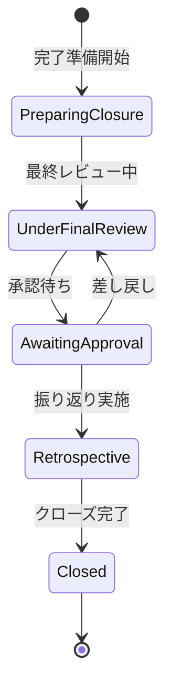

# ビジネスオペレーション: プロジェクトを完了し評価する

**バージョン**: 1.0.0
**更新日**: 2024-12-30

## 概要

**目的**: プロジェクトの成果物を確定し、目標達成度を評価し、教訓を抽出する

**パターン**: Workflow + Analytics

**ゴール**: 成果物が承認され、プロジェクトが正式に完了し、教訓が次に活かされる

## 関係者とロール

- **PM**: 完了報告作成、振り返り実施
- **エグゼクティブ**: 最終承認、評価
- **全チームメンバー**: 振り返り参加、教訓提供
- **クライアント**: 成果物承認、満足度評価

## プロセスフロー

> **重要**: プロセスフローは必ず番号付きリスト形式で記述してください。
> Mermaid形式は使用せず、テキスト形式で記述することで、代替フローと例外フローが視覚的に分離されたフローチャートが自動生成されます。

1. システムが成果物確定を処理する
2. システムが最終レビューを処理する
3. システムがクライアント承認を行う
4. システムが振り返り実施を処理する
5. システムが教訓文書化を処理する
6. システムがプロジェクトクローズを処理する

## 代替フロー

### 代替フロー1: 情報不備
- 2-1. システムが情報の不備を検知する
- 2-2. システムが修正要求を送信する
- 2-3. ユーザーが情報を修正し再実行する
- 2-4. 基本フロー2に戻る

## 例外処理

### 例外1: システムエラー
- システムエラーが発生した場合
- エラーメッセージを表示する
- 管理者に通知し、ログに記録する

### 例外2: 承認却下
- 承認が却下された場合
- 却下理由をユーザーに通知する
- 修正後の再実行を促す

## ビジネス状態

## KPI

- **目標達成率**: 90%以上の目標が達成される
- **クライアント満足度**: 4.0/5.0以上
- **教訓文書化率**: 100%（すべてのプロジェクトで実施）
- **成果物承認率**: 一度の提出で80%以上が承認される
- **振り返り参加率**: チームメンバーの90%以上が参加

## ビジネスルール

- すべての成果物がクライアントに承認されるまでプロジェクトはクローズできない
- 振り返り会議は全メンバー参加を原則とする
- 教訓は3つのカテゴリ（Keep, Problem, Try）で整理すること
- プロジェクトクローズ後1週間以内に教訓を知識ベースに登録
- クライアント満足度調査は必須とする
- プロジェクト完了報告書は経営層に提出すること

## 入出力仕様

### 入力

- **成果物一覧**: プロジェクトで作成されたすべての成果物
- **プロジェクト実績**: 工数、コスト、スケジュールの実績値
- **課題・リスク履歴**: プロジェクト期間中に発生した問題
- **KPI実績**: 計画時に設定したKPIの実績値

### 出力

- **プロジェクト完了報告書**: 実績サマリー、目標達成度評価
- **教訓文書**: Keep/Problem/Tryのフレームワークでの学び
- **クライアント満足度調査結果**: 評価スコアとコメント
- **ベストプラクティス**: 他プロジェクトへの適用可能な知見
- **プロジェクトクローズ承認書**: 正式なクローズ承認文書

## 例外処理

- **承認遅延**: 承認期限の再設定、追加説明会の実施
- **成果物不備**: 不備内容の特定と修正計画の策定
- **クライアント不満**: 追加対応計画の策定、無償サポート期間の設定
- **教訓抽出不十分**: 追加の振り返りセッションの実施
- **リソース早期解放**: クローズ前のリソース確保、外部支援の検討

## 派生ユースケース

このビジネスオペレーションから以下のユースケースが派生します：

1. 最終成果物を確定する
2. プロジェクト完了報告を作成する
3. プロジェクト振り返りを実施する
4. 教訓を文書化する