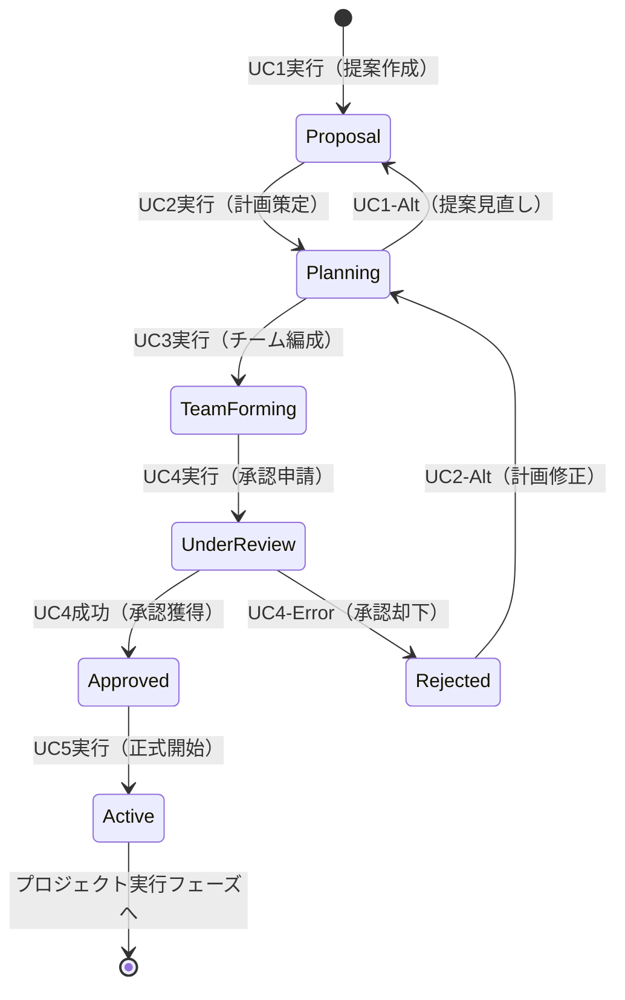

# ビジネスオペレーション: プロジェクトを成功裏に立ち上げ持続的価値を実現する

**バージョン**: 2.0.0
**更新日**: 2025-10-09
**設計方針**: ユースケース・ページ分解指向 + パラソルドメイン言語連携

## 📋 概要
**目的**: クライアントのビジネス価値創出に向け、戦略的プロジェクトを成功軌道に乗せて持続的な成果を実現する
**パターン**: Workflow + Strategic Planning
**ゴール**: 承認されたプロジェクトが確実な成功軌道で開始され、継続的な価値創造を実現する

## 🎭 関係者とロール
- **エグゼクティブ**: 戦略承認・予算承認・ビジネス価値判定・組織整合性確認
- **PM**: プロジェクト計画策定・チーム編成・リスク管理・実行可能性確保
- **コンサルタント**: 戦略分析・計画支援・実行可能性評価・ベストプラクティス適用
- **クライアント**: ビジネス要件定義・成果期待設定・承認・協力体制確立
- **システム**: 計画整合性検証・リスク評価・スケジュール最適化・リソース調整

## 🏗️ パラソルドメイン連携

### サービス境界とユースケース連携

> **⚡ マイクロサービス設計の基本原則（ユースケース利用型）**
> - **自サービス管理**: 自エンティティの全CRUD + 自ユースケースの実装
> - **他サービス連携**: **他サービスの公開ユースケースを利用**（エンティティは意識しない）

#### 📦 自サービス管理（project-success-service）
**責務**: ✅ エンティティ管理 ✅ ユースケース実装 ✅ ビジネスロジック

```
Entity: Project - Aggregate Root
├── id: UUID - 一意識別子
├── code: STRING_20 - プロジェクトコード
├── name: STRING_100 - プロジェクト名
├── clientId: UUID - クライアント識別子
├── status: ENUM - ステータス（Planning/Active/OnHold/Completed）
├── priority: ENUM - 優先度（Critical/High/Medium/Low）
├── budget: MONEY - 予算
├── projectManagerId: UUID - プロジェクトマネージャーID
└── sponsorId: UUID - スポンサーID

Entity: Milestone - Project Aggregate Member
├── id: UUID - マイルストーンID
├── projectId: UUID - 所属プロジェクト
├── name: STRING_100 - マイルストーン名
├── targetDate: DATE - 目標日
└── isKeyMilestone: BOOLEAN - 重要マイルストーンフラグ

Entity: ProjectMember - Project Aggregate Member
├── id: UUID - 一意識別子
├── projectId: UUID - プロジェクトID
├── userId: UUID - ユーザーID
├── role: ENUM - 役割（PM/Leader/Member/Observer）
└── allocationRate: PERCENTAGE - アサイン率

Aggregate: ProjectAggregate
├── ルート: Project
├── 包含: Milestone（1対多）、ProjectMember（1対多）
└── 不変条件: 予算制約、期間制約、メンバー配分制約
```

#### 🔗 他サービスユースケース利用（ユースケース呼び出し型）
**責務**: ❌ エンティティ知識不要 ✅ ユースケース利用のみ

```
[secure-access-service] ユースケース利用:
├── UC-AUTH-01: ユーザー認証を実行する → POST /api/auth/authenticate
├── UC-AUTH-02: プロジェクト権限を検証する → POST /api/auth/validate-project-permission
└── UC-AUDIT-01: プロジェクト監査ログを記録する → POST /api/audit/project-events

[talent-optimization-service] ユースケース利用:
├── UC-RESOURCE-01: 最適なチームを編成する → POST /api/resource/optimize-team
├── UC-SKILL-01: スキルマッチングを実行する → POST /api/skills/match
└── UC-ALLOCATION-01: リソース配分を最適化する → POST /api/allocation/optimize

[collaboration-facilitation-service] ユースケース利用:
├── UC-NOTIFY-01: プロジェクト通知を配信する → POST /api/notifications/project-update
├── UC-COMMUNICATE-01: ステークホルダー連絡を実行する → POST /api/communication/stakeholder
└── UC-COLLABORATE-01: チームコラボレーションを促進する → POST /api/collaboration/enable

[knowledge-co-creation-service] ユースケース利用:
├── UC-KNOWLEDGE-01: プロジェクト知識を記録する → POST /api/knowledge/project-insights
└── UC-PRACTICE-01: ベストプラクティスを適用する → GET /api/best-practices/project-launch
```

**ユースケース連携パターン**:
- **機能利用**: `POST /api/{service}/usecases/{usecase-id}` - 他サービス機能実行
- **状況照会**: `GET /api/{service}/usecases/{usecase-id}/status` - 実行状況確認
- **結果取得**: `GET /api/{service}/usecases/{usecase-id}/result` - 処理結果取得

### マイクロサービス連携型ドメインサービス

#### 🎯 ビジネス価値重視のドメインサービス
```
DomainService: ProjectSuccessCoordinator（プロジェクト成功調整サービス）
├── establishSuccessTrajectory() - 成功軌道の確立
├── optimizeValueDelivery() - 価値提供の最適化（→ タレント最適化連携）
├── ensureStakeholderAlignment() - ステークホルダー整合性確保（→ コラボ促進連携）
└── maximizeBusinessImpact() - ビジネス影響の最大化

DomainService: ProjectPlanningCoordinator（プロジェクト計画調整サービス）
├── coordinateResourceAllocation() - リソース配分調整（→ タレント最適化連携）
├── validateTechnicalFeasibility() - 技術実現性検証（→ 知識共創連携）
├── optimizeScheduleConstraints() - スケジュール制約最適化
└── integrateRiskMitigation() - リスク軽減統合（→ リスク管理連携）
```

## 🔄 プロセスフロー（ユースケース分解指向）

> **重要**: 各ステップは「誰が何をするか」を明記し、ユースケース分解の根拠とする

### 基本フロー
1. **PMがプロジェクト提案を作成** → **UC1: プロジェクト提案書を作成する**
   - **操作エンティティ**: Project（新規作成）
   - **必要ページ**: プロジェクト提案作成フォーム - ビジネス価値・目的・スコープ定義

2. **システムが実行可能性を検証** → **内部処理（ページなし）**
   - **ドメインサービス**: ProjectPlanningCoordinator.validateTechnicalFeasibility()

3. **PMがプロジェクト計画を策定** → **UC2: 包括的プロジェクト計画を策定する**
   - **操作エンティティ**: Project（詳細更新）, Milestone（作成）
   - **必要ページ**: プロジェクト計画策定ページ - スケジュール・予算・マイルストーン設定

4. **システムがリソース最適化を実行** → **内部処理（ページなし）**
   - **ドメインサービス**: ProjectPlanningCoordinator.coordinateResourceAllocation()

5. **PMがプロジェクトチームを編成** → **UC3: 最適なプロジェクトチームを編成する**
   - **操作エンティティ**: ProjectMember（作成）
   - **必要ページ**: チーム編成ページ - メンバー選定・役割定義・スキルマッチング

6. **エグゼクティブがプロジェクト承認を実行** → **UC4: プロジェクト承認を獲得する**
   - **操作エンティティ**: Project（承認ステータス更新）
   - **必要ページ**: プロジェクト承認ページ - 計画レビュー・予算承認・GO/NO-GO判定

7. **システムがプロジェクト開始を確立** → **内部処理（ページなし）**
   - **ドメインサービス**: ProjectSuccessCoordinator.establishSuccessTrajectory()

8. **PMがプロジェクト開始を実行** → **UC5: プロジェクト開始を正式実行する**
   - **操作エンティティ**: Project（Active状態へ遷移）
   - **必要ページ**: プロジェクト開始ページ - キックオフ・初期タスク設定・コミュニケーション開始

### ユースケース分解原則
- **ユーザー操作ステップ** → ユースケース + ページ
- **システム内部処理** → ドメインサービス（ページなし）
- **1ユースケース = 1つの明確な目的 = 1つのページ**

## 📄 ユースケース・ページ設計マトリックス

| UC# | ユースケース名 | 対応ページ | エンティティ | アクター | 設計方針 |
|-----|---------------|-----------|-------------|----------|----------|
| UC1 | プロジェクト提案書を作成する | プロジェクト提案作成フォーム | Project（新規） | PM | 入力重視・価値定義 |
| UC2 | 包括的プロジェクト計画を策定する | プロジェクト計画策定ページ | Project, Milestone | PM | 入力重視・計画最適化 |
| UC3 | 最適なプロジェクトチームを編成する | チーム編成ページ | ProjectMember | PM | 操作重視・スキルマッチング |
| UC4 | プロジェクト承認を獲得する | プロジェクト承認ページ | Project（承認） | エグゼクティブ | 表示重視・判定支援 |
| UC5 | プロジェクト開始を正式実行する | プロジェクト開始ページ | Project（開始） | PM | 操作重視・開始確認 |

## 🔀 代替フロー（ユースケース分岐指向）

### 代替フロー1: 計画修正による再策定
- **分岐元**: 基本フロー ステップ4
- **条件**: リソース制約または実現困難性を検知
- **代替ユースケース**: UC2-Alt: プロジェクト計画を修正し再策定する
  - **必要ページ**: 計画修正ページ - 制約分析・代替案検討・調整実行
  - **操作エンティティ**: Project（計画更新）, Milestone（調整）

### 代替フロー2: 段階的承認プロセス
- **分岐元**: 基本フロー ステップ6
- **条件**: 大規模予算または高リスクプロジェクト
- **代替ユースケース**: UC4-Alt: 段階的承認を実行する
  - **必要ページ**: 段階承認ページ - フェーズ別承認・条件付き承認・段階実行計画
  - **操作エンティティ**: Project（段階承認状態）

## ⚠️ 例外フロー（エラーページ設計指向）

### 例外1: 承認却下による計画見直し
- **発生ステップ**: ステップ6（承認実行）
- **エラーユースケース**: UC4-Error: 承認却下を処理し計画改善する
  - **必要ページ**: 承認却下対応ページ - 却下理由分析・改善計画・再申請準備
  - **表示情報**: 却下理由詳細、改善要求項目、再申請ガイド

### 例外2: リソース不足による代替案検討
- **発生ステップ**: ステップ5（チーム編成）
- **エラーユースケース**: UC3-Error: リソース不足を解決し代替編成する
  - **必要ページ**: リソース不足対応ページ - 不足分析・外部調達・スケジュール調整
  - **表示情報**: 不足リソース詳細、調達オプション、影響分析

## 📊 ビジネス状態（エンティティライフサイクル）



**状態とエンティティの対応**:
- **Proposal**: Project.status = "Planning", Project.budget = null
- **Planning**: Project.budget = set, Milestone.count > 0
- **TeamForming**: ProjectMember.count > 0, ProjectMember.allocationRate = set
- **Approved**: Project.status = "Approved", Project.sponsorId = set
- **Active**: Project.status = "Active", Project.startDate = now()

## 📏 KPI（ユースケース別成功指標）

| ユースケース | KPI | 目標値 | 測定方法 |
|-------------|-----|--------|----------|
| UC1 | 提案書品質スコア | 80点以上 | ビジネス価値・実現性・ROIの評価 |
| UC2 | 計画精度 | 予算・スケジュール誤差10%以内 | 計画値vs実績値の偏差分析 |
| UC3 | チーム編成適合率 | 90%以上 | スキルマッチング度・稼働率適合性 |
| UC4 | 承認率 | 85%以上 | 承認/却下の比率 |
| UC5 | 開始成功率 | 95%以上 | 計画通りの開始実行率 |

## 📜 ビジネスルール（ドメイン制約）

### エンティティ制約
- **Project**: プロジェクトコード組織内一意 → ProjectSuccessCoordinator.validateUniqueness()
- **ProjectMember**: アサイン率合計100%以下 → ProjectPlanningCoordinator.validateAllocation()

### ユースケース制約
- **UC1**: 提案は必ずビジネス価値とROIを含む → ページバリデーションで実装
- **UC4**: 100万円以上は経営会議承認必須 → ページバリデーションで実装

## 🔗 入出力仕様（API・ページ連携）

### ユースケース別入出力

#### UC1: プロジェクト提案書を作成する
**入力（ページ → API）**:
```json
{
  "proposalData": {
    "name": "string - プロジェクト名",
    "businessObjective": "string - ビジネス目的",
    "expectedValue": "string - 期待価値",
    "clientId": "UUID - クライアントID",
    "estimatedBudget": "number - 概算予算",
    "estimatedDuration": "string - 概算期間",
    "strategicAlignment": "string - 戦略整合性"
  }
}
```

**出力（API → ページ）**:
```json
{
  "result": "success/error",
  "projectId": "UUID - プロジェクトID",
  "proposalScore": "number - 提案評価スコア",
  "nextAction": "UC2実行可能（計画策定） | 提案修正要求"
}
```

#### UC4: プロジェクト承認を獲得する
**入力（ページ → API）**:
```json
{
  "approvalRequest": {
    "projectId": "UUID - プロジェクトID",
    "approvalLevel": "string - 承認レベル",
    "businessJustification": "string - ビジネス正当性",
    "riskAssessment": "string - リスク評価",
    "roiProjection": "number - ROI予測"
  }
}
```

**出力（API → ページ）**:
```json
{
  "result": "approved/rejected/pending",
  "approvalId": "UUID - 承認ID",
  "decision": "string - 承認判定理由",
  "nextAction": "UC5実行可能（プロジェクト開始） | 計画修正要求 | 追加承認要求"
}
```

## 🚀 実装指針

### 推奨実装順序
1. **パラソルドメイン言語定義** - Project、Milestone、ProjectMember集約
2. **ドメインサービス実装** - ProjectSuccessCoordinator、ProjectPlanningCoordinator
3. **ユースケース・ページのペア実装** - UC1→UC2→UC3→UC4→UC5の順序で段階的に
4. **統合テスト** - プロジェクト立ち上げ全体の検証

### 品質チェックポイント
- [ ] 各ユースケースに対応するページが1対1で存在する
- [ ] パラソルドメイン言語エンティティが正しく操作される
- [ ] ビジネス状態遷移がエンティティ状態と一致する
- [ ] 代替・例外フローにも適切なページが用意される
- [ ] 他サービス連携が適切にユースケース経由で実装される
- [ ] ビジネス価値創出の軌道が確立される

---
*このテンプレートは、ユースケース・ページ分解とパラソルドメイン言語連携を強化したビジネスオペレーション設計指針v2.0に基づいています*