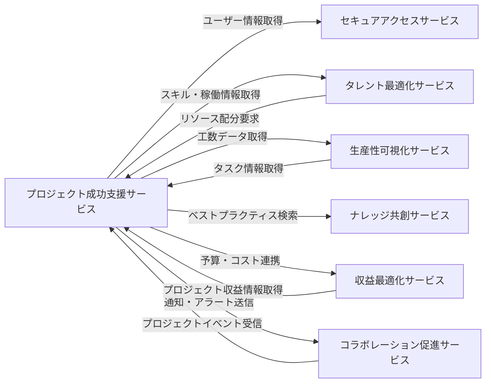

# 統合仕様: プロジェクト成功支援サービス

## 統合概要
**目的**: プロジェクト成功支援サービスが他のサービスと連携し、プロジェクト管理に必要な情報を統合的に提供する
**統合パターン**: REST API、イベント駆動、共有データベース参照
**データ形式**: JSON

## サービス間連携マップ



## 依存サービスとの統合

### 1. セキュアアクセスサービス統合

#### 1.1 ユーザー情報取得
**目的**: プロジェクトメンバーのユーザー情報を取得

**エンドポイント**: `GET /api/v1/secure-access/users/{userId}`

**リクエスト例**:
```http
GET /api/v1/secure-access/users/uuid-1234
Authorization: Bearer {jwt_token}
```

**レスポンス例**:
```json
{
  "success": true,
  "data": {
    "id": "uuid-1234",
    "email": "pm@example.com",
    "name": "山田太郎",
    "role": "PM",
    "organizationId": "uuid-org",
    "isActive": true
  }
}
```

**使用ケース**:
- プロジェクトメンバーアサイン時のユーザー検証
- タスク担当者情報の表示
- 通知送信先の決定

#### 1.2 組織情報取得
**目的**: クライアント組織の情報を取得

**エンドポイント**: `GET /api/v1/secure-access/organizations/{organizationId}`

**使用ケース**:
- プロジェクト作成時のクライアント情報表示
- 組織別プロジェクト一覧の取得

#### 1.3 権限チェック
**目的**: ユーザーのプロジェクトアクセス権限を確認

**エンドポイント**: `POST /api/v1/secure-access/authorize`

**リクエスト例**:
```json
{
  "userId": "uuid-1234",
  "resource": "project",
  "resourceId": "uuid-project",
  "action": "read"
}
```

**レスポンス例**:
```json
{
  "success": true,
  "data": {
    "authorized": true,
    "reason": "User is project member with PM role"
  }
}
```

### 2. タレント最適化サービス統合

#### 2.1 スキル情報取得
**目的**: メンバーのスキル情報を取得してタスクアサインに活用

**エンドポイント**: `GET /api/v1/talent-optimization/users/{userId}/skills`

**レスポンス例**:
```json
{
  "success": true,
  "data": {
    "userId": "uuid-1234",
    "skills": [
      {
        "skillId": "uuid-skill-1",
        "skillName": "プロジェクト管理",
        "level": "Expert",
        "yearsOfExperience": 5,
        "certifications": ["PMP"]
      },
      {
        "skillId": "uuid-skill-2",
        "skillName": "Java",
        "level": "Advanced",
        "yearsOfExperience": 8
      }
    ]
  }
}
```

**使用ケース**:
- タスクへの最適な担当者の自動提案
- プロジェクトチーム編成の最適化
- スキルギャップの特定

#### 2.2 稼働状況取得
**目的**: メンバーの現在の稼働状況を取得してアサイン可能性を判断

**エンドポイント**: `GET /api/v1/talent-optimization/users/{userId}/utilization`

**パラメータ**:
- `startDate`: 開始日
- `endDate`: 終了日

**レスポンス例**:
```json
{
  "success": true,
  "data": {
    "userId": "uuid-1234",
    "period": {
      "startDate": "2024-01-01",
      "endDate": "2024-01-31"
    },
    "utilizationRate": 85,
    "allocatedHours": 136,
    "availableHours": 24,
    "projects": [
      {
        "projectId": "uuid-project-1",
        "allocationRate": 50,
        "hours": 80
      },
      {
        "projectId": "uuid-project-2",
        "allocationRate": 35,
        "hours": 56
      }
    ]
  }
}
```

**使用ケース**:
- 過剰配分の防止
- リソース配分の最適化
- プロジェクト計画時の要員確保

#### 2.3 リソース配分要求
**目的**: プロジェクトに必要なリソースの配分を要求

**エンドポイント**: `POST /api/v1/talent-optimization/resource-allocations`

**リクエスト例**:
```json
{
  "projectId": "uuid-project",
  "requiredSkills": ["Java", "React", "プロジェクト管理"],
  "startDate": "2024-02-01",
  "endDate": "2024-06-30",
  "requiredMembers": 5,
  "allocationRates": [100, 80, 80, 50, 50]
}
```

### 3. 生産性可視化サービス統合

#### 3.1 工数データ取得
**目的**: タスクの実績工数データを取得

**エンドポイント**: `GET /api/v1/productivity-visualization/timesheets`

**パラメータ**:
- `projectId`: プロジェクトID
- `taskId`: タスクID（オプション）
- `startDate`: 開始日
- `endDate`: 終了日

**レスポンス例**:
```json
{
  "success": true,
  "data": {
    "timesheets": [
      {
        "id": "uuid-timesheet-1",
        "userId": "uuid-user-1",
        "projectId": "uuid-project",
        "taskId": "uuid-task-1",
        "date": "2024-01-15",
        "hours": 8,
        "description": "要件定義作業",
        "status": "Approved"
      }
    ],
    "summary": {
      "totalHours": 240,
      "approvedHours": 200,
      "pendingHours": 40
    }
  }
}
```

**使用ケース**:
- タスクの実績工数更新
- プロジェクトコストの計算
- 進捗率の精緻化

#### 3.2 工数データ送信
**目的**: タスク完了時に工数データを生産性可視化サービスへ送信

**エンドポイント**: `POST /api/v1/productivity-visualization/timesheets`

**リクエスト例**:
```json
{
  "userId": "uuid-user-1",
  "projectId": "uuid-project",
  "taskId": "uuid-task-1",
  "date": "2024-01-15",
  "hours": 8,
  "description": "要件定義完了",
  "category": "Development"
}
```

### 4. ナレッジ共創サービス統合

#### 4.1 ベストプラクティス検索
**目的**: 類似プロジェクトのベストプラクティスを検索

**エンドポイント**: `GET /api/v1/knowledge-co-creation/articles/search`

**パラメータ**:
- `keywords`: キーワード（プロジェクト名、技術、業種等）
- `category`: カテゴリ
- `tags`: タグ

**レスポンス例**:
```json
{
  "success": true,
  "data": {
    "articles": [
      {
        "id": "uuid-article-1",
        "title": "DXプロジェクトでのアジャイル適用事例",
        "summary": "製造業DXプロジェクトでのスクラム適用成功事例",
        "author": "uuid-user-expert",
        "tags": ["DX", "Agile", "Scrum", "製造業"],
        "relevanceScore": 0.92,
        "createdAt": "2023-12-01T00:00:00Z"
      }
    ]
  }
}
```

**使用ケース**:
- プロジェクト計画時の参考情報収集
- リスク軽減策の立案
- 過去の失敗事例の学習

#### 4.2 プロジェクト完了時のナレッジ登録
**目的**: プロジェクト完了時に得られた知見を登録

**エンドポイント**: `POST /api/v1/knowledge-co-creation/articles`

**リクエスト例**:
```json
{
  "title": "DX001プロジェクトの成功要因",
  "content": "ステークホルダーとの密なコミュニケーションが成功の鍵...",
  "category": "Project Management",
  "tags": ["DX", "成功事例", "コミュニケーション"],
  "relatedProjectId": "uuid-project",
  "visibility": "Organization"
}
```

### 5. 収益最適化サービス統合

#### 5.1 プロジェクト予算・コスト連携
**目的**: プロジェクトの予算とコストデータを連携

**エンドポイント**: `POST /api/v1/revenue-optimization/project-costs`

**リクエスト例**:
```json
{
  "projectId": "uuid-project",
  "budget": 50000000,
  "actualCost": 25000000,
  "forecastCost": 48000000,
  "period": {
    "startDate": "2024-01-01",
    "endDate": "2024-12-31"
  },
  "costBreakdown": [
    {"category": "Labor", "amount": 20000000},
    {"category": "Infrastructure", "amount": 3000000},
    {"category": "License", "amount": 2000000}
  ]
}
```

**使用ケース**:
- 予算超過アラートの受信
- コスト最適化提案の取得
- 収益性分析

#### 5.2 収益予測取得
**目的**: プロジェクトの収益予測を取得

**エンドポイント**: `GET /api/v1/revenue-optimization/projects/{projectId}/revenue-forecast`

**レスポンス例**:
```json
{
  "success": true,
  "data": {
    "projectId": "uuid-project",
    "contractRevenue": 60000000,
    "recognizedRevenue": 30000000,
    "forecastRevenue": 58000000,
    "profitMargin": 16.7,
    "risks": [
      {
        "type": "Scope Creep",
        "impact": -2000000,
        "probability": 0.3
      }
    ]
  }
}
```

### 6. コラボレーション促進サービス統合

#### 6.1 通知送信
**目的**: プロジェクトイベント発生時に関係者へ通知

**エンドポイント**: `POST /api/v1/collaboration-promotion/notifications`

**リクエスト例**:
```json
{
  "type": "TaskOverdue",
  "title": "タスク期限超過アラート",
  "message": "タスク「要件定義」が期限を超過しています",
  "recipients": ["uuid-user-1", "uuid-user-2"],
  "priority": "High",
  "relatedResource": {
    "type": "Task",
    "id": "uuid-task-1"
  },
  "actions": [
    {
      "label": "タスクを確認",
      "url": "/projects/uuid-project/tasks/uuid-task-1"
    }
  ]
}
```

**使用ケース**:
- タスク期限超過通知
- マイルストーン達成通知
- リスク特定アラート
- 成果物承認依頼

#### 6.2 プロジェクトディスカッション連携
**目的**: プロジェクト関連のディスカッションを管理

**エンドポイント**: `POST /api/v1/collaboration-promotion/discussions`

**リクエスト例**:
```json
{
  "projectId": "uuid-project",
  "title": "要件定義レビュー",
  "content": "要件定義書のレビューをお願いします",
  "participants": ["uuid-user-1", "uuid-user-2", "uuid-user-3"],
  "attachments": ["uuid-deliverable-1"]
}
```

## イベント駆動統合

### 発行イベント

プロジェクト成功支援サービスが発行するドメインイベント:

#### ProjectCreated
**発生条件**: 新規プロジェクト作成時
**サブスクライバー**: タレント最適化、収益最適化、コラボレーション促進

**ペイロード**:
```json
{
  "eventId": "uuid-event",
  "eventType": "ProjectCreated",
  "occurredAt": "2024-01-01T00:00:00Z",
  "data": {
    "projectId": "uuid-project",
    "projectCode": "DX001",
    "projectName": "デジタルトランスフォーメーション推進",
    "clientId": "uuid-client",
    "projectManagerId": "uuid-pm",
    "startDate": "2024-01-01",
    "endDate": "2024-12-31",
    "budget": 50000000
  }
}
```

#### TaskCompleted
**発生条件**: タスク完了時
**サブスクライバー**: 生産性可視化、ナレッジ共創、コラボレーション促進

**ペイロード**:
```json
{
  "eventId": "uuid-event",
  "eventType": "TaskCompleted",
  "occurredAt": "2024-01-15T10:30:00Z",
  "data": {
    "taskId": "uuid-task",
    "projectId": "uuid-project",
    "taskName": "要件定義",
    "completedBy": "uuid-user",
    "actualHours": 80,
    "estimatedHours": 80,
    "completedDate": "2024-01-15"
  }
}
```

#### MilestoneAchieved
**発生条件**: マイルストーン達成時
**サブスクライバー**: 収益最適化、コラボレーション促進、ナレッジ共創

#### RiskIdentified
**発生条件**: 新規リスク特定時
**サブスクライバー**: コラボレーション促進、タレント最適化

#### ProjectStatusChanged
**発生条件**: プロジェクトステータス変更時
**サブスクライバー**: 全サービス

### サブスクライブイベント

プロジェクト成功支援サービスがサブスクライブするイベント:

#### UserSkillUpdated（タレント最適化サービス）
**用途**: メンバーのスキル情報更新時にタスク推奨担当者を再計算

#### TimesheetApproved（生産性可視化サービス）
**用途**: 承認済み工数データをタスク実績工数に反映

#### BudgetAlertTriggered（収益最適化サービス）
**用途**: 予算超過アラートを受信してプロジェクトステータス更新

## データ同期戦略

### 参照データの同期

#### ユーザー情報キャッシュ
**方式**: イベント駆動 + 定期同期
**更新頻度**: リアルタイム（イベント）+ 日次バッチ
**キャッシュ期間**: 24時間

```json
{
  "userId": "uuid-user",
  "name": "山田太郎",
  "email": "yamada@example.com",
  "role": "Consultant",
  "cachedAt": "2024-01-01T00:00:00Z"
}
```

#### スキル情報キャッシュ
**方式**: オンデマンド取得 + キャッシュ
**更新頻度**: スキル更新イベント受信時
**キャッシュ期間**: 7日間

### 整合性担保

#### 最終的整合性
- イベント再送機構（3回まで）
- Dead Letter Queueでの失敗イベント管理
- 定期的な整合性チェックバッチ

#### トランザクション境界
- プロジェクト集約内はACID保証
- サービス間はSagaパターンで補償トランザクション

## エラーハンドリング

### 外部サービス呼び出しエラー

#### リトライポリシー
```json
{
  "maxRetries": 3,
  "retryIntervals": [1000, 3000, 10000],
  "retryableErrors": [500, 502, 503, 504],
  "timeoutMs": 5000
}
```

#### サーキットブレーカー
```json
{
  "failureThreshold": 5,
  "successThreshold": 2,
  "timeout": 60000,
  "halfOpenRequests": 3
}
```

#### フォールバック戦略
- ユーザー情報: キャッシュデータを使用
- スキル情報: デフォルトスキルレベルを仮定
- 稼働情報: 過去の平均値を使用

## セキュリティ

### サービス間認証
- **方式**: JWT（Service-to-Service Token）
- **有効期間**: 1時間
- **更新**: 30分前に自動更新

### データ暗号化
- **通信**: TLS 1.3
- **機密データ**: AES-256で暗号化

### APIレート制限
```json
{
  "service": "project-success",
  "limits": {
    "secure-access": {"requests": 1000, "period": "1h"},
    "talent-optimization": {"requests": 500, "period": "1h"},
    "productivity-visualization": {"requests": 2000, "period": "1h"}
  }
}
```

## モニタリング

### メトリクス
- 外部API呼び出し成功率
- 平均レスポンス時間
- イベント配信成功率
- キャッシュヒット率

### アラート条件
- 外部API成功率 < 95%
- 平均レスポンス時間 > 1秒
- イベント配信失敗 > 10件/時間
