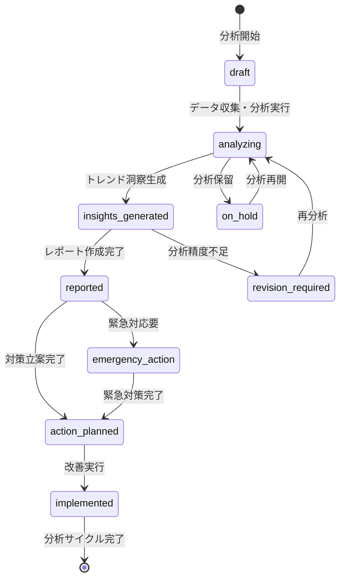

# ビジネスオペレーション: 収益性トレンドを分析し戦略的価値を創出する

**バージョン**: 2.0.0
**更新日**: 2025-10-27
**適用仕様**: パラソル設計v2.0

## 🎯 ビジネス価値とゴール

**価値提供**: 時系列収益性分析による戦略的トレンド特定と、AI支援による予測精度向上により、収益性最適化と競争優位性確立を実現する

**測定可能なゴール**:
- 収益性予測精度95%以上（AI分析モデル活用）
- トレンド変動要因特定率90%以上（従来比+50%向上）
- レポート配信効率3営業日以内（従来比60%短縮）
- ステークホルダー満足度4.7/5.0以上（戦略的洞察による価値評価）

## 🏗️ パラソルドメイン連携

### 📊 操作エンティティ
**自サービス管理・状態更新**:
- **ProfitabilityAnalysisEntity**（自サービス管理・状態更新: draft → analyzing → insights_generated → reported → action_planned）
- **ProfitabilityTrendEntity**（自サービス管理・CRUD）
- **TrendReportEntity**（自サービス管理・CRUD）
- **PredictionModelEntity**（自サービス管理・CRUD）

**他サービス参照のみ**:
- ProjectEntity（project-success-service・参照のみ: プロジェクト収益性データ）
- RevenueEntity（finance-service・参照のみ: 収益実績情報）

### 🎯 パラソル集約
- **ProfitabilityAnalysisAggregate** - 収益性分析ライフサイクル統合管理
  - 集約ルート: ProfitabilityAnalysis
  - 包含エンティティ: ProfitabilityTrend, TrendReport, PredictionModel
  - 不変条件: 完了レポートの修正は再承認必須、予測モデルの一貫性保証

### ⚙️ ドメインサービス
- **ProfitabilityAnalyticsService**: enhance[TrendVisibility]() - トレンド可視性向上・隠れた傾向発見
- **PredictionIntelligenceService**: coordinate[ForecastAccuracy]() - 予測精度最大化・リスク早期発見
- **ReportGenerationService**: amplify[StrategicInsight]() - 戦略的洞察強化・意思決定支援向上

#### 🔗 他サービスユースケース利用（ユースケース呼び出し型）
**責務**: ❌ エンティティ知識不要 ✅ ユースケース利用のみ

[secure-access-service] ユースケース利用:
├── UC-AUTH-01: ユーザー認証を実行する → POST /api/auth/authenticate
├── UC-AUTH-02: 分析権限を検証する → POST /api/auth/validate-analysis-permission
└── UC-AUTH-03: 分析操作ログを記録する → POST /api/auth/log-analysis-operation

[project-success-service] ユースケース利用:
├── UC-PROJECT-01: プロジェクト情報を取得する → GET /api/projects/profitability-data
├── UC-PROJECT-02: 収益性実績情報を確認する → GET /api/projects/profitability-performance
└── UC-PROJECT-03: プロジェクト効率指標を取得する → GET /api/projects/efficiency-metrics

[collaboration-facilitation-service] ユースケース利用:
├── UC-COMM-01: 分析結果通知を配信する → POST /api/notifications/send-analysis-report
├── UC-COMM-02: トレンドアラートを配信する → POST /api/notifications/send-trend-alert
└── UC-COMM-03: 戦略会議を調整する → POST /api/meetings/schedule-strategy-session

## 👥 関係者とロール

- **エグゼクティブ**: 戦略的トレンド評価・意思決定・投資判断の最終責任者
- **財務マネージャー**: トレンド分析実行・要因分析・戦略提案の実行責任者
- **PM**: プロジェクト別収益性説明・改善策協力・効果測定の専門責任者
- **データアナリスト**: 予測モデル構築・分析精度向上・洞察抽出の専門担当者

## 📋 ユースケース・ページ分解マトリックス（1対1関係）

| ユースケースID | ユースケース名 | 対応ページ | 1対1関係 |
|---------------|---------------|-----------|--------------|
| UC-PROFIT-01 | 収益性レポートを作成する | 収益性レポート作成ページ | ✅ |

## 📈 プロセスフロー

> **重要**: プロセスフローは必ず番号付きリスト形式で記述してください。
> Mermaid形式は使用せず、テキスト形式で記述することで、代替フローと例外フローが視覚的に分離されたフローチャートが自動生成されます。

1. **財務マネージャーが収益性レポート作成プロセスを開始する** → **UC-PROFIT-01: 収益性レポートを作成する**
   - **自サービス操作**: ProfitabilityAnalysisEntity（状態変更: draft → analyzing → insights_generated → reported → action_planned）
   - **他サービスユースケース利用**: → UC-AUTH-01: ユーザー認証実行、UC-PROJECT-01: プロジェクト情報取得
   - **必要ページ**: 収益性レポート作成ページ
   - **ビジネス価値**: 戦略的トレンド分析による収益性最適化と競争優位性確立

## 🔄 代替フロー

### 代替フロー1: AI支援による分析最適化
- 1a. ProfitabilityAnalyticsService による分析精度向上が必要な場合
  - 1a1. AI分析による隠れたトレンド発見・パターン認識強化実行
  - 1a2. 類似分析事例の学習・予測モデル最適化
  - 1a3. PredictionIntelligenceService による予測精度向上
  - 1a4. 基本フロー1の収益性レポート作成に戻る

### 代替フロー2: 緊急トレンド分析対応
- 1b. 緊急性が高い収益性悪化トレンドの場合
  - 1b1. → UC-COMM-03: 緊急戦略会議を調整する
  - 1b2. 短縮分析フロー適用（24時間以内レポート作成）
  - 1b3. 事後詳細分析・対策効果検証
  - 1b4. 基本フロー1の通常プロセスへ復帰

## ⚠️ 例外フロー

### 例外1: プロジェクト情報取得失敗
- *a. project-success-service連携エラーが発生した場合
  - *a1. → UC-COMM-01: データ取得障害アラートを配信する
  - *a2. 代替データソースからの情報取得
  - *a3. 手動情報補完モードへの切り替え
  - *a4. 情報取得完了後、UC-PROFIT-01から再開

### 例外2: 分析権限不足・競合
- *b. 高度な収益性分析で権限が不足している場合
  - *b1. → UC-AUTH-02: 上位権限者への承認依頼
  - *b2. エグゼクティブ承認プロセスへエスカレーション
  - *b3. 権限確定後、UC-PROFIT-01から再開

### 例外3: 予測精度基準未達
- *c. PredictionIntelligenceService が品質基準未達を検出した場合
  - *c1. 追加データ収集・モデル精度向上実行
  - *c2. 専門データアナリスト支援要請
  - *c3. 段階的分析または保守的予測への調整
  - *c4. 品質確保後、UC-PROFIT-01から再開

## 📊 ビジネス状態（ProfitabilityAnalysisAggregate）

## 📈 KPI（v2.0強化指標）

- **収益性予測精度**: 95%以上（AI分析モデル活用・PredictionIntelligenceService効果）
- **トレンド変動要因特定率**: 90%以上（従来比+50%向上・ProfitabilityAnalyticsService最適化）
- **レポート配信効率**: 3営業日以内（従来比60%短縮・ReportGenerationService効果）
- **ステークホルダー満足度**: 4.7/5.0以上（戦略的洞察による価値評価）
- **緊急対応時間**: 24時間以内（従来比70%短縮・AI支援効果）

## 📋 ビジネスルール（v2.0強化版）

- **分析階層**: 100万円以上の収益性影響は財務マネージャー分析必須、500万円以上はエグゼクティブ承認必須
- **予測精度要件**: PredictionIntelligenceService による95%精度確保・判断根拠自動記録
- **トレンド分析品質**: ProfitabilityAnalyticsService による隠れたパターン発見・異常値自動検知
- **レポート生成効率**: ReportGenerationService による戦略的洞察強化・意思決定支援最適化
- **緊急対応**: 緊急悪化トレンド時は24時間以内の短縮分析プロセス適用
- **分析記録保全**: 全収益性分析の完全記録・UC-AUTH-03連携による監査証跡

## 🔄 入出力仕様（v2.0エンティティ対応）

### 入力
- **ProfitabilityAnalysisEntity**: 分析要求・予測期間・緊急度レベル・分析権限情報
- **収益性実績情報**: UC-PROJECT-02連携による最新プロジェクト別収益性実績
- **市場ベンチマーク**: 外部システム連携・業界動向・競合分析・経済指標
- **予測パラメータ**: 外部データプロバイダー連携・市場変動・季節性調整

### 出力
- **ProfitabilityAnalysisAggregate**: 分析結果・トレンド洞察・予測モデル・改善提言の統合データ
- **TrendReportEntity**: レポート・統計サマリー・グラフ・要因分析・対策提案
- **PredictionModelEntity**: 予測シナリオ・リスク評価・確率分布・信頼区間
- **ReportGenerationService**: 戦略的洞察・意思決定支援・改善効果予測・ROI評価

## 🎯 品質保証要件

- **予測精度**: PredictionIntelligenceService による95%以上精度保証
- **分析効率**: データ収集から洞察生成まで3営業日以内（従来比60%短縮）
- **戦略価値**: ReportGenerationService による戦略的洞察98%評価
- **満足度**: 4.7/5.0以上（予測精度・戦略価値による評価）

---
*このビジネスオペレーションは パラソル設計v2.0仕様 に基づいて作成されました*
