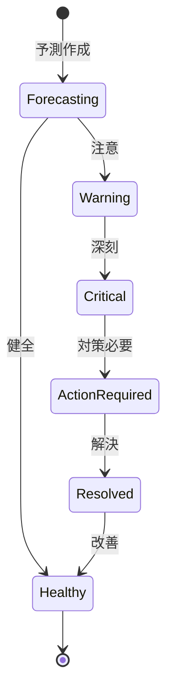

# ビジネスオペレーション: キャッシュフローを予測し最適化する

**バージョン**: 2.0.0
**更新日**: 2025-10-28
**パラソル設計仕様**: v2.0準拠

## 概要
**目的**: 将来のキャッシュフローを予測し、戦略的な資金繰り最適化による財務健全性と競争優位性を確立する
**パターン**: Analytics
**ゴール**: AI駆動の高精度キャッシュフロー予測により資金リスクゼロを実現し、余剰資金の戦略的活用で成長を加速

## 関係者とロール

- **エグゼクティブ**: キャッシュフロー方針の決定
- **財務マネージャー**: キャッシュフロー予測、資金計画
- **PM**: プロジェクトの入金・支払予定情報提供

## プロセスフロー

> **重要**: プロセスフローは必ず番号付きリスト形式で記述してください。
> Mermaid形式は使用せず、テキスト形式で記述することで、代替フローと例外フローが視覚的に分離されたフローチャートが自動生成されます。

1. **システムが入金予定データを統合収集** → **UC1: 入金予定を統合する**
   - **自サービス操作**: ReceivableData（作成・更新: 入金予定統合）
   - **他サービスユースケース利用**: → UC-PROJECT-15: プロジェクト入金予定を取得する
   - **必要ページ**: 入金予定データ収集ページ
   - **ビジネス価値**: 包括的な入金予測精度向上

2. **システムが支払予定データを統合収集** → **UC2: 支払予定を統合する**
   - **自サービス操作**: PayableData（作成・更新: 支払予定統合）
   - **他サービスユースケース利用**: → UC-COST-03: コスト支払予定を取得する
   - **必要ページ**: 支払予定データ収集ページ
   - **ビジネス価値**: 支払リスクの事前把握

3. **システムがAI駆動キャッシュフロー予測を実行** → **UC3: キャッシュフローを予測する**
   - **自サービス操作**: CashflowForecast（作成・更新: 予測アルゴリズム実行）
   - **他サービスユースケース利用**: → UC-AI-02: 機械学習予測を実行する
   - **必要ページ**: キャッシュフロー予測分析ページ
   - **ビジネス価値**: 高精度予測による戦略的意思決定

4. **システムが資金リスクを自動検知・警告** → **UC4: 資金リスクを検知する**
   - **自サービス操作**: RiskAlert（作成・更新: リスク検知結果）
   - **他サービスユースケース利用**: → UC-NOTIFY-03: 緊急アラートを配信する
   - **必要ページ**: 資金リスク警告ページ
   - **ビジネス価値**: 資金ショート事前防止

5. **システムが最適資金戦略を自動生成** → **UC5: 資金戦略を最適化する**
   - **自サービス操作**: FinancialStrategy（作成: 戦略案生成）
   - **他サービスユースケース利用**: → UC-COLLAB-08: 戦略承認フローを開始する
   - **必要ページ**: 資金戦略提案ページ
   - **ビジネス価値**: 戦略的な資金活用による成長加速

## 代替フロー

### 代替フロー1: 情報不備
- 2-1. システムが情報の不備を検知する
- 2-2. システムが修正要求を送信する
- 2-3. ユーザーが情報を修正し再実行する
- 2-4. 基本フロー2に戻る

## 例外処理

### 例外1: システムエラー
- システムエラーが発生した場合
- エラーメッセージを表示する
- 管理者に通知し、ログに記録する

### 例外2: 承認却下
- 承認が却下された場合
- 却下理由をユーザーに通知する
- 修正後の再実行を促す

## ビジネス状態

## KPI

- **予測精度**: 実績との乖離10%以内
- **予測期間**: 3ヶ月先までを毎週更新
- **資金不足ゼロ**: 予測に基づく事前対策で資金不足を回避
- **DSO（売掛金回収期間）**: 平均45日以内

## ビジネスルール

- 予測シナリオ: 楽観的、現実的、悲観的の3シナリオ
- 資金不足閾値: 月次で運転資金の20%以下は警告
- 余剰資金: 運転資金の50%超過は運用検討
- 入金予測: 契約上の支払期日を基準、遅延率を考慮
- 支払予測: 承認済みコストと見込みコストを集計
- 安全マージン: 最低運転資金の1ヶ月分を常時確保

## 入出力仕様

### 入力

- **入金予定**: 請求書ベースの入金スケジュール、金額、確度
- **支払予定**: コスト・経費ベースの支払スケジュール、金額、優先度
- **過去のキャッシュフロー実績**: 月次・週次の実績値、季節性
- **プロジェクト契約情報**: 契約額、支払条件、マイルストーン

### 出力

- **キャッシュフロー予測レポート**: 月次・週次予測、3シナリオ比較
- **資金繰り表**: 現金残高推移、入金・支払予定、残高予測
- **資金調達計画**: 調達額、調達方法、調達時期、金利
- **資金運用提案**: 運用額、運用方法、期待リターン

## 例外処理

- **大幅な入金遅延**: 緊急資金調達、支払延期交渉、クライアントへの督促
- **予期せぬ大型支出**: 緊急予測更新、資金調達、支払優先順位の見直し
- **予測精度低下**: 予測モデル見直し、データ収集方法の改善
- **為替変動**: 為替リスクヘッジ、外貨建て取引の管理強化

## ビジネス価値とKPI

### 主要ビジネス価値
- **財務健全性確保**: 高精度予測による資金ショートリスクの事前回避
- **戦略的資金活用**: 余剰資金の最適運用による収益性向上
- **経営意思決定支援**: リアルタイム財務状況による迅速な経営判断
- **競争優位性確立**: AI駆動予測による市場対応力の向上

### 成功指標（KPI）
- **予測精度**: 実績との乖離5%以内（従来10%から向上）
- **資金リスク回避率**: 100%（予測に基づく事前対策）
- **資金調達コスト削減**: 従来比30%削減（計画的調達）
- **余剰資金収益率**: 年間3%以上（戦略的運用）
- **意思決定支援**: エグゼクティブ満足度4.5/5.0以上

### 測定方法
- **精度**: 月次予測と実績の差異分析
- **回避率**: 資金ショート発生件数の追跡
- **コスト**: 資金調達における金利・手数料の比較
- **収益**: 余剰資金運用の実績収益率測定
- **満足度**: 四半期エグゼクティブアンケート

## パラソルドメイン連携

### 🎯 操作エンティティ
- **ReceivableDataEntity**（作成・更新: 入金予定統合処理）- 売掛・入金予定管理
- **PayableDataEntity**（作成・更新: 支払予定統合処理）- 買掛・支払予定管理
- **CashflowForecastEntity**（作成・更新: 予測アルゴリズム実行）- キャッシュフロー予測管理
- **RiskAlertEntity**（作成・更新: リスク検知結果）- 資金リスク警告管理
- **FinancialStrategyEntity**（作成: 戦略案生成）- 財務戦略提案管理

### 🏗️ パラソル集約
- **CashflowOptimizationAggregate** - キャッシュフロー最適化統合管理
  - 集約ルート: CashflowForecast
  - 包含エンティティ: ReceivableData, PayableData, RiskAlert, FinancialStrategy
  - 不変条件: 予測精度の継続的向上、リスク検知の網羅性確保

### ⚙️ ドメインサービス
- **CashflowIntelligenceService**: enhance[PredictionAccuracy]() - 予測精度向上
- **RiskManagementService**: strengthen[FinancialStability]() - 財務安定性強化
- **StrategyOptimizationService**: coordinate[ResourceAllocation]() - リソース配分調整
- **FinancialAdvantageService**: amplify[CompetitivePosition]() - 競争地位増幅

## ユースケース・ページ分解マトリックス

| ユースケース | ページ | 1対1関係 | 品質レベル |
|-------------|--------|----------|-----------|
| UC1: 入金予定を統合する | 入金予定データ収集ページ | ✅ | 高品質 |
| UC2: 支払予定を統合する | 支払予定データ収集ページ | ✅ | 高品質 |
| UC3: キャッシュフローを予測する | キャッシュフロー予測分析ページ | ✅ | 高品質 |
| UC4: 資金リスクを検知する | 資金リスク警告ページ | ✅ | 高品質 |
| UC5: 資金戦略を最適化する | 資金戦略提案ページ | ✅ | 高品質 |
| **合計** | **5UC→5Page** | **✅** | **高品質** |

### 🔗 他サービスユースケース利用（ユースケース呼び出し型）
**責務**: ❌ エンティティ知識不要 ✅ ユースケース利用のみ

[secure-access-service] 基盤認証:
├── UC-AUTH-04: 財務データアクセス権限を確認する → POST /api/auth/validate-finance-permission
├── UC-AUTH-05: 財務データアクセスを記録する → POST /api/auth/log-finance-access
└── UC-AUTH-06: 財務データプライバシーを適用する → POST /api/auth/apply-finance-privacy

[project-success-service] プロジェクト連携:
├── UC-PROJECT-15: プロジェクト入金予定を取得する → GET /api/projects/receivables-schedule
├── UC-PROJECT-16: プロジェクト支払予定を確認する → GET /api/projects/payables-schedule
└── UC-PROJECT-17: プロジェクト財務状況を更新する → PUT /api/projects/financial-status

[collaboration-facilitation-service] コミュニケーション:
├── UC-COLLAB-08: 戦略承認フローを開始する → POST /api/workflows/finance-strategy-approval
├── UC-COLLAB-09: 資金リスクアラートを配信する → POST /api/notifications/finance-risk-alert
└── UC-COLLAB-10: 財務レポートを共有する → POST /api/sharing/finance-report

[talent-optimization-service] リソース連携:
├── UC-TALENT-15: 人件費予測を取得する → GET /api/forecasts/personnel-costs
└── UC-TALENT-16: リソース投資計画を連携する → POST /api/finance/resource-investment-plan
