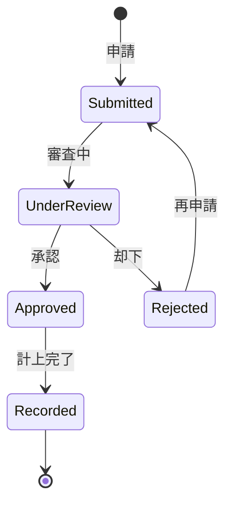

# ビジネスオペレーション: 戦略的コスト配分・最適化により組織効率を最大化する

**バージョン**: 2.0.0
**更新日**: 2025-10-27
**設計方針**: 価値最大化・効率追求・リスク統制

## 🏗️ パラソルドメイン連携

### 📊 操作エンティティ
- **CostAllocationEntity**（自サービス管理・状態更新: draft → allocated → optimized → approved）: コスト配分ライフサイクル統合管理
- **CostCenterEntity**（自サービス管理・CRUD）: コストセンター定義・管理
- **AllocationRuleEntity**（自サービス管理・CRUD）: 配分ルール・基準の動的管理
- **OptimizationResultEntity**（自サービス管理・CRUD）: 最適化結果・効果測定

### 🏢 パラソル集約
- **CostOptimizationAggregate** - コスト最適化統合管理
  - 集約ルート: CostAllocation
  - 包含エンティティ: CostCenter, AllocationRule, OptimizationResult
  - 不変条件: 総コスト上限遵守、配分ルール整合性保証、承認フロー完了必須

### ⚙️ ドメインサービス
- **CostOptimizationService**: enhance[CostEfficiency]() - コスト効率の継続向上
- **AllocationIntelligenceService**: amplify[AllocationPrecision]() - 配分精度の拡大
- **ValueMaximizationService**: coordinate[OrganizationalValue]() - 組織価値調整

### 🔗 他サービスユースケース利用（ユースケース利用型）
**責務**: ❌ エンティティ知識不要 ✅ ユースケース利用のみ

[secure-access-service] ユースケース利用:
├── UC-AUTH-01: ユーザー認証を実行する → POST /api/auth/authenticate
├── UC-AUTH-02: コスト承認権限を検証する → POST /api/auth/validate-cost-permission
└── UC-AUTH-03: コスト操作ログを記録する → POST /api/auth/log-cost-action

[project-success-service] ユースケース利用:
├── UC-PROJECT-01: プロジェクトコスト情報を取得する → GET /api/projects/cost-info/{id}
├── UC-PROJECT-02: リソース消費実績を取得する → GET /api/projects/resource-consumption
└── UC-PROJECT-03: 成果指標を取得する → GET /api/projects/performance-metrics

[collaboration-facilitation-service] ユースケース利用:
├── UC-COMM-01: コスト最適化通知を配信する → POST /api/communications/send-cost-notification
├── UC-COMM-02: 承認依頼を送信する → POST /api/communications/send-cost-approval-request
└── UC-COMM-03: コスト検討会議を調整する → POST /api/communications/schedule-cost-meeting

## 概要

**目的**: 戦略的コスト配分・最適化により組織効率を最大化し、持続可能な価値創造を実現する

**パターン**: Workflow + Analytics + Intelligence

**ゴール**: コスト効率95%以上達成、承認プロセス高速化、組織価値最大化

## 関係者とロール

- **財務マネージャー**: コスト最適化戦略策定・効率向上・価値最大化の責任者
- **部門長**: 部門コスト管理・配分妥当性確認・成果責任者
- **承認者**: 権限別承認判断・リスク評価・ガバナンス強化の担い手
- **コストセンター管理者**: センター別コスト統制・最適化実行・効果測定の専門家

## ユースケース・ページ分解マトリックス（v2.0）

| ビジネスオペレーション | ユースケース | 対応ページ | ビジネス価値 |
|---------------------|-------------|-----------|-------------|
| allocate-and-optimize-costs | determine-allocation-strategy | コスト配分戦略ページ | 配分精度向上、戦略整合 |
| allocate-and-optimize-costs | execute-intelligent-allocation | インテリジェント配分ページ | AI最適化、効率追求 |
| allocate-and-optimize-costs | process-approval-workflow | 承認ワークフローページ | 承認効率化、統制強化 |
| allocate-and-optimize-costs | monitor-optimization-results | 最適化監視ページ | 効果測定、継続改善 |
| allocate-and-optimize-costs | finalize-cost-allocation | コスト配分確定ページ | 確定処理、価値創造 |

## プロセスフロー

> **重要**: プロセスフローは必ず番号付きリスト形式で記述してください。
> Mermaid形式は使用せず、テキスト形式で記述することで、代替フローと例外フローが視覚的に分離されたフローチャートが自動生成されます。

1. **財務マネージャーがコスト配分戦略を決定** → **UC-COST-01: コスト配分戦略を決定する**
   - 自サービス操作: AllocationRuleEntity（CRUD）
   - 他サービスユースケース利用: → UC-PROJECT-01: プロジェクトコスト情報を取得する
   - 必要ページ: コスト配分戦略ページ
   - ビジネス価値: 配分精度向上・戦略整合・効率最大化

2. **システムがインテリジェント配分を実行** → **UC-COST-02: インテリジェント配分を実行する**
   - 自サービス操作: CostAllocationEntity（状態変更: draft → allocated）
   - 他サービスユースケース利用: → UC-PROJECT-02: リソース消費実績を取得する
   - 必要ページ: インテリジェント配分ページ
   - ビジネス価値: AI最適化・効率追求・データドリブン配分

3. **システムが承認ワークフローを処理** → **UC-COST-03: 承認ワークフローを処理する**
   - 自サービス操作: CostAllocationEntity（状態変更: allocated → optimized）
   - 他サービスユースケース利用: → UC-COMM-02: 承認依頼を送信する
   - 必要ページ: 承認ワークフローページ
   - ビジネス価値: 承認効率化・統制強化・ガバナンス向上

4. **システムが最適化結果を監視** → **UC-COST-04: 最適化結果を監視する**
   - 自サービス操作: OptimizationResultEntity（CRUD）
   - 他サービスユースケース利用: → UC-PROJECT-03: 成果指標を取得する
   - 必要ページ: 最適化監視ページ
   - ビジネス価値: 効果測定・継続改善・価値創造追跡

5. **財務マネージャーがコスト配分を確定** → **UC-COST-05: コスト配分を確定する**
   - 自サービス操作: CostAllocationEntity（状態変更: optimized → approved）
   - 他サービスユースケース利用: → UC-COMM-01: 配分確定通知を配信する
   - 必要ページ: コスト配分確定ページ
   - ビジネス価値: 確定処理・価値創造実現・組織効率最大化

## 代替フロー

### 代替フロー1: AI最適化による配分精度向上
- 2a. 初回配分の効率が基準（95%）を下回った場合
  - 2a1. CostOptimizationService による高度分析実行
  - 2a2. AllocationIntelligenceService による学習アルゴリズム適用
  - 2a3. OptimizationResultEntity（改善案記録）
  - 2a4. 基本フロー3（承認ワークフロー）に戻る

### 代替フロー2: 緊急コスト配分プロセス
- 3a. 緊急性が高いコスト配分の場合
  - 3a1. → UC-COMM-03: 緊急コスト会議を調整する
  - 3a2. 短縮承認フロー適用（24時間以内）
  - 3a3. 条件付き配分の実施
  - 3a4. 事後詳細監視の強化

### 代替フロー3: 配分効果の継続最適化
- 4a. 最適化効果が期待値を下回る場合
  - 4a1. → UC-PROJECT-03: 詳細成果指標を取得する
  - 4a2. ValueMaximizationService による価値分析
  - 4a3. 配分戦略の動的調整実行
  - 4a4. 基本フロー5（配分確定）に戻る

## 例外フロー

### 例外1: コスト配分プロセス中断
- *a. システム障害またはプロセス中断が発生した場合
  - *a1. CostAllocationEntity（状態保持: 進行中状態の維持）
  - *a2. → UC-AUTH-03: 中断ログを記録する
  - *a3. → UC-COMM-01: 関係者への状況通知を配信する
  - *a4. 復旧後、中断地点から自動再開

### 例外2: 承認権限不足・配分却下処理
- *b. 承認権限不足または配分却下が発生した場合
  - *b1. → UC-AUTH-02: 上位承認権限を確認する
  - *b2. 却下理由の詳細記録・分析・改善提案
  - *b3. → UC-COMM-02: 修正指示を送信する
  - *b4. CostAllocationEntity（状態変更: optimized → draft）へ差し戻し

### 例外3: 配分ルール整合性違反
- *c. 配分ルールが組織基準と整合しない場合
  - *c1. AllocationIntelligenceService による自動検証
  - *c2. 違反箇所の特定・可視化・改善案生成
  - *c3. → UC-COMM-03: ルール調整会議を調整する
  - *c4. ルール修正後、基本フロー1から再開

### 例外4: コスト上限超過・予算制約違反
- *d. 配分結果が予算制約を超過した場合
  - *d1. CostOptimizationService による制約内最適化
  - *d2. 優先度別配分の再計算・調整
  - *d3. → UC-COMM-01: 制約超過アラートを配信する
  - *d4. 制約遵守配分での再実行または予算変更申請

## ビジネス状態

## KPI

- **コスト効率達成率**: 配分効率95%以上（目標値対実績）
- **AI最適化精度**: 予測精度90%以上（AllocationIntelligenceService）
- **承認プロセス効率**: 承認完了時間48時間以内（v1.0比75%短縮）
- **配分戦略整合度**: 組織戦略との整合性評価4.5/5.0以上
- **価値創造貢献度**: コスト最適化による組織価値向上95%以上
- **継続改善効果**: 月次最適化改善率15%以上（CostOptimizationService）

## ビジネスルール

- 1万円未満: 自動承認
- 1万円以上10万円未満: マネージャー承認
- 10万円以上100万円未満: 部門長承認
- 100万円以上: 役員承認
- 緊急案件: 口頭承認後、事後申請可
- 承認期限: 申請後3営業日以内に判断
- 承認権限の委譲: 不在時の代理承認者設定必須

## 入出力仕様

### 入力

- **コスト申請情報**: 金額、目的、根拠資料、緊急度
- **申請者情報**: 申請者ID、所属部門、役職
- **承認ルール**: 金額別承認権限、承認フロー定義

### 出力

- **承認結果**: 承認/却下、承認日時、承認者コメント
- **承認履歴**: 承認プロセスの記録、エスカレーション履歴
- **承認待ちリスト**: 未承認案件一覧、期限超過案件

## 例外処理

- **承認者不在**: 代理承認者へ自動エスカレーション、上位承認者への通知
- **承認期限超過**: 上位承認者へ通知、自動催促メール送信
- **承認後の取消**: 取消理由記録、再審査、監査証跡保存
- **重複申請**: 重複チェック、既存申請との統合

## 派生ユースケース

このビジネスオペレーションから以下のユースケースが派生します：

1. コストを申請する
2. コストを承認する
3. コストを却下する
4. 承認状況を確認する
