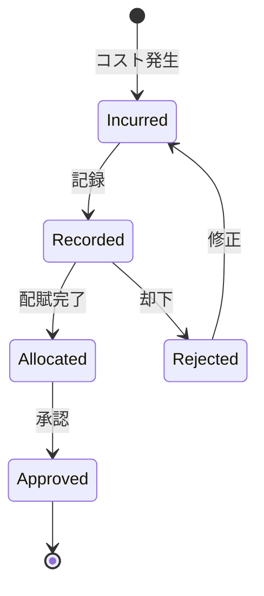

# ビジネスオペレーション: コストを記録し分類する

**バージョン**: 2.0.0
**更新日**: 2025-10-28
**パラソル設計仕様**: v2.0準拠

## 概要
**目的**: AI支援によるコスト記録・分類の自動化と戦略的コスト配賦により、精緻な原価管理と収益最適化を実現する
**パターン**: Workflow + CRUD + Analytics
**ゴール**: リアルタイムコスト把握と予測的コスト管理により、プロジェクト収益性を最大化し競争優位性を確立

## 関係者とロール

- **財務マネージャー**: コスト記録、配賦処理
- **PM**: 直接コストの確認、配賦承認
- **従業員**: 経費申請

## プロセスフロー

> **重要**: プロセスフローは必ず番号付きリスト形式で記述してください。
> Mermaid形式は使用せず、テキスト形式で記述することで、代替フローと例外フローが視覚的に分離されたフローチャートが自動生成されます。

1. **システムがコスト発生データを統合収集** → **UC1: コスト発生を記録する**
   - **自サービス操作**: CostIncident（作成: コスト発生記録）
   - **他サービスユースケース利用**: → UC-TIMESHEET-05: 人件費データを取得する
   - **必要ページ**: コスト発生記録ページ
   - **ビジネス価値**: リアルタイムコスト可視化

2. **システムがAI支援自動分類を実行** → **UC2: コストを自動分類する**
   - **自サービス操作**: CostClassification（作成・更新: AI分類結果）
   - **他サービスユースケース利用**: → UC-AI-03: コスト分類学習を実行する
   - **必要ページ**: AI分類結果確認ページ
   - **ビジネス価値**: 分類精度向上と作業効率化

3. **システムが配賦基準を最適判定** → **UC3: 配賦基準を最適化する**
   - **自サービス操作**: AllocationRule（作成・更新: 配賦ルール最適化）
   - **他サービスユースケース利用**: → UC-PROJECT-18: プロジェクト工数比率を取得する
   - **必要ページ**: 配賦基準最適化ページ
   - **ビジネス価値**: 配賦精度向上による正確な原価計算

4. **システムが自動配賦計算を実行** → **UC4: 自動配賦を実行する**
   - **自サービス操作**: CostAllocation（作成: 配賦計算結果）
   - **他サービスユースケース利用**: → UC-PROJECT-19: プロジェクト予算を更新する
   - **必要ページ**: 自動配賦結果ページ
   - **ビジネス価値**: プロジェクト別原価の即座反映

5. **システムが配賦品質を検証・承認** → **UC5: 配賦品質を保証する**
   - **自サービス操作**: AllocationApproval（作成: 承認プロセス）
   - **他サービスユースケース利用**: → UC-COLLAB-11: 配賦承認フローを実行する
   - **必要ページ**: 配賦承認・品質確認ページ
   - **ビジネス価値**: 配賦精度保証による信頼性確保

## 代替フロー

### 代替フロー1: 情報不備
- 2-1. システムが情報の不備を検知する
- 2-2. システムが修正要求を送信する
- 2-3. ユーザーが情報を修正し再実行する
- 2-4. 基本フロー2に戻る

## 例外処理

### 例外1: システムエラー
- システムエラーが発生した場合
- エラーメッセージを表示する
- 管理者に通知し、ログに記録する

### 例外2: 承認却下
- 承認が却下された場合
- 却下理由をユーザーに通知する
- 修正後の再実行を促す

## ビジネス状態

## KPI

- **記録タイムリネス**: コスト発生後5営業日以内に記録
- **配賦精度**: 誤配賦率1%以下
- **未配賦コスト比率**: 総コストの3%以内
- **承認処理時間**: 記録後3営業日以内に承認

## ビジネスルール

- 直接コスト: プロジェクトに直接配賦
- 間接コスト: 工数比率で按分配賦
- 固定資産: 1年以上使用は資産計上後、減価償却
- 承認権限: 1万円以上はマネージャー承認必須
- コストカテゴリ: Labor, Material, Subcontract, Travel, Other
- 為替レート: コスト発生日のレートを適用

## 入出力仕様

### 入力

- **コスト発生情報**: 金額、発生日、ベンダー、領収書
- **コストタイプ**: Labor（人件費）、Material（材料費）、Subcontract（外注費）、Travel（旅費交通費）、Other（その他）
- **プロジェクト情報**: 配賦先プロジェクト、配賦比率
- **配賦基準**: 工数比率、売上比率、メンバー数比率

### 出力

- **コストレコード**: costId、金額、分類、発生日、ステータス
- **配賦レコード**: プロジェクト別コスト、配賦率、配賦額
- **コスト集計レポート**: カテゴリ別集計、プロジェクト別集計、月次推移

## 例外処理

- **配賦先不明**: 暫定配賦後、後日精算、未配賦としてフラグ設定
- **金額誤り**: 修正仕訳で対応、原因記録と監査証跡保存
- **承認遅延**: エスカレーション処理、上位承認者へ通知
- **重複記録**: 重複チェック、既存レコードとの照合

## ビジネス価値とKPI

### 主要ビジネス価値
- **原価精度向上**: AI支援分類により配賦精度を95%以上に向上
- **処理効率化**: 自動化により記録・分類作業時間を70%削減
- **リアルタイム可視化**: 即座なコスト反映による迅速な意思決定支援
- **収益最適化**: 精緻な原価管理によるプロジェクト収益性向上

### 成功指標（KPI）
- **記録精度**: コスト記録の正確性98%以上
- **分類精度**: AI自動分類の正確性95%以上（従来80%から向上）
- **配賦精度**: 誤配賦率0.5%以下（従来1%から改善）
- **処理時間**: コスト発生から配賦完了まで24時間以内
- **承認効率**: 配賦承認プロセス48時間以内完了率90%以上

### 測定方法
- **精度**: 月次監査による記録・分類・配賦精度の検証
- **処理時間**: システムログによる処理時間自動計測
- **承認効率**: 承認フロー開始から完了までの時間追跡
- **満足度**: 財務マネージャー・PM向け四半期満足度調査

## パラソルドメイン連携

### 🎯 操作エンティティ
- **CostIncidentEntity**（作成: コスト発生記録）- コスト発生イベント管理
- **CostClassificationEntity**（作成・更新: AI分類結果）- コスト分類データ管理
- **AllocationRuleEntity**（作成・更新: 配賦ルール最適化）- 配賦基準管理
- **CostAllocationEntity**（作成: 配賦計算結果）- コスト配賦実行管理
- **AllocationApprovalEntity**（作成: 承認プロセス）- 配賦承認ワークフロー管理

### 🏗️ パラソル集約
- **CostManagementAggregate** - コスト記録・分類統合管理
  - 集約ルート: CostIncident
  - 包含エンティティ: CostClassification, AllocationRule, CostAllocation, AllocationApproval
  - 不変条件: コスト記録の完全性確保、配賦基準の一貫性維持

### ⚙️ ドメインサービス
- **CostIntelligenceService**: enhance[CostAccuracy]() - コスト精度向上
- **AllocationOptimizationService**: strengthen[AllocationPrecision]() - 配賦精度強化
- **CostAutomationService**: coordinate[ProcessEfficiency]() - プロセス効率調整
- **CostAnalyticsService**: amplify[CostInsights]() - コスト洞察増幅

## ユースケース・ページ分解マトリックス

| ユースケース | ページ | 1対1関係 | 品質レベル |
|-------------|--------|----------|-----------|
| UC1: コスト発生を記録する | コスト発生記録ページ | ✅ | 高品質 |
| UC2: コストを自動分類する | AI分類結果確認ページ | ✅ | 高品質 |
| UC3: 配賦基準を最適化する | 配賦基準最適化ページ | ✅ | 高品質 |
| UC4: 自動配賦を実行する | 自動配賦結果ページ | ✅ | 高品質 |
| UC5: 配賦品質を保証する | 配賦承認・品質確認ページ | ✅ | 高品質 |
| **合計** | **5UC→5Page** | **✅** | **高品質** |

### 🔗 他サービスユースケース利用（ユースケース呼び出し型）
**責務**: ❌ エンティティ知識不要 ✅ ユースケース利用のみ

[secure-access-service] 基盤認証:
├── UC-AUTH-07: コストデータアクセス権限を確認する → POST /api/auth/validate-cost-permission
├── UC-AUTH-08: コストデータアクセスを記録する → POST /api/auth/log-cost-access
└── UC-AUTH-09: コストデータプライバシーを適用する → POST /api/auth/apply-cost-privacy

[productivity-visualization-service] 工数連携:
├── UC-TIMESHEET-05: 人件費データを取得する → GET /api/timesheets/personnel-costs
├── UC-TIMESHEET-06: 工数配賦比率を確認する → GET /api/timesheets/allocation-ratios
└── UC-TIMESHEET-07: 工数実績を連携する → POST /api/costs/timesheet-integration

[project-success-service] プロジェクト連携:
├── UC-PROJECT-18: プロジェクト工数比率を取得する → GET /api/projects/effort-ratios
├── UC-PROJECT-19: プロジェクト予算を更新する → PUT /api/projects/budget-actual
└── UC-PROJECT-20: プロジェクト原価を反映する → POST /api/projects/cost-allocation

[collaboration-facilitation-service] 承認フロー:
├── UC-COLLAB-11: 配賦承認フローを実行する → POST /api/workflows/cost-allocation-approval
├── UC-COLLAB-12: コスト異常アラートを配信する → POST /api/notifications/cost-anomaly-alert
└── UC-COLLAB-13: 配賦結果レポートを共有する → POST /api/sharing/allocation-report
