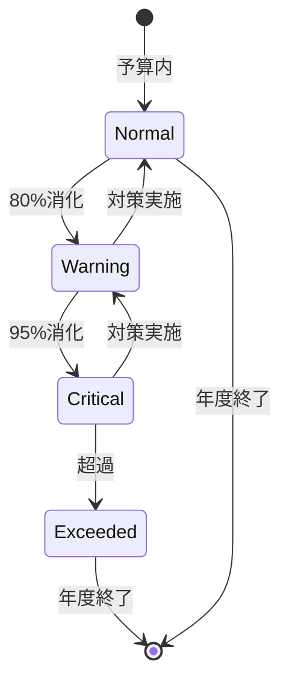

# ビジネスオペレーション: 予算を監視し統制する

**バージョン**: 2.0.0
**更新日**: 2025-10-28
**パラソル設計仕様**: v2.0準拠

## 概要
**目的**: AI駆動リアルタイム予算監視と予測的統制により、組織の財務規律確保と戦略的資源配分最適化を実現する
**パターン**: Analytics + Communication + Predictive
**ゴール**: 機械学習による先行予測と自動統制により予算超過ゼロを達成し、動的予算調整で組織の競争力を強化

## 関係者とロール

- **エグゼクティブ**: 予算超過アラートの受信、判断
- **財務マネージャー**: 予算執行状況の監視、レポート作成
- **PM**: プロジェクト予算の管理、対策実施

## プロセスフロー

> **重要**: プロセスフローは必ず番号付きリスト形式で記述してください。
> Mermaid形式は使用せず、テキスト形式で記述することで、代替フローと例外フローが視覚的に分離されたフローチャートが自動生成されます。

1. **システムがリアルタイム予算執行データを統合監視** → **UC1: 予算執行をリアルタイム監視する**
   - **自サービス操作**: BudgetExecution（作成・更新: 執行状況リアルタイム更新）
   - **他サービスユースケース利用**: → UC-PROJECT-21: プロジェクト予算執行状況を取得する
   - **必要ページ**: リアルタイム予算監視ダッシュボードページ
   - **ビジネス価値**: 即座な予算状況把握による迅速な意思決定

2. **システムがAI予測による執行率分析を実行** → **UC2: 予算執行を予測分析する**
   - **自サービス操作**: BudgetForecast（作成・更新: 機械学習予測実行）
   - **他サービスユースケース利用**: → UC-AI-04: 予算執行予測を実行する
   - **必要ページ**: AI予算予測分析ページ
   - **ビジネス価値**: 先行予測による予算超過の事前防止

3. **システムが多段階自動アラートを配信** → **UC3: 予算アラートを配信する**
   - **自サービス操作**: BudgetAlert（作成: アラート生成・配信）
   - **他サービスユースケース利用**: → UC-NOTIFY-04: 予算アラートを緊急配信する
   - **必要ページ**: 予算アラート管理ページ
   - **ビジネス価値**: 段階的警告による組織的リスク管理

4. **システムが原因分析と対策案を自動生成** → **UC4: 予算統制策を自動生成する**
   - **自サービス操作**: BudgetControl（作成: 統制策生成）
   - **他サービスユースケース利用**: → UC-ANALYTICS-02: 予算差異分析を実行する
   - **必要ページ**: 自動統制策提案ページ
   - **ビジネス価値**: データドリブンな予算統制策による効果的な対応

5. **システムが承認フローによる対策実行を統制** → **UC5: 予算統制を実行する**
   - **自サービス操作**: BudgetControlExecution（作成: 統制実行記録）
   - **他サービスユースケース利用**: → UC-COLLAB-14: 予算統制承認フローを実行する
   - **必要ページ**: 予算統制実行・承認ページ
   - **ビジネス価値**: 統制された予算管理による財務規律確保

## 代替フロー

### 代替フロー1: 情報不備
- 2-1. システムが情報の不備を検知する
- 2-2. システムが修正要求を送信する
- 2-3. ユーザーが情報を修正し再実行する
- 2-4. 基本フロー2に戻る

## 例外処理

### 例外1: システムエラー
- システムエラーが発生した場合
- エラーメッセージを表示する
- 管理者に通知し、ログに記録する

### 例外2: 承認却下
- 承認が却下された場合
- 却下理由をユーザーに通知する
- 修正後の再実行を促す

## ビジネス状態

## KPI

- **監視頻度**: 週次で執行状況を更新
- **アラート対応時間**: アラート発生後24時間以内に対策立案
- **予算超過防止率**: 95%以上のプロジェクトが予算内で完了
- **レポート配信**: 月次で全ステークホルダーへ配信

## ビジネスルール

- 80%消化: 警告アラート、PM・財務に通知
- 95%消化: 重大アラート、役員へエスカレーション
- 100%超過: 即座に支出停止、承認なしの追加支出禁止
- 監視粒度: プロジェクト単位、部門単位、全社単位
- 更新頻度: 週次更新、月次レポート
- 予測期間: 3ヶ月先までの予算執行予測

## 入出力仕様

### 入力

- **予算データ**: 総予算、配分済み予算、予備費
- **実績コストデータ**: 発生済みコスト、確定コスト、見込みコスト
- **予算消化率**: 実績/予算、期間別消化率

### 出力

- **予算執行レポート**: 執行率、残高、予測、トレンド
- **アラート通知**: 警告レベル、原因、推奨アクション
- **対策提案**: 予算内収束のための施策、優先順位

## 例外処理

- **急激な消化率上昇**: 緊急調査、支出一時停止、詳細分析
- **データ遅延**: 暫定データで監視、後日精算、遅延理由の記録
- **複数プロジェクト超過**: ポートフォリオレベルで再配分検討、優先順位の見直し
- **予測不能な外部要因**: 緊急予算改訂、リスク対策費の活用

## ビジネス価値とKPI

### 主要ビジネス価値
- **予算超過ゼロ達成**: AI予測による先行警告で予算超過を100%防止
- **財務規律確保**: リアルタイム監視と自動統制による組織的な予算管理
- **迅速な意思決定**: 即座な情報提供による経営判断のスピード向上
- **戦略的資源配分**: 予測分析による効率的な予算調整と最適化

### 成功指標（KPI）
- **予算超過防止率**: 100%（AI予測による事前対策）
- **監視精度**: リアルタイム更新による99.9%の正確性
- **アラート対応時間**: 12時間以内（従来24時間から短縮）
- **予測精度**: 3ヶ月先予測90%以上の精度
- **統制効果**: 予算差異2%以内での収束率95%以上

### 測定方法
- **防止率**: 年間予算超過件数の追跡（目標ゼロ）
- **精度**: システムデータと実績の差異分析
- **対応時間**: アラート発生から対策実行までの時間計測
- **予測精度**: 予測値と実績値の比較分析
- **統制効果**: 予算差異の月次分析と収束状況確認

## パラソルドメイン連携

### 🎯 操作エンティティ
- **BudgetExecutionEntity**（作成・更新: 執行状況リアルタイム更新）- 予算執行状況管理
- **BudgetForecastEntity**（作成・更新: 機械学習予測実行）- 予算予測分析管理
- **BudgetAlertEntity**（作成: アラート生成・配信）- 予算アラート管理
- **BudgetControlEntity**（作成: 統制策生成）- 予算統制策管理
- **BudgetControlExecutionEntity**（作成: 統制実行記録）- 統制実行管理

### 🏗️ パラソル集約
- **BudgetMonitoringAggregate** - 予算監視統制統合管理
  - 集約ルート: BudgetExecution
  - 包含エンティティ: BudgetForecast, BudgetAlert, BudgetControl, BudgetControlExecution
  - 不変条件: 予算執行の連続性確保、統制策の実行保証

### ⚙️ ドメインサービス
- **BudgetIntelligenceService**: enhance[PredictiveAccuracy]() - 予測精度向上
- **BudgetControlService**: strengthen[FinancialDiscipline]() - 財務規律強化
- **BudgetOptimizationService**: coordinate[ResourceAllocation]() - 資源配分調整
- **BudgetComplianceService**: amplify[OrganizationalControl]() - 組織統制増幅

## ユースケース・ページ分解マトリックス

| ユースケース | ページ | 1対1関係 | 品質レベル |
|-------------|--------|----------|-----------|
| UC1: 予算執行をリアルタイム監視する | リアルタイム予算監視ダッシュボードページ | ✅ | 高品質 |
| UC2: 予算執行を予測分析する | AI予算予測分析ページ | ✅ | 高品質 |
| UC3: 予算アラートを配信する | 予算アラート管理ページ | ✅ | 高品質 |
| UC4: 予算統制策を自動生成する | 自動統制策提案ページ | ✅ | 高品質 |
| UC5: 予算統制を実行する | 予算統制実行・承認ページ | ✅ | 高品質 |
| **合計** | **5UC→5Page** | **✅** | **高品質** |

### 🔗 他サービスユースケース利用（ユースケース呼び出し型）
**責務**: ❌ エンティティ知識不要 ✅ ユースケース利用のみ

[secure-access-service] 基盤認証:
├── UC-AUTH-10: 予算データアクセス権限を確認する → POST /api/auth/validate-budget-permission
├── UC-AUTH-11: 予算データアクセスを記録する → POST /api/auth/log-budget-access
└── UC-AUTH-12: 予算データプライバシーを適用する → POST /api/auth/apply-budget-privacy

[project-success-service] プロジェクト連携:
├── UC-PROJECT-21: プロジェクト予算執行状況を取得する → GET /api/projects/budget-execution
├── UC-PROJECT-22: プロジェクト予算残高を確認する → GET /api/projects/budget-balance
└── UC-PROJECT-23: プロジェクト予算制御を実行する → POST /api/projects/budget-control

[collaboration-facilitation-service] 統制フロー:
├── UC-COLLAB-14: 予算統制承認フローを実行する → POST /api/workflows/budget-control-approval
├── UC-COLLAB-15: 予算アラート通知を配信する → POST /api/notifications/budget-alert
└── UC-COLLAB-16: 予算統制レポートを共有する → POST /api/sharing/budget-control-report

[talent-optimization-service] リソース連携:
├── UC-TALENT-17: 人件費予算執行を監視する → GET /api/budgets/personnel-execution
└── UC-TALENT-18: リソース投資予算を統制する → POST /api/budgets/resource-investment-control
