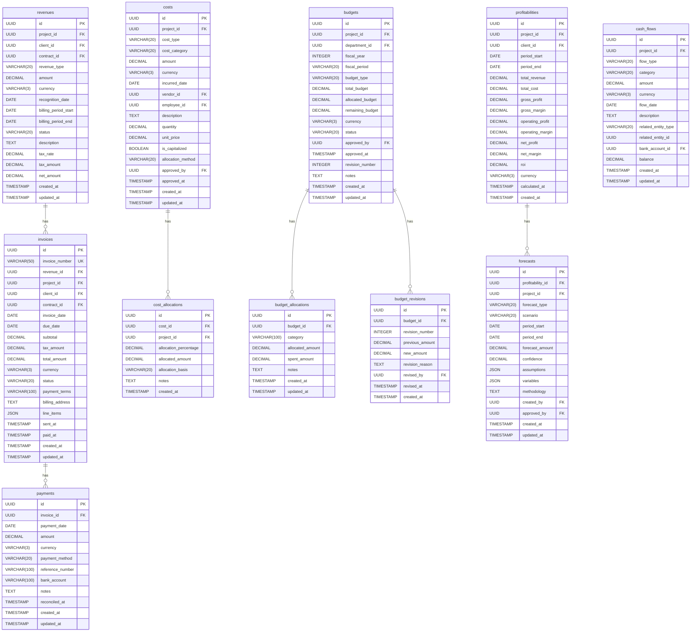

# データベース設計: 収益最適化サービス

## 設計概要
**データベース**: SQLite (開発環境) / PostgreSQL (本番環境想定)
**文字エンコーディング**: UTF-8
**タイムゾーン**: UTC

## 論理設計

### ER図



## 物理設計

### テーブル作成SQL

#### revenuesテーブル
```sql
CREATE TABLE revenues (
    id UUID PRIMARY KEY DEFAULT gen_random_uuid(),
    project_id UUID NOT NULL,
    client_id UUID NOT NULL,
    contract_id UUID,
    revenue_type VARCHAR(20) NOT NULL CHECK (revenue_type IN ('Fixed', 'TimeAndMaterial', 'Milestone', 'Recurring')),
    amount DECIMAL(15, 2) NOT NULL,
    currency VARCHAR(3) NOT NULL DEFAULT 'JPY',
    recognition_date DATE NOT NULL,
    billing_period_start DATE NOT NULL,
    billing_period_end DATE NOT NULL,
    status VARCHAR(20) NOT NULL CHECK (status IN ('Planned', 'Recognized', 'Invoiced', 'Collected')),
    description TEXT,
    tax_rate DECIMAL(5, 2) NOT NULL,
    tax_amount DECIMAL(15, 2) NOT NULL,
    net_amount DECIMAL(15, 2) NOT NULL,
    created_at TIMESTAMP NOT NULL DEFAULT NOW(),
    updated_at TIMESTAMP NOT NULL DEFAULT NOW(),
    CONSTRAINT check_revenue_amount CHECK (amount > 0),
    CONSTRAINT check_revenue_dates CHECK (billing_period_start <= billing_period_end),
    CONSTRAINT check_revenue_tax CHECK (tax_rate >= 0 AND tax_rate <= 100),
    CONSTRAINT check_revenue_net_amount CHECK (net_amount = amount + tax_amount)
);

-- インデックス
CREATE INDEX idx_revenues_project_id ON revenues(project_id);
CREATE INDEX idx_revenues_client_id ON revenues(client_id);
CREATE INDEX idx_revenues_status ON revenues(status);
CREATE INDEX idx_revenues_recognition_date ON revenues(recognition_date);
CREATE INDEX idx_revenues_billing_period ON revenues(billing_period_start, billing_period_end);
```

#### invoicesテーブル
```sql
CREATE TABLE invoices (
    id UUID PRIMARY KEY DEFAULT gen_random_uuid(),
    invoice_number VARCHAR(50) NOT NULL UNIQUE,
    revenue_id UUID REFERENCES revenues(id) ON DELETE SET NULL,
    project_id UUID NOT NULL,
    client_id UUID NOT NULL,
    contract_id UUID,
    invoice_date DATE NOT NULL,
    due_date DATE NOT NULL,
    subtotal DECIMAL(15, 2) NOT NULL,
    tax_amount DECIMAL(15, 2) NOT NULL,
    total_amount DECIMAL(15, 2) NOT NULL,
    currency VARCHAR(3) NOT NULL DEFAULT 'JPY',
    status VARCHAR(20) NOT NULL CHECK (status IN ('Draft', 'Sent', 'Paid', 'Overdue', 'Cancelled')),
    payment_terms VARCHAR(100) NOT NULL,
    billing_address TEXT NOT NULL,
    line_items JSON NOT NULL,
    sent_at TIMESTAMP,
    paid_at TIMESTAMP,
    created_at TIMESTAMP NOT NULL DEFAULT NOW(),
    updated_at TIMESTAMP NOT NULL DEFAULT NOW(),
    CONSTRAINT check_invoice_dates CHECK (invoice_date <= due_date),
    CONSTRAINT check_invoice_total CHECK (total_amount = subtotal + tax_amount),
    CONSTRAINT check_invoice_amounts CHECK (subtotal > 0 AND tax_amount >= 0)
);

-- インデックス
CREATE INDEX idx_invoices_invoice_number ON invoices(invoice_number);
CREATE INDEX idx_invoices_project_id ON invoices(project_id);
CREATE INDEX idx_invoices_client_id ON invoices(client_id);
CREATE INDEX idx_invoices_status ON invoices(status);
CREATE INDEX idx_invoices_due_date ON invoices(due_date);
CREATE INDEX idx_invoices_revenue_id ON invoices(revenue_id);
```

#### paymentsテーブル
```sql
CREATE TABLE payments (
    id UUID PRIMARY KEY DEFAULT gen_random_uuid(),
    invoice_id UUID NOT NULL REFERENCES invoices(id) ON DELETE CASCADE,
    payment_date DATE NOT NULL,
    amount DECIMAL(15, 2) NOT NULL,
    currency VARCHAR(3) NOT NULL DEFAULT 'JPY',
    payment_method VARCHAR(20) NOT NULL CHECK (payment_method IN ('BankTransfer', 'CreditCard', 'Check', 'Cash', 'Other')),
    reference_number VARCHAR(100),
    bank_account VARCHAR(100),
    notes TEXT,
    reconciled_at TIMESTAMP,
    created_at TIMESTAMP NOT NULL DEFAULT NOW(),
    updated_at TIMESTAMP NOT NULL DEFAULT NOW(),
    CONSTRAINT check_payment_amount CHECK (amount > 0)
);

-- インデックス
CREATE INDEX idx_payments_invoice_id ON payments(invoice_id);
CREATE INDEX idx_payments_payment_date ON payments(payment_date);
CREATE INDEX idx_payments_reconciled_at ON payments(reconciled_at);
```

#### costsテーブル
```sql
CREATE TABLE costs (
    id UUID PRIMARY KEY DEFAULT gen_random_uuid(),
    project_id UUID,
    cost_type VARCHAR(20) NOT NULL CHECK (cost_type IN ('Labor', 'Material', 'Subcontract', 'Travel', 'Other')),
    cost_category VARCHAR(20) NOT NULL CHECK (cost_category IN ('Direct', 'Indirect', 'Overhead')),
    amount DECIMAL(15, 2) NOT NULL,
    currency VARCHAR(3) NOT NULL DEFAULT 'JPY',
    incurred_date DATE NOT NULL,
    vendor_id UUID,
    employee_id UUID,
    description TEXT NOT NULL,
    quantity DECIMAL(10, 2),
    unit_price DECIMAL(15, 2),
    is_capitalized BOOLEAN NOT NULL DEFAULT FALSE,
    allocation_method VARCHAR(20),
    approved_by UUID,
    approved_at TIMESTAMP,
    created_at TIMESTAMP NOT NULL DEFAULT NOW(),
    updated_at TIMESTAMP NOT NULL DEFAULT NOW(),
    CONSTRAINT check_cost_amount CHECK (amount > 0),
    CONSTRAINT check_cost_quantity CHECK (quantity IS NULL OR quantity > 0),
    CONSTRAINT check_cost_unit_price CHECK (unit_price IS NULL OR unit_price > 0)
);

-- インデックス
CREATE INDEX idx_costs_project_id ON costs(project_id);
CREATE INDEX idx_costs_cost_type ON costs(cost_type);
CREATE INDEX idx_costs_cost_category ON costs(cost_category);
CREATE INDEX idx_costs_incurred_date ON costs(incurred_date);
CREATE INDEX idx_costs_approved_by ON costs(approved_by);
```

#### cost_allocationsテーブル
```sql
CREATE TABLE cost_allocations (
    id UUID PRIMARY KEY DEFAULT gen_random_uuid(),
    cost_id UUID NOT NULL REFERENCES costs(id) ON DELETE CASCADE,
    project_id UUID NOT NULL,
    allocation_percentage DECIMAL(5, 2) NOT NULL,
    allocated_amount DECIMAL(15, 2) NOT NULL,
    allocation_basis VARCHAR(20) NOT NULL,
    notes TEXT,
    created_at TIMESTAMP NOT NULL DEFAULT NOW(),
    CONSTRAINT check_allocation_percentage CHECK (allocation_percentage >= 0 AND allocation_percentage <= 100),
    CONSTRAINT check_allocated_amount CHECK (allocated_amount >= 0)
);

-- インデックス
CREATE INDEX idx_cost_alloc_cost_id ON cost_allocations(cost_id);
CREATE INDEX idx_cost_alloc_project_id ON cost_allocations(project_id);
```

#### budgetsテーブル
```sql
CREATE TABLE budgets (
    id UUID PRIMARY KEY DEFAULT gen_random_uuid(),
    project_id UUID,
    department_id UUID,
    fiscal_year INTEGER NOT NULL,
    fiscal_period VARCHAR(20) NOT NULL,
    budget_type VARCHAR(20) NOT NULL CHECK (budget_type IN ('Annual', 'Quarterly', 'Monthly', 'Project')),
    total_budget DECIMAL(15, 2) NOT NULL,
    allocated_budget DECIMAL(15, 2) NOT NULL DEFAULT 0,
    remaining_budget DECIMAL(15, 2) NOT NULL,
    currency VARCHAR(3) NOT NULL DEFAULT 'JPY',
    status VARCHAR(20) NOT NULL CHECK (status IN ('Draft', 'Approved', 'Revised', 'Closed')),
    approved_by UUID,
    approved_at TIMESTAMP,
    revision_number INTEGER NOT NULL DEFAULT 0,
    notes TEXT,
    created_at TIMESTAMP NOT NULL DEFAULT NOW(),
    updated_at TIMESTAMP NOT NULL DEFAULT NOW(),
    CONSTRAINT check_budget_total CHECK (total_budget > 0),
    CONSTRAINT check_budget_allocated CHECK (allocated_budget >= 0 AND allocated_budget <= total_budget),
    CONSTRAINT check_budget_remaining CHECK (remaining_budget = total_budget - allocated_budget),
    CONSTRAINT check_budget_fiscal_year CHECK (fiscal_year >= 2000 AND fiscal_year <= 2100)
);

-- インデックス
CREATE INDEX idx_budgets_project_id ON budgets(project_id);
CREATE INDEX idx_budgets_department_id ON budgets(department_id);
CREATE INDEX idx_budgets_fiscal_year ON budgets(fiscal_year);
CREATE INDEX idx_budgets_status ON budgets(status);
```

#### budget_allocationsテーブル
```sql
CREATE TABLE budget_allocations (
    id UUID PRIMARY KEY DEFAULT gen_random_uuid(),
    budget_id UUID NOT NULL REFERENCES budgets(id) ON DELETE CASCADE,
    category VARCHAR(100) NOT NULL,
    allocated_amount DECIMAL(15, 2) NOT NULL,
    spent_amount DECIMAL(15, 2) NOT NULL DEFAULT 0,
    notes TEXT,
    created_at TIMESTAMP NOT NULL DEFAULT NOW(),
    updated_at TIMESTAMP NOT NULL DEFAULT NOW(),
    CONSTRAINT check_budget_alloc_amount CHECK (allocated_amount > 0),
    CONSTRAINT check_budget_spent CHECK (spent_amount >= 0 AND spent_amount <= allocated_amount)
);

-- インデックス
CREATE INDEX idx_budget_alloc_budget_id ON budget_allocations(budget_id);
CREATE INDEX idx_budget_alloc_category ON budget_allocations(category);
```

#### budget_revisionsテーブル
```sql
CREATE TABLE budget_revisions (
    id UUID PRIMARY KEY DEFAULT gen_random_uuid(),
    budget_id UUID NOT NULL REFERENCES budgets(id) ON DELETE CASCADE,
    revision_number INTEGER NOT NULL,
    previous_amount DECIMAL(15, 2) NOT NULL,
    new_amount DECIMAL(15, 2) NOT NULL,
    revision_reason TEXT NOT NULL,
    revised_by UUID NOT NULL,
    revised_at TIMESTAMP NOT NULL,
    created_at TIMESTAMP NOT NULL DEFAULT NOW(),
    CONSTRAINT check_revision_amounts CHECK (previous_amount >= 0 AND new_amount >= 0),
    CONSTRAINT unique_budget_revision UNIQUE (budget_id, revision_number)
);

-- インデックス
CREATE INDEX idx_budget_rev_budget_id ON budget_revisions(budget_id);
CREATE INDEX idx_budget_rev_revised_at ON budget_revisions(revised_at);
```

#### profitabilitiesテーブル
```sql
CREATE TABLE profitabilities (
    id UUID PRIMARY KEY DEFAULT gen_random_uuid(),
    project_id UUID,
    client_id UUID,
    period_start DATE NOT NULL,
    period_end DATE NOT NULL,
    total_revenue DECIMAL(15, 2) NOT NULL,
    total_cost DECIMAL(15, 2) NOT NULL,
    gross_profit DECIMAL(15, 2) NOT NULL,
    gross_margin DECIMAL(5, 2) NOT NULL,
    operating_profit DECIMAL(15, 2) NOT NULL,
    operating_margin DECIMAL(5, 2) NOT NULL,
    net_profit DECIMAL(15, 2) NOT NULL,
    net_margin DECIMAL(5, 2) NOT NULL,
    roi DECIMAL(5, 2),
    currency VARCHAR(3) NOT NULL DEFAULT 'JPY',
    calculated_at TIMESTAMP NOT NULL,
    created_at TIMESTAMP NOT NULL DEFAULT NOW(),
    CONSTRAINT check_prof_dates CHECK (period_start <= period_end),
    CONSTRAINT check_prof_gross_profit CHECK (gross_profit = total_revenue - total_cost),
    CONSTRAINT check_prof_gross_margin CHECK (gross_margin >= -100 AND gross_margin <= 100),
    CONSTRAINT check_prof_margins CHECK (operating_margin >= -100 AND operating_margin <= 100 AND net_margin >= -100 AND net_margin <= 100)
);

-- インデックス
CREATE INDEX idx_prof_project_id ON profitabilities(project_id);
CREATE INDEX idx_prof_client_id ON profitabilities(client_id);
CREATE INDEX idx_prof_period ON profitabilities(period_start, period_end);
CREATE INDEX idx_prof_calculated_at ON profitabilities(calculated_at);
```

#### forecastsテーブル
```sql
CREATE TABLE forecasts (
    id UUID PRIMARY KEY DEFAULT gen_random_uuid(),
    profitability_id UUID REFERENCES profitabilities(id) ON DELETE SET NULL,
    project_id UUID,
    forecast_type VARCHAR(20) NOT NULL CHECK (forecast_type IN ('Revenue', 'Cost', 'Cashflow', 'Profitability')),
    scenario VARCHAR(20) NOT NULL CHECK (scenario IN ('Optimistic', 'Realistic', 'Pessimistic')),
    period_start DATE NOT NULL,
    period_end DATE NOT NULL,
    forecast_amount DECIMAL(15, 2) NOT NULL,
    confidence DECIMAL(5, 2) NOT NULL,
    assumptions JSON NOT NULL,
    variables JSON,
    methodology TEXT,
    created_by UUID NOT NULL,
    approved_by UUID,
    created_at TIMESTAMP NOT NULL DEFAULT NOW(),
    updated_at TIMESTAMP NOT NULL DEFAULT NOW(),
    CONSTRAINT check_forecast_dates CHECK (period_start <= period_end),
    CONSTRAINT check_forecast_confidence CHECK (confidence >= 0 AND confidence <= 100)
);

-- インデックス
CREATE INDEX idx_forecasts_profitability_id ON forecasts(profitability_id);
CREATE INDEX idx_forecasts_project_id ON forecasts(project_id);
CREATE INDEX idx_forecasts_type ON forecasts(forecast_type);
CREATE INDEX idx_forecasts_scenario ON forecasts(scenario);
```

#### cash_flowsテーブル
```sql
CREATE TABLE cash_flows (
    id UUID PRIMARY KEY DEFAULT gen_random_uuid(),
    project_id UUID,
    flow_type VARCHAR(20) NOT NULL CHECK (flow_type IN ('Inflow', 'Outflow')),
    category VARCHAR(20) NOT NULL CHECK (category IN ('Operating', 'Investing', 'Financing')),
    amount DECIMAL(15, 2) NOT NULL,
    currency VARCHAR(3) NOT NULL DEFAULT 'JPY',
    flow_date DATE NOT NULL,
    description TEXT NOT NULL,
    related_entity_type VARCHAR(20),
    related_entity_id UUID,
    bank_account_id UUID,
    balance DECIMAL(15, 2),
    created_at TIMESTAMP NOT NULL DEFAULT NOW(),
    updated_at TIMESTAMP NOT NULL DEFAULT NOW(),
    CONSTRAINT check_cashflow_amount CHECK (amount > 0)
);

-- インデックス
CREATE INDEX idx_cashflows_project_id ON cash_flows(project_id);
CREATE INDEX idx_cashflows_flow_type ON cash_flows(flow_type);
CREATE INDEX idx_cashflows_category ON cash_flows(category);
CREATE INDEX idx_cashflows_flow_date ON cash_flows(flow_date);
```

## パフォーマンス設計

### インデックス戦略

#### 主要検索パターン
1. **収益一覧取得**: project_id, status, recognition_dateによる検索
2. **請求書検索**: invoice_number, client_id, statusによる検索
3. **コスト分析**: project_id, cost_type, incurred_dateによる検索
4. **予算管理**: fiscal_year, statusによる検索
5. **収益性分析**: project_id, period範囲による検索

#### 複合インデックス
```sql
-- プロジェクトの期間別収益検索
CREATE INDEX idx_revenues_project_period ON revenues(project_id, recognition_date);

-- ステータス別請求書検索
CREATE INDEX idx_invoices_status_date ON invoices(status, due_date);

-- コストのプロジェクトとカテゴリでの検索
CREATE INDEX idx_costs_project_category ON costs(project_id, cost_category);
```

### クエリ最適化

#### よく使用されるクエリ例

1. **プロジェクト収益性サマリー**
```sql
SELECT
    p.id,
    p.period_start,
    p.period_end,
    p.total_revenue,
    p.total_cost,
    p.gross_profit,
    p.gross_margin,
    COUNT(f.id) as forecast_count
FROM profitabilities p
LEFT JOIN forecasts f ON p.id = f.profitability_id
WHERE p.project_id = ?
  AND p.period_start >= ?
GROUP BY p.id, p.period_start, p.period_end, p.total_revenue, p.total_cost, p.gross_profit, p.gross_margin
ORDER BY p.period_start DESC;
```

2. **未払い請求書一覧**
```sql
SELECT
    i.*,
    COALESCE(SUM(p.amount), 0) as paid_amount,
    i.total_amount - COALESCE(SUM(p.amount), 0) as outstanding_amount
FROM invoices i
LEFT JOIN payments p ON i.id = p.invoice_id
WHERE i.status IN ('Sent', 'Overdue')
  AND i.due_date <= CURRENT_DATE
GROUP BY i.id
HAVING i.total_amount - COALESCE(SUM(p.amount), 0) > 0
ORDER BY i.due_date ASC;
```

3. **予算消化状況**
```sql
SELECT
    b.id,
    b.fiscal_year,
    b.total_budget,
    b.allocated_budget,
    b.remaining_budget,
    SUM(ba.spent_amount) as total_spent,
    (SUM(ba.spent_amount) / b.total_budget * 100) as utilization_rate
FROM budgets b
INNER JOIN budget_allocations ba ON b.id = ba.budget_id
WHERE b.project_id = ?
  AND b.status = 'Approved'
GROUP BY b.id, b.fiscal_year, b.total_budget, b.allocated_budget, b.remaining_budget;
```

## セキュリティ設計

### アクセス制御
```sql
-- ロール定義（PostgreSQL想定）
CREATE ROLE finance_reader;
CREATE ROLE finance_writer;
CREATE ROLE finance_manager;
CREATE ROLE finance_admin;

-- 権限付与
GRANT SELECT ON ALL TABLES IN SCHEMA public TO finance_reader;
GRANT SELECT, INSERT, UPDATE ON revenues, costs, invoices, payments TO finance_writer;
GRANT SELECT, INSERT, UPDATE, DELETE ON budgets, budget_allocations, profitabilities TO finance_manager;
GRANT ALL PRIVILEGES ON ALL TABLES IN SCHEMA public TO finance_admin;
```

### 行レベルセキュリティ（PostgreSQL想定）
```sql
-- プロジェクトメンバーのみがアクセス可能
CREATE POLICY revenue_project_access ON revenues
    FOR SELECT
    USING (
        project_id IN (
            SELECT project_id
            FROM project_members
            WHERE user_id = current_user_id() AND is_active = TRUE
        )
    );
```

### データ暗号化
- **機密フィールド**: description, notes, billing_addressは暗号化推奨
- **金額データ**: 監査ログと共に管理
- **支払情報**: bank_account, reference_numberは暗号化必須

## 運用設計

### バックアップ戦略
- **フルバックアップ**: 日次（深夜2:00）
- **差分バックアップ**: 6時間毎
- **保管期間**: 7年（法的要件）
- **リストアテスト**: 月次で実行

### 監視項目
- **接続数**: 最大接続数の80%以下を維持
- **クエリレスポンス時間**:
  - 単純検索: 50ms以下
  - 集計クエリ: 200ms以下
  - 収益性計算: 1秒以下
- **テーブルサイズ**:
  - revenues: 100万件まで
  - invoices: 100万件まで
  - costs: 500万件まで

### メンテナンス

#### 定期メンテナンス（PostgreSQL）
```sql
-- 統計情報更新
ANALYZE revenues;
ANALYZE costs;
ANALYZE profitabilities;

-- バキューム実行
VACUUM ANALYZE invoices;

-- インデックス再構築
REINDEX TABLE revenues;
```

#### データアーカイブ
```sql
-- 3年以上前のデータをアーカイブテーブルへ移動
INSERT INTO revenues_archive
SELECT * FROM revenues
WHERE recognition_date < NOW() - INTERVAL '3 years';

DELETE FROM revenues
WHERE recognition_date < NOW() - INTERVAL '3 years';
```

### データ整合性チェック

#### 定期チェッククエリ
```sql
-- 請求額と支払額の整合性チェック
SELECT i.id, i.invoice_number, i.total_amount,
       COALESCE(SUM(p.amount), 0) as total_paid
FROM invoices i
LEFT JOIN payments p ON i.id = p.invoice_id
WHERE i.status = 'Paid'
GROUP BY i.id, i.invoice_number, i.total_amount
HAVING i.total_amount != COALESCE(SUM(p.amount), 0);

-- 収益性計算の正確性チェック
SELECT id, project_id,
       total_revenue, total_cost, gross_profit,
       (total_revenue - total_cost) as calculated_gross_profit
FROM profitabilities
WHERE gross_profit != (total_revenue - total_cost);

-- 予算配分の合計チェック
SELECT budget_id,
       SUM(allocated_amount) as total_allocated
FROM budget_allocations
GROUP BY budget_id
HAVING SUM(allocated_amount) > (
    SELECT total_budget FROM budgets WHERE id = budget_id
);
```

## 移行戦略

### 初期データ移行
```sql
-- レガシーシステムからの収益データ移行例
INSERT INTO revenues (id, project_id, client_id, revenue_type, amount, currency, recognition_date, billing_period_start, billing_period_end, status, tax_rate, tax_amount, net_amount)
SELECT
    gen_random_uuid(),
    map_project_id(legacy_project),
    map_client_id(legacy_client),
    map_revenue_type(legacy_type),
    legacy_amount,
    'JPY',
    legacy_recognition_date,
    legacy_period_start,
    legacy_period_end,
    'Recognized',
    0.10,
    legacy_amount * 0.10,
    legacy_amount * 1.10
FROM legacy_revenues
WHERE legacy_status = 'ACTIVE';
```

### データ検証
```sql
-- 移行後の件数チェック
SELECT
    (SELECT COUNT(*) FROM legacy_revenues WHERE legacy_status = 'ACTIVE') as legacy_count,
    (SELECT COUNT(*) FROM revenues) as migrated_count;
```
