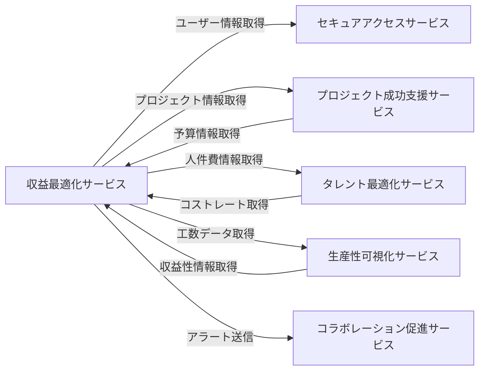

# 統合仕様: 収益最適化サービス

## 統合概要
**目的**: 収益最適化サービスが他のサービスと連携し、プロジェクトの財務状況を統合的に管理する
**統合パターン**: REST API、イベント駆動、共有データベース参照
**データ形式**: JSON

## サービス間連携マップ



## 依存サービスとの統合

### 1. セキュアアクセスサービス統合

#### 1.1 ユーザー情報取得
**目的**: 承認者情報を取得

**エンドポイント**: `GET /api/v1/secure-access/users/{userId}`

**リクエスト例**:
```http
GET /api/v1/secure-access/users/uuid-1234
Authorization: Bearer {jwt_token}
```

**レスポンス例**:
```json
{
  "success": true,
  "data": {
    "id": "uuid-1234",
    "email": "approver@example.com",
    "name": "承認者",
    "role": "Executive",
    "organizationId": "uuid-org",
    "isActive": true
  }
}
```

**使用ケース**:
- 予算承認者の確認
- コスト承認フロー
- 請求書承認

#### 1.2 組織情報取得
**目的**: クライアント組織の請求先情報を取得

**エンドポイント**: `GET /api/v1/secure-access/organizations/{organizationId}`

**使用ケース**:
- 請求先住所の自動入力
- 契約条件の確認
- 支払条件の設定

#### 1.3 権限チェック
**目的**: 財務データへのアクセス権限を確認

**エンドポイント**: `POST /api/v1/secure-access/authorize`

**リクエスト例**:
```json
{
  "userId": "uuid-1234",
  "resource": "revenue",
  "resourceId": "uuid-revenue",
  "action": "read"
}
```

### 2. プロジェクト成功支援サービス統合

#### 2.1 プロジェクト情報取得
**目的**: 収益・コスト記録時のプロジェクト情報を検証

**エンドポイント**: `GET /api/v1/project-success/projects/{projectId}`

**レスポンス例**:
```json
{
  "success": true,
  "data": {
    "id": "uuid-project",
    "code": "DX001",
    "name": "DXプロジェクト",
    "status": "Active",
    "startDate": "2024-01-01",
    "endDate": "2024-12-31",
    "budget": 50000000,
    "clientId": "uuid-client",
    "contractId": "uuid-contract"
  }
}
```

**使用ケース**:
- 収益認識時のプロジェクト期間検証
- 予算と実績の比較
- コスト記録の妥当性確認

#### 2.2 契約情報取得
**目的**: 請求条件と収益認識基準を取得

**エンドポイント**: `GET /api/v1/project-success/contracts/{contractId}`

**レスポンス例**:
```json
{
  "success": true,
  "data": {
    "id": "uuid-contract",
    "projectId": "uuid-project",
    "contractType": "TimeAndMaterial",
    "totalAmount": 60000000,
    "paymentTerms": "月末締め翌月末払い",
    "revenueRecognitionMethod": "Percentage",
    "startDate": "2024-01-01",
    "endDate": "2024-12-31"
  }
}
```

**使用ケース**:
- 収益認識タイミングの決定
- 請求スケジュールの設定
- 支払条件の適用

#### 2.3 予算情報の提供
**目的**: プロジェクト予算情報を提供

**エンドポイント**: `GET /api/v1/revenue-optimization/budgets/{projectId}`

**レスポンス例**:
```json
{
  "success": true,
  "data": {
    "projectId": "uuid-project",
    "totalBudget": 50000000,
    "allocatedBudget": 30000000,
    "remainingBudget": 20000000,
    "utilizationRate": 60.0,
    "status": "Approved"
  }
}
```

### 3. タレント最適化サービス統合

#### 3.1 人件費情報取得
**目的**: メンバーのコストレートを取得してコスト計算

**エンドポイント**: `GET /api/v1/talent-optimization/members/{memberId}/cost-rate`

**レスポンス例**:
```json
{
  "success": true,
  "data": {
    "memberId": "uuid-member",
    "costRate": 8000,
    "currency": "JPY",
    "effectiveFrom": "2024-01-01",
    "level": "Senior"
  }
}
```

**使用ケース**:
- プロジェクト人件費の計算
- コスト予測
- 収益性分析

#### 3.2 リソース配分情報取得
**目的**: プロジェクトへのリソース配分を取得してコスト計算

**エンドポイント**: `GET /api/v1/talent-optimization/assignments`

**パラメータ**:
- `projectId`: プロジェクトID
- `startDate`: 開始日
- `endDate`: 終了日

**レスポンス例**:
```json
{
  "success": true,
  "data": {
    "assignments": [
      {
        "memberId": "uuid-member-1",
        "allocationRate": 100,
        "costRate": 8000,
        "startDate": "2024-01-01",
        "endDate": "2024-06-30"
      }
    ],
    "estimatedCost": 35000000
  }
}
```

#### 3.3 人件費データの送信
**目的**: 計算した人件費データを送信

**エンドポイント**: `POST /api/v1/revenue-optimization/labor-costs`

**リクエスト例**:
```json
{
  "projectId": "uuid-project",
  "period": {
    "startDate": "2024-01-01",
    "endDate": "2024-01-31"
  },
  "costs": [
    {
      "memberId": "uuid-member-1",
      "hours": 160,
      "costRate": 8000,
      "totalCost": 1280000
    }
  ],
  "totalLaborCost": 1280000
}
```

### 4. 生産性可視化サービス統合

#### 4.1 工数データ取得
**目的**: 承認済み工数データを取得してコスト計算

**エンドポイント**: `GET /api/v1/productivity-visualization/timesheets`

**パラメータ**:
- `projectId`: プロジェクトID
- `status`: Approved
- `startDate`: 開始日
- `endDate`: 終了日

**レスポンス例**:
```json
{
  "success": true,
  "data": {
    "timesheets": [
      {
        "id": "uuid-timesheet-1",
        "userId": "uuid-user-1",
        "projectId": "uuid-project",
        "totalHours": 160,
        "billableHours": 140,
        "periodStart": "2024-01-01",
        "periodEnd": "2024-01-31",
        "status": "Approved"
      }
    ],
    "summary": {
      "totalHours": 640,
      "billableHours": 560
    }
  }
}
```

**使用ケース**:
- 人件費の精緻な計算
- 課金可能工数の確認
- 収益性分析のデータソース

#### 4.2 課金工数データの送信
**目的**: 課金可能工数を生産性サービスへ連携

**エンドポイント**: `POST /api/v1/productivity-visualization/billable-hours`

**リクエスト例**:
```json
{
  "projectId": "uuid-project",
  "period": {
    "startDate": "2024-01-01",
    "endDate": "2024-01-31"
  },
  "billableHours": 560,
  "billingRate": 10000,
  "revenue": 5600000
}
```

### 5. コラボレーション促進サービス統合

#### 5.1 予算超過アラート送信
**目的**: 予算超過時に関係者へ通知

**エンドポイント**: `POST /api/v1/collaboration-promotion/notifications`

**リクエスト例**:
```json
{
  "type": "BudgetAlert",
  "title": "予算超過アラート",
  "message": "プロジェクト「DX001」の予算が85%に達しました",
  "recipients": ["uuid-pm", "uuid-sponsor"],
  "priority": "High",
  "relatedResource": {
    "type": "Budget",
    "id": "uuid-budget"
  },
  "data": {
    "projectId": "uuid-project",
    "totalBudget": 50000000,
    "spentAmount": 42500000,
    "utilizationRate": 85.0
  },
  "actions": [
    {
      "label": "予算詳細を確認",
      "url": "/finance/budgets/uuid-budget"
    }
  ]
}
```

**使用ケース**:
- 予算超過アラート（80%, 90%, 100%）
- 支払期限リマインド
- 収益認識通知
- 請求書発行通知

#### 5.2 請求書送付通知
**目的**: 請求書発行時にクライアントへ通知

**エンドポイント**: `POST /api/v1/collaboration-promotion/notifications`

**リクエスト例**:
```json
{
  "type": "InvoiceIssued",
  "title": "請求書発行のお知らせ",
  "message": "請求書 #INV-2024-001 を発行しました",
  "recipients": ["uuid-client"],
  "priority": "Normal",
  "relatedResource": {
    "type": "Invoice",
    "id": "uuid-invoice"
  },
  "data": {
    "invoiceNumber": "INV-2024-001",
    "amount": 5000000,
    "dueDate": "2024-02-28"
  }
}
```

## イベント駆動統合

### 発行イベント

収益最適化サービスが発行するドメインイベント:

#### RevenueRecognized
**発生条件**: 収益が認識された時
**サブスクライバー**: プロジェクト成功支援、コラボレーション促進

**ペイロード**:
```json
{
  "eventId": "uuid-event",
  "eventType": "RevenueRecognized",
  "occurredAt": "2024-01-31T23:59:59Z",
  "data": {
    "revenueId": "uuid-revenue",
    "projectId": "uuid-project",
    "amount": 5000000,
    "currency": "JPY",
    "recognitionDate": "2024-01-31",
    "revenueType": "TimeAndMaterial"
  }
}
```

#### InvoiceIssued
**発生条件**: 請求書が発行された時
**サブスクライバー**: コラボレーション促進、プロジェクト成功支援

**ペイロード**:
```json
{
  "eventId": "uuid-event",
  "eventType": "InvoiceIssued",
  "occurredAt": "2024-02-01T10:00:00Z",
  "data": {
    "invoiceId": "uuid-invoice",
    "invoiceNumber": "INV-2024-001",
    "projectId": "uuid-project",
    "clientId": "uuid-client",
    "totalAmount": 5500000,
    "dueDate": "2024-02-28"
  }
}
```

#### PaymentReceived
**発生条件**: 支払いを受領した時
**サブスクライバー**: プロジェクト成功支援、コラボレーション促進

**ペイロード**:
```json
{
  "eventId": "uuid-event",
  "eventType": "PaymentReceived",
  "occurredAt": "2024-02-28T15:30:00Z",
  "data": {
    "paymentId": "uuid-payment",
    "invoiceId": "uuid-invoice",
    "amount": 5500000,
    "currency": "JPY",
    "paymentDate": "2024-02-28",
    "paymentMethod": "BankTransfer"
  }
}
```

#### BudgetExceeded
**発生条件**: 予算超過が発生した時
**サブスクライバー**: プロジェクト成功支援、コラボレーション促進、タレント最適化

**ペイロード**:
```json
{
  "eventId": "uuid-event",
  "eventType": "BudgetExceeded",
  "occurredAt": "2024-01-15T12:00:00Z",
  "data": {
    "budgetId": "uuid-budget",
    "projectId": "uuid-project",
    "totalBudget": 50000000,
    "spentAmount": 42500000,
    "exceededAmount": 0,
    "utilizationRate": 85.0,
    "thresholdType": "Warning"
  }
}
```

#### ProfitabilityCalculated
**発生条件**: 収益性が計算された時
**サブスクライバー**: プロジェクト成功支援、コラボレーション促進

**ペイロード**:
```json
{
  "eventId": "uuid-event",
  "eventType": "ProfitabilityCalculated",
  "occurredAt": "2024-01-31T23:59:59Z",
  "data": {
    "profitabilityId": "uuid-profitability",
    "projectId": "uuid-project",
    "periodStart": "2024-01-01",
    "periodEnd": "2024-01-31",
    "totalRevenue": 5000000,
    "totalCost": 3500000,
    "grossProfit": 1500000,
    "grossMargin": 30.0
  }
}
```

### サブスクライブイベント

収益最適化サービスがサブスクライブするイベント:

#### ProjectCreated（プロジェクト成功支援サービス）
**用途**: 新規プロジェクト作成時に初期予算を設定

#### ProjectStatusChanged（プロジェクト成功支援サービス）
**用途**: プロジェクト完了時に最終収益性を計算

#### TimesheetApproved（生産性可視化サービス）
**用途**: 承認済み工数データをコスト計算に反映

#### AssignmentCreated（タレント最適化サービス）
**用途**: リソース配分変更時に予算影響を再計算

## データ同期戦略

### 参照データの同期

#### プロジェクト情報キャッシュ
**方式**: イベント駆動 + 定期同期
**更新頻度**: リアルタイム（イベント）+ 日次バッチ
**キャッシュ期間**: 24時間

```json
{
  "projectId": "uuid-project",
  "projectCode": "DX001",
  "projectName": "DXプロジェクト",
  "budget": 50000000,
  "clientId": "uuid-client",
  "cachedAt": "2024-01-01T00:00:00Z"
}
```

#### コストレート情報キャッシュ
**方式**: オンデマンド取得 + キャッシュ
**更新頻度**: 月次更新イベント受信時
**キャッシュ期間**: 30日

### 整合性担保

#### 最終的整合性
- イベント再送機構（3回まで）
- Dead Letter Queueでの失敗イベント管理
- 定期的な整合性チェックバッチ

#### トランザクション境界
- Revenue集約内はACID保証
- サービス間はSagaパターンで補償トランザクション

#### 整合性チェック例
```typescript
// 収益と請求書の整合性チェック
async function verifyRevenueInvoiceConsistency(revenueId: UUID) {
  const revenue = await revenueRepository.findById(revenueId);
  const invoices = await invoiceRepository.findByRevenueId(revenueId);

  const totalInvoiced = invoices.reduce((sum, inv) => sum + inv.totalAmount, 0);

  if (Math.abs(revenue.amount - totalInvoiced) > 1) {
    // 整合性エラーをログに記録
    await logInconsistency({
      type: 'RevenueInvoiceMismatch',
      revenueId,
      revenueAmount: revenue.amount,
      invoicedAmount: totalInvoiced
    });
  }
}
```

## エラーハンドリング

### 外部サービス呼び出しエラー

#### リトライポリシー
```json
{
  "maxRetries": 3,
  "retryIntervals": [1000, 3000, 10000],
  "retryableErrors": [500, 502, 503, 504],
  "timeoutMs": 5000
}
```

#### サーキットブレーカー
```json
{
  "failureThreshold": 5,
  "successThreshold": 2,
  "timeout": 60000,
  "halfOpenRequests": 3
}
```

#### フォールバック戦略
- プロジェクト情報: キャッシュデータを使用
- コストレート: 前月の値を使用
- 工数データ: 推定値で代替

### ビジネスエラーハンドリング

#### 予算超過時の処理
```typescript
async function handleBudgetExceeded(budgetId: UUID) {
  const budget = await budgetRepository.findById(budgetId);

  // アラート送信
  await notificationService.send({
    type: 'BudgetAlert',
    recipients: [budget.projectManagerId, budget.sponsorId],
    data: { budgetId, utilizationRate: budget.utilizationRate }
  });

  // 自動承認停止
  if (budget.utilizationRate > 95) {
    await budget.suspendAutoApproval();
  }
}
```

#### 収益認識エラー時の処理
```typescript
async function handleRevenueRecognitionError(error: Error, revenue: Revenue) {
  // エラーログ記録
  await auditLog.record({
    action: 'RevenueRecognitionFailed',
    revenueId: revenue.id,
    error: error.message
  });

  // 再処理キューに追加
  await retryQueue.add({
    type: 'RecognizeRevenue',
    revenueId: revenue.id,
    retryCount: 0
  });
}
```

## セキュリティ

### サービス間認証
- **方式**: JWT（Service-to-Service Token）
- **有効期間**: 1時間
- **更新**: 30分前に自動更新

### データ暗号化
- **通信**: TLS 1.3
- **機密データ**: AES-256で暗号化（支払情報、銀行口座）
- **監査ログ**: 全ての財務操作を記録

### APIレート制限
```json
{
  "service": "revenue-optimization",
  "limits": {
    "project-success": {"requests": 1000, "period": "1h"},
    "talent-optimization": {"requests": 500, "period": "1h"},
    "productivity-visualization": {"requests": 2000, "period": "1h"}
  }
}
```

## モニタリング

### メトリクス
- 外部API呼び出し成功率
- 平均レスポンス時間
- イベント配信成功率
- 収益認識処理時間
- 予算超過アラート発生率

### アラート条件
- 外部API成功率 < 95%
- 平均レスポンス時間 > 1秒
- イベント配信失敗 > 10件/時間
- 収益と請求書の不整合検出
- 予算超過件数 > 5件/日

### ダッシュボード
```typescript
// 財務健全性ダッシュボード
interface FinanceHealthMetrics {
  totalRevenue: number;
  totalCost: number;
  overallMargin: number;
  budgetUtilization: number;
  overdueInvoices: number;
  cashPosition: number;
}
```
