# セキュアアクセスサービス - ケーパビリティとビジネスオペレーション設計

**バージョン**: 1.0.0
**更新日**: 2025-09-30

## サービス概要

セキュアアクセスサービスは、組織のアクセス権限を安全に管理し、セキュリティとコンプライアンスを確保するためのサービスです。ユーザー認証、アクセス制御、組織構造管理、監査ログ管理を通じて、情報資産を保護し、適切なアクセス権限を維持します。

## ビジネスケーパビリティ一覧

1. **ユーザーを認証し管理する能力**
2. **アクセス権限を制御する能力**
3. **組織構造を管理する能力**
4. **セキュリティを監査し保証する能力**

---

## 1. ユーザーを認証し管理する能力

### 定義
ユーザーの身元を確実に認証し、ライフサイクル全体を管理する組織能力

### 責務
- 安全なユーザー認証の提供
- ユーザーアカウントのライフサイクル管理
- 多要素認証（MFA）の提供
- パスワードポリシーの適用

### 提供価値
- **セキュリティ強化**: 多層防御により、不正アクセスを防止
- **利便性**: シングルサインオン（SSO）により、ユーザー体験を向上
- **コンプライアンス**: 認証ログにより、監査要件を満たす

### 実現手段
以下のビジネスオペレーションで実現：
- ユーザーを登録し認証する
- 多要素認証を実施する
- パスワードを管理する

---

### オペレーション1-1: ユーザーを登録し認証する

**パターン**: Workflow

**目的**: ユーザーを安全に登録し、ログイン時に身元を確認する

**ゴール**: ユーザーが正しく認証され、システムへのアクセスが許可される

**関係者とロール**:
- **管理者**: ユーザー登録、アカウント管理
- **ユーザー**: アカウント申請、ログイン
- **セキュリティ管理者**: 認証ポリシーの設定

**プロセスフロー**:
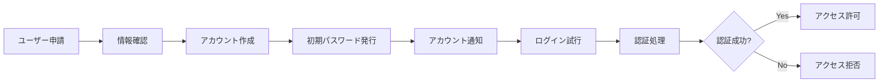

**ビジネス状態遷移**:
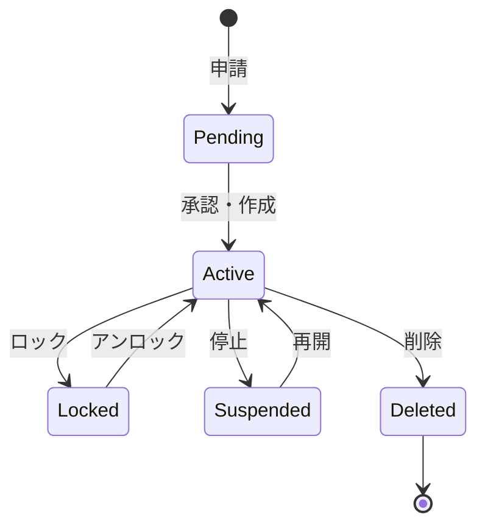

**KPI**:
- **登録処理時間**: 申請から24時間以内にアカウント作成
- **認証成功率**: 98%以上（誤入力除く）
- **初回ログイン率**: アカウント通知後48時間以内に90%がログイン
- **アカウント正確性**: 誤登録率0.5%以下

**ビジネスルール**:
- メールアドレスは組織ドメインのみ許可
- パスワードは8文字以上、英数字記号を含む
- 初回ログイン時にパスワード変更を強制
- 連続5回ログイン失敗でアカウントロック

**入力**:
- ユーザー情報（氏名、メールアドレス、所属）
- 申請理由
- 希望ロール

**出力**:
- アカウント情報（ユーザーID、初期パスワード）
- 認証トークン（JWT）
- 認証ログ

**例外処理**:
- **メールアドレス重複**: 既存アカウントの確認、統合
- **承認却下**: 申請者へ理由通知
- **認証失敗**: エラーメッセージ表示、ロックまでの残回数通知

**派生ユースケース**:
1. ユーザーアカウントを申請する
2. アカウントを承認・作成する
3. ログインする
4. ログアウトする

---

### オペレーション1-2: 多要素認証を実施する

**パターン**: Workflow

**目的**: パスワードに加えて追加の認証要素を要求し、セキュリティを強化する

**ゴール**: ユーザーが2つ以上の認証要素で本人確認され、安全にログインする

**関係者とロール**:
- **ユーザー**: MFA設定、認証コード入力
- **管理者**: MFA ポリシーの設定
- **セキュリティ管理者**: MFAの監視、強制

**プロセスフロー**:
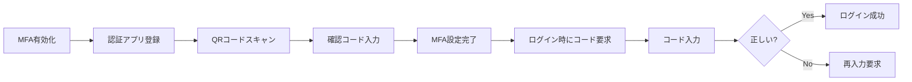

**ビジネス状態遷移**:
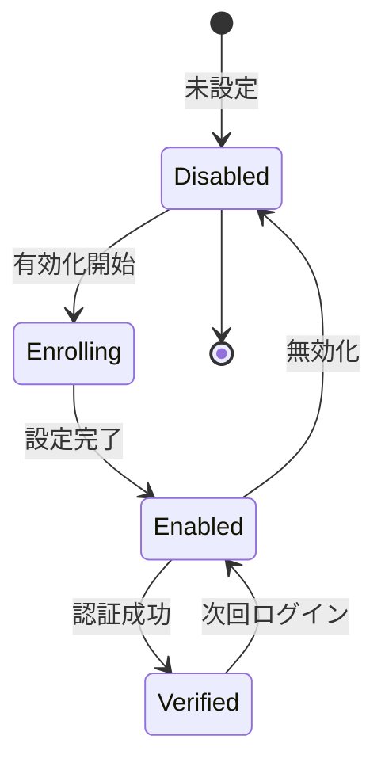

**KPI**:
- **MFA有効化率**: 全ユーザーの90%以上がMFA有効化
- **認証成功率**: MFA認証の95%以上が初回で成功
- **バックアップコード利用率**: 5%以下（紛失対応）
- **強制適用**: 管理者・財務担当は100%強制

**ビジネスルール**:
- 管理者ロールはMFA必須
- 財務・人事データアクセスはMFA必須
- バックアップコード10個を発行、使い切ったら再発行
- 認証コード有効期限30秒

**入力**:
- 認証アプリ（Google Authenticator、Authydなど）
- 秘密鍵（QRコードまたは文字列）
- 6桁認証コード

**出力**:
- MFA設定完了通知
- バックアップコードリスト
- 認証成功トークン

**例外処理**:
- **デバイス紛失**: バックアップコードで認証、管理者による再設定
- **コード期限切れ**: 新しいコードの入力要求
- **連続失敗**: 一時的にアカウントロック、管理者へ通知

**派生ユースケース**:
1. MFAを有効化する
2. 認証コードを入力する
3. バックアップコードを使用する
4. MFAをリセットする

---

### オペレーション1-3: パスワードを管理する

**パターン**: Workflow + CRUD

**目的**: パスワードの変更、リセット、ポリシー適用を管理する

**ゴール**: すべてのパスワードが強固なポリシーに準拠し、定期的に更新される

**関係者とロール**:
- **ユーザー**: パスワード変更、リセット依頼
- **管理者**: パスワードリセット、ポリシー設定
- **セキュリティ管理者**: パスワードポリシーの策定

**プロセスフロー**:
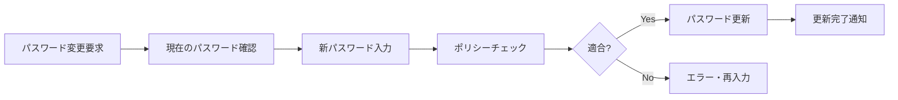

**ビジネス状態遷移**:
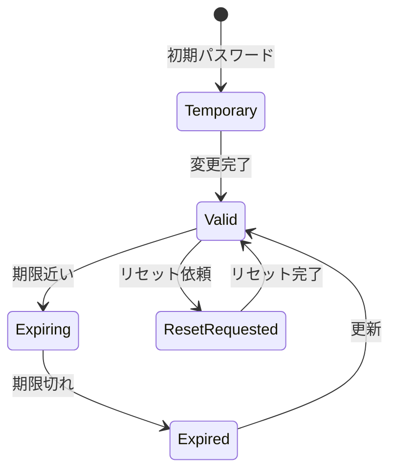

**KPI**:
- **パスワード強度**: 100%が強度基準を満たす
- **定期変更率**: 90日毎の変更率95%以上
- **リセット処理時間**: リセット依頼から1時間以内に対応
- **漏洩検知**: 既知の漏洩パスワード使用率0%

**ビジネスルール**:
- パスワード長: 最低8文字、推奨12文字以上
- 複雑性: 英大文字、英小文字、数字、記号を各1文字以上
- 有効期限: 90日（管理者は60日）
- 過去5世代のパスワード再利用禁止
- 既知の漏洩パスワードリストとの照合

**入力**:
- 現在のパスワード（変更時）
- 新しいパスワード
- 確認用パスワード
- メールアドレス（リセット時）

**出力**:
- パスワード更新完了通知
- パスワード強度スコア
- リセットメール（一時リンク）

**例外処理**:
- **ポリシー違反**: 具体的な違反理由を表示
- **リセットメール未達**: 別の連絡方法で対応
- **頻繁なリセット**: 不正アクセスの可能性を調査

**派生ユースケース**:
1. パスワードを変更する
2. パスワードをリセットする
3. パスワード強度を確認する
4. パスワードポリシーを設定する

---

## 2. アクセス権限を制御する能力

### 定義
ユーザーのアクセス権限を適切に管理し、情報資産を保護する組織能力

### 責務
- ロールベースアクセス制御（RBAC）の実装
- 権限の適切な付与と剥奪
- 最小権限の原則の適用
- 権限の定期的な見直し

### 提供価値
- **情報保護**: 適切な権限管理により、情報漏洩を防止
- **コンプライアンス**: 権限の監査証跡により、規制要件を満たす
- **運用効率化**: ロールベースの管理により、権限管理を効率化

### 実現手段
以下のビジネスオペレーションで実現：
- ロールと権限を定義する
- 権限を付与し管理する
- 権限を監査し見直す

---

### オペレーション2-1: ロールと権限を定義する

**パターン**: CRUD

**目的**: 組織で使用するロールと、各ロールに割り当てる権限を定義する

**ゴール**: すべてのロールと権限が明確に定義され、体系化される

**関係者とロール**:
- **セキュリティ管理者**: ロール・権限の定義
- **部門長**: 部門固有のロール要件の提供
- **監査担当**: 権限の妥当性確認

**プロセスフロー**:
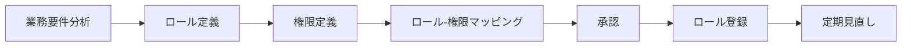

**ビジネス状態遷移**:
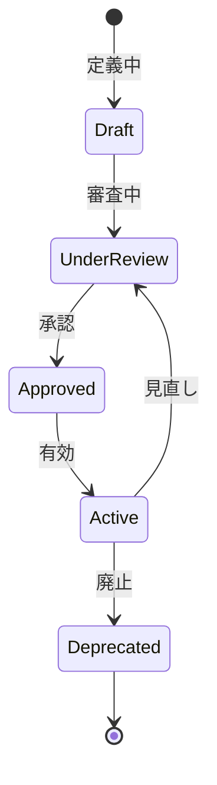

**KPI**:
- **ロールカバー率**: 業務要件の95%以上をカバー
- **権限粒度**: 適切な粒度で定義（粗すぎず細かすぎず）
- **定義更新頻度**: 年2回の見直し実施
- **利用率**: 全ロールの80%以上が実際に使用される

**ビジネスルール**:
- ロールは職務に基づいて定義（職務分離の原則）
- 権限は最小権限の原則に従う
- 管理者権限は特に厳格に管理
- 廃止ロールは6ヶ月保持後に削除

**入力**:
- 業務要件（職務、責任範囲）
- 既存のロール体系
- コンプライアンス要件
- システム機能一覧

**出力**:
- ロール定義書
- 権限マトリクス
- ロール-権限マッピング表
- 変更履歴

**例外処理**:
- **権限競合**: 職務分離の原則に基づき分割
- **定義曖昧**: 明確化のための追加ドキュメント作成
- **過剰権限**: 最小権限の原則に基づき削減

**派生ユースケース**:
1. ロールを定義する
2. 権限を定義する
3. ロールに権限を割り当てる
4. ロールを見直す

---

### オペレーション2-2: 権限を付与し管理する

**パターン**: Workflow

**目的**: ユーザーに適切なロールを割り当て、権限を付与する

**ゴール**: すべてのユーザーが適切な権限を持ち、業務を遂行できる

**関係者とロール**:
- **管理者**: 権限付与、変更、剥奪
- **申請者**: 権限申請
- **承認者**: 権限付与の承認

**プロセスフロー**:
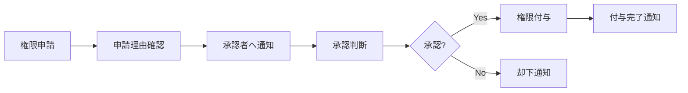

**ビジネス状態遷移**:
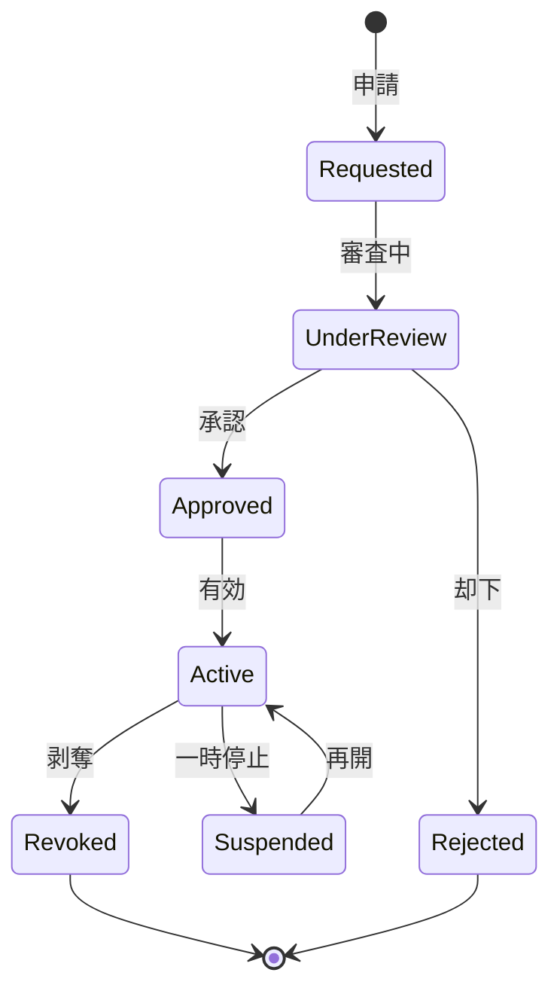

**KPI**:
- **申請処理時間**: 申請から24時間以内に承認/却下
- **承認率**: 85%以上（適切な事前確認の指標）
- **権限付与正確性**: 誤付与率0.5%以下
- **定期レビュー**: 四半期毎に全権限をレビュー

**ビジネスルール**:
- 権限申請は直属の上司が承認
- 管理者権限は役員承認必須
- 一時的な権限付与は最長30日
- 異動・退職時は即座に権限剥奪

**入力**:
- 権限申請（ロール、理由、期間）
- 申請者情報
- 業務上の必要性

**出力**:
- 権限付与記録
- 付与完了通知
- 監査ログ

**例外処理**:
- **緊急権限付与**: 事後承認可、24時間以内に申請
- **承認者不在**: 代理承認者へ自動エスカレーション
- **過剰権限**: 最小権限への調整提案

**派生ユースケース**:
1. 権限を申請する
2. 権限を承認する
3. 権限を付与する
4. 権限を剥奪する

---

### オペレーション2-3: 権限を監査し見直す

**パターン**: Analytics + Workflow

**目的**: 権限の利用状況を監査し、不要な権限を見直す

**ゴール**: すべての権限が必要最小限に保たれ、不正な権限が検知される

**関係者とロール**:
- **監査担当**: 権限の監査、レビュー実施
- **管理者**: レビュー結果に基づく権限調整
- **部門長**: 部門内権限の妥当性確認

**プロセスフロー**:
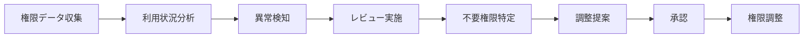

**ビジネス状態遷移**:
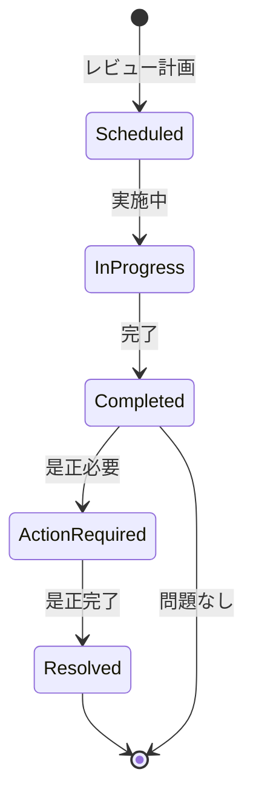

**KPI**:
- **レビュー頻度**: 四半期毎に全権限をレビュー
- **不要権限削減率**: レビュー毎に10%以上の不要権限を削減
- **異常検知率**: 不正アクセスの疑いを100%検知
- **是正完了率**: 指摘事項の90%以上を30日以内に是正

**ビジネスルール**:
- 90日以上未使用の権限は剥奪候補
- 職務変更時は全権限を再評価
- 管理者権限は月次でレビュー
- 異常なアクセスパターンは即座に調査

**入力**:
- 権限データ（ユーザー、ロール、付与日）
- アクセスログ（利用状況）
- 異動・退職データ
- コンプライアンス要件

**出力**:
- 監査レポート
- 不要権限リスト
- 異常アクセスアラート
- 是正計画

**例外処理**:
- **異常アクセス検知**: 即座にアカウント停止、調査開始
- **大量の不要権限**: 段階的に削減、影響を最小化
- **レビュー遅延**: エスカレーション、優先度を上げる

**派生ユースケース**:
1. 権限利用状況を確認する
2. 不要権限を特定する
3. 異常アクセスを検知する
4. 権限を是正する

---

## 3. 組織構造を管理する能力

### 定義
組織の階層構造、部門、チームを管理し、組織変更に柔軟に対応する組織能力

### 責務
- 組織階層の定義と管理
- 部門・チームの作成と変更
- メンバーの組織配置
- 組織変更の履歴管理

### 提供価値
- **組織可視化**: 組織構造を可視化し、コミュニケーションを円滑化
- **柔軟な組織変更**: 組織変更に迅速に対応し、影響を最小化
- **権限連動**: 組織構造とアクセス権限を連動し、管理を効率化

### 実現手段
以下のビジネスオペレーションで実現：
- 組織を定義し構築する
- 組織を変更し再編成する
- 組織階層を可視化する

---

### オペレーション3-1: 組織を定義し構築する

**パターン**: CRUD

**目的**: 組織の階層構造、部門、チームを定義し構築する

**ゴール**: 組織構造が正確に定義され、システムに反映される

**関係者とロール**:
- **人事管理者**: 組織構造の定義、管理
- **経営層**: 組織構造の承認
- **管理者**: 部門・チームの作成

**プロセスフロー**:
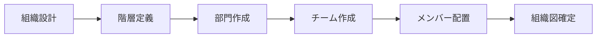

**ビジネス状態遷移**:
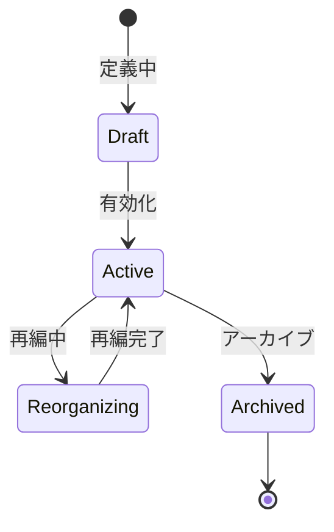

**KPI**:
- **定義完全性**: 全部門・チームが定義済み
- **階層正確性**: 組織階層の誤り0件
- **更新タイムリネス**: 組織変更を5営業日以内に反映
- **利用率**: 全メンバーの100%が組織に配置

**ビジネスルール**:
- 最大階層レベル: 5階層まで
- 部門コード: 一意の部門コードを付与
- 部門長: 各部門に1名の部門長を設定
- 兼務: メンバーは複数の組織に所属可能

**入力**:
- 組織設計書
- 部門情報（名称、コード、上位部門）
- チーム情報（名称、ミッション）
- メンバー配置情報

**出力**:
- 組織構造データ
- 組織図
- 部門・チーム一覧
- メンバー配置表

**例外処理**:
- **部門コード重複**: 一意のコードを再付与
- **循環参照**: エラー検知、階層構造を修正
- **未配置メンバー**: 警告表示、配置促進

**派生ユースケース**:
1. 組織階層を定義する
2. 部門を作成する
3. チームを作成する
4. メンバーを配置する

---

### オペレーション3-2: 組織を変更し再編成する

**パターン**: Workflow

**目的**: 組織の変更や再編成を実施し、影響を最小化する

**ゴール**: 組織変更が承認され、システムに反映され、関係者に通知される

**関係者とロール**:
- **経営層**: 組織変更の決定、承認
- **人事管理者**: 変更計画の策定、実行
- **管理者**: 権限の調整、データ移行

**プロセスフロー**:
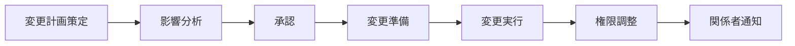

**ビジネス状態遷移**:
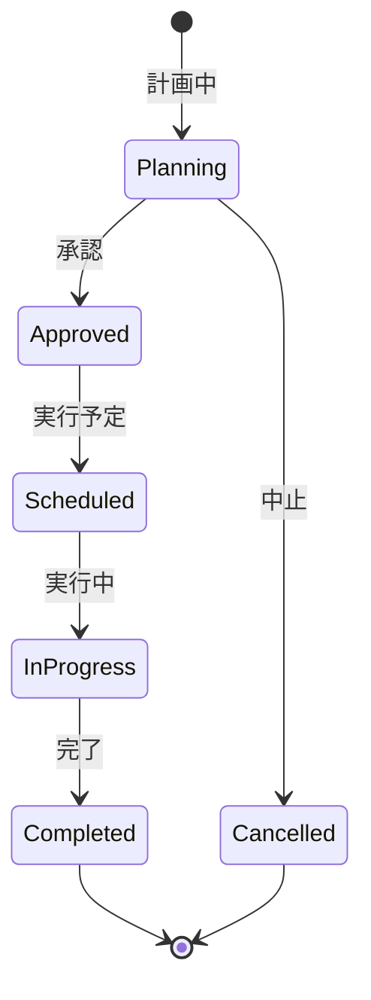

**KPI**:
- **変更処理時間**: 承認から実行まで2週間以内
- **影響最小化**: 変更に伴うシステム停止時間1時間以内
- **通知完了率**: 関係者全員への通知完了率100%
- **権限調整完了**: 変更と同時に権限調整を完了

**ビジネスルール**:
- 大規模変更（20名以上）: 役員承認必須
- 変更実施: 業務時間外に実施
- 通知: 変更の1週間前と当日に通知
- ロールバック: 問題発生時は即座にロールバック可能にする

**入力**:
- 変更計画（変更内容、理由、影響範囲）
- 新組織構造
- メンバー異動リスト
- 権限調整計画

**出力**:
- 変更完了通知
- 新組織図
- 異動辞令
- 権限変更記録

**例外処理**:
- **変更失敗**: ロールバック実行、原因調査
- **権限不整合**: 緊急修正、監査実施
- **通知未達**: 代替手段で連絡、確認

**派生ユースケース**:
1. 組織変更を計画する
2. 影響を分析する
3. 組織変更を実行する
4. 権限を調整する

---

### オペレーション3-3: 組織階層を可視化する

**パターン**: Analytics

**目的**: 組織の階層構造を可視化し、理解を促進する

**ゴール**: 組織図が作成され、全メンバーが組織構造を理解できる

**関係者とロール**:
- **人事管理者**: 組織図の作成、更新
- **マネージャー**: 部門組織図の確認
- **メンバー**: 組織図の参照

**プロセスフロー**:
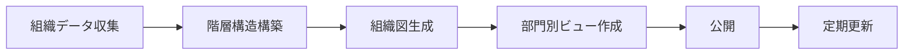

**ビジネス状態遷移**:
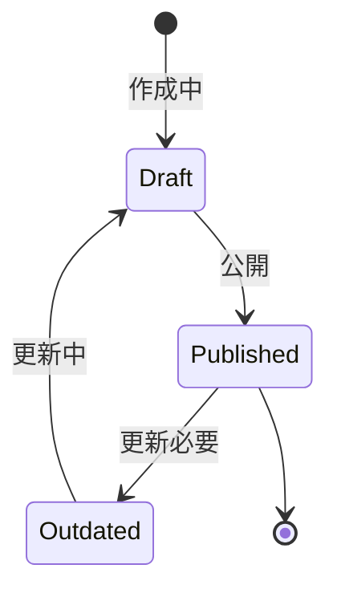

**KPI**:
- **可視化完全性**: 全組織の100%を可視化
- **更新頻度**: 組織変更後3営業日以内に更新
- **利用率**: 全メンバーの60%以上が月1回以上参照
- **正確性**: 組織図の誤り0件

**ビジネスルール**:
- 組織図の種類: 全社組織図、部門組織図、プロジェクト組織図
- 表示形式: ツリー形式、マトリクス形式
- アクセス制御: 一般メンバーは自部門のみ、管理者は全社
- 更新責任: 人事管理者が管理

**入力**:
- 組織構造データ
- メンバー情報（役職、写真）
- 部門情報（ミッション、連絡先）

**出力**:
- 組織図（画像、PDF、インタラクティブ）
- 部門別組織図
- 連絡先一覧

**例外処理**:
- **データ不完全**: 暫定図を作成、後日補完
- **大規模組織**: 階層ごとに分割表示
- **頻繁な変更**: リアルタイム更新の検討

**派生ユースケース**:
1. 全社組織図を作成する
2. 部門組織図を作成する
3. 組織図を検索する
4. 組織図を更新する

---

## 4. セキュリティを監査し保証する能力

### 定義
セキュリティイベントを記録・監査し、セキュリティポリシーの遵守を保証する組織能力

### 責務
- 監査ログの記録と保管
- セキュリティイベントの検知と分析
- コンプライアンスレポートの作成
- セキュリティポリシーの遵守確認

### 提供価値
- **セキュリティ保証**: 継続的な監査により、セキュリティレベルを保証
- **インシデント対応**: 異常を早期に検知し、被害を最小化
- **コンプライアンス**: 監査証跡により、規制要件を満たす

### 実現手段
以下のビジネスオペレーションで実現：
- 監査ログを記録し保管する
- セキュリティイベントを検知し分析する
- コンプライアンスを監査し報告する

---

### オペレーション4-1: 監査ログを記録し保管する

**パターン**: CRUD

**目的**: すべてのセキュリティ関連イベントを記録し、安全に保管する

**ゴール**: すべての監査ログが記録され、改ざん不可能な状態で保管される

**関係者とロール**:
- **システム**: 自動的にログを記録
- **管理者**: ログ設定、保管管理
- **監査担当**: ログの確認、分析

**プロセスフロー**:


**ビジネス状態遷移**:
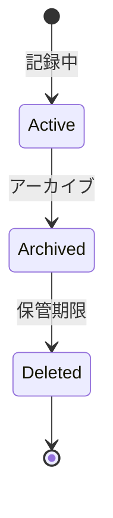

**KPI**:
- **記録率**: セキュリティイベントの100%を記録
- **保管期間**: 最低1年間保管
- **改ざん防止**: 改ざん検知率100%
- **バックアップ成功率**: 99.9%以上

**ビジネスルール**:
- 記録対象: ログイン、ログアウト、権限変更、データアクセス、設定変更
- タイムスタンプ: UTC時刻で記録
- 保管期間: 1年間（法的要件により延長可）
- アクセス制御: 監査担当のみ参照可能

**入力**:
- イベントタイプ（ログイン、権限変更など）
- ユーザーID
- タイムスタンプ
- IPアドレス
- 操作内容

**出力**:
- 監査ログレコード
- ログファイル（JSON、CSV）
- バックアップ記録

**例外処理**:
- **ログ記録失敗**: アラート発行、代替ストレージへ記録
- **ストレージ不足**: 古いログのアーカイブ、容量拡張
- **改ざん検知**: 即座にアラート、調査開始

**派生ユースケース**:
1. 監査ログを記録する
2. ログを検索する
3. ログをエクスポートする
4. ログをアーカイブする

---

### オペレーション4-2: セキュリティイベントを検知し分析する

**パターン**: Analytics

**目的**: セキュリティログを分析し、異常なイベントを検知する

**ゴール**: 不正アクセスやセキュリティ違反が早期に検知され、対応される

**関係者とロール**:
- **セキュリティ管理者**: イベント分析、対応
- **監査担当**: 定期的なログレビュー
- **インシデント対応チーム**: インシデント対応

**プロセスフロー**:
```mermaid
flowchart LR
    A[ログ収集] --> B[パターン分析]
    B --> C[異常検知]
    C --> D{脅威レベル?}
    D -->|高| E[即座にアラート]
    D -->|中| F[要注意マーク]
    D -->|低| G[記録のみ]
    E --> H[インシデント対応]
```

**ビジネス状態遷移**:
```mermaid
stateDiagram-v2
    [*] --> Normal: 正常
    Normal --> Warning: 注意
    Warning --> Critical: 危機的
    Critical --> Investigating: 調査中
    Investigating --> Resolved: 解決
    Resolved --> [*]
    Warning --> Normal: 誤検知
```

**KPI**:
- **検知率**: 既知の攻撃パターンの100%を検知
- **誤検知率**: 5%以下
- **対応時間**: 高脅威イベントを15分以内に通知
- **分析頻度**: リアルタイムで分析

**ビジネスルール**:
- 高脅威イベント: 不正ログイン、管理者権限の不正使用、大量データアクセス
- 検知パターン: 失敗ログイン連続、異常な時間帯アクセス、異常な地理位置
- アラート: 高脅威はメール・SMS、中脅威はメール、低脅威は記録のみ

**入力**:
- 監査ログデータ
- 脅威インテリジェンス
- 攻撃パターンデータベース
- ユーザー通常行動パターン

**出力**:
- セキュリティアラート
- 異常イベントレポート
- 脅威分析レポート
- 推奨対応アクション

**例外処理**:
- **誤検知**: パターンの調整、ホワイトリスト追加
- **検知漏れ**: 検知ルールの追加、改善
- **大量アラート**: トリアージ、優先度付け

**派生ユースケース**:
1. 異常イベントを検知する
2. セキュリティアラートを発行する
3. インシデントを調査する
4. 検知ルールを更新する

---

### オペレーション4-3: コンプライアンスを監査し報告する

**パターン**: Analytics + Communication

**目的**: セキュリティポリシーとコンプライアンス要件の遵守状況を監査し報告する

**ゴール**: コンプライアンス監査レポートが作成され、違反が是正される

**関係者とロール**:
- **監査担当**: コンプライアンス監査の実施
- **セキュリティ管理者**: 違反の是正
- **経営層**: 監査結果の確認、方針決定

**プロセスフロー**:
```mermaid
flowchart LR
    A[監査計画策定] --> B[監査実施]
    B --> C[証跡確認]
    C --> D[違反検出]
    D --> E[是正提案]
    E --> F[レポート作成]
    F --> G[経営層報告]
```

**ビジネス状態遷移**:
```mermaid
stateDiagram-v2
    [*] --> Scheduled: 計画
    Scheduled --> InProgress: 実施中
    InProgress --> Completed: 完了
    Completed --> ActionRequired: 是正必要
    ActionRequired --> Resolved: 是正完了
    Resolved --> [*]
    Completed --> [*]: 違反なし
```

**KPI**:
- **監査頻度**: 年2回以上実施
- **カバー率**: 全セキュリティポリシーの100%を監査
- **違反是正率**: 指摘事項の95%以上を60日以内に是正
- **レポート提出**: 監査完了後2週間以内に提出

**ビジネスルール**:
- 監査スコープ: ユーザー管理、アクセス制御、ログ管理、パスワードポリシー
- 監査基準: ISO27001、SOC2、GDPR、業界標準
- 是正期限: 重大な違反は30日以内、軽微な違反は60日以内
- フォローアップ: 是正完了を確認

**入力**:
- セキュリティポリシー
- コンプライアンス要件
- 監査ログデータ
- 権限データ
- インシデントレポート

**出力**:
- コンプライアンス監査レポート
- 違反リスト
- 是正計画
- トレンド分析

**例外処理**:
- **重大な違反**: 即座に経営層へ報告、緊急是正
- **是正遅延**: エスカレーション、リソース追加
- **監査困難**: 外部監査の検討

**派生ユースケース**:
1. コンプライアンス監査を計画する
2. 監査を実施する
3. 違反を検出する
4. 是正計画を策定する

---

## まとめ

セキュアアクセスサービスは、4つのビジネスケーパビリティと12のビジネスオペレーションから構成され、組織のアクセス権限を安全に管理し、セキュリティとコンプライアンスを確保します。

各オペレーションは明確なゴール、KPI、ビジネスルールを持ち、プロセスフローと状態遷移が定義されています。これにより、ユーザー認証からアクセス制御、組織管理、監査まで、セキュリティ管理の全プロセスが体系的に管理されます。