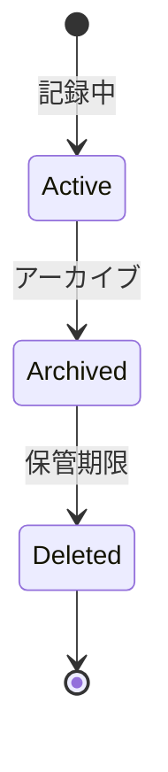

# ビジネスオペレーション: 監査ログを記録し保管する

**バージョン**: 1.0.0
**更新日**: 2025-10-01

## 概要

**目的**: すべてのセキュリティ関連イベントを記録し、安全に保管する

**パターン**: CRUD

**ゴール**: すべての監査ログが記録され、改ざん不可能な状態で保管される

## 関係者とロール

- **システム**: 自動的にログを記録
- **管理者**: ログ設定、保管管理
- **監査担当**: ログの確認、分析

## プロセスフロー

> **重要**: プロセスフローは必ず番号付きリスト形式で記述してください。
> Mermaid形式は使用せず、テキスト形式で記述することで、代替フローと例外フローが視覚的に分離されたフローチャートが自動生成されます。

1. システムがイベント発生を処理する
2. システムがログ記録を処理する
3. システムがタイムスタンプ付与を処理する
4. システムが暗号化を処理する
5. システムがストレージ保存を処理する
6. システムがバックアップを処理する
7. システムが定期アーカイブを処理する

## 代替フロー

### 代替フロー1: 情報不備
- 2-1. システムが情報の不備を検知する
- 2-2. システムが修正要求を送信する
- 2-3. ユーザーが情報を修正し再実行する
- 2-4. 基本フロー2に戻る

## 例外処理

### 例外1: システムエラー
- システムエラーが発生した場合
- エラーメッセージを表示する
- 管理者に通知し、ログに記録する

### 例外2: 承認却下
- 承認が却下された場合
- 却下理由をユーザーに通知する
- 修正後の再実行を促す

## ビジネス状態

## KPI

- **記録率**: セキュリティイベントの100%を記録
- **保管期間**: 最低1年間保管
- **改ざん防止**: 改ざん検知率100%
- **バックアップ成功率**: 99.9%以上

## ビジネスルール

- 記録対象: ログイン、ログアウト、権限変更、データアクセス、設定変更
- タイムスタンプ: UTC時刻で記録
- 保管期間: 1年間（法的要件により延長可）
- アクセス制御: 監査担当のみ参照可能

## 入出力仕様

### 入力
- イベントタイプ（ログイン、権限変更など）
- ユーザーID
- タイムスタンプ
- IPアドレス
- 操作内容

### 出力
- 監査ログレコード
- ログファイル（JSON、CSV）
- バックアップ記録

## 例外処理

- **ログ記録失敗**: アラート発行、代替ストレージへ記録
- **ストレージ不足**: 古いログのアーカイブ、容量拡張
- **改ざん検知**: 即座にアラート、調査開始

## 派生ユースケース

1. 監査ログを記録する
2. ログを検索する
3. ログをエクスポートする
4. ログをアーカイブする
