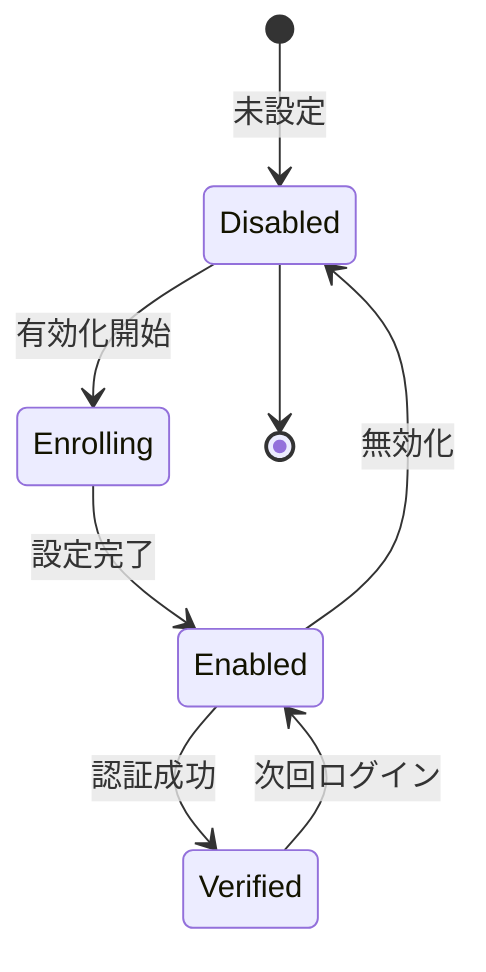

# ビジネスオペレーション: 多要素認証を実施する

**バージョン**: 2.0.0
**更新日**: 2025-10-21
**設計方針**: セキュリティ強化・段階的導入・利便性両立

## 概要

**目的**: パスワードに加えて追加の認証要素を要求し、組織全体のセキュリティ防御を劇的に強化する

**パターン**: Workflow

**ゴール**: ユーザーが2つ以上の認証要素で確実な本人確認を完了し、セキュリティ侵害リスクを最小化した状態で安全にシステムアクセスする

## 🏗️ パラソルドメイン連携

### 📊 操作エンティティ
- **MFAConfigurationEntity**（自サービス管理・状態更新: disabled → enabled → verified）: MFA設定の管理、秘密鍵保存、状態追跡
- **MFASecretEntity**（自サービス管理・CRUD）: TOTP秘密鍵の生成・保存・ローテーション
- **BackupCodeEntity**（自サービス管理・CRUD）: 緊急時バックアップコードの生成・使用・再生成

### 🏢 パラソル集約
- **MFASecurityAggregate** - MFAセキュリティ統合管理
  - **集約ルート**: MFAConfiguration
  - **包含エンティティ**: MFASecret, BackupCode, SecurityEvent
  - **不変条件**: MFA設定変更時の統制、セキュリティログ記録必須、リセット時の完全削除保証

### ⚙️ ドメインサービス
- **MFASecurityService**: strengthen[AuthenticationSecurity]() - 認証セキュリティの強化
- **MFAEnrollmentService**: enhance[UserSecurityPosture]() - ユーザーセキュリティ体制の向上
- **MFARecoveryService**: coordinate[EmergencyAccess]() - 緊急時アクセス回復の調整

#### 🔗 他サービスユースケース利用（ユースケース呼び出し型）
**責務**: ❌ エンティティ知識不要 ✅ ユースケース利用のみ

[collaboration-facilitation-service] ユースケース利用:
├── UC-NOTIFY-01: セキュリティアラートを送信する → POST /api/notifications/security-alerts
├── UC-NOTIFY-02: MFA設定完了通知を配信する → POST /api/notifications/mfa-setup
└── UC-COMM-01: IT管理者への緊急連絡を実行する → POST /api/communications/emergency-contact

[knowledge-co-creation-service] ユースケース利用:
├── UC-KNOWLEDGE-01: MFA教育資料を提供する → GET /api/knowledge/mfa-guides
└── UC-KNOWLEDGE-02: セキュリティ学習進捗を記録する → POST /api/knowledge/learning-progress

[project-success-service] ユースケース利用:
└── UC-AUDIT-01: セキュリティ監査ログを記録する → POST /api/audits/security-events

#### 🎯 マイクロサービス設計原則（ユースケース利用型）
- **自サービス管理**: 自エンティティ全CRUD + 自ユースケース実装
- **他サービス連携**: 他サービス公開ユースケース利用（エンティティ直接参照禁止）
- **ユースケース利用**: notification-service UC-NOTIFY系、knowledge-service UC-KNOWLEDGE系

## 関係者とロール

- **ユーザー**: MFA設定、認証コード入力
- **管理者**: MFAポリシーの設定
- **セキュリティ管理者**: MFAの監視、強制

## プロセスフロー

> **重要**: プロセスフローは必ず番号付きリスト形式で記述してください。
> Mermaid形式は使用せず、テキスト形式で記述することで、代替フローと例外フローが視覚的に分離されたフローチャートが自動生成されます。

1. **ユーザー**がMFA有効化を要求する → **UC-MFA-01: MFAを有効化する**
   - **自サービス操作**: MFAConfigurationEntity（状態変更: disabled → enabled）
   - **他サービスユースケース利用**: → UC-KNOWLEDGE-01: MFA教育資料を提供する
   - **必要ページ**: MFA設定開始ページ
   - **ビジネス価値**: セキュリティ防御の第一歩として認証強化を開始

2. **ユーザー**が認証アプリでQRコードをスキャンし秘密鍵を登録する → **UC-MFA-01継続**
   - **自サービス操作**: MFASecretEntity（作成・保存）
   - **集約**: MFASecurityAggregate - 設定プロセス統合管理
   - **ビジネス価値**: 物理デバイスとの紐付けによるセキュリティ確立

3. **ユーザー**が認証コード入力でMFA設定を完了する → **UC-MFA-02: 認証コードを入力する**
   - **自サービス操作**: MFAConfigurationEntity（状態変更: enabled → verified）
   - **他サービスユースケース利用**: → UC-NOTIFY-02: MFA設定完了通知を配信する
   - **必要ページ**: 認証コード入力ページ
   - **ビジネス価値**: 設定正確性の検証と本格運用開始

4. **システム**がバックアップコードを生成し安全に提供する → **UC-MFA-01継続**
   - **自サービス操作**: BackupCodeEntity（作成・暗号化保存）
   - **他サービスユースケース利用**: → UC-AUDIT-01: セキュリティ監査ログを記録する
   - **ビジネス価値**: 緊急時アクセス手段の確保

5. **ユーザー**が日常ログイン時に認証コードを入力する → **UC-MFA-02: 認証コードを入力する**
   - **自サービス操作**: 認証コード検証・ログイン許可
   - **集約**: MFASecurityAggregate - 認証統合管理
   - **ビジネス価値**: 日常的なセキュリティ確保の実現

6. **ユーザー**が緊急時にバックアップコードを使用する → **UC-MFA-03: バックアップコードを使用する**
   - **自サービス操作**: BackupCodeEntity（使用済み状態更新）
   - **他サービスユースケース利用**: → UC-NOTIFY-01: セキュリティアラートを送信する
   - **必要ページ**: バックアップコード入力ページ
   - **ビジネス価値**: デバイス紛失時の確実なアクセス継続

7. **管理者**が必要に応じてMFAリセットを実行する → **UC-MFA-04: MFAをリセットする**
   - **自サービス操作**: MFASecurityAggregate（完全削除・初期化）
   - **他サービスユースケース利用**: → UC-COMM-01: IT管理者への緊急連絡を実行する
   - **必要ページ**: 管理者MFAリセットページ
   - **ビジネス価値**: 緊急時の迅速な問題解決と業務継続性確保

8. **ユーザー**がリセット後に新規MFA設定を実行する
   - **プロセスフロー**: ステップ1に戻り設定を再開始
   - **ビジネス価値**: セキュリティ継続性の維持と改善

## 代替フロー

### 代替フロー1: 情報不備
- 2-1. システムが情報の不備を検知する
- 2-2. システムが修正要求を送信する
- 2-3. ユーザーが情報を修正し再実行する
- 2-4. 基本フロー2に戻る

## 例外処理

### 例外1: システムエラー
- システムエラーが発生した場合
- エラーメッセージを表示する
- 管理者に通知し、ログに記録する

### 例外2: 承認却下
- 承認が却下された場合
- 却下理由をユーザーに通知する
- 修正後の再実行を促す

## ビジネス状態



## KPI

- **MFA有効化率**: 全ユーザーの90%以上がMFA有効化
- **認証成功率**: MFA認証の95%以上が初回で成功
- **バックアップコード利用率**: 5%以下（紛失対応）
- **強制適用**: 管理者・財務担当は100%強制

## ビジネスルール

- 管理者ロールはMFA必須
- 財務・人事データアクセスはMFA必須
- バックアップコード10個を発行、使い切ったら再発行
- 認証コード有効期限30秒

## 入出力仕様

### 入力
- 認証アプリ（Google Authenticator、Authydなど）
- 秘密鍵（QRコードまたは文字列）
- 6桁認証コード

### 出力
- MFA設定完了通知
- バックアップコードリスト
- 認証成功トークン

## 例外処理

- **デバイス紛失**: バックアップコードで認証、管理者による再設定
- **コード期限切れ**: 新しいコードの入力要求
- **連続失敗**: 一時的にアカウントロック、管理者へ通知

## ユースケース・ページ分解マトリックス

| ユースケース | 対応ページ | 1対1関係 | ビジネス価値 |
|-------------|-----------|----------|-------------|
| UC-MFA-01: MFAを有効化する | MFA設定開始ページ | ✅ | セキュリティ防御強化の開始 |
| UC-MFA-02: 認証コードを入力する | 認証コード入力ページ | ✅ | 日常的セキュリティ確保 |
| UC-MFA-03: バックアップコードを使用する | バックアップコード入力ページ | ✅ | 緊急時アクセス継続 |
| UC-MFA-04: MFAをリセットする | 管理者MFAリセットページ | ✅ | 迅速な問題解決 |

## v2.0仕様ユースケース構造

```
usecases/
├── enable-mfa/                    # UC-MFA-01: MFAを有効化する
│   ├── usecase.md                # ユースケース定義
│   └── page.md                   # 対応ページ定義（1対1関係）
├── enter-auth-code/              # UC-MFA-02: 認証コードを入力する
│   ├── usecase.md
│   └── page.md
├── use-backup-code/              # UC-MFA-03: バックアップコードを使用する
│   ├── usecase.md
│   └── page.md
└── reset-mfa/                    # UC-MFA-04: MFAをリセットする
    ├── usecase.md
    └── page.md
```
