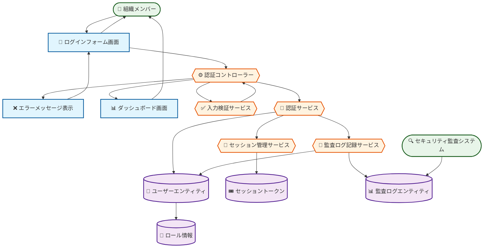

# ロバストネス図: ログインして認証する

## 図の概要

### 対象ユースケース
- **ユースケース**: ログインして認証する
- **目的**: 組織メンバーが自身のアカウント情報でログインし、システムに安全にアクセスする
- **主アクター**: 組織メンバー（Executive、PM、Consultant、Client）

### 主要な流れ
ユーザーがメールアドレスとパスワードを入力し、システムが認証処理を行い、成功すればセッションを確立してダッシュボードへ遷移する。

### 図の範囲
- **含む範囲**: ログインフォーム表示から認証成功までの基本フロー
- **含まない範囲**: MFA認証、パスワードリセット、アカウントロック解除（これらは別のユースケース）
- **前提**: ユーザーアカウントが既に作成され、有効な状態である

## アクター

### 組織メンバー
- **役割**: システムを利用する全ての組織ユーザー
- **目的**: 認証を経てシステム機能にアクセスする
- **権限**: 各自のロールに応じた権限（認証後に付与）
- **関与**:
  - ログインフォームへのアクセス
  - 認証情報の入力
  - 認証結果の確認
  - ダッシュボードへのアクセス

### セキュリティ監査システム
- **役割**: 認証イベントの記録と分析
- **目的**: セキュリティ監査とコンプライアンス確保
- **権限**: 監査ログへの書き込み権限
- **関与**: 認証試行と結果の記録

## 境界要素

### ログインフォーム画面
- **目的**: ユーザーから認証情報を受け取る
- **提供機能**:
  - メールアドレス入力フィールド
  - パスワード入力フィールド（マスク表示）
  - ログインボタン
  - パスワードリセットリンク
- **表示情報**:
  - アプリケーションロゴ
  - ログインフォームタイトル
  - エラーメッセージ表示エリア
- **受付操作**:
  - メールアドレス入力
  - パスワード入力
  - ログインボタンクリック

### ダッシュボード画面
- **目的**: 認証成功後のメイン画面を表示する
- **提供機能**:
  - ユーザー情報表示
  - ロール別メニュー表示
  - 最新通知表示
- **表示情報**:
  - ユーザー名
  - ロール
  - 最終ログイン日時
- **受付操作**:
  - 各機能へのナビゲーション

### エラーメッセージ表示
- **目的**: 認証失敗時にユーザーへフィードバック
- **提供機能**: エラー内容の明示
- **表示情報**:
  - エラーの種類（認証失敗、アカウントロック等）
  - 対処方法の案内
- **受付操作**: 再入力への誘導

## 制御要素

### 認証コントローラー
- **責務**: ログイン処理全体のフロー制御
- **処理内容**:
  1. ログインフォームから入力情報を受け取る
  2. 入力検証サービスに検証を依頼する
  3. 認証サービスに認証処理を依頼する
  4. セッション管理サービスにセッション生成を依頼する
  5. 認証結果に応じて適切な画面に遷移させる
- **ビジネスルール**:
  - メールアドレスは組織ドメインのみ許可
  - 連続5回失敗でアカウントロック
- **判断基準**: 認証成功または失敗に応じた画面遷移

### 入力検証サービス
- **責務**: 入力情報の妥当性確認
- **処理内容**:
  1. メールアドレス形式の検証
  2. パスワード入力の有無確認
  3. 必須項目チェック
- **ビジネスルール**:
  - メールアドレスはRFC5322準拠
  - パスワードは空白不可
- **連携**:
  - 入力元: 認証コントローラー
  - 出力先: 認証コントローラー（検証結果）

### 認証サービス
- **責務**: ユーザー認証の実行
- **処理内容**:
  1. ユーザーエンティティから該当ユーザーを取得
  2. 入力パスワードとハッシュ化パスワードを照合
  3. アカウント状態（Active/Locked/Suspended）を確認
  4. ログイン失敗回数をチェック
  5. 認証結果を返却
- **ビジネスルール**:
  - bcryptでパスワードハッシュを検証
  - Locked状態の場合は認証拒否
- **連携**:
  - 入力元: 認証コントローラー
  - 出力先: 認証コントローラー、セッション管理サービス

### セッション管理サービス
- **責務**: セッショントークンの生成と管理
- **処理内容**:
  1. JWT形式のセッショントークンを生成
  2. トークンにユーザーID、ロール、権限情報を埋め込む
  3. 有効期限を8時間に設定
  4. httpOnlyクッキーとして保存
- **ビジネスルール**:
  - トークン有効期限は8時間
  - httpOnlyフラグで XSS対策
- **連携**:
  - 入力元: 認証サービス
  - 出力先: 認証コントローラー

### 監査ログ記録サービス
- **責務**: 認証イベントの記録
- **処理内容**:
  1. タイムスタンプ、ユーザーID、IPアドレスを取得
  2. 認証結果（成功/失敗）を記録
  3. 失敗時は失敗理由を記録
- **ビジネスルール**:
  - すべての認証試行を記録
  - 90日間保持
- **連携**:
  - 入力元: 認証サービス
  - 出力先: 監査ログエンティティ

## エンティティ要素

### ユーザーエンティティ
- **情報内容**:
  - id: UUID（主キー）
  - email: メールアドレス
  - passwordHash: ハッシュ化パスワード
  - role: ロール（Executive, PM, Consultant, Client）
  - status: アカウント状態（Active, Locked, Suspended）
  - failedLoginAttempts: ログイン失敗回数
  - lastLoginAt: 最終ログイン日時
- **責務**: ユーザーアカウント情報の管理
- **永続性**: データベースに永続化（auth-service/data/auth.db）
- **整合性**: メールアドレスはユニーク、パスワードは必須

### セッショントークン値オブジェクト
- **情報内容**:
  - token: JWT文字列
  - userId: ユーザーID
  - role: ロール
  - permissions: 権限リスト
  - expiresAt: 有効期限
- **責務**: セッション情報の保持
- **永続性**: httpOnlyクッキーとして一時保存
- **整合性**: 有効期限内のみ有効

### 監査ログエンティティ
- **情報内容**:
  - id: UUID
  - eventType: イベント種別（LOGIN_SUCCESS, LOGIN_FAILURE）
  - userId: ユーザーID（試行したユーザー）
  - ipAddress: IPアドレス
  - userAgent: ブラウザ情報
  - timestamp: タイムスタンプ
  - details: 詳細情報（失敗理由等）
- **責務**: セキュリティイベントの記録
- **永続性**: データベースに永続化（90日間保持）
- **整合性**: タイムスタンプ必須、ユーザーIDは外部キー

### ロール情報値オブジェクト
- **情報内容**:
  - name: ロール名
  - permissions: 権限リスト（配列）
- **責務**: ロールと権限のマッピング
- **関連**: ユーザーエンティティが参照
- **更新頻度**: 低頻度（システム設定変更時のみ）

## 処理の流れ

### 基本フロー
1. **開始**: アクター「組織メンバー」が「ログインフォーム画面」にアクセス
2. **入力**: 「ログインフォーム画面」でメールアドレスとパスワードを入力
3. **検証要求**: 「ログインフォーム画面」が「認証コントローラー」にログイン要求
4. **入力検証**: 「認証コントローラー」が「入力検証サービス」に入力検証を依頼
5. **検証実行**: 「入力検証サービス」が形式と必須項目をチェック
6. **ユーザー取得**: 「認証サービス」が「ユーザーエンティティ」から該当ユーザーを取得
7. **パスワード照合**: 「認証サービス」が入力パスワードとハッシュ化パスワードを照合
8. **アカウント状態確認**: 「認証サービス」が「ユーザーエンティティ」のstatus を確認
9. **トークン生成**: 「セッション管理サービス」が「セッショントークン値オブジェクト」を生成
10. **ログ記録**: 「監査ログ記録サービス」が「監査ログエンティティ」に成功を記録
11. **結果表示**: 「ダッシュボード画面」がアクター「組織メンバー」に認証結果を表示

### 代替フロー: MFA認証が有効な場合
- **分岐点**: 基本フロー ステップ8
- **条件**: ユーザーアカウントでMFAが有効化されている
1. 「認証コントローラー」がMFA有効を検知
2. 「MFA認証画面」に遷移
3. 「MFA認証サービス」で追加認証を実行
4. 基本フロー ステップ9に合流

### エラーフロー: 認証失敗
- **発生点**: 基本フロー ステップ7
- **条件**: パスワードが一致しない
1. 「認証サービス」がパスワード不一致を検出
2. 「ユーザーエンティティ」のfailedLoginAttemptsをカウントアップ
3. 「監査ログ記録サービス」が失敗を記録
4. 「エラーメッセージ表示」にエラーメッセージを返却
5. 「エラーメッセージ表示」がアクターにエラーを表示
6. アクターが正しい情報を再入力し、ステップ2から再開

## ロバストネス図

### Mermaidダイアグラム（BCE Pattern）



### 要素の凡例

**🔐 Boundary（境界オブジェクト）**: ユーザーインターフェース要素
- ログインフォーム画面、エラーメッセージ表示、ダッシュボード画面

**⚙️ Control（制御オブジェクト）**: ビジネスロジック・処理制御
- 認証コントローラー、入力検証サービス、認証サービス、セッション管理サービス、監査ログ記録サービス

**👤 Entity（実体オブジェクト）**: データ・ドメインオブジェクト
- ユーザーエンティティ、セッショントークン、監査ログエンティティ、ロール情報

### テキスト表現
```
[組織メンバー] → [ログインフォーム画面] : メールアドレス・パスワード入力
              [ログインフォーム画面] → [認証コントローラー] : ログイン要求
                                     [認証コントローラー] → [入力検証サービス] : 検証依頼
                                                          [入力検証サービス] → [認証コントローラー] : 検証結果
                                     [認証コントローラー] → [認証サービス] : 認証依頼
                                                          [認証サービス] → [ユーザーエンティティ] : ユーザー取得
                                                          [認証サービス] → [ユーザーエンティティ] : パスワード照合
                                                          [認証サービス] → [セッション管理サービス] : トークン生成依頼
                                                                          [セッション管理サービス] → [セッショントークン] : トークン作成
                                                          [認証サービス] → [監査ログ記録サービス] : ログ記録依頼
                                                                          [監査ログ記録サービス] → [監査ログエンティティ] : ログ保存
                                     [認証コントローラー] → [ダッシュボード画面] : 画面遷移
              [ダッシュボード画面] → [組織メンバー] : 認証成功表示
```

### レイヤー別要素配置
```
プレゼンテーション層:
  [ログインフォーム画面] -- [エラーメッセージ表示] -- [ダッシュボード画面]

ビジネスロジック層:
  [認証コントローラー] -- [入力検証サービス] -- [認証サービス] -- [セッション管理サービス] -- [監査ログ記録サービス]

データ層:
  [ユーザーエンティティ] -- [セッショントークン] -- [監査ログエンティティ] -- [ロール情報]
```

### 主要な相互作用
1. **入力フェーズ**: 組織メンバー → ログインフォーム → 認証コントローラー → 入力検証サービス
2. **認証フェーズ**: 認証サービス ↔ ユーザーエンティティ
3. **セッション確立フェーズ**: セッション管理サービス → セッショントークン
4. **監査記録フェーズ**: 監査ログ記録サービス → 監査ログエンティティ
5. **出力フェーズ**: 認証コントローラー → ダッシュボード画面 → 組織メンバー

## 設計上の注意点

### 責務の分離
- **境界要素**: 入力受付と結果表示のみ（認証ロジックを含まない）
- **制御要素**: 認証処理とセッション管理（UI要素を含まない）
- **エンティティ**: データの保持のみ（ビジネスロジックを含まない）

### 結合度
- 認証コントローラーは各サービスと疎結合（インターフェース経由で連携）
- ログインフォームは認証コントローラーとのみ通信
- エンティティは受動的（サービスから呼ばれるのみ）

### 凝集度
- 入力検証サービスは検証のみに責務を限定
- 認証サービスは認証処理のみに特化
- セッション管理サービスはセッション関連のみを扱う

### 拡張性
- 新しい認証方式（OAuth、SAML）の追加が容易
- MFA等の追加認証要素を独立したサービスとして追加可能
- 監査ログの出力先変更が他に影響しない

### エラー処理
- すべての境界要素でエラー表示が可能
- 制御要素でエラーを適切にハンドリング
- エラー情報は利用者に分かりやすく伝達（具体的なセキュリティ情報は隠蔽）

## 実装への考慮事項

### パフォーマンス
- パスワードハッシュ照合は計算コストが高い（bcryptのラウンド数を適切に設定）
- セッショントークンはメモリキャッシュで高速化
- 頻繁なログイン試行への対策（レートリミット）

### セキュリティ
- パスワードは必ずハッシュ化して保存（平文保存禁止）
- セッショントークンはhttpOnlyクッキーで保存（XSS対策）
- 監査ログは改ざん防止のため追記のみ
- エラーメッセージで具体的なセキュリティ情報を漏らさない（「メールアドレスまたはパスワードが誤っています」と一般化）

### 保守性
- 認証方式の変更が容易（認証サービスのみ修正）
- ロールと権限の追加が独立して可能
- 監査ログフォーマットの変更が容易
