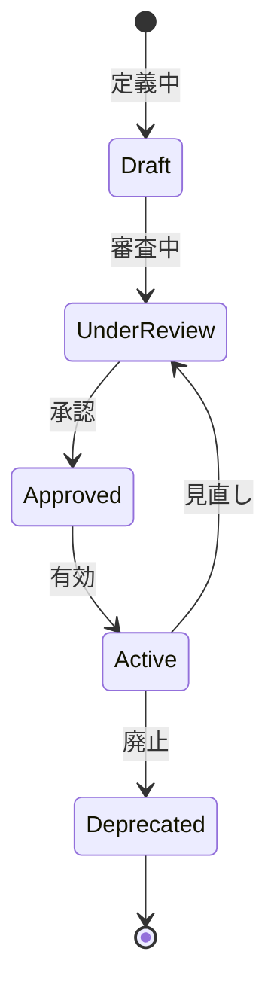

# ビジネスオペレーション: ロールと権限を定義する

**バージョン**: 1.0.0
**更新日**: 2025-10-01

## 概要

**目的**: 組織で使用するロールと、各ロールに割り当てる権限を定義する

**パターン**: CRUD

**ゴール**: すべてのロールと権限が明確に定義され、体系化される

## 関係者とロール

- **セキュリティ管理者**: ロール・権限の定義
- **部門長**: 部門固有のロール要件の提供
- **監査担当**: 権限の妥当性確認

## プロセスフロー

> **重要**: プロセスフローは必ず番号付きリスト形式で記述してください。
> Mermaid形式は使用せず、テキスト形式で記述することで、代替フローと例外フローが視覚的に分離されたフローチャートが自動生成されます。

1. システムが業務要件分析を処理する
2. システムがロール定義を処理する
3. システムが権限定義を処理する
4. システムがロール-権限マッピングを処理する
5. システムが承認を行う
6. ユーザーがロール登録を行う
7. システムが定期見直しを処理する

## 代替フロー

### 代替フロー1: 情報不備
- 2-1. システムが情報の不備を検知する
- 2-2. システムが修正要求を送信する
- 2-3. ユーザーが情報を修正し再実行する
- 2-4. 基本フロー2に戻る

## 例外処理

### 例外1: システムエラー
- システムエラーが発生した場合
- エラーメッセージを表示する
- 管理者に通知し、ログに記録する

### 例外2: 承認却下
- 承認が却下された場合
- 却下理由をユーザーに通知する
- 修正後の再実行を促す

## ビジネス状態

## KPI

- **ロールカバー率**: 業務要件の95%以上をカバー
- **権限粒度**: 適切な粒度で定義（粗すぎず細かすぎず）
- **定義更新頻度**: 年2回の見直し実施
- **利用率**: 全ロールの80%以上が実際に使用される

## ビジネスルール

- ロールは職務に基づいて定義（職務分離の原則）
- 権限は最小権限の原則に従う
- 管理者権限は特に厳格に管理
- 廃止ロールは6ヶ月保持後に削除

## 入出力仕様

### 入力
- 業務要件（職務、責任範囲）
- 既存のロール体系
- コンプライアンス要件
- システム機能一覧

### 出力
- ロール定義書
- 権限マトリクス
- ロール-権限マッピング表
- 変更履歴

## 例外処理

- **権限競合**: 職務分離の原則に基づき分割
- **定義曖昧**: 明確化のための追加ドキュメント作成
- **過剰権限**: 最小権限の原則に基づき削減

## 派生ユースケース

1. ロールを定義する
2. 権限を定義する
3. ロールに権限を割り当てる
4. ロールを見直す
