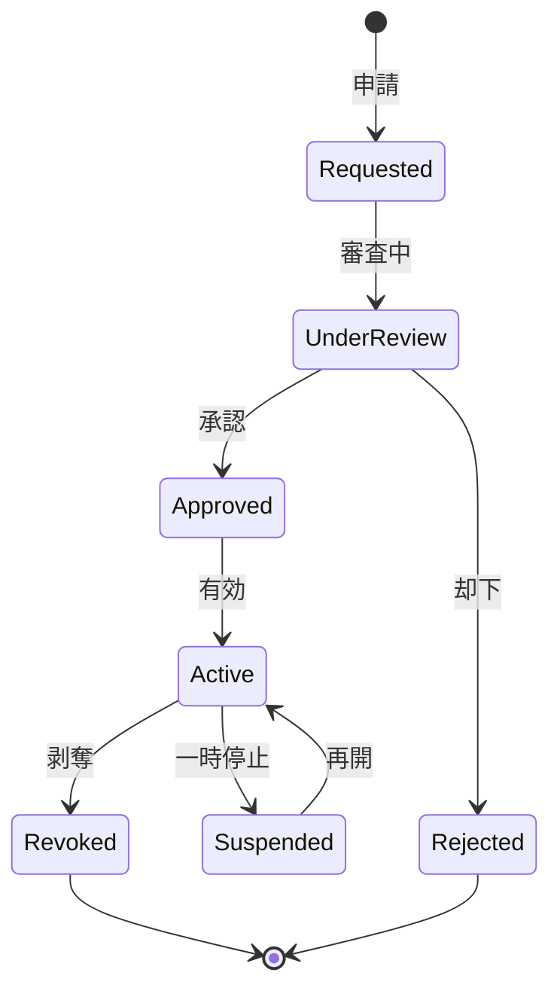

# ビジネスオペレーション: 権限を付与し管理する

**バージョン**: 1.0.0
**更新日**: 2025-10-01

## 概要

**目的**: ユーザーに適切なロールを割り当て、権限を付与する

**パターン**: Workflow

**ゴール**: すべてのユーザーが適切な権限を持ち、業務を遂行できる

## 関係者とロール

- **管理者**: 権限付与、変更、剥奪
- **申請者**: 権限申請
- **承認者**: 権限付与の承認

## プロセスフロー

> **重要**: プロセスフローは必ず番号付きリスト形式で記述してください。
> Mermaid形式は使用せず、テキスト形式で記述することで、代替フローと例外フローが視覚的に分離されたフローチャートが自動生成されます。

1. ユーザーが権限申請を行う
2. ユーザーが申請理由確認を行う
3. システムが承認者へ通知を行う
4. システムが承認判断を行う
5. システムが権限付与を処理する
6. システムが却下通知を行う
7. システムが付与完了通知を行う

## 代替フロー

### 代替フロー1: 情報不備
- 2-1. システムが情報の不備を検知する
- 2-2. システムが修正要求を送信する
- 2-3. ユーザーが情報を修正し再実行する
- 2-4. 基本フロー2に戻る

## 例外処理

### 例外1: システムエラー
- システムエラーが発生した場合
- エラーメッセージを表示する
- 管理者に通知し、ログに記録する

### 例外2: 承認却下
- 承認が却下された場合
- 却下理由をユーザーに通知する
- 修正後の再実行を促す

## ビジネス状態

## KPI

- **申請処理時間**: 申請から24時間以内に承認/却下
- **承認率**: 85%以上（適切な事前確認の指標）
- **権限付与正確性**: 誤付与率0.5%以下
- **定期レビュー**: 四半期毎に全権限をレビュー

## ビジネスルール

- 権限申請は直属の上司が承認
- 管理者権限は役員承認必須
- 一時的な権限付与は最長30日
- 異動・退職時は即座に権限剥奪

## 入出力仕様

### 入力
- 権限申請（ロール、理由、期間）
- 申請者情報
- 業務上の必要性

### 出力
- 権限付与記録
- 付与完了通知
- 監査ログ

## 例外処理

- **緊急権限付与**: 事後承認可、24時間以内に申請
- **承認者不在**: 代理承認者へ自動エスカレーション
- **過剰権限**: 最小権限への調整提案

## 派生ユースケース

1. 権限を申請する
2. 権限を承認する
3. 権限を付与する
4. 権限を剥奪する
