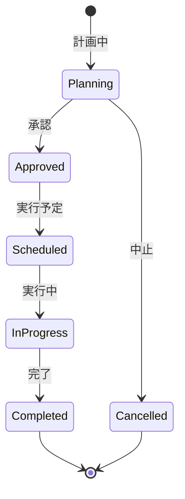

# ビジネスオペレーション: 組織を変更し再編成する

**バージョン**: 1.0.0
**更新日**: 2025-10-01

## 概要

**目的**: 組織の変更や再編成を実施し、影響を最小化する

**パターン**: Workflow

**ゴール**: 組織変更が承認され、システムに反映され、関係者に通知される

## 関係者とロール

- **経営層**: 組織変更の決定、承認
- **人事管理者**: 変更計画の策定、実行
- **管理者**: 権限の調整、データ移行

## プロセスフロー

> **重要**: プロセスフローは必ず番号付きリスト形式で記述してください。
> Mermaid形式は使用せず、テキスト形式で記述することで、代替フローと例外フローが視覚的に分離されたフローチャートが自動生成されます。

1. システムが変更計画策定を処理する
2. システムが影響分析を処理する
3. システムが承認を行う
4. システムが変更準備を処理する
5. システムが変更実行を実行する
6. システムが権限調整を処理する
7. システムが関係者通知を行う

## 代替フロー

### 代替フロー1: 情報不備
- 2-1. システムが情報の不備を検知する
- 2-2. システムが修正要求を送信する
- 2-3. ユーザーが情報を修正し再実行する
- 2-4. 基本フロー2に戻る

## 例外処理

### 例外1: システムエラー
- システムエラーが発生した場合
- エラーメッセージを表示する
- 管理者に通知し、ログに記録する

### 例外2: 承認却下
- 承認が却下された場合
- 却下理由をユーザーに通知する
- 修正後の再実行を促す

## ビジネス状態

## KPI

- **変更処理時間**: 承認から実行まで2週間以内
- **影響最小化**: 変更に伴うシステム停止時間1時間以内
- **通知完了率**: 関係者全員への通知完了率100%
- **権限調整完了**: 変更と同時に権限調整を完了

## ビジネスルール

- 大規模変更（20名以上）: 役員承認必須
- 変更実施: 業務時間外に実施
- 通知: 変更の1週間前と当日に通知
- ロールバック: 問題発生時は即座にロールバック可能にする

## 入出力仕様

### 入力
- 変更計画（変更内容、理由、影響範囲）
- 新組織構造
- メンバー異動リスト
- 権限調整計画

### 出力
- 変更完了通知
- 新組織図
- 異動辞令
- 権限変更記録

## 例外処理

- **変更失敗**: ロールバック実行、原因調査
- **権限不整合**: 緊急修正、監査実施
- **通知未達**: 代替手段で連絡、確認

## 派生ユースケース

1. 組織変更を計画する
2. 影響を分析する
3. 組織変更を実行する
4. 権限を調整する
