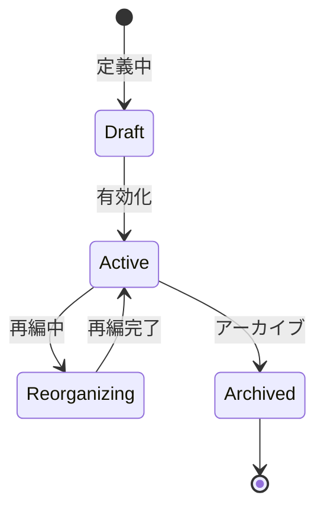

# ビジネスオペレーション: 組織を定義し構築する

**バージョン**: 1.0.0
**更新日**: 2025-10-01

## 概要

**目的**: 組織の階層構造、部門、チームを定義し構築する

**パターン**: CRUD

**ゴール**: 組織構造が正確に定義され、システムに反映される

## 関係者とロール

- **人事管理者**: 組織構造の定義、管理
- **経営層**: 組織構造の承認
- **管理者**: 部門・チームの作成

## プロセスフロー

> **重要**: プロセスフローは必ず番号付きリスト形式で記述してください。
> Mermaid形式は使用せず、テキスト形式で記述することで、代替フローと例外フローが視覚的に分離されたフローチャートが自動生成されます。

1. システムが組織設計を処理する
2. システムが階層定義を処理する
3. システムが部門作成を行う
4. システムがチーム作成を行う
5. システムがメンバー配置を処理する
6. システムが組織図確定を処理する

## 代替フロー

### 代替フロー1: 情報不備
- 2-1. システムが情報の不備を検知する
- 2-2. システムが修正要求を送信する
- 2-3. ユーザーが情報を修正し再実行する
- 2-4. 基本フロー2に戻る

## 例外処理

### 例外1: システムエラー
- システムエラーが発生した場合
- エラーメッセージを表示する
- 管理者に通知し、ログに記録する

### 例外2: 承認却下
- 承認が却下された場合
- 却下理由をユーザーに通知する
- 修正後の再実行を促す

## ビジネス状態

## KPI

- **定義完全性**: 全部門・チームが定義済み
- **階層正確性**: 組織階層の誤り0件
- **更新タイムリネス**: 組織変更を5営業日以内に反映
- **利用率**: 全メンバーの100%が組織に配置

## ビジネスルール

- 最大階層レベル: 5階層まで
- 部門コード: 一意の部門コードを付与
- 部門長: 各部門に1名の部門長を設定
- 兼務: メンバーは複数の組織に所属可能

## 入出力仕様

### 入力
- 組織設計書
- 部門情報（名称、コード、上位部門）
- チーム情報（名称、ミッション）
- メンバー配置情報

### 出力
- 組織構造データ
- 組織図
- 部門・チーム一覧
- メンバー配置表

## 例外処理

- **部門コード重複**: 一意のコードを再付与
- **循環参照**: エラー検知、階層構造を修正
- **未配置メンバー**: 警告表示、配置促進

## 派生ユースケース

1. 組織階層を定義する
2. 部門を作成する
3. チームを作成する
4. メンバーを配置する
