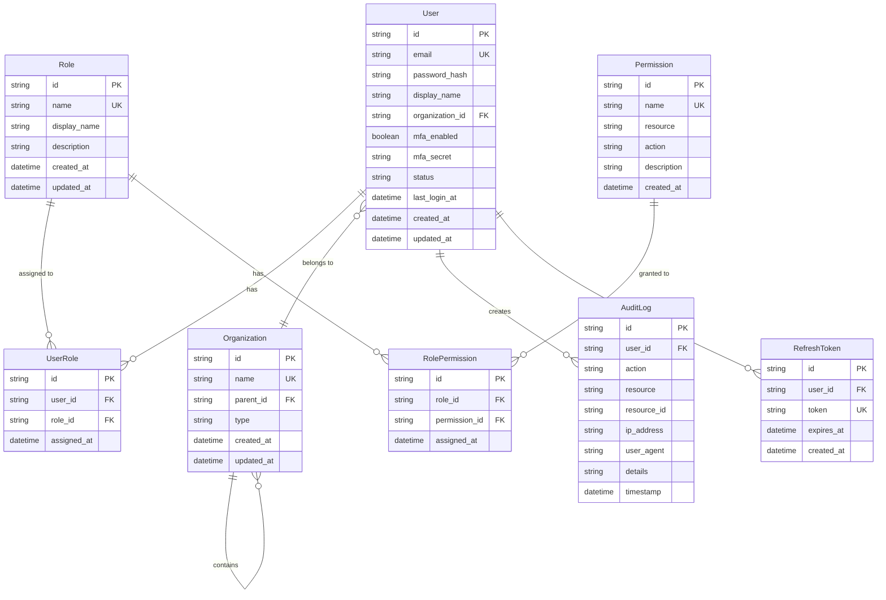

# セキュアアクセスサービス データベース設計書

**バージョン**: v1.0.0
**最終更新日**: 2025-01-15

---

## 1. 設計概要

### データベース仕様
**DBMS**: SQLite 3.x
**文字エンコーディング**: UTF-8
**データベースファイル**: `prisma/auth-service/data/auth.db`

### 設計方針
- ユーザー認証・認可に特化した設計
- 組織階層構造の柔軟な表現
- 監査ログによる操作履歴の完全記録
- パフォーマンスとセキュリティのバランス

---

## 2. ER図



---

## 3. テーブル定義

### Userテーブル

**テーブル名**: `users`
**目的**: システム利用者の認証情報とプロファイルを管理

| カラム名 | データ型 | NULL | デフォルト | 制約 | 説明 |
|---------|---------|------|-----------|------|------|
| id | TEXT | NOT NULL | cuid() | PK | ユーザーID |
| email | TEXT | NOT NULL | - | UNIQUE | メールアドレス |
| password_hash | TEXT | NOT NULL | - | - | パスワードハッシュ（bcrypt） |
| display_name | TEXT | NOT NULL | - | - | 表示名 |
| organization_id | TEXT | NOT NULL | - | FK | 所属組織ID |
| mfa_enabled | INTEGER | NOT NULL | 0 | - | MFA有効フラグ（0/1） |
| mfa_secret | TEXT | NULL | - | - | MFA秘密鍵（TOTP） |
| status | TEXT | NOT NULL | 'active' | CHECK | ステータス（active/suspended/deleted） |
| last_login_at | TEXT | NULL | - | - | 最終ログイン日時 |
| created_at | TEXT | NOT NULL | CURRENT_TIMESTAMP | - | 作成日時 |
| updated_at | TEXT | NOT NULL | CURRENT_TIMESTAMP | - | 更新日時 |

**インデックス**:
```sql
PRIMARY KEY (id)
UNIQUE INDEX idx_users_email (email)
INDEX idx_users_organization_id (organization_id)
INDEX idx_users_status (status)
```

**制約**:
```sql
CHECK (status IN ('active', 'suspended', 'deleted'))
CHECK (length(email) >= 5 AND email LIKE '%@%')
CHECK (length(display_name) >= 1)
FOREIGN KEY (organization_id) REFERENCES organizations(id) ON DELETE RESTRICT
```

---

### Organizationテーブル

**テーブル名**: `organizations`
**目的**: 組織階層構造とテナント情報を管理

| カラム名 | データ型 | NULL | デフォルト | 制約 | 説明 |
|---------|---------|------|-----------|------|------|
| id | TEXT | NOT NULL | cuid() | PK | 組織ID |
| name | TEXT | NOT NULL | - | UNIQUE | 組織名 |
| parent_id | TEXT | NULL | - | FK | 親組織ID |
| type | TEXT | NOT NULL | 'client' | CHECK | 組織種別（internal/client/partner） |
| created_at | TEXT | NOT NULL | CURRENT_TIMESTAMP | - | 作成日時 |
| updated_at | TEXT | NOT NULL | CURRENT_TIMESTAMP | - | 更新日時 |

**インデックス**:
```sql
PRIMARY KEY (id)
UNIQUE INDEX idx_organizations_name (name)
INDEX idx_organizations_parent_id (parent_id)
INDEX idx_organizations_type (type)
```

**制約**:
```sql
CHECK (type IN ('internal', 'client', 'partner'))
FOREIGN KEY (parent_id) REFERENCES organizations(id) ON DELETE SET NULL
```

---

### Roleテーブル

**テーブル名**: `roles`
**目的**: ユーザーロールの定義

| カラム名 | データ型 | NULL | デフォルト | 制約 | 説明 |
|---------|---------|------|-----------|------|------|
| id | TEXT | NOT NULL | cuid() | PK | ロールID |
| name | TEXT | NOT NULL | - | UNIQUE | ロール識別子（システム名） |
| display_name | TEXT | NOT NULL | - | - | ロール表示名 |
| description | TEXT | NULL | - | - | ロール説明 |
| created_at | TEXT | NOT NULL | CURRENT_TIMESTAMP | - | 作成日時 |
| updated_at | TEXT | NOT NULL | CURRENT_TIMESTAMP | - | 更新日時 |

**インデックス**:
```sql
PRIMARY KEY (id)
UNIQUE INDEX idx_roles_name (name)
```

**初期データ**:
- Executive（エグゼクティブ）
- PM（プロジェクトマネージャー）
- Consultant（コンサルタント）
- Client（クライアント）
- Admin（管理者）

---

### UserRoleテーブル

**テーブル名**: `user_roles`
**目的**: ユーザーとロールの多対多関係

| カラム名 | データ型 | NULL | デフォルト | 制約 | 説明 |
|---------|---------|------|-----------|------|------|
| id | TEXT | NOT NULL | cuid() | PK | レコードID |
| user_id | TEXT | NOT NULL | - | FK | ユーザーID |
| role_id | TEXT | NOT NULL | - | FK | ロールID |
| assigned_at | TEXT | NOT NULL | CURRENT_TIMESTAMP | - | 割り当て日時 |

**インデックス**:
```sql
PRIMARY KEY (id)
UNIQUE INDEX idx_user_roles_unique (user_id, role_id)
INDEX idx_user_roles_user_id (user_id)
INDEX idx_user_roles_role_id (role_id)
```

**制約**:
```sql
FOREIGN KEY (user_id) REFERENCES users(id) ON DELETE CASCADE
FOREIGN KEY (role_id) REFERENCES roles(id) ON DELETE CASCADE
```

---

### Permissionテーブル

**テーブル名**: `permissions`
**目的**: システム権限の定義

| カラム名 | データ型 | NULL | デフォルト | 制約 | 説明 |
|---------|---------|------|-----------|------|------|
| id | TEXT | NOT NULL | cuid() | PK | 権限ID |
| name | TEXT | NOT NULL | - | UNIQUE | 権限識別子（例: project:read） |
| resource | TEXT | NOT NULL | - | - | リソース種別 |
| action | TEXT | NOT NULL | - | CHECK | アクション（read/write/delete/admin） |
| description | TEXT | NULL | - | - | 権限説明 |
| created_at | TEXT | NOT NULL | CURRENT_TIMESTAMP | - | 作成日時 |

**インデックス**:
```sql
PRIMARY KEY (id)
UNIQUE INDEX idx_permissions_name (name)
INDEX idx_permissions_resource (resource)
```

**制約**:
```sql
CHECK (action IN ('read', 'write', 'delete', 'admin'))
```

---

### RolePermissionテーブル

**テーブル名**: `role_permissions`
**目的**: ロールと権限の多対多関係

| カラム名 | データ型 | NULL | デフォルト | 制約 | 説明 |
|---------|---------|------|-----------|------|------|
| id | TEXT | NOT NULL | cuid() | PK | レコードID |
| role_id | TEXT | NOT NULL | - | FK | ロールID |
| permission_id | TEXT | NOT NULL | - | FK | 権限ID |
| assigned_at | TEXT | NOT NULL | CURRENT_TIMESTAMP | - | 割り当て日時 |

**インデックス**:
```sql
PRIMARY KEY (id)
UNIQUE INDEX idx_role_permissions_unique (role_id, permission_id)
INDEX idx_role_permissions_role_id (role_id)
INDEX idx_role_permissions_permission_id (permission_id)
```

**制約**:
```sql
FOREIGN KEY (role_id) REFERENCES roles(id) ON DELETE CASCADE
FOREIGN KEY (permission_id) REFERENCES permissions(id) ON DELETE CASCADE
```

---

### AuditLogテーブル

**テーブル名**: `audit_logs`
**目的**: 全操作の監査ログ記録

| カラム名 | データ型 | NULL | デフォルト | 制約 | 説明 |
|---------|---------|------|-----------|------|------|
| id | TEXT | NOT NULL | cuid() | PK | ログID |
| user_id | TEXT | NOT NULL | - | FK | 実行ユーザーID |
| action | TEXT | NOT NULL | - | - | アクション種別 |
| resource | TEXT | NOT NULL | - | - | 対象リソース |
| resource_id | TEXT | NULL | - | - | リソースID |
| ip_address | TEXT | NULL | - | - | IPアドレス |
| user_agent | TEXT | NULL | - | - | ユーザーエージェント |
| details | TEXT | NULL | - | - | 詳細情報（JSON） |
| timestamp | TEXT | NOT NULL | CURRENT_TIMESTAMP | - | 実行日時 |

**インデックス**:
```sql
PRIMARY KEY (id)
INDEX idx_audit_logs_user_id (user_id)
INDEX idx_audit_logs_action (action)
INDEX idx_audit_logs_timestamp (timestamp)
INDEX idx_audit_logs_resource (resource, resource_id)
```

**制約**:
```sql
FOREIGN KEY (user_id) REFERENCES users(id) ON DELETE SET NULL
```

**パーティション戦略**（将来）:
- 日付別パーティション
- 3ヶ月以上前のログはアーカイブ

---

### RefreshTokenテーブル

**テーブル名**: `refresh_tokens`
**目的**: JWTリフレッシュトークンの管理

| カラム名 | データ型 | NULL | デフォルト | 制約 | 説明 |
|---------|---------|------|-----------|------|------|
| id | TEXT | NOT NULL | cuid() | PK | トークンID |
| user_id | TEXT | NOT NULL | - | FK | ユーザーID |
| token | TEXT | NOT NULL | - | UNIQUE | リフレッシュトークン |
| expires_at | TEXT | NOT NULL | - | - | 有効期限 |
| created_at | TEXT | NOT NULL | CURRENT_TIMESTAMP | - | 作成日時 |

**インデックス**:
```sql
PRIMARY KEY (id)
UNIQUE INDEX idx_refresh_tokens_token (token)
INDEX idx_refresh_tokens_user_id (user_id)
INDEX idx_refresh_tokens_expires_at (expires_at)
```

**制約**:
```sql
FOREIGN KEY (user_id) REFERENCES users(id) ON DELETE CASCADE
CHECK (expires_at > created_at)
```

**クリーンアップ**:
- 期限切れトークンは1日1回自動削除

---

## 4. パフォーマンス設計

### インデックス戦略

#### 頻繁なクエリパターン
1. **ユーザーログイン**: `email`での検索 → UNIQUE INDEX
2. **権限チェック**: `user_id` → `role_id` → `permission_id` の結合クエリ
3. **監査ログ検索**: `user_id`, `timestamp`, `resource`での絞り込み
4. **組織階層**: `parent_id`での再帰的検索

#### 複合インデックス（将来の最適化）
```sql
-- ユーザー検索
CREATE INDEX idx_users_org_status ON users(organization_id, status);

-- 監査ログ検索
CREATE INDEX idx_audit_timestamp_user ON audit_logs(timestamp DESC, user_id);
```

### クエリ最適化例

#### ユーザー権限チェック
```sql
-- ユーザーの全権限を取得
SELECT DISTINCT p.name, p.resource, p.action
FROM users u
JOIN user_roles ur ON u.id = ur.user_id
JOIN role_permissions rp ON ur.role_id = rp.role_id
JOIN permissions p ON rp.permission_id = p.id
WHERE u.id = ?
  AND u.status = 'active';
```

#### 組織階層取得（再帰CTE）
```sql
-- ある組織の全子組織を取得
WITH RECURSIVE org_tree AS (
  SELECT id, name, parent_id, 0 as level
  FROM organizations
  WHERE id = ?

  UNION ALL

  SELECT o.id, o.name, o.parent_id, ot.level + 1
  FROM organizations o
  JOIN org_tree ot ON o.parent_id = ot.id
)
SELECT * FROM org_tree;
```

---

## 5. セキュリティ設計

### データ暗号化

#### 保存時
- **パスワード**: bcrypt（コスト12）
- **MFA秘密鍵**: AES-256暗号化（アプリケーション層）

#### 通信時
- SSL/TLS（HTTPS）必須

### アクセス制御

#### アプリケーションレベル
```typescript
// ロールベースアクセス制御（RBAC）
function checkPermission(userId: string, permission: string): Promise<boolean>

// リソースベースアクセス制御（RBAC）
function checkResourceAccess(userId: string, resource: string, resourceId: string): Promise<boolean>
```

### 監査ログ記録対象
- ログイン/ログアウト
- ロール・権限変更
- ユーザー作成/更新/削除（論理削除）
- MFA設定変更
- 組織変更
- パスワード変更

---

## 6. 運用設計

### バックアップ戦略
- **フルバックアップ**: 日次（午前2時）
- **保管期間**: 30日間
- **バックアップ先**: AWS S3またはローカルストレージ

### データ保持ポリシー
| データ種別 | 保持期間 |
|-----------|---------|
| ユーザーアカウント | 削除申請から30日後に物理削除 |
| 監査ログ | 3ヶ月（アーカイブ後3年保管） |
| リフレッシュトークン | 7日間（自動削除） |

### 監視項目
- **接続数**: 最大接続数の80%以下
- **レスポンス時間**: 平均50ms以下
- **ディスク使用量**: 80%以下

### メンテナンス
```sql
-- 期限切れトークンの削除（日次バッチ）
DELETE FROM refresh_tokens WHERE expires_at < datetime('now');

-- 古い監査ログのアーカイブ（月次バッチ）
-- アーカイブ処理はアプリケーション層で実装
```

---

## 7. マイグレーション戦略

### スキーマ変更方針
- Prismaマイグレーション機能を使用
- 本番環境への適用前に必ずバックアップ
- 大規模データ変更はメンテナンスウィンドウで実施

### ロールバック計画
- マイグレーション失敗時は自動ロールバック
- データ不整合が発生した場合は直前のバックアップから復元

---

**ドキュメント管理**:
- 作成日: 2025-01-15
- 作成者: System
- レビュー状態: Draft
