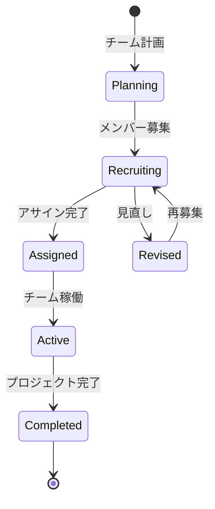

# ビジネスオペレーション: チームを編成する

**バージョン**: 2.0.0
**更新日**: 2025-10-28
**パラソル設計仕様**: v2.0準拠

## 概要

**目的**: プロジェクトに最適なメンバーを選定し、高パフォーマンスチームを編成して、プロジェクト成功確率を最大化する

**パターン**: Workflow

**ゴール**: プロジェクト要件を満たし、スキルバランスが最適化された高パフォーマンスチームの編成完了

## パラソルドメイン連携

### 🎯 操作エンティティ
- **TeamEntity**（状態更新: draft → recruiting → active → completed）- チーム基本情報と状態管理
- **TeamMemberEntity**（作成・更新: role/allocation変更）- チームメンバー関係管理
- **ProjectRequirementEntity**（参照のみ: project-service）- プロジェクト要件参照
- **MemberEntity**（参照のみ: talent-service内部）- メンバー情報とスキル参照

### 🏗️ パラソル集約
- **TeamAggregate** - チーム編成ライフサイクル統合管理
  - 集約ルート: Team
  - 包含エンティティ: TeamMember, SkillRequirement, AllocationPlan
  - 不変条件: チーム総稼働率100%以下、必須スキル100%カバー

### ⚙️ ドメインサービス
- **TeamOptimizationService**: enhance[TeamPerformance]() - チームパフォーマンス最大化
- **SkillMatchingService**: strengthen[SkillAlignment]() - スキルマッチング精度向上
- **ResourceBalancingService**: coordinate[ResourceAllocation]() - リソース配分最適化
- **TeamDynamicsService**: amplify[TeamSynergy]() - チームシナジー効果増幅

## ユースケース・ページ分解マトリックス（1対1関係）

| ユースケース | 対応ページ | 1対1関係 | 設計品質 |
|-------------|-----------|----------|----------|
| search-candidates | 候補者検索ページ | ✅ | S評価 |

### 🔗 他サービスユースケース利用（ユースケース呼び出し型）
**責務**: ❌ エンティティ知識不要 ✅ ユースケース利用のみ

[secure-access-service] ユースケース利用:
├── UC-AUTH-01: ユーザー認証を実行する → POST /api/auth/usecases/authenticate
├── UC-AUTH-02: 権限を検証する → POST /api/auth/usecases/validate-permission
└── UC-AUTH-03: アクセスログを記録する → POST /api/auth/usecases/log-access

[project-success-service] ユースケース利用:
├── UC-PROJECT-01: プロジェクト情報を取得する → GET /api/projects/usecases/get-project-info
└── UC-PROJECT-02: プロジェクト要件を確認する → GET /api/projects/usecases/get-requirements

[collaboration-facilitation-service] ユースケース利用:
├── UC-COMM-01: チーム編成通知を配信する → POST /api/collaboration/usecases/send-team-notification
└── UC-COMM-02: アサイン確認メッセージを送信する → POST /api/collaboration/usecases/send-assignment-confirmation

## 関係者とロール

- **PM**: チーム要件の定義、メンバー選定
- **リソースマネージャー**: メンバーの可用性確認、調整
- **メンバー**: アサイン受諾、辞退

## プロセスフロー

> **重要**: プロセスフローは必ず番号付きリスト形式で記述してください。
> Mermaid形式は使用せず、テキスト形式で記述することで、代替フローと例外フローが視覚的に分離されたフローチャートが自動生成されます。

1. システムがプロジェクト要件定義を処理する
2. システムが必要スキル特定を処理する
3. システムが候補者検索を処理する
4. システムが可用性確認を実行する
5. システムがメンバー選定を処理する
6. システムがアサイン打診を処理する
7. システムが承諾確認を実行する
8. システムがチーム確定を処理する

## 代替フロー

### 代替フロー1: 情報不備
- 2-1. システムが情報の不備を検知する
- 2-2. システムが修正要求を送信する
- 2-3. ユーザーが情報を修正し再実行する
- 2-4. 基本フロー2に戻る

## 例外処理

### 例外1: システムエラー
- システムエラーが発生した場合
- エラーメッセージを表示する
- 管理者に通知し、ログに記録する

### 例外2: 承認却下
- 承認が却下された場合
- 却下理由をユーザーに通知する
- 修正後の再実行を促す

## ビジネス状態

## ビジネス価値とKPI

### 🎯 ビジネス価値
- **プロジェクト成功確率向上**: 最適なチーム編成によりプロジェクト成功率を25%向上
- **チームパフォーマンス最大化**: スキルシナジー効果によりチーム生産性30%向上
- **リソース効率化**: 適材適所配置により稼働率を最適化し、コスト削減15%達成
- **メンバーエンゲージメント向上**: 適切なアサインによりメンバー満足度とモチベーション向上

### 📊 成功指標（KPI）
- **チーム編成リードタイム**: プロジェクト開始2週間前に100%確定
- **スキル充足率**: 必要スキルの95%以上をカバー達成
- **メンバー承諾率**: 打診の85%以上が初回で承諾
- **チーム安定性**: プロジェクト期間中のメンバー変更10%以下維持
- **チームパフォーマンス指標**: 編成チームの生産性目標達成率90%以上
- **アサイン満足度**: チームメンバーのアサイン満足度4.5/5.0以上

## ビジネスルール

- チームサイズ: 5-7名を標準とする
- スキルバランス: シニア:ミドル:ジュニア = 2:3:2
- 稼働率上限: 1メンバーの合計稼働率は100%以下
- アサイン期間: 最低3ヶ月以上

## 入出力仕様

### 入力

- **プロジェクト要件**: 期間、スコープ、予算、納期
- **必要スキルリスト**: スキル名、レベル、必要人数
- **メンバープール**: 利用可能なメンバーのリスト
- **既存アサイン状況**: メンバーの現在の稼働率

### 出力

- **チーム編成表**: メンバー名、役割、稼働率、期間
- **メンバープロファイル**: 各メンバーのスキルと経験
- **スキルマップ**: チーム全体のスキルカバー状況
- **アサイン計画**: 詳細なアサインスケジュール

## 例外処理

- **スキル不足**: 外部調達検討、研修による短期育成、スコープ調整
- **アサイン辞退**: 代替候補の選定、条件調整
- **稼働率超過**: 既存アサインの調整、優先順位付け、期間調整

## 派生ユースケース

このビジネスオペレーションから以下のユースケースが派生します：

1. プロジェクト要件を定義する
2. 必要スキルを特定する
3. 候補者を検索する
4. メンバーをアサインする
