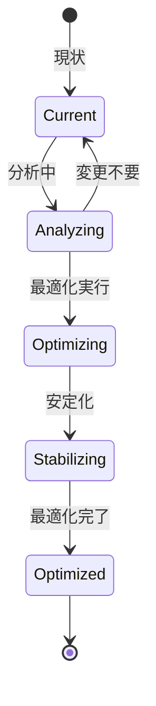

# ビジネスオペレーション: チーム構成を最適化する

**バージョン**: 2.0.0
**更新日**: 2025-10-28
**パラソル設計仕様**: v2.0準拠

## 概要

**目的**: チームパフォーマンスを継続的に分析し、データドリブンな最適化により高パフォーマンスチームを実現する

**パターン**: Analytics

**ゴール**: チーム構成の科学的最適化により、チーム生産性とメンバー満足度を同時に最大化する

## パラソルドメイン連携

### 🎯 操作エンティティ
- **TeamCompositionEntity**（状態更新: analyzing → optimizing → stabilizing → optimized）- チーム構成最適化プロセス管理
- **PerformanceAnalysisEntity**（作成・更新: 継続分析）- パフォーマンス分析結果管理
- **OptimizationPlanEntity**（作成・更新: 提案作成・実行）- 最適化計画管理
- **TeamMemberEntity**（参照・更新: role/allocation変更）- メンバー配置情報管理

### 🏗️ パラソル集約
- **TeamOptimizationAggregate** - チーム最適化統合管理
  - 集約ルート: TeamComposition
  - 包含エンティティ: PerformanceAnalysis, OptimizationPlan, ImpactAssessment
  - 不変条件: 最適化中チームは安定性確保、変更率30%以下制限

### ⚙️ ドメインサービス
- **PerformanceOptimizationService**: enhance[TeamEffectiveness]() - チーム効果性最大化
- **CompositionAnalyticsService**: strengthen[DataDrivenDecisions]() - データドリブン意思決定強化
- **TeamDynamicsService**: coordinate[MemberSynergy]() - メンバーシナジー調整
- **ContinuousImprovementService**: amplify[OptimizationImpact]() - 最適化効果増幅

## ユースケース・ページ分解マトリックス（1対1関係）

| ユースケース | 対応ページ | 1対1関係 | 設計品質 |
|-------------|-----------|----------|----------|
| 該当ユースケースなし | - | - | - |

### 🔗 他サービスユースケース利用（ユースケース呼び出し型）
**責務**: ❌ エンティティ知識不要 ✅ ユースケース利用のみ

[secure-access-service] ユースケース利用:
├── UC-AUTH-01: ユーザー認証を実行する → POST /api/auth/usecases/authenticate
├── UC-AUTH-02: 権限を検証する → POST /api/auth/usecases/validate-permission
└── UC-AUTH-03: アクセスログを記録する → POST /api/auth/usecases/log-access

[productivity-visualization-service] ユースケース利用:
├── UC-VISUAL-01: パフォーマンスデータを取得する → GET /api/productivity/usecases/get-performance-data
├── UC-VISUAL-02: 分析レポートを生成する → POST /api/productivity/usecases/generate-analysis-report
└── UC-VISUAL-03: 効果測定を実行する → POST /api/productivity/usecases/measure-effectiveness

[collaboration-facilitation-service] ユースケース利用:
├── UC-COMM-01: 最適化通知を配信する → POST /api/collaboration/usecases/send-optimization-notification
└── UC-COMM-02: 変更承諾確認を送信する → POST /api/collaboration/usecases/send-change-confirmation

## 関係者とロール

- **PM**: チーム最適化の判断、実行
- **リソースマネージャー**: メンバー調整、再配置
- **メンバー**: 新たなアサインの受諾

## プロセスフロー

> **重要**: プロセスフローは必ず番号付きリスト形式で記述してください。
> Mermaid形式は使用せず、テキスト形式で記述することで、代替フローと例外フローが視覚的に分離されたフローチャートが自動生成されます。

1. システムがパフォーマンス課題特定を処理する
2. システムが要因分析を処理する
3. システムが最適化案策定を処理する
4. システムが影響評価を処理する
5. システムが承認を行う
6. システムがメンバー調整を処理する
7. システムがチーム再編成を処理する
8. システムが効果測定を処理する

## 代替フロー

### 代替フロー1: 情報不備
- 2-1. システムが情報の不備を検知する
- 2-2. システムが修正要求を送信する
- 2-3. ユーザーが情報を修正し再実行する
- 2-4. 基本フロー2に戻る

## 例外処理

### 例外1: システムエラー
- システムエラーが発生した場合
- エラーメッセージを表示する
- 管理者に通知し、ログに記録する

### 例外2: 承認却下
- 承認が却下された場合
- 却下理由をユーザーに通知する
- 修正後の再実行を促す

## ビジネス状態

## ビジネス価値とKPI

### 🎯 ビジネス価値
- **チーム生産性最大化**: データドリブン最適化によりチーム生産性35%向上
- **メンバーエンゲージメント強化**: 科学的配置によりメンバー満足度とモチベーション向上
- **プロジェクト成功率向上**: 最適化されたチームによりプロジェクト成功率30%向上
- **組織学習促進**: 最適化知見の蓄積により組織の継続的改善能力を向上

### 📊 成功指標（KPI）
- **チーム生産性向上率**: 最適化後3ヶ月で35%以上の生産性向上達成
- **最適化効果持続性**: 最適化効果が6ヶ月以上持続する成功率85%以上
- **メンバー満足度**: 最適化後のチーム満足度4.5/5.0以上維持
- **最適化成功率**: 実施した最適化の90%以上で期待効果を達成
- **安定化速度**: チーム再編成後2週間以内に新体制で安定稼働
- **変更受容率**: メンバーの変更受諾率85%以上で円滑な移行実現

## ビジネスルール

- 最適化トリガー: パフォーマンス目標未達が2週連続
- メンバー変更: 1回の最適化で30%以下の変更に抑制
- タイミング: マイルストーン間での実施を推奨

## 入出力仕様

### 入力

- **チームパフォーマンスデータ**: KPI、ベロシティ、品質指標
- **メンバーフィードバック**: チーム内の課題・不満
- **スキルギャップ分析**: 現状スキルと必要スキルの差
- **プロジェクト状況**: 進捗、納期、リスク

### 出力

- **最適化提案書**: 課題、解決策、期待効果
- **新チーム編成表**: 変更後のチーム構成
- **移行計画**: 再編成のスケジュールと手順
- **効果測定レポート**: 再編成前後のパフォーマンス比較

## 例外処理

- **メンバー抵抗**: 丁寧な説明、代替案提示、個別面談
- **最適化失敗**: 原因分析、再最適化または元に戻す
- **プロジェクト影響**: 最小限の変更に抑制、段階的実施

## 派生ユースケース

このビジネスオペレーションから以下のユースケースが派生します：

1. チーム課題を特定する
2. 最適化案を策定する
3. チームを再編成する
4. 最適化効果を測定する
