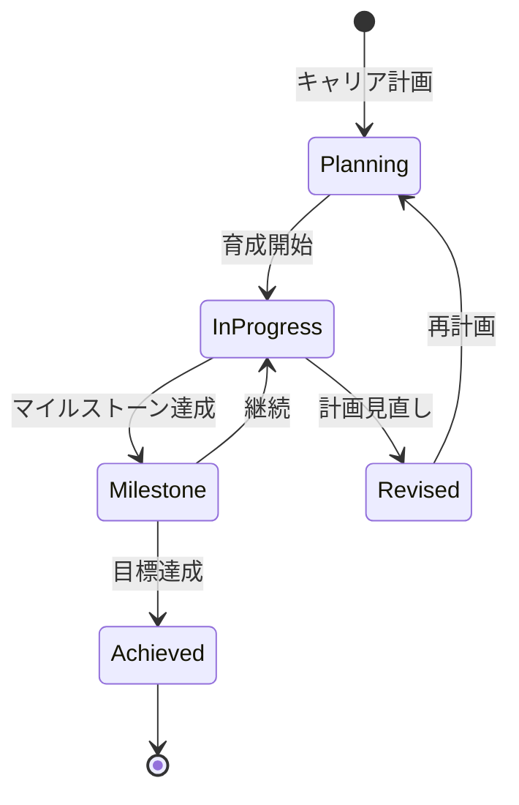

# ビジネスオペレーション: キャリアを開発し支援する

**バージョン**: 2.0.0
**更新日**: 2025-10-28
**パラソル設計仕様**: v2.0準拠

## 概要

**目的**: メンバーの潜在能力を最大化し、個人と組織の成長を同時に実現するキャリア開発エコシステムを構築する

**パターン**: Workflow

**ゴール**: 戦略的キャリア開発により、メンバーエンゲージメントと組織競争力を同時に向上させる

## パラソルドメイン連携

### 🎯 操作エンティティ
- **CareerPlanEntity**（状態更新: draft → active → progressing → achieved）- キャリアプラン管理
- **DevelopmentPlanEntity**（作成・更新: 継続実行）- 育成計画実行管理
- **CareerGoalEntity**（作成・更新: 目標設定・達成）- キャリア目標追跡
- **MemberEntity**（参照・更新: career progression）- メンバーキャリア情報管理

### 🏗️ パラソル集約
- **CareerDevelopmentAggregate** - キャリア開発統合管理
  - 集約ルート: CareerPlan
  - 包含エンティティ: DevelopmentPlan, CareerGoal, SkillGapAnalysis
  - 不変条件: キャリア目標は実現可能性確保、育成リソース制限内運用

### ⚙️ ドメインサービス
- **CareerGrowthService**: enhance[IndividualPotential]() - 個人ポテンシャル最大化
- **TalentDevelopmentService**: strengthen[OrganizationalCapability]() - 組織能力強化
- **CareerPathOptimizationService**: coordinate[CareerAlignment]() - キャリア最適化調整
- **SuccessionPlanningService**: amplify[LeadershipPipeline]() - リーダーシップパイプライン拡大

## ユースケース・ページ分解マトリックス（1対1関係）

| ユースケース | 対応ページ | 1対1関係 | 設計品質 |
|-------------|-----------|----------|----------|
| 該当ユースケースなし | - | - | - |

### 🔗 他サービスユースケース利用（ユースケース呼び出し型）
**責務**: ❌ エンティティ知識不要 ✅ ユースケース利用のみ

[secure-access-service] ユースケース利用:
├── UC-AUTH-01: ユーザー認証を実行する → POST /api/auth/usecases/authenticate
├── UC-AUTH-02: 権限を検証する → POST /api/auth/usecases/validate-permission
└── UC-AUTH-03: アクセスログを記録する → POST /api/auth/usecases/log-access

[knowledge-co-creation-service] ユースケース利用:
├── UC-KNOW-01: 育成コンテンツを取得する → GET /api/knowledge/usecases/get-development-content
├── UC-KNOW-02: 学習リソースを検索する → POST /api/knowledge/usecases/search-learning-resources
└── UC-KNOW-03: ベストプラクティスを共有する → POST /api/knowledge/usecases/share-best-practices

[collaboration-facilitation-service] ユースケース利用:
├── UC-COMM-01: キャリア面談通知を配信する → POST /api/collaboration/usecases/send-career-interview-notification
└── UC-COMM-02: 育成進捗レポートを送信する → POST /api/collaboration/usecases/send-development-progress-report

## 関係者とロール

- **メンバー**: キャリア目標の設定
- **マネージャー**: キャリア相談、育成計画策定
- **人事管理者**: キャリアパス設計、研修提供

## プロセスフロー

> **重要**: プロセスフローは必ず番号付きリスト形式で記述してください。
> Mermaid形式は使用せず、テキスト形式で記述することで、代替フローと例外フローが視覚的に分離されたフローチャートが自動生成されます。

1. システムがキャリア面談を処理する
2. システムがキャリア目標設定を処理する
3. システムが現状とギャップ分析を処理する
4. システムが育成計画策定を処理する
5. システムが研修・OJT実施を処理する
6. システムが進捗モニタリングを処理する
7. システムがキャリア実現を処理する

## 代替フロー

### 代替フロー1: 情報不備
- 2-1. システムが情報の不備を検知する
- 2-2. システムが修正要求を送信する
- 2-3. ユーザーが情報を修正し再実行する
- 2-4. 基本フロー2に戻る

## 例外処理

### 例外1: システムエラー
- システムエラーが発生した場合
- エラーメッセージを表示する
- 管理者に通知し、ログに記録する

### 例外2: 承認却下
- 承認が却下された場合
- 却下理由をユーザーに通知する
- 修正後の再実行を促す

## ビジネス状態

## ビジネス価値とKPI

### 🎯 ビジネス価値
- **人材ポテンシャル最大化**: 戦略的キャリア開発によりメンバー能力向上40%達成
- **組織エンゲージメント強化**: キャリア支援によりメンバーエンゲージメント向上
- **リテンション率向上**: 計画的キャリア開発により離職率50%削減
- **次世代リーダー育成**: 体系的育成によりリーダーシップパイプライン構築

### 📊 成功指標（KPI）
- **キャリア面談完了率**: 年2回以上全メンバーと面談実施100%達成
- **育成計画実行率**: 策定した育成計画の90%以上を期限内実行
- **キャリア目標達成率**: 3年以内のキャリア目標達成率75%以上
- **内部昇進率**: 管理職ポジションの80%以上を内部昇進で充足
- **スキル向上率**: 年間スキル評価で85%以上のメンバーが向上
- **キャリア満足度**: メンバーのキャリア開発満足度4.7/5.0以上維持

## ビジネスルール

- キャリアパス: 専門職、マネジメント、スペシャリストの3コース
- 面談頻度: 年1回以上実施
- 育成予算: メンバー1人あたり年間20万円
- 社内公募: 希望者は社内ポジションに応募可能

## 入出力仕様

### 入力

- **メンバーのキャリア希望**: 希望する職種、役割、働き方
- **現在のスキル・経験**: スキルマップ、プロジェクト履歴
- **パフォーマンス評価結果**: 過去の評価、強み・弱み
- **組織のニーズ**: 事業計画、必要とされるスキル・ポジション

### 出力

- **キャリアプラン**: 3-5年後のキャリア目標、マイルストーン
- **育成計画書**: 具体的な研修、OJT、プロジェクト参加計画
- **研修推奨リスト**: メンバーに推奨する研修プログラム
- **進捗レポート**: 育成計画の進捗状況、達成度

## 例外処理

- **キャリア変更希望**: 新たなキャリアパスの設計、移行支援
- **育成計画未達**: 原因分析（業務多忙、意欲低下等）、計画見直し
- **組織ニーズ変化**: キャリアパスの柔軟な調整、代替案提示

## 派生ユースケース

このビジネスオペレーションから以下のユースケースが派生します：

1. キャリア面談を実施する
2. キャリアプランを策定する
3. 育成計画を実行する
4. キャリア進捗を確認する
