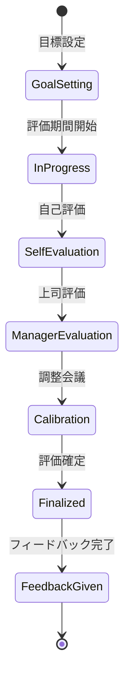

# ビジネスオペレーション: パフォーマンスを評価する

**バージョン**: 2.0.0
**更新日**: 2025-10-28
**パラソル設計仕様**: v2.0準拠

## 概要

**目的**: 公正で建設的なパフォーマンス評価により、メンバーの成長と組織の目標達成を同時に実現する

**パターン**: Analytics

**ゴール**: データドリブン評価による信頼性の高いフィードバックと、個人成長を促進する目標設定の完成

## パラソルドメイン連携

### 🎯 操作エンティティ
- **PerformanceEvaluationEntity**（状態更新: draft → in_progress → calibration → finalized）- パフォーマンス評価プロセス管理
- **EvaluationGoalEntity**（作成・更新: 目標設定・達成度更新）- 評価目標管理
- **FeedbackSessionEntity**（作成・更新: 面談実施・記録）- フィードバック面談管理
- **MemberEntity**（参照・更新: performance history）- メンバーパフォーマンス履歴管理

### 🏗️ パラソル集約
- **PerformanceEvaluationAggregate** - パフォーマンス評価統合管理
  - 集約ルート: PerformanceEvaluation
  - 包含エンティティ: EvaluationGoal, FeedbackSession, CalibrationResult
  - 不変条件: 評価公正性確保、フィードバック完了必須

### ⚙️ ドメインサービス
- **FairEvaluationService**: enhance[EvaluationObjectivity]() - 評価客観性向上
- **PerformanceDevelopmentService**: strengthen[MemberGrowth]() - メンバー成長支援強化
- **CalibrationOptimizationService**: coordinate[EvaluationConsistency]() - 評価一貫性調整
- **FeedbackEffectivenessService**: amplify[DevelopmentImpact]() - 育成効果増幅

## ユースケース・ページ分解マトリックス（1対1関係）

| ユースケース | 対応ページ | 1対1関係 | 設計品質 |
|-------------|-----------|----------|----------|
| 該当ユースケースなし | - | - | - |

### 🔗 他サービスユースケース利用（ユースケース呼び出し型）
**責務**: ❌ エンティティ知識不要 ✅ ユースケース利用のみ

[secure-access-service] ユースケース利用:
├── UC-AUTH-01: ユーザー認証を実行する → POST /api/auth/usecases/authenticate
├── UC-AUTH-02: 権限を検証する → POST /api/auth/usecases/validate-permission
└── UC-AUTH-03: アクセスログを記録する → POST /api/auth/usecases/log-access

[productivity-visualization-service] ユースケース利用:
├── UC-VISUAL-01: パフォーマンスデータを取得する → GET /api/productivity/usecases/get-performance-data
├── UC-VISUAL-02: 成果分析レポートを生成する → POST /api/productivity/usecases/generate-achievement-report
└── UC-VISUAL-03: 目標達成度を可視化する → POST /api/productivity/usecases/visualize-goal-achievement

[collaboration-facilitation-service] ユースケース利用:
├── UC-COMM-01: 評価通知を配信する → POST /api/collaboration/usecases/send-evaluation-notification
└── UC-COMM-02: フィードバック面談予約を送信する → POST /api/collaboration/usecases/send-feedback-appointment

## 関係者とロール

- **マネージャー**: 評価実施、フィードバック
- **メンバー**: 自己評価、目標設定
- **人事管理者**: 評価プロセス管理、調整

## プロセスフロー

> **重要**: プロセスフローは必ず番号付きリスト形式で記述してください。
> Mermaid形式は使用せず、テキスト形式で記述することで、代替フローと例外フローが視覚的に分離されたフローチャートが自動生成されます。

1. システムが評価期間開始を処理する
2. システムが目標設定を処理する
3. システムが進捗モニタリングを処理する
4. システムが自己評価を処理する
5. システムがマネージャー評価を処理する
6. システムが評価調整会議を処理する
7. システムがフィードバック面談を処理する
8. システムが次期目標設定を処理する

## 代替フロー

### 代替フロー1: 情報不備
- 2-1. システムが情報の不備を検知する
- 2-2. システムが修正要求を送信する
- 2-3. ユーザーが情報を修正し再実行する
- 2-4. 基本フロー2に戻る

## 例外処理

### 例外1: システムエラー
- システムエラーが発生した場合
- エラーメッセージを表示する
- 管理者に通知し、ログに記録する

### 例外2: 承認却下
- 承認が却下された場合
- 却下理由をユーザーに通知する
- 修正後の再実行を促す

## ビジネス状態

## ビジネス価値とKPI

### 🎯 ビジネス価値
- **メンバー成長促進**: 建設的評価により個人能力向上30%と満足度向上を実現
- **組織パフォーマンス向上**: 公正評価による適切な人材配置で組織効率25%向上
- **人材リテンション強化**: 透明性ある評価により離職率30%削減
- **企業競争力強化**: 継続的な人材育成により市場競争力を向上

### 📊 成功指標（KPI）
- **評価完了率**: 評価期間終了後10営業日以内に100%完了
- **フィードバック実施率**: 評価確定後5営業日以内に100%面談実施
- **目標達成率**: 全メンバーの平均目標達成率80%以上維持
- **評価納得度**: 評価結果に対するメンバー納得度4.3/5.0以上
- **評価公正性指標**: 部門間評価分布のバラつき係数0.2以下
- **成長実感度**: 評価プロセスによる成長実感度4.5/5.0以上

## ビジネスルール

- 評価サイクル: 年2回（上半期・下半期）
- 評価基準: 目標達成度、行動評価、コンピテンシー
- 評価段階: 5段階評価（S/A/B/C/D）
- 相対評価: 部門内で分布を調整

## 入出力仕様

### 入力

- **評価期間の目標**: 期初に設定した具体的な目標
- **プロジェクト成果データ**: タスク完了状況、品質指標
- **自己評価コメント**: メンバーの自己評価と振り返り
- **360度フィードバック**: 該当者のみ、同僚・部下からの評価

### 出力

- **評価結果**: 評価点（S/A/B/C/D）、評価コメント
- **フィードバックレポート**: 強み・改善点・具体的な行動提案
- **次期目標**: 次の評価期間の目標
- **育成計画**: スキル開発やキャリア支援の計画

## 例外処理

- **評価異議申し立て**: 再評価プロセス開始、人事管理者が仲介
- **評価遅延**: エスカレーション通知、期限延長申請
- **低評価継続**: 改善計画の策定、支援強化、1on1頻度増加

## 派生ユースケース

このビジネスオペレーションから以下のユースケースが派生します：

1. 目標を設定する
2. 自己評価を実施する
3. マネージャー評価を実施する
4. フィードバック面談を実施する
