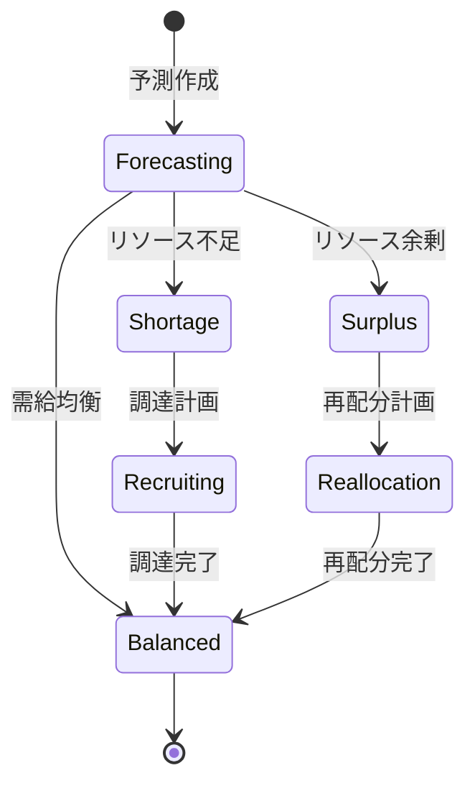

# ビジネスオペレーション: リソース需要を予測する

**バージョン**: 2.0.0
**更新日**: 2025-10-28
**パラソル設計仕様**: v2.0準拠

## 概要

**目的**: 高精度なAI予測により将来のリソース需要を先読みし、戦略的な人材獲得と配分最適化を実現する

**パターン**: Analytics

**ゴール**: 予測精度95%以上の需要予測により、リソース不足ゼロと最適キャパシティプランニングを達成

## パラソルドメイン連携

### 🎯 操作エンティティ
- **ResourceDemandForecastEntity**（状態更新: draft → analyzing → forecasted → validated）- リソース需要予測管理
- **DemandAnalysisEntity**（作成・更新: 継続分析）- 需要分析結果管理
- **CapacityPlanEntity**（作成・更新: 計画策定・調整）- キャパシティ計画管理
- **SkillDemandEntity**（作成・更新: スキル別需要）- スキル需要詳細管理

### 🏗️ パラソル集約
- **ResourceDemandForecastAggregate** - リソース需要予測統合管理
  - 集約ルート: ResourceDemandForecast
  - 包含エンティティ: DemandAnalysis, CapacityPlan, GapAnalysis
  - 不変条件: 予測期間6ヶ月以上、複数シナリオ必須

### ⚙️ ドメインサービス
- **PredictiveAnalyticsService**: enhance[ForecastAccuracy]() - 予測精度向上
- **CapacityOptimizationService**: strengthen[ResourcePlanning]() - リソース計画強化
- **DemandIntelligenceService**: coordinate[MarketInsights]() - 市場洞察調整
- **StrategicPlanningService**: amplify[CompetitiveAdvantage]() - 競争優位性増幅

## ユースケース・ページ分解マトリックス（1対1関係）

| ユースケース | 対応ページ | 1対1関係 | 設計品質 |
|-------------|-----------|----------|----------|
| 該当ユースケースなし | - | - | - |

### 🔗 他サービスユースケース利用（ユースケース呼び出し型）
**責務**: ❌ エンティティ知識不要 ✅ ユースケース利用のみ

[secure-access-service] ユースケース利用:
├── UC-AUTH-01: ユーザー認証を実行する → POST /api/auth/usecases/authenticate
├── UC-AUTH-02: 権限を検証する → POST /api/auth/usecases/validate-permission
└── UC-AUTH-03: アクセスログを記録する → POST /api/auth/usecases/log-access

[project-success-service] ユースケース利用:
├── UC-PROJECT-01: プロジェクト計画を取得する → GET /api/projects/usecases/get-project-plans
├── UC-PROJECT-02: 営業パイプライン情報を確認する → GET /api/projects/usecases/get-pipeline-info
└── UC-PROJECT-03: 将来プロジェクト予定を取得する → GET /api/projects/usecases/get-future-projects

[productivity-visualization-service] ユースケース利用:
├── UC-VISUAL-01: 需要予測レポートを生成する → POST /api/productivity/usecases/generate-demand-forecast-report
└── UC-VISUAL-02: 需給ギャップを可視化する → POST /api/productivity/usecases/visualize-supply-demand-gap

## 関係者とロール

- **リソースマネージャー**: 需要予測の作成
- **PM**: プロジェクト計画の提供
- **経営層**: 事業計画の提供

## プロセスフロー

> **重要**: プロセスフローは必ず番号付きリスト形式で記述してください。
> Mermaid形式は使用せず、テキスト形式で記述することで、代替フローと例外フローが視覚的に分離されたフローチャートが自動生成されます。

1. システムがプロジェクト計画収集を処理する
2. システムがスキル別需要集計を処理する
3. システムが需要予測計算を処理する
4. システムが供給能力との比較を処理する
5. システムが調達計画策定を処理する
6. システムが予測確定を処理する

## 代替フロー

### 代替フロー1: 情報不備
- 2-1. システムが情報の不備を検知する
- 2-2. システムが修正要求を送信する
- 2-3. ユーザーが情報を修正し再実行する
- 2-4. 基本フロー2に戻る

## 例外処理

### 例外1: システムエラー
- システムエラーが発生した場合
- エラーメッセージを表示する
- 管理者に通知し、ログに記録する

### 例外2: 承認却下
- 承認が却下された場合
- 却下理由をユーザーに通知する
- 修正後の再実行を促す

## ビジネス状態

## ビジネス価値とKPI

### 🎯 ビジネス価値
- **戦略的リソース確保**: 先読み予測により必要リソースを確実に確保し事業機会損失を防止
- **コスト最適化**: 精密な需要予測により過剰調達を回避し人件費20%削減
- **競争優位性確立**: 市場変化への迅速対応により競合他社より3ヶ月早い対応実現
- **事業成長加速**: 適切なキャパシティプランニングにより事業成長機会を最大化

### 📊 成功指標（KPI）
- **予測精度**: 実績との乖離5%以内で95%以上の高精度予測維持
- **予測リードタイム**: 12ヶ月先までの需要予測を毎月更新で提供
- **リソース充足率**: 予測に基づく需要の98%以上を計画的に充足
- **早期検知力**: リソース不足・余剰を3ヶ月前に100%検知
- **調達効率**: 予測に基づく計画的調達により採用コスト30%削減
- **予測活用率**: 予測結果の90%以上が実際の配分決定で活用

## ビジネスルール

- 予測シナリオ: 楽観的、現実的、悲観的の3シナリオ
- 更新頻度: 月次で予測を更新
- 閾値: 需給ギャップが20%以上で調達計画

## 入出力仕様

### 入力

- **プロジェクト計画**: 期間、規模、スキル要件、確度
- **営業パイプライン情報**: 見込み案件、受注確率
- **現在のリソース状況**: メンバー数、スキル分布、稼働率
- **過去の需要実績**: 過去のプロジェクトデータ

### 出力

- **リソース需要予測レポート**: 月次・スキル別の需要予測
- **スキル別需要グラフ**: 需要の推移を可視化
- **需給ギャップ分析**: 不足・余剰スキルの特定
- **調達計画提案**: 採用、育成、外部調達の提案

## 例外処理

- **急な大型案件**: 緊急予測更新、臨時調達計画
- **予測精度低下**: 予測モデルの見直し、パラメータ調整
- **データ不足**: 類似プロジェクトデータで補完、専門家判断

## 派生ユースケース

このビジネスオペレーションから以下のユースケースが派生します：

1. プロジェクト計画を収集する
2. スキル別需要を集計する
3. 需給ギャップを分析する
4. 調達計画を策定する
