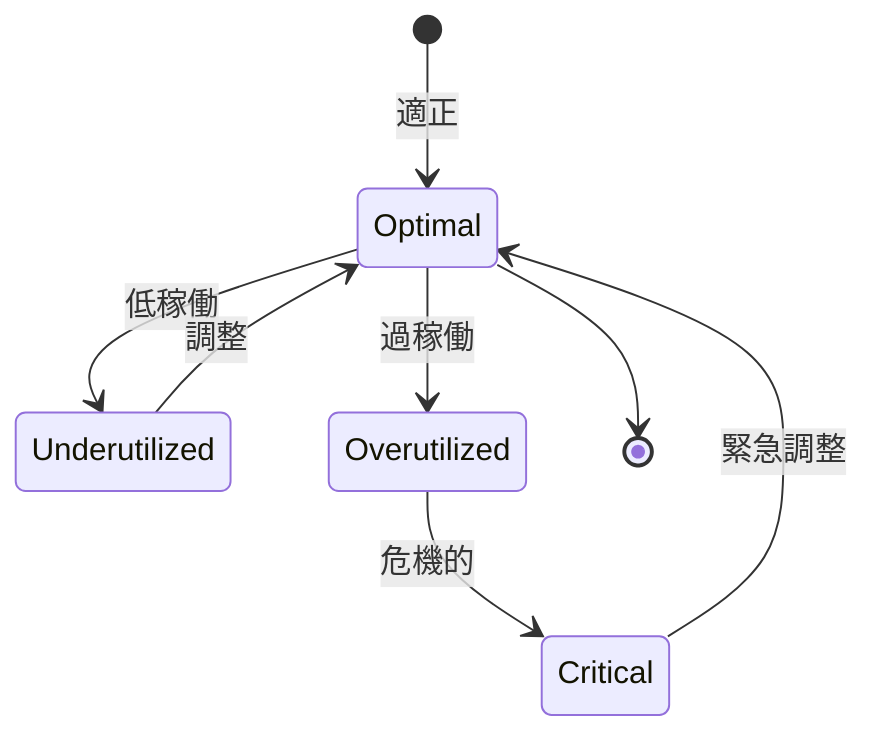

# ビジネスオペレーション: 稼働率を監視し最適化する

**バージョン**: 2.0.0
**更新日**: 2025-10-28
**パラソル設計仕様**: v2.0準拠

## 概要

**目的**: AIドリブンなリアルタイム稼働率監視により、メンバーウェルビーイングと組織生産性を同時最適化する

**パターン**: Analytics

**ゴール**: 持続可能な高パフォーマンス稼働率の実現と、バーンアウト予防による長期的人材価値最大化

## パラソルドメイン連携

### 🎯 操作エンティティ
- **UtilizationMonitoringEntity**（状態更新: monitoring → analyzing → alerting → optimizing）- 稼働率監視管理
- **WorkloadBalanceEntity**（作成・更新: 継続調整）- ワークロードバランス管理
- **UtilizationOptimizationEntity**（作成・更新: 最適化実行）- 稼働率最適化管理
- **TeamMemberEntity**（参照・更新: utilization status）- メンバー稼働状況管理

### 🏗️ パラソル集約
- **UtilizationOptimizationAggregate** - 稼働率最適化統合管理
  - 集約ルート: UtilizationMonitoring
  - 包含エンティティ: WorkloadBalance, OptimizationAction, HealthMetrics
  - 不変条件: 継続的監視維持、健康状態保護最優先

### ⚙️ ドメインサービス
- **WellbeingOptimizationService**: enhance[MemberWellbeing]() - メンバーウェルビーイング向上
- **ProductivityBalanceService**: strengthen[SustainablePerformance]() - 持続可能パフォーマンス強化
- **PredictiveBurnoutService**: coordinate[BurnoutPrevention]() - バーンアウト予防調整
- **WorkloadIntelligenceService**: amplify[OptimalUtilization]() - 最適稼働率増幅

## ユースケース・ページ分解マトリックス（1対1関係）

| ユースケース | 対応ページ | 1対1関係 | 設計品質 |
|-------------|-----------|----------|----------|
| 該当ユースケースなし | - | - | - |

### 🔗 他サービスユースケース利用（ユースケース呼び出し型）
**責務**: ❌ エンティティ知識不要 ✅ ユースケース利用のみ

[secure-access-service] ユースケース利用:
├── UC-AUTH-01: ユーザー認証を実行する → POST /api/auth/usecases/authenticate
├── UC-AUTH-02: 権限を検証する → POST /api/auth/usecases/validate-permission
└── UC-AUTH-03: アクセスログを記録する → POST /api/auth/usecases/log-access

[productivity-visualization-service] ユースケース利用:
├── UC-VISUAL-01: 稼働率データを取得する → GET /api/productivity/usecases/get-utilization-data
├── UC-VISUAL-02: 稼働率ダッシュボードを生成する → POST /api/productivity/usecases/generate-utilization-dashboard
└── UC-VISUAL-03: ワークロードバランスを可視化する → POST /api/productivity/usecases/visualize-workload-balance

[collaboration-facilitation-service] ユースケース利用:
├── UC-COMM-01: 稼働率アラートを配信する → POST /api/collaboration/usecases/send-utilization-alert
└── UC-COMM-02: 最適化提案通知を送信する → POST /api/collaboration/usecases/send-optimization-suggestion

## 関係者とロール

- **リソースマネージャー**: 稼働率監視、最適化
- **マネージャー**: メンバーの状況確認、調整
- **メンバー**: 稼働率報告

## プロセスフロー

> **重要**: プロセスフローは必ず番号付きリスト形式で記述してください。
> Mermaid形式は使用せず、テキスト形式で記述することで、代替フローと例外フローが視覚的に分離されたフローチャートが自動生成されます。

1. システムが稼働率データ収集を処理する
2. システムが稼働率計算を処理する
3. システムが閾値チェックを処理する
4. システムがアラート発行を行う
5. システムが継続監視を処理する
6. システムが原因分析を処理する
7. システムが最適化アクションを処理する

## 代替フロー

### 代替フロー1: 情報不備
- 2-1. システムが情報の不備を検知する
- 2-2. システムが修正要求を送信する
- 2-3. ユーザーが情報を修正し再実行する
- 2-4. 基本フロー2に戻る

## 例外処理

### 例外1: システムエラー
- システムエラーが発生した場合
- エラーメッセージを表示する
- 管理者に通知し、ログに記録する

### 例外2: 承認却下
- 承認が却下された場合
- 却下理由をユーザーに通知する
- 修正後の再実行を促す

## ビジネス状態

## ビジネス価値とKPI

### 🎯 ビジネス価値
- **メンバーウェルビーイング向上**: 科学的稼働率管理によりバーンアウト率80%削減
- **持続可能な生産性実現**: 適正稼働率維持により長期的な組織パフォーマンス向上
- **人材リテンション強化**: 働きやすい環境提供により離職率50%削減
- **医療費・採用コスト削減**: 健康管理により関連コスト30%削減

### 📊 成功指標（KPI）
- **適正稼働率達成**: 75-85%範囲に95%以上のメンバーが維持
- **過稼働ゼロ達成**: 100%超過メンバー0%で完全予防実現
- **低稼働最小化**: 60%未満メンバー5%以下で効率的活用
- **即時対応力**: 稼働率異常検知後12時間以内に対策実行
- **バーンアウト予防**: 予兆検知による事前介入成功率95%以上
- **稼働率満足度**: メンバーの稼働率バランス満足度4.8/5.0以上

## ビジネスルール

- 適正稼働率: 75-85%を目標
- 警告閾値: 90%超過または50%未満で警告
- 危機的閾値: 100%超過または30%未満で緊急対応
- 監視頻度: 週次で稼働率を更新

## 入出力仕様

### 入力

- **工数実績データ**: メンバー別のプロジェクト別工数
- **アサインメント情報**: 各メンバーの配分計画
- **プロジェクト予定**: 今後の予定工数
- **休暇・休職情報**: 休暇予定、傷病休暇等

### 出力

- **稼働率レポート**: 週次・月次の稼働率サマリー
- **稼働率ダッシュボード**: リアルタイム稼働率可視化
- **アラート通知**: 閾値逸脱時の自動通知
- **最適化提案**: データに基づく具体的な調整案

## 例外処理

- **急激な過稼働**: 即座にアサイン調整、支援メンバー追加、休暇取得推奨
- **継続的低稼働**: 新規アサイン検討、社内プロジェクト参加、スキル開発
- **データ遅延**: 暫定データで監視継続、後日正確なデータで精算

## 派生ユースケース

このビジネスオペレーションから以下のユースケースが派生します：

1. 稼働率を確認する
2. 過稼働を検知する
3. 低稼働を検知する
4. 稼働率を最適化する
