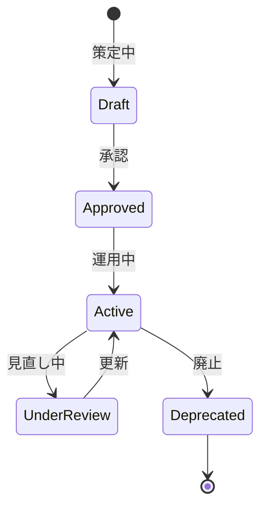

# ビジネスオペレーション: スキルマトリックスを構築し活用する

**バージョン**: 2.0.0
**更新日**: 2025-10-28
**パラソル設計仕様**: v2.0準拠

## 概要

**目的**: 戦略的なスキルマトリックス構築により組織の知的資産を可視化し、競争力強化と人材価値最大化を実現する

**パターン**: Analytics

**ゴール**: データドリブンなスキル体系により戦略的人材育成と最適配置を実現し、組織の持続的競争優位性を確立

## パラソルドメイン連携

### 🎯 操作エンティティ
- **SkillMatrixEntity**（状態更新: draft → validated → active → optimized）- スキルマトリックス構築管理
- **SkillFrameworkEntity**（作成・更新: フレームワーク定義・改善）- スキルフレームワーク管理
- **SkillCategoryEntity**（作成・更新: カテゴリ体系・分類）- スキルカテゴリ体系管理
- **SkillLevelEntity**（作成・更新: レベル定義・基準）- スキルレベル基準管理

### 🏗️ パラソル集約
- **SkillMatrixAggregate** - スキルマトリックス統合管理
  - 集約ルート: SkillMatrix
  - 包含エンティティ: SkillFramework, SkillCategory, SkillLevel
  - 不変条件: 体系一貫性確保、レベル基準明確化

### ⚙️ ドメインサービス
- **SkillIntelligenceService**: enhance[SkillInsights]() - スキル知見向上
- **FrameworkOptimizationService**: strengthen[SkillFramework]() - スキルフレームワーク強化
- **MatrixAnalyticsService**: coordinate[SkillAnalytics]() - スキル分析調整
- **CompetitiveAdvantageService**: amplify[OrganizationalCapability]() - 組織能力増幅

## ユースケース・ページ分解マトリックス（1対1関係）

| ユースケース | 対応ページ | 1対1関係 | 設計品質 |
|-------------|-----------|----------|----------|
| 該当ユースケースなし | - | - | - |

### 🔗 他サービスユースケース利用（ユースケース呼び出し型）
**責務**: ❌ エンティティ知識不要 ✅ ユースケース利用のみ

[secure-access-service] ユースケース利用:
├── UC-AUTH-01: ユーザー認証を実行する → POST /api/auth/usecases/authenticate
├── UC-AUTH-02: 権限を検証する → POST /api/auth/usecases/validate-permission
└── UC-AUTH-03: アクセスログを記録する → POST /api/auth/usecases/log-access

[knowledge-co-creation-service] ユースケース利用:
├── UC-KNOW-01: 業界標準フレームワークを取得する → GET /api/knowledge/usecases/get-industry-frameworks
├── UC-KNOW-02: スキルトレンド情報を取得する → GET /api/knowledge/usecases/get-skill-trends
└── UC-KNOW-03: ベストプラクティスを参照する → GET /api/knowledge/usecases/get-best-practices

[productivity-visualization-service] ユースケース利用:
├── UC-VISUAL-01: スキルマトリックスを可視化する → POST /api/productivity/usecases/visualize-skill-matrix
└── UC-VISUAL-02: スキル分析ダッシュボードを生成する → POST /api/productivity/usecases/generate-skill-analytics

## 関係者とロール

- **人事管理者**: スキル体系の設計、管理
- **技術リーダー**: 技術スキルの定義、レベル設定
- **マネージャー**: スキル要件の提供

## プロセスフロー

> **重要**: プロセスフローは必ず番号付きリスト形式で記述してください。
> Mermaid形式は使用せず、テキスト形式で記述することで、代替フローと例外フローが視覚的に分離されたフローチャートが自動生成されます。

1. システムがスキル調査を処理する
2. システムがスキルカテゴリ定義を処理する
3. システムがスキルレベル定義を処理する
4. システムが評価基準作成を行う
5. システムがスキル体系確定を処理する
6. システムが定期見直しを処理する

## 代替フロー

### 代替フロー1: 情報不備
- 2-1. システムが情報の不備を検知する
- 2-2. システムが修正要求を送信する
- 2-3. ユーザーが情報を修正し再実行する
- 2-4. 基本フロー2に戻る

## 例外処理

### 例外1: システムエラー
- システムエラーが発生した場合
- エラーメッセージを表示する
- 管理者に通知し、ログに記録する

### 例外2: 承認却下
- 承認が却下された場合
- 却下理由をユーザーに通知する
- 修正後の再実行を促す

## ビジネス状態

## ビジネス価値とKPI

### 🎯 ビジネス価値
- **組織知的資産可視化**: 戦略的スキルマトリックスにより組織の知的資産を完全可視化し競争力強化
- **人材価値最大化**: データドリブンなスキル分析により個人と組織の価値を最大化
- **戦略的人材育成**: 科学的スキル体系により効果的な人材育成プログラムを実現
- **最適人材配置**: スキルマトリックスに基づく最適配置により生産性30%向上

### 📊 成功指標（KPI）
- **スキル体系完成度**: 業界標準スキル体系の98%以上をカバーし完全性確保
- **マトリックス活用率**: 全人事決定の95%以上でスキルマトリックスを活用
- **スキル予測精度**: 将来必要スキルの90%以上を3ヶ月前に予測し先行育成
- **レベル判定精度**: スキルレベル評価の95%以上で一致率確保
- **フレームワーク進化**: 年4回の体系アップデートで業界変化に適応
- **価値創造効果**: スキルマトリックス活用により人材ROI40%向上

## ビジネスルール

- スキルカテゴリ: 技術、ビジネス、ヒューマンの3大カテゴリ
- スキルレベル: 5段階（初級・中級・上級・エキスパート・マスター）
- 評価基準: 各レベルで具体的な行動指標を定義

## 入出力仕様

### 入力

- **業界標準スキルフレームワーク**: ITSS、PMBOKなどの標準
- **自社のプロジェクト要件**: 過去のプロジェクトで必要とされたスキル
- **技術トレンド情報**: 新技術、市場動向
- **メンバーからのスキル提案**: 現場からの新スキル追加要望

### 出力

- **スキル体系図**: スキルの階層構造と分類
- **スキルレベル定義書**: 各レベルの評価基準
- **評価基準書**: 具体的な行動指標
- **スキルマスタデータ**: データベースに格納するスキル定義

## 例外処理

- **新技術出現**: スキル体系への即時追加、臨時レビュー
- **スキル廃止**: 段階的な廃止プロセス、代替スキルへの移行
- **定義曖昧**: 技術リーダーと協議し明確化のための改訂

## 派生ユースケース

このビジネスオペレーションから以下のユースケースが派生します：

1. 新スキルを定義する
2. スキルレベルを設定する
3. スキル体系を更新する
4. スキルを廃止する
