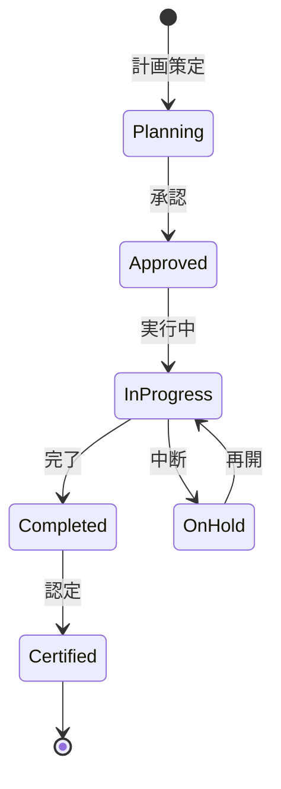

# ビジネスオペレーション: スキル開発を加速し価値創造する

**バージョン**: 2.0.0
**更新日**: 2025-10-28
**パラソル設計仕様**: v2.0準拠

## 概要

**目的**: 戦略的スキル開発により個人の潜在能力を最大化し、組織の持続的成長と競争優位性を実現する

**パターン**: Workflow

**ゴール**: AIドリブンな個別最適化学習により90%以上のスキル習得達成と、組織能力の飛躍的向上を実現

## パラソルドメイン連携

### 🎯 操作エンティティ
- **SkillDevelopmentEntity**（状態更新: planning → active → progressing → completed）- スキル開発プロセス管理
- **DevelopmentPlanEntity**（作成・更新: 計画策定・調整）- 開発計画管理
- **TrainingProgramEntity**（作成・更新: プログラム実施・評価）- 研修プログラム管理
- **CertificationEntity**（作成・更新: 認定実施・管理）- スキル認定管理

### 🏗️ パラソル集約
- **SkillDevelopmentAggregate** - スキル開発統合管理
  - 集約ルート: SkillDevelopment
  - 包含エンティティ: DevelopmentPlan, TrainingProgram, Certification
  - 不変条件: 継続的進捗確保、品質保証必須

### ⚙️ ドメインサービス
- **LearningOptimizationService**: enhance[LearningEffectiveness]() - 学習効果最大化
- **DevelopmentAccelerationService**: strengthen[SkillAcquisition]() - スキル習得加速強化
- **PersonalizedEducationService**: coordinate[IndividualGrowth]() - 個人成長調整
- **OrganizationalCapabilityService**: amplify[CollectiveCapability]() - 組織能力増幅

## ユースケース・ページ分解マトリックス（1対1関係）

| ユースケース | 対応ページ | 1対1関係 | 設計品質 |
|-------------|-----------|----------|----------|
| 該当ユースケースなし | - | - | - |

### 🔗 他サービスユースケース利用（ユースケース呼び出し型）
**責務**: ❌ エンティティ知識不要 ✅ ユースケース利用のみ

[secure-access-service] ユースケース利用:
├── UC-AUTH-01: ユーザー認証を実行する → POST /api/auth/usecases/authenticate
├── UC-AUTH-02: 権限を検証する → POST /api/auth/usecases/validate-permission
└── UC-AUTH-03: アクセスログを記録する → POST /api/auth/usecases/log-access

[knowledge-co-creation-service] ユースケース利用:
├── UC-KNOW-01: 学習リソースを取得する → GET /api/knowledge/usecases/get-learning-resources
├── UC-KNOW-02: ベストプラクティスを取得する → GET /api/knowledge/usecases/get-best-practices
└── UC-KNOW-03: 学習成果を蓄積する → POST /api/knowledge/usecases/accumulate-learning-outcomes

[productivity-visualization-service] ユースケース利用:
├── UC-VISUAL-01: 学習進捗を可視化する → POST /api/productivity/usecases/visualize-learning-progress
└── UC-VISUAL-02: スキル開発ダッシュボードを生成する → POST /api/productivity/usecases/generate-development-dashboard

[collaboration-facilitation-service] ユースケース利用:
├── UC-COMM-01: 学習支援通知を配信する → POST /api/collaboration/usecases/send-learning-support
└── UC-COMM-02: メンター連携を促進する → POST /api/collaboration/usecases/facilitate-mentoring

## 関係者とロール

- **人事管理者**: 開発計画の策定、研修提供
- **マネージャー**: OJT計画、進捗管理
- **メンバー**: スキル習得、認定取得

## プロセスフロー

> **重要**: プロセスフローは必ず番号付きリスト形式で記述してください。
> Mermaid形式は使用せず、テキスト形式で記述することで、代替フローと例外フローが視覚的に分離されたフローチャートが自動生成されます。

1. システムがギャップ分析結果を処理する
2. システムが開発計画策定を処理する
3. システムが研修プログラム選定を処理する
4. システムがOJT計画作成を行う
5. システムが実行を実行する
6. システムが進捗モニタリングを処理する
7. システムがスキル認定を処理する

## 代替フロー

### 代替フロー1: 情報不備
- 2-1. システムが情報の不備を検知する
- 2-2. システムが修正要求を送信する
- 2-3. ユーザーが情報を修正し再実行する
- 2-4. 基本フロー2に戻る

## 例外処理

### 例外1: システムエラー
- システムエラーが発生した場合
- エラーメッセージを表示する
- 管理者に通知し、ログに記録する

### 例外2: 承認却下
- 承認が却下された場合
- 却下理由をユーザーに通知する
- 修正後の再実行を促す

## ビジネス状態

## ビジネス価値とKPI

### 🎯 ビジネス価値
- **個人潜在能力最大化**: 戦略的スキル開発により個人の能力を最大限に引き出し価値創造を実現
- **組織競争力強化**: 継続的なスキル開発により市場競争力を40%向上し業界リーダーシップを確立
- **イノベーション創出**: 多様なスキル組み合わせにより新たな価値創造とイノベーションを促進
- **人材満足度向上**: 個人成長を支援することでエンゲージメント向上と人材定着を実現

### 📊 成功指標（KPI）
- **スキル習得成功率**: 全学習者の90%以上が目標スキルレベルを達成し期待を上回る成果
- **学習効率最大化**: AIドリブン個別最適化により学習期間を従来比50%短縮
- **認定取得率**: 計画対象者の85%以上が公的認定・社内認定を取得し専門性確立
- **学習継続率**: 自発的な継続学習率95%以上で学習文化の定着実現
- **スキル活用率**: 習得スキルの90%以上が実務で活用され具体的価値創造
- **ROI達成**: スキル開発投資に対し300%のROI達成で投資効果を証明

## ビジネスルール

- 開発方法: 研修（30%）、OJT（50%）、自己学習（20%）
- 認定基準: 実践プロジェクトでの適用と評価
- 予算: メンバー1人あたり年間20万円

## 入出力仕様

### 入力

- **スキルギャップ分析結果**: 優先スキルリスト、必要人数
- **メンバーの希望・適性**: キャリア希望、学習スタイル
- **研修プログラムカタログ**: 利用可能な研修の一覧
- **OJT機会（プロジェクト）**: スキル習得可能なプロジェクト

### 出力

- **スキル開発計画書**: メンバー別の詳細計画
- **研修スケジュール**: 研修の日程・場所・受講者
- **OJT計画**: プロジェクトアサインとOJT目標
- **スキル認定証**: 認定取得の証明書

## 例外処理

- **研修キャンセル**: 代替研修の手配、オンライン研修への切替
- **OJT機会不足**: 社外プロジェクト参加、シミュレーション演習
- **習得困難**: 個別指導、メンター配置、期間延長

## 派生ユースケース

このビジネスオペレーションから以下のユースケースが派生します：

1. スキル開発計画を策定する
2. 研修を実施する
3. OJTを実施する
4. スキルを認定する
