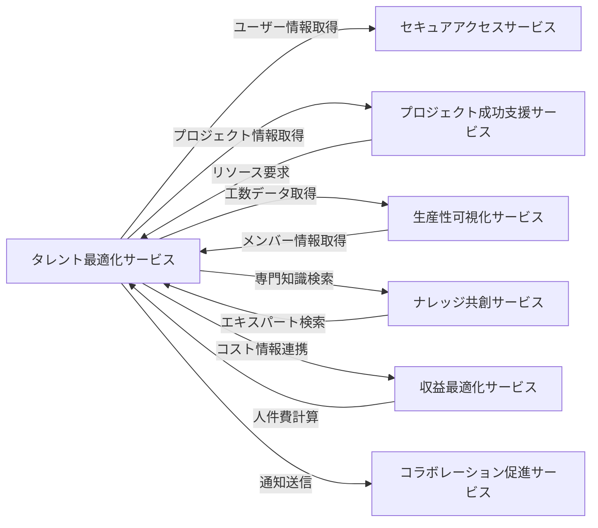

# 統合仕様: タレント最適化サービス

## 統合概要
**目的**: タレント最適化サービスが他のサービスと連携し、人材の最適配置とスキル開発を実現する
**統合パターン**: REST API、イベント駆動、共有データベース参照
**データ形式**: JSON

## サービス間連携マップ



## 依存サービスとの統合

### 1. セキュアアクセスサービス統合

#### 1.1 ユーザー情報取得
**目的**: メンバー登録時のユーザー基本情報を取得

**エンドポイント**: `GET /api/v1/secure-access/users/{userId}`

**リクエスト例**:
```http
GET /api/v1/secure-access/users/uuid-1234
Authorization: Bearer {jwt_token}
```

**レスポンス例**:
```json
{
  "success": true,
  "data": {
    "id": "uuid-1234",
    "email": "yamada@example.com",
    "name": "山田太郎",
    "role": "Consultant",
    "organizationId": "uuid-org",
    "isActive": true,
    "createdAt": "2024-01-01T00:00:00Z"
  }
}
```

**使用ケース**:
- メンバー新規登録時のユーザー情報同期
- メンバーアカウント無効化時の整合性確保
- ログイン情報とメンバー情報の紐付け

#### 1.2 組織情報取得
**目的**: 組織構造を取得して部門階層を構築

**エンドポイント**: `GET /api/v1/secure-access/organizations/{organizationId}`

**使用ケース**:
- 部門別メンバー集計
- 組織階層に基づくレポート生成
- 部門異動時の整合性確保

#### 1.3 権限チェック
**目的**: メンバー情報へのアクセス権限を確認

**エンドポイント**: `POST /api/v1/secure-access/authorize`

**リクエスト例**:
```json
{
  "userId": "uuid-1234",
  "resource": "member",
  "resourceId": "uuid-member",
  "action": "read"
}
```

**レスポンス例**:
```json
{
  "success": true,
  "data": {
    "authorized": true,
    "reason": "User is in same department"
  }
}
```

### 2. プロジェクト成功支援サービス統合

#### 2.1 プロジェクト情報取得
**目的**: アサインメント作成時のプロジェクト情報を検証

**エンドポイント**: `GET /api/v1/project-success/projects/{projectId}`

**レスポンス例**:
```json
{
  "success": true,
  "data": {
    "id": "uuid-project",
    "code": "DX001",
    "name": "DXプロジェクト",
    "status": "Active",
    "startDate": "2024-01-01",
    "endDate": "2024-12-31",
    "requiredSkills": ["Java", "React", "AWS"],
    "budget": 50000000
  }
}
```

**使用ケース**:
- アサインメント作成時のプロジェクト期間検証
- 必要スキルとメンバースキルのマッチング
- プロジェクト予算に基づくコスト計算

#### 2.2 タスク情報取得
**目的**: タスクレベルのアサインメントに必要な情報を取得

**エンドポイント**: `GET /api/v1/project-success/tasks/{taskId}`

**使用ケース**:
- タスク期間に基づくアサイン期間の設定
- タスクに必要なスキルの特定
- タスク完了時のスキル実績記録

#### 2.3 リソース配分要求の受信
**目的**: プロジェクトからのリソース要求を処理

**エンドポイント**: `POST /api/v1/talent-optimization/resource-allocations`

**リクエスト例**:
```json
{
  "projectId": "uuid-project",
  "requiredSkills": ["Java", "Spring Boot", "AWS"],
  "requiredMembers": 5,
  "startDate": "2024-02-01",
  "endDate": "2024-06-30",
  "allocationRates": [100, 80, 80, 50, 50]
}
```

**レスポンス例**:
```json
{
  "success": true,
  "data": {
    "suggestions": [
      {
        "memberId": "uuid-member-1",
        "memberName": "山田太郎",
        "matchScore": 95,
        "skills": ["Java", "Spring Boot", "AWS"],
        "availability": 50,
        "costRate": 8000
      }
    ],
    "teamComposition": {
      "skillCoverage": 100,
      "estimatedCost": 35000000
    }
  }
}
```

### 3. 生産性可視化サービス統合

#### 3.1 工数実績取得
**目的**: メンバーの実稼働状況を取得して稼働率を計算

**エンドポイント**: `GET /api/v1/productivity-visualization/timesheets`

**パラメータ**:
- `userId`: ユーザーID
- `startDate`: 開始日
- `endDate`: 終了日

**レスポンス例**:
```json
{
  "success": true,
  "data": {
    "timesheets": [
      {
        "id": "uuid-timesheet-1",
        "userId": "uuid-user-1",
        "periodStart": "2024-01-01",
        "periodEnd": "2024-01-07",
        "totalHours": 40,
        "billableHours": 35,
        "status": "Approved"
      }
    ],
    "summary": {
      "totalHours": 160,
      "billableHours": 140,
      "utilizationRate": 87.5
    }
  }
}
```

**使用ケース**:
- メンバーの月次稼働率計算
- プロジェクト別工数集計
- パフォーマンス評価のデータソース

#### 3.2 稼働率データ送信
**目的**: 計算した稼働率を生産性可視化サービスへ送信

**エンドポイント**: `POST /api/v1/productivity-visualization/utilization-rates`

**リクエスト例**:
```json
{
  "userId": "uuid-user-1",
  "period": {
    "startDate": "2024-01-01",
    "endDate": "2024-01-31"
  },
  "utilizationRate": 87.5,
  "allocatedHours": 140,
  "availableHours": 160
}
```

### 4. ナレッジ共創サービス統合

#### 4.1 エキスパート情報登録
**目的**: 高スキル保有者をエキスパートとして登録

**エンドポイント**: `POST /api/v1/knowledge-co-creation/experts`

**リクエスト例**:
```json
{
  "userId": "uuid-user-1",
  "expertiseAreas": ["Java", "Spring Boot", "マイクロサービス"],
  "yearsOfExperience": 10,
  "certifications": ["AWS Certified Solutions Architect"],
  "bio": "大規模システム開発の経験豊富なアーキテクト"
}
```

**使用ケース**:
- Expertレベルのメンバー自動登録
- スキル検証完了時のエキスパート情報更新
- メンター候補の推薦

#### 4.2 エキスパート検索
**目的**: 特定分野のエキスパートを検索

**エンドポイント**: `GET /api/v1/knowledge-co-creation/experts/search`

**パラメータ**:
- `expertiseArea`: 専門分野
- `available`: 相談可能フラグ

**レスポンス例**:
```json
{
  "success": true,
  "data": {
    "experts": [
      {
        "id": "uuid-expert-1",
        "userId": "uuid-user-1",
        "name": "山田太郎",
        "expertiseAreas": ["Java", "Spring Boot"],
        "availabilityStatus": "Available",
        "rating": 4.8
      }
    ]
  }
}
```

**使用ケース**:
- メンター候補の検索
- スキル開発支援者の推薦
- 技術相談窓口の案内

### 5. 収益最適化サービス統合

#### 5.1 人件費計算
**目的**: メンバーのコストレートを収益計算に連携

**エンドポイント**: `POST /api/v1/revenue-optimization/labor-costs`

**リクエスト例**:
```json
{
  "projectId": "uuid-project",
  "period": {
    "startDate": "2024-01-01",
    "endDate": "2024-01-31"
  },
  "members": [
    {
      "memberId": "uuid-member-1",
      "costRate": 8000,
      "allocatedHours": 160
    }
  ]
}
```

**レスポンス例**:
```json
{
  "success": true,
  "data": {
    "totalLaborCost": 1280000,
    "breakdown": [
      {
        "memberId": "uuid-member-1",
        "cost": 1280000
      }
    ]
  }
}
```

**使用ケース**:
- プロジェクトコスト計算
- 予算と実績の比較
- 収益性分析

#### 5.2 予算超過アラート受信
**目的**: 予算超過時にリソース配分を見直す

**エンドポイント**: Webhook受信

**ペイロード例**:
```json
{
  "eventType": "BudgetExceeded",
  "projectId": "uuid-project",
  "exceededAmount": 5000000,
  "currentAllocation": [
    {
      "memberId": "uuid-member-1",
      "allocationRate": 100,
      "costRate": 8000
    }
  ]
}
```

### 6. コラボレーション促進サービス統合

#### 6.1 通知送信
**目的**: 人材管理イベント発生時に関係者へ通知

**エンドポイント**: `POST /api/v1/collaboration-promotion/notifications`

**リクエスト例**:
```json
{
  "type": "AssignmentCreated",
  "title": "新規アサイン通知",
  "message": "DXプロジェクトにアサインされました",
  "recipients": ["uuid-user-1"],
  "priority": "High",
  "relatedResource": {
    "type": "Assignment",
    "id": "uuid-assignment-1"
  },
  "actions": [
    {
      "label": "詳細を確認",
      "url": "/assignments/uuid-assignment-1"
    }
  ]
}
```

**使用ケース**:
- アサイン作成・変更時の通知
- スキル開発完了時の通知
- パフォーマンス評価期日リマインド
- 認定有効期限アラート

## イベント駆動統合

### 発行イベント

タレント最適化サービスが発行するドメインイベント:

#### MemberOnboarded
**発生条件**: 新規メンバーのオンボーディング完了時
**サブスクライバー**: ナレッジ共創、コラボレーション促進、収益最適化

**ペイロード**:
```json
{
  "eventId": "uuid-event",
  "eventType": "MemberOnboarded",
  "occurredAt": "2024-01-01T00:00:00Z",
  "data": {
    "memberId": "uuid-member",
    "employeeCode": "EMP001",
    "name": "山田太郎",
    "department": "開発部",
    "position": "シニアエンジニア",
    "joinDate": "2024-01-01"
  }
}
```

#### SkillAcquired
**発生条件**: メンバーが新規スキルを習得し検証完了時
**サブスクライバー**: ナレッジ共創、プロジェクト成功支援

**ペイロード**:
```json
{
  "eventId": "uuid-event",
  "eventType": "SkillAcquired",
  "occurredAt": "2024-01-15T00:00:00Z",
  "data": {
    "memberId": "uuid-member",
    "skillId": "uuid-skill",
    "skillName": "AWS",
    "proficiencyLevel": "Advanced",
    "validatedBy": "uuid-validator",
    "validatedDate": "2024-01-15"
  }
}
```

#### TeamFormed
**発生条件**: 新規チーム編成完了時
**サブスクライバー**: プロジェクト成功支援、コラボレーション促進

**ペイロード**:
```json
{
  "eventId": "uuid-event",
  "eventType": "TeamFormed",
  "occurredAt": "2024-01-01T00:00:00Z",
  "data": {
    "teamId": "uuid-team",
    "teamName": "DX推進チーム",
    "leaderId": "uuid-leader",
    "memberIds": ["uuid-1", "uuid-2", "uuid-3"],
    "purpose": "全社DX推進",
    "requiredSkills": ["DX知識", "プロジェクト管理"]
  }
}
```

#### AssignmentCreated
**発生条件**: 新規アサインメント承認確定時
**サブスクライバー**: プロジェクト成功支援、生産性可視化、コラボレーション促進

**ペイロード**:
```json
{
  "eventId": "uuid-event",
  "eventType": "AssignmentCreated",
  "occurredAt": "2024-01-05T00:00:00Z",
  "data": {
    "assignmentId": "uuid-assignment",
    "memberId": "uuid-member",
    "projectId": "uuid-project",
    "allocationRate": 50,
    "startDate": "2024-02-01",
    "endDate": "2024-06-30",
    "billable": true
  }
}
```

#### PerformanceEvaluated
**発生条件**: パフォーマンス評価完了確定時
**サブスクライバー**: ナレッジ共創、収益最適化

**ペイロード**:
```json
{
  "eventId": "uuid-event",
  "eventType": "PerformanceEvaluated",
  "occurredAt": "2024-04-01T00:00:00Z",
  "data": {
    "performanceId": "uuid-performance",
    "memberId": "uuid-member",
    "evaluationPeriod": "2024Q1",
    "overallRating": "Exceeds",
    "evaluatorId": "uuid-evaluator",
    "evaluationDate": "2024-04-01"
  }
}
```

### サブスクライブイベント

タレント最適化サービスがサブスクライブするイベント:

#### UserCreated（セキュアアクセスサービス）
**用途**: 新規ユーザー作成時にメンバー登録候補として記録

#### ProjectCreated（プロジェクト成功支援サービス）
**用途**: 新規プロジェクト作成時にリソース要求を待機

#### TimesheetApproved（生産性可視化サービス）
**用途**: 承認済み工数データを稼働率計算に反映

#### KnowledgePublished（ナレッジ共創サービス）
**用途**: 公開された知識をスキル開発リソースとして登録

## データ同期戦略

### 参照データの同期

#### ユーザー情報キャッシュ
**方式**: イベント駆動 + 定期同期
**更新頻度**: リアルタイム（イベント）+ 日次バッチ
**キャッシュ期間**: 24時間

```json
{
  "userId": "uuid-user",
  "name": "山田太郎",
  "email": "yamada@example.com",
  "role": "Consultant",
  "cachedAt": "2024-01-01T00:00:00Z"
}
```

#### プロジェクト情報キャッシュ
**方式**: オンデマンド取得 + キャッシュ
**更新頻度**: プロジェクト更新イベント受信時
**キャッシュ期間**: 1時間

### 整合性担保

#### 最終的整合性
- イベント再送機構（3回まで）
- Dead Letter Queueでの失敗イベント管理
- 定期的な整合性チェックバッチ

#### トランザクション境界
- Member集約内はACID保証
- サービス間はSagaパターンで補償トランザクション

## エラーハンドリング

### 外部サービス呼び出しエラー

#### リトライポリシー
```json
{
  "maxRetries": 3,
  "retryIntervals": [1000, 3000, 10000],
  "retryableErrors": [500, 502, 503, 504],
  "timeoutMs": 5000
}
```

#### サーキットブレーカー
```json
{
  "failureThreshold": 5,
  "successThreshold": 2,
  "timeout": 60000,
  "halfOpenRequests": 3
}
```

#### フォールバック戦略
- ユーザー情報: キャッシュデータを使用
- プロジェクト情報: 前回取得データを使用
- 工数情報: 推定値で代替

## セキュリティ

### サービス間認証
- **方式**: JWT（Service-to-Service Token）
- **有効期間**: 1時間
- **更新**: 30分前に自動更新

### データ暗号化
- **通信**: TLS 1.3
- **機密データ**: AES-256で暗号化（評価データ、個人情報）

### APIレート制限
```json
{
  "service": "talent-optimization",
  "limits": {
    "secure-access": {"requests": 1000, "period": "1h"},
    "project-success": {"requests": 500, "period": "1h"},
    "productivity-visualization": {"requests": 2000, "period": "1h"}
  }
}
```

## モニタリング

### メトリクス
- 外部API呼び出し成功率
- 平均レスポンス時間
- イベント配信成功率
- キャッシュヒット率
- リソース配分提案の精度

### アラート条件
- 外部API成功率 < 95%
- 平均レスポンス時間 > 1秒
- イベント配信失敗 > 10件/時間
- キャッシュヒット率 < 80%
