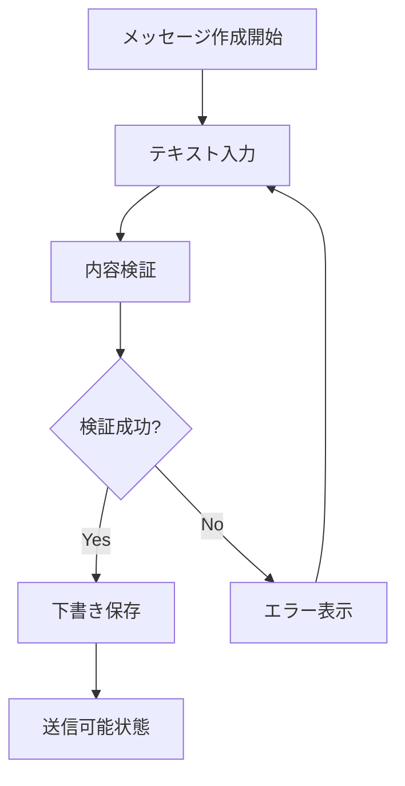
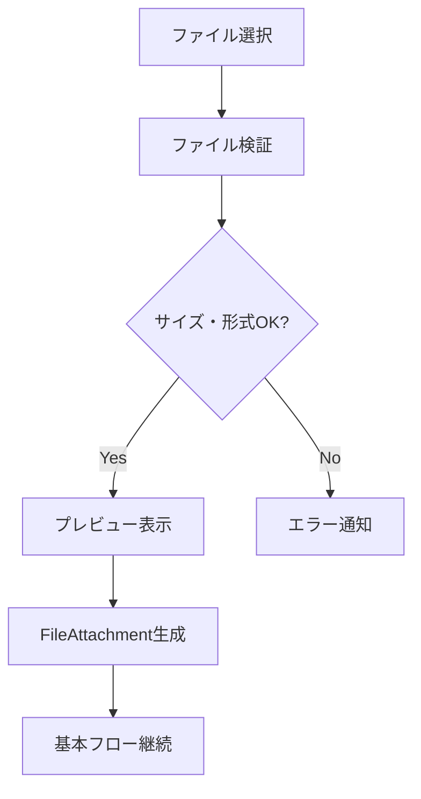

# ユースケース: メッセージを作成する

## 基本情報
- **ユースケースID**: UC1
- **アクター**: チャネルメンバー
- **概要**: チャネル内でテキスト、ファイル添付、メンションを含むメッセージを作成する

## パラソルドメイン連携
- **操作エンティティ**: Message
- **関連エンティティ**: Channel, MentionContext, FileAttachment
- **ドメインサービス**: CollaborationCoordinator.validateMessageContent()

## 事前条件
- ユーザーがチャネルメンバーとして認証済み
- 対象チャネルが存在し、アクティブ状態である
- ユーザーがチャネルへの投稿権限を持つ

## 事後条件
### 成功時
- メッセージがdraft状態で保存されている
- メッセージIDが発行されている
- 次のアクション（送信）が実行可能状態

### 失敗時
- エラーメッセージが表示されている
- 入力内容が保持されている（下書き保存）

## 基本フロー



1. チャネルメンバーがメッセージ作成画面を開く
2. テキスト入力フィールドにメッセージ内容を入力する
3. 必要に応じてファイルを添付する
4. 必要に応じて@マークでメンションを追加する
5. システムが入力内容をリアルタイム検証する
6. システムが下書きとして一時保存する
7. 送信ボタンが有効化される

## 代替フロー

### 代替フロー1: メンション付きメッセージ作成
**分岐点**: ステップ4
**条件**: @マークが入力される

```mermaid
graph TD
    A[@ 入力] --> B[メンション候補表示]
    B --> C[ユーザー選択]
    C --> D[MentionContext生成]
    D --> E[基本フロー継続]
```

1. ユーザーが@マークを入力する
2. システムが候補ユーザーリストを表示する
3. ユーザーがメンション対象を選択する
4. システムがMentionContextを生成する
5. 基本フローのステップ5に戻る

### 代替フロー2: ファイル添付
**分岐点**: ステップ3
**条件**: ファイルが選択される



1. ユーザーがファイル添付ボタンをクリック
2. ファイル選択ダイアログが表示される
3. システムがファイルサイズ・形式を検証する
4. 検証成功時、ファイルプレビューを表示する
5. FileAttachmentオブジェクトを生成する
6. 基本フローのステップ5に戻る

## 例外フロー

### 例外1: 文字数制限超過
**発生点**: ステップ5
**条件**: メッセージ内容が10,000文字を超過

1. システムがCollaborationCoordinator.validateMessageContent()でエラー検出
2. 文字数超過エラーメッセージを表示
3. 入力フィールドをエラー状態にハイライト
4. ユーザーに文字数削減を促す

### 例外2: 禁止ワード検出
**発生点**: ステップ5
**条件**: 組織ポリシーで禁止された単語が含まれる

1. システムが禁止ワードを検出
2. 該当箇所をハイライト表示
3. 代替表現の提案を表示
4. ユーザーによる修正を待機

### 例外3: 添付ファイルサイズ超過
**発生点**: 代替フロー2のステップ3
**条件**: ファイルサイズが100MBを超過

1. システムがファイルサイズエラーを検出
2. ファイルサイズ超過エラーを表示
3. ファイル圧縮方法を提案
4. ユーザーに再選択を促す

## 特別要件
- **性能**: 入力検証は500ms以内のレスポンス
- **可用性**: 下書き保存は1秒間隔で自動実行
- **セキュリティ**: 添付ファイルのウイルススキャン実行
- **ユーザビリティ**: メンション自動補完は3文字入力で開始

## ビジネスルール
- メッセージ内容は1文字以上10,000文字以内
- 添付ファイルは1メッセージあたり最大10個
- メンションは1メッセージあたり最大20個
- 下書き保存期間は24時間
- 連続投稿制限: 1分間に10メッセージまで

## 成功指標
- **メッセージ作成完了率**: 95%以上（作成開始から下書き保存完了まで）
- **入力エラー率**: 5%以下（検証エラー発生率）
- **メンション利用率**: 30%以上（メンション機能の使用率）

---
*このユースケースは新仕様v2.0のユースケース・ページ分解指向設計に基づいています*